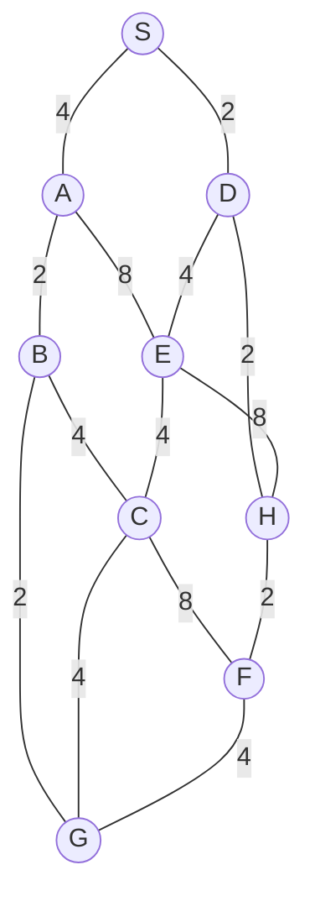

## The Question

1×1-tile grid. Start **S**, goal **G**. MoveGen alphabetical. Heuristic = Manhattan Distance. Tie-breaker: node labels.

| # | Question | Official answer |
|---|----------|-----------------|
| 1.1 | Best First Search path | `S,D,E,C,G` |
| 1.2 | A* path | `S,D,H,F,G` |
| 1.3 | Branch-and-Bound path | `S,A,B,G` |
| 1.4 | Who finds the shortest path? | **C** — Branch-and-Bound |
| 1.5 | Admissibility | **B** — inadmissible |

## The Topic in 60 Seconds

| Algorithm | Sorts OPEN by | Ignores |
|-----------|---------------|---------|
| Best First | $h(n)$ | $g(n)$ |
| A* | $f(n) = g(n) + h(n)$ | nothing |
| Branch-and-Bound | $g(n)$ | $h(n)$ |

> Deep-dive: [A* Search](/concepts/week-03-heuristic-search/01-a-star-search), [Best First Search](/concepts/week-03-heuristic-search/09-best-first-search), [Branch and Bound](/concepts/week-03-heuristic-search/05-branch-and-bound).

## Step 0 — Heuristic table (Manhattan to G, from the figure's grid)

| Node | $h$ | Node | $h$ |
|------|-----|------|-----|
| S | 6 | E | 5 |
| A | 7 | F | 1 |
| B | 3 | G | 0 |
| C | 3 | H | 5 |
| D | 5 | | |

## 1.1 — Best First Search → `S,D,E,C,G`

| Step | OPEN (node : $h$) | Pick |
|------|-------------------|------|
| 1 | S : 6 | **S** → A(7), D(5) |
| 2 | D : 5, A : 7 | **D** → E(5), H(5) |
| 3 | E : 5, H : 5, A : 7 | **E** (tie with H → label order) → C(3) |
| 4 | C : 3, H : 5, A : 7 | **C** → G(0), F(1) |
| 5 | G : 0, F : 1, … | **G** — goal! |

Path: **S → D → E → C → G**, cost $2+4+4+4 = 14$.

## 1.2 — A* → `S,D,H,F,G`

| Step | OPEN (node : $f$) | Pick |
|------|-------------------|------|
| 1 | S : 0+6 = **6** | **S** → A : 4+7 = 11, D : 2+5 = **7** |
| 2 | D : **7**, A : 11 | **D** → E : 6+5 = 11, H : 4+5 = **9** |
| 3 | H : **9**, E : 11, A : 11 | **H** → F : 6+1 = **7** |
| 4 | F : **7**, E : 11, A : 11 | **F** → G : 10+0 = **10** |
| 5 | G : **10**, E : 11, A : 11 | **G** — goal! |

Path: **S → D → H → F → G**, cost $2+2+2+4 = 10$.

<PaperTrace
  height={380}
  nodeWidth={100}
  nodeHeight={50}
  nodeFontSize={13}
  legend={[
    { color: "#b45309", label: "expanding" },
    { color: "#0369a1", label: "in OPEN (f = g+h)" },
    { color: "#4b5563", label: "expanded" },
    { color: "#16a34a", label: "returned path" }
  ]}
  nodes={[
    { id: "S", x: 40, y: 200 },
    { id: "A", x: 230, y: 60 },
    { id: "B", x: 470, y: 60 },
    { id: "D", x: 120, y: 200 },
    { id: "E", x: 340, y: 200 },
    { id: "C", x: 450, y: 300 },
    { id: "G", x: 660, y: 300 },
    { id: "F", x: 560, y: 390 },
    { id: "H", x: 230, y: 390 }
  ]}
  edges={[
    { id: "e1", from: "S", to: "A", label: "4" },
    { id: "e2", from: "S", to: "D", label: "2" },
    { id: "e3", from: "A", to: "B", label: "2" },
    { id: "e4", from: "A", to: "E", label: "8" },
    { id: "e5", from: "B", to: "C", label: "4" },
    { id: "e6", from: "B", to: "G", label: "2" },
    { id: "e7", from: "D", to: "E", label: "4" },
    { id: "e8", from: "D", to: "H", label: "2" },
    { id: "e9", from: "E", to: "C", label: "4" },
    { id: "e10", from: "E", to: "H", label: "8" },
    { id: "e11", from: "C", to: "G", label: "4" },
    { id: "e12", from: "C", to: "F", label: "8" },
    { id: "e13", from: "H", to: "F", label: "2" },
    { id: "e14", from: "F", to: "G", label: "4" }
  ]}
  steps={[
    { label: "Init", note: "OPEN = {S(g=0, h=6, f=6)}", nodes: { S: "frontier" } },
    { label: "Expand S", note: "A: g=4, h=7 → f=11 | D: g=2, h=5 → f=7 | OPEN = {D(7), A(11)}", nodes: { S: "explored", D: "frontier", A: "frontier" } },
    { label: "Expand D", note: "E: g=6, h=5 → f=11 | H: g=4, h=5 → f=9 | OPEN = {H(9), E(11), A(11)}", nodes: { S: "explored", D: "current", E: "frontier", H: "frontier", A: "frontier" } },
    { label: "Expand H", note: "F: g=6, h=1 → f=7 | OPEN = {F(7), E(11), A(11)}", nodes: { D: "explored", H: "current", F: "frontier", E: "frontier", A: "frontier" } },
    { label: "Expand F", note: "G: g=10, h=0 → f=10 | OPEN = {G(10), E(11), A(11)}", nodes: { H: "explored", F: "current", G: "frontier", E: "frontier", A: "frontier" } },
    { label: "GOAL: S→D→H→F", note: "Pick G (f=10) = GOAL. Path S,D,H,F,G cost 10. E never expanded: f(E)=11 > 10!", nodes: { S: "path", D: "path", H: "path", F: "path", G: "goal" }, edges: { e2: "path", e8: "path", e13: "path", e14: "path" } }
  ]}
/>

<Callout type="tip" title="Why A* detours through H">
E's low $h$ (5) is a lie — its real cost to G is 8. But at expansion time $f(E) = 11$ sits *above* $f(H) = 9$ and $f(F) = 7$, so the goal (10) is reached before E ever comes off the queue. The inadmissible $h(A) = 7 > h^*(A) = 4$ is what breaks optimality overall.
</Callout>

## 1.3 — Branch-and-Bound → `S,A,B,G`

| Pop | OPEN (path : $g$) | Extend |
|-----|-------------------|--------|
| S : 0 | SA : 4, SD : 2 | |
| SD : 2 | SDE : 6, SDH : 4 | |
| SDH : 4 | SDHF : 6 | |
| SA : 4 | SAB : 6, SAE : 12 | |
| SDHF : 6 | SDHFG : 10 | |
| SAB : 6 | SABG : **8** ← goal on queue, SB C : 10 | |
| SBG : **8** | all open ≥ 8 → **optimal** | |

Path: **S → A → B → G**, cost $4+2+2 = 8$ ✓ the true shortest.

## 1.4 — Shortest path → **C (Branch-and-Bound only)**

Routes: S-A-B-G = **8** · S-D-H-F-G = 10 · S-D-E-C-G = 14 · S-A-B-C-G = 14. Only BnB returned 8 → **C**.

## 1.5 — Admissibility → **B (inadmissible)**

$h(A) = 7$ but $h^*(A) = A \to B \to G = 4$ — **overestimate** → inadmissible → **B** ✓ (and that's exactly why A* returned 10 instead of 8).

## Tricks & Tips

<Accordion title="Exam shortcuts">
1. h-table first. Here it explains everything: B looks cheap (h=3) to BFS... no wait, A(7) vs D(5) sends BFS right; A* never expands E because f(E) = 11 exceeds the goal cost 10.
2. BFS = sort by h (ties → labels: E before H).
3. A* = sort by g+h; a node with f above the final goal cost is never expanded.
4. BnB = sort by g on full paths — the S,A,B,G = 8 line pops first.
5. 1.4/1.5 agree: A* suboptimal ⇒ h inadmissible (A: 7 > 4).
</Accordion>

**Answers:** 1.1 `S,D,E,C,G` · 1.2 `S,D,H,F,G` · 1.3 `S,A,B,G` · 1.4 **C** · 1.5 **B**
