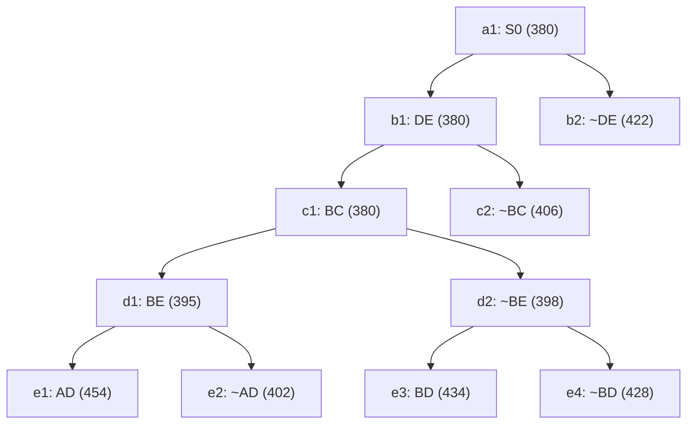

## The Question

TSP BnB snapshot when the optimal tour is discovered. `XY` = include, `~XY` = exclude; numbers = lower bounds; reference numbers break ties.

| # | Question | Official answer |
|---|----------|-----------------|
| 2.1 | 2nd–5th nodes refined | `b1,c1,d1,d2` |
| 2.2 | Optimal tour node + cost | `e2,402` |
| 2.3 | Number of cities | `6` |
| 2.4 | Tour from A | `A,C,B,E,D,F` |

## The Topic in 60 Seconds

Refine = pop the cheapest open node, insert its two children. Childless snapshot nodes are tours. Stop when a tour pops with no cheaper open node.

> Deep-dive: [Reading BnB Trees](/concepts/week-05-optimal-tsp/01-bnb-tree-reading), [Branch and Bound](/concepts/week-03-heuristic-search/05-branch-and-bound).

## 2.1 — Refine order → `b1,c1,d1,d2`

| Pop | Queue (min first) | Action |
|-----|-------------------|--------|
| 1 | a1 : 380 | refine → b1(380), b2(422) |
| 2 | b1 : 380, b2 : 422 | refine **b1** → c1(380), c2(406) |
| 3 | c1 : 380, b2 : 422, c2 : 406 | refine **c1** → d1(395), d2(398) |
| 4 | d1 : 395, d2 : 398, b2 : 422, c2 : 406 | refine **d1** → e1(454), e2(402) |
| 5 | d2 : 398, e2 : 402, b2 : 422, … | refine **d2** → e3(434), e4(428) |

## 2.2 — Optimal tour → `e2`, cost `402`

Queue after pop 5: `{e2 : 402, b2 : 422, e4 : 428, e3 : 434, e1 : 454}`. The minimum, **e2 : 402**, is a **leaf** — a tour — and every open node is ≥ 422 → **e2 = optimal, 402** ✓

## 2.3 — Cities → `6`

Path root→e2: **DE in, BC in, BE in, ~AD**. Degrees: B–2 full (C, E), E–2 full (D, B), C–1, D–1, A–0, F–0. The remaining cities A, C, D, F need 3 edges with AD excluded: A–C, A–F, D–F (forced). Tour: **A–C–B–E–D–F–A** → 6 cities ✓

## 2.4 — Tour from A → `A,C,B,E,D,F`

The forced cycle above ✓ (reverse A,F,D,E,B,C equivalent).

<Graph
  height={430}
  nodeWidth={110}
  nodeHeight={56}
  nodeFontSize={12}
  layout={{ name: "preset" }}
  elements={[
    { data: { id: "a1", label: "a1: S0 380", type: "current" }, position: { x: 380, y: 20 } },
    { data: { id: "b1", label: "b1: DE 380", type: "current" }, position: { x: 190, y: 110 } },
    { data: { id: "b2", label: "b2: ~DE 422", type: "explored" }, position: { x: 590, y: 110 } },
    { data: { id: "c1", label: "c1: BC 380", type: "current" }, position: { x: 60, y: 200 } },
    { data: { id: "c2", label: "c2: ~BC 406", type: "explored" }, position: { x: 320, y: 200 } },
    { data: { id: "d1", label: "d1: BE 395", type: "current" }, position: { x: 60, y: 290 } },
    { data: { id: "d2", label: "d2: ~BE 398", type: "current" }, position: { x: 300, y: 290 } },
    { data: { id: "e1", label: "e1: AD 454" }, position: { x: 10, y: 380 } },
    { data: { id: "e2", label: "e2: ~AD 402 ✓", type: "path" }, position: { x: 140, y: 380 } },
    { data: { id: "e3", label: "e3: BD 434" }, position: { x: 250, y: 380 } },
    { data: { id: "e4", label: "e4: ~BD 428" }, position: { x: 380, y: 380 } },
    { data: { id: "x1", source: "a1", target: "b1" } },
    { data: { id: "x2", source: "a1", target: "b2" } },
    { data: { id: "x3", source: "b1", target: "c1" } },
    { data: { id: "x4", source: "b1", target: "c2" } },
    { data: { id: "x5", source: "c1", target: "d1" } },
    { data: { id: "x6", source: "c1", target: "d2" } },
    { data: { id: "x7", source: "d1", target: "e1" } },
    { data: { id: "x8", source: "d1", target: "e2" } },
    { data: { id: "x9", source: "d2", target: "e3" } },
    { data: { id: "x10", source: "d2", target: "e4" } },
  ]}
/>

*Amber = refined in order b1 → c1 → d1 → d2. Green = e2, the 402 tour.*

## Tricks & Tips

<Accordion title="Fast method">
1. Sorted queue with (cost, ref#); refine only nodes with children in the snapshot.
2. Optimal = cheapest leaf popped while all open bounds ≥ it.
3. Cities: complete degrees from the winner's chain; the excluded edge (~AD) forces the A-C and F-D detours.
</Accordion>

**Answers:** 2.1 `b1,c1,d1,d2` · 2.2 `e2,402` · 2.3 `6` · 2.4 `A,C,B,E,D,F`
