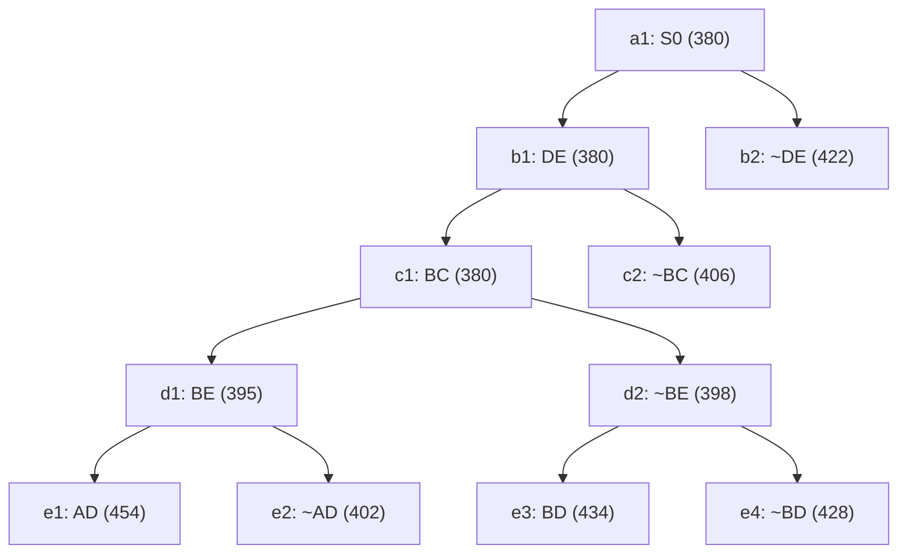

## The Question

TSP BnB snapshot when the optimal tour is discovered. `XY` = include, `~XY` = exclude; numbers = lower bounds; reference numbers break ties.

| # | Question | Official answer |
|---|----------|-----------------|
| 2.1 | 2nd–5th nodes refined | `b1,c1,d1,d2` |
| 2.2 | Optimal tour node + cost | `e2,402` |
| 2.3 | Number of cities | `6` |
| 2.4 | Tour from A | `A,C,B,E,D,F` |

## The Topic in 60 Seconds

Refine = pop the cheapest open node, insert its two children. Childless snapshot nodes are tours. Stop when a tour pops with no cheaper open node.

> Deep-dive: [Reading BnB Trees](/concepts/week-05-optimal-tsp/01-bnb-tree-reading), [Branch and Bound](/concepts/week-03-heuristic-search/05-branch-and-bound).

## 2.1 — Refine order → `b1,c1,d1,d2`

Pop the minimum bound each round (ties by reference number); refining replaces the popped node with its two children.

| Pop | Queue before (bound) | Refine | Children added |
|-----|----------------------|--------|----------------|
| 1 | a1 : 380 | **a1** | b1 : 380, b2 : 422 |
| 2 | b1 : 380, b2 : 422 | **b1** | c1 : 380, c2 : 406 |
| 3 | c1 : 380, c2 : 406, b2 : 422 | **c1** | d1 : 395, d2 : 398 |
| 4 | d1 : 395, d2 : 398, c2 : 406, b2 : 422 | **d1** | e1 : 454, e2 : 402 |
| 5 | d2 : 398, e2 : 402, c2 : 406, b2 : 422, e1 : 454 | **d2** | e3 : 434, e4 : 428 |

The 380 cluster (a1, b1, c1) refines back-to-back because each leaves an equal-bound child behind.

## 2.2 — Optimal tour → `e2`, cost `402`

Queue after pop 5, sorted: `{e2 : 402, c2 : 406, b2 : 422, e4 : 428, e3 : 434, e1 : 454}`. The minimum, **e2 : 402**, has no children in the snapshot — it is a **complete tour** — and every other open bound is ≥ 406 > 402. Nothing below it can ever appear → **e2 = optimal, 402** ✓

## 2.3 — Cities → `6`

Chain root→e2: **DE in → BC in → BE in → ~AD excluded**. Fixed edges: D–E, B–C, B–E.

Degrees so far: B = 2 (C, E) full · E = 2 (D, B) full · C = 1 (B) · D = 1 (E) · A = 0 · F = 0.

AD is excluded, so A cannot pair with D. A needs two edges from \{C, F\} → forced **A–C** and **A–F**. Now C is full (B, A), and D still needs one partner — only F remains → **D–F**. One closed cycle:

$$A - C - B - E - D - F - A \Rightarrow \textbf{6 cities} ✓$$

## 2.4 — Tour from A → `A,C,B,E,D,F`

The forced cycle above read clockwise from A ✓ (the reverse A,F,D,E,B,C is the same tour).

<PaperTrace
  height={430}
  nodeWidth={110}
  nodeHeight={56}
  nodeFontSize={12}
  legend={[
    { color: "#b45309", label: "refining now" },
    { color: "#0369a1", label: "open (waiting)" },
    { color: "#4b5563", label: "already refined" },
    { color: "#15803d", label: "optimal tour (leaf)" }
  ]}
  nodes={[
    { id: "a1", label: "a1: S0 380", x: 400, y: 20 },
    { id: "b1", label: "b1: DE 380", x: 200, y: 110 },
    { id: "b2", label: "b2: ~DE 422", x: 600, y: 110 },
    { id: "c1", label: "c1: BC 380", x: 70, y: 200 },
    { id: "c2", label: "c2: ~BC 406", x: 330, y: 200 },
    { id: "d1", label: "d1: BE 395", x: 70, y: 290 },
    { id: "d2", label: "d2: ~BE 398", x: 300, y: 290 },
    { id: "e1", label: "e1: AD 454", x: 20, y: 380 },
    { id: "e2", label: "e2: ~AD 402", x: 160, y: 380 },
    { id: "e3", label: "e3: BD 434", x: 280, y: 380 },
    { id: "e4", label: "e4: ~BD 428", x: 410, y: 380 }
  ]}
  edges={[
    { id: "x1", from: "a1", to: "b1" },
    { id: "x2", from: "a1", to: "b2" },
    { id: "x3", from: "b1", to: "c1" },
    { id: "x4", from: "b1", to: "c2" },
    { id: "x5", from: "c1", to: "d1" },
    { id: "x6", from: "c1", to: "d2" },
    { id: "x7", from: "d1", to: "e1" },
    { id: "x8", from: "d1", to: "e2" },
    { id: "x9", from: "d2", to: "e3" },
    { id: "x10", from: "d2", to: "e4" }
  ]}
  steps={[
    { label: "Queue: a1(380)", note: "OPEN = { a1:380 }", nodes: { a1: "frontier" } },
    { label: "Refine a1", note: "Pop a1:380 -> insert b1:380, b2:422\nOPEN = { b1:380, b2:422 }", nodes: { a1: "explored", b1: "frontier", b2: "frontier" } },
    { label: "Refine b1", note: "Pop b1:380 -> insert c1:380, c2:406\nOPEN = { c1:380, c2:406, b2:422 }", nodes: { a1: "explored", b1: "current", b2: "frontier", c1: "frontier", c2: "frontier" }, edges: { x1: "path" } },
    { label: "Refine c1", note: "Pop c1:380 -> insert d1:395, d2:398\nOPEN = { d1:395, d2:398, c2:406, b2:422 }", nodes: { a1: "explored", b1: "explored", b2: "frontier", c1: "current", c2: "frontier", d1: "frontier", d2: "frontier" }, edges: { x1: "path", x3: "active" } },
    { label: "Refine d1", note: "Pop d1:395 -> insert e1:454, e2:402\nOPEN = { d2:398, e2:402, c2:406, b2:422, e1:454 }", nodes: { a1: "explored", b1: "explored", b2: "frontier", c1: "explored", c2: "frontier", d1: "current", d2: "frontier", e1: "frontier", e2: "frontier" }, edges: { x1: "path", x3: "path", x5: "active" } },
    { label: "Refine d2", note: "Pop d2:398 -> insert e3:434, e4:428\nOPEN = { e2:402, c2:406, b2:422, e4:428, e3:434, e1:454 }", nodes: { a1: "explored", b1: "explored", b2: "frontier", c1: "explored", c2: "frontier", d1: "explored", d2: "current", e1: "frontier", e2: "frontier", e3: "frontier", e4: "frontier" }, edges: { x1: "path", x3: "path", x5: "path", x6: "active" } },
    { label: "Tour: e2 = 402", note: "Min e2:402 is a LEAF = complete tour.\nAll other open bounds >= 406 > 402 -> OPTIMAL.\nForced cycle: A-C-B-E-D-F-A (6 cities).", nodes: { a1: "explored", b1: "explored", b2: "frontier", c1: "explored", c2: "frontier", d1: "explored", d2: "explored", e1: "frontier", e2: "path", e3: "frontier", e4: "frontier" }, edges: { x1: "path", x3: "path", x5: "path", x8: "path" } }
  ]}
/>

*Amber = refined in order b1 → c1 → d1 → d2. Green = e2, the 402 tour.*

## Tricks & Tips

<Accordion title="Fast method">
1. Simulate the queue as sorted pairs (bound, ref#): the 380 tie a1/b1/c1 means three straight refinements before anything else moves.
2. Refine exactly five times here: a1, then b1, c1, d1, d2 — every popped node that has children in the snapshot must be refined, nothing else.
3. Optimal = cheapest LEAF at the top while all open bounds exceed it: e2 : 402 vs next-best c2 : 406 — one glance.
4. Reconstruct degrees from the winner's chain (DE, BC, BE in; AD out): B and E close instantly, ~AD forces A–C/A–F, and the leftover degree at D forces D–F. Six junctions, one cycle: A-C-B-E-D-F-A.
</Accordion>

**Answers:** 2.1 `b1,c1,d1,d2` · 2.2 `e2,402` · 2.3 `6` · 2.4 `A,C,B,E,D,F`
