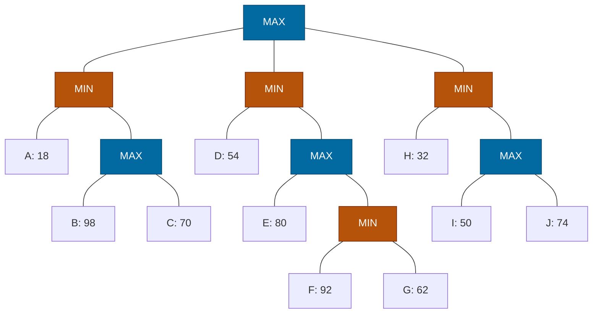

## The Question

Squares = MAX, circles = MIN. Leaves A–J. Tie-breaker: deepest, then leftmost.

| # | Question | Official answer |
|---|----------|-----------------|
| 3.1 | Valid strategies (A: A,C · B: A,D,H · C: D,F,G · D: E,I,J) | **A and C** |
| 3.2 | Best strategy leaves | `D,E` |
| 3.3 | Alpha-Beta pruned | `C,F,G,I,J` |
| 3.4 | SSS* solved | `A,D,E,H` |

## The Topic in 60 Seconds

- **Strategy for MAX:** no MAX node's set-leaves may split across two of its children; MIN's alternatives stay whole.
- **Best strategy** maximizes $\min(\text{leaves})$ = root minimax value.
- **α-β:** cutoff when $\alpha \ge \beta$. **SSS\*:** solves leaves line-by-line; unneeded leaves are discarded or pruned.

> Deep-dive: [Game Strategies](/concepts/week-07-game-search/03-game-strategies), [Alpha-Beta Pruning](/concepts/week-07-game-search/02-alpha-beta-pruning), [SSS*](/concepts/week-03-heuristic-search/03-sss-star).

## Step 0 — Back up

- $X_1 = \max(98, 70) = 98$; $M_1 = \min(18, 98) = 18$
- $Y_2 = \min(92, 62) = 62$; $X_2 = \max(80, 62) = 80$; $M_2 = \min(54, 80) = 54$
- $X_3 = \max(50, 74) = 74$; $M_3 = \min(32, 74) = 32$
- $\text{Root} = \max(18, 54, 32) = \mathbf{54}$ via $M_2$

## 3.1 — Valid strategies → **A (A,C) and C (D,F,G)**

| Option | Check | Verdict |
|--------|-------|---------|
| **A: A,C** | Root→$M_1$ ✓; $M_1$ keeps A and $X_1$; $X_1$ → C only ✓ | **Valid** |
| B: A,D,H | Root: A via $M_1$, D,H via $M_2$ — **split!** | Invalid |
| **C: D,F,G** | Root→$M_2$ ✓; $M_2$ keeps D, $X_2$; $X_2$ → $Y_2$ only; $Y_2$ keeps F,G ✓ | **Valid** |
| D: E,I,J | Root: E via $M_2$, I,J via $M_3$ — **split!** | Invalid |

## 3.2 — Best strategy → `D,E`

Root → $M_2$ (54). $M_2$ keeps D and $X_2$; $X_2$ picks E (80 beats 62); leaves **`{D, E}`**, guarantee $\min(54, 80) = 54$ = game value ✓

## 3.3 — Alpha-Beta prunes → `C,F,G,I,J`

| Node | Window | Happening |
|------|--------|-----------|
| $M_1$ (MIN) | $(-\infty, \infty)$ | A = 18 → $\beta = 18$ |
| $X_1$ (MAX) | $(-\infty, 18)$ | B = 98 ≥ 18 → **β-cutoff** — C pruned! |
| Root | $\alpha = 18$ | |
| $M_2$ (MIN) | $(18, \infty)$ | D = 54 → $\beta = 54$ |
| $X_2$ (MAX) | $(18, 54)$ | E = 80 ≥ 54 → **β-cutoff** — F, G pruned! |
| Root | $\alpha = 54$ | |
| $M_3$ (MIN) | $(54, \infty)$ | H = 32 ≤ 54 → **α-cutoff** — I, J pruned! |

Pruned: **C, F, G, I, J** ✓ — only A, B, D, E, H inspected.

<PaperTrace
  height={400}
  nodeWidth={100}
  nodeHeight={50}
  nodeFontSize={12}
  legend={[
    { color: "#0369a1", label: "MAX (square)" },
    { color: "#b45309", label: "MIN (circle)" },
    { color: "#16a34a", label: "inspected / value path" },
    { color: "#4b5563", label: "pruned" }
  ]}
  nodes={[
    { id: "R", label: "MAX", kind: "max", x: 430, y: 20 },
    { id: "M1", label: "MIN", kind: "min", x: 150, y: 120 },
    { id: "M2", label: "MIN", kind: "min", x: 430, y: 120 },
    { id: "M3", label: "MIN", kind: "min", x: 710, y: 120 },
    { id: "A", label: "A: 18", x: 40, y: 230 },
    { id: "X1", label: "MAX", kind: "max", x: 210, y: 230 },
    { id: "B", label: "B: 98", x: 140, y: 340 },
    { id: "C", label: "C: 70", x: 270, y: 340 },
    { id: "D", label: "D: 54", x: 340, y: 230 },
    { id: "X2", label: "MAX", kind: "max", x: 480, y: 230 },
    { id: "E", label: "E: 80", x: 420, y: 340 },
    { id: "Y2", label: "MIN", kind: "min", x: 550, y: 340 },
    { id: "F", label: "F: 92", x: 490, y: 450 },
    { id: "G", label: "G: 62", x: 610, y: 450 },
    { id: "H", label: "H: 32", x: 660, y: 230 },
    { id: "X3", label: "MAX", kind: "max", x: 790, y: 230 },
    { id: "I", label: "I: 50", x: 730, y: 340 },
    { id: "J", label: "J: 74", x: 850, y: 340 }
  ]}
  edges={[
    { id: "x1", from: "R", to: "M1" },
    { id: "x2", from: "R", to: "M2" },
    { id: "x3", from: "R", to: "M3" },
    { id: "x4", from: "M1", to: "A" },
    { id: "x5", from: "M1", to: "X1" },
    { id: "x6", from: "X1", to: "B" },
    { id: "x7", from: "X1", to: "C" },
    { id: "x8", from: "M2", to: "D" },
    { id: "x9", from: "M2", to: "X2" },
    { id: "x10", from: "X2", to: "E" },
    { id: "x11", from: "X2", to: "Y2" },
    { id: "x12", from: "Y2", to: "F" },
    { id: "x13", from: "Y2", to: "G" },
    { id: "x14", from: "M3", to: "H" },
    { id: "x15", from: "M3", to: "X3" },
    { id: "x16", from: "X3", to: "I" },
    { id: "x17", from: "X3", to: "J" }
  ]}
  steps={[
    { label: "1 · M1: A=18", note: "M1 (MIN): A = 18 -> beta = 18.", nodes: { R: "max", M1: "current", A: "path" } },
    { label: "2 · X1: B=98 cutoff", note: "X1 (MAX) window (-inf, 18): B = 98 >= 18 -> BETA-CUTOFF. C pruned! M1 = 18. Root: alpha = 18.", nodes: { R: "current", M1: "path", A: "path", X1: "current", B: "path", C: "explored" } },
    { label: "3 · M2: D=54", note: "M2 (MIN) window (18, inf): D = 54 -> beta = 54.", nodes: { R: "max", M2: "current", D: "frontier", M1: "path", A: "path" } },
    { label: "4 · X2: E=80 cutoff", note: "X2 (MAX) window (18, 54): E = 80 >= 54 -> BETA-CUTOFF. F, G pruned! M2 = 54. Root: alpha = 54.", nodes: { R: "current", M2: "path", D: "path", X2: "current", E: "path", Y2: "explored", F: "explored", G: "explored" } },
    { label: "5 · M3: H=32 cutoff · Root=54", note: "M3 (MIN) window (54, inf): H = 32 <= 54 -> ALPHA-CUTOFF. I, J pruned! Root = max(18, 54, 32) = 54 via M2. Pruned: C, F, G, I, J.", nodes: { R: "path", M1: "path", M2: "path", M3: "current", A: "path", B: "path", D: "path", E: "path", H: "path", X1: "explored", X2: "explored", X3: "explored", C: "explored", F: "explored", G: "explored", I: "explored", J: "explored" } }
  ]}
/>

## 3.4 — SSS* solves → `A,D,E,H`

1. **A solved** (18) → $M_1 \le 18$. $X_1$ live merit 18: solve **B** (98 ≥ 18) → $X_1$ proven ≥ 18 → **C never expanded**. $M_1$ solved 18.
2. $M_2$ line (∞): **D solved** (54) → $M_2 \le 54$; $X_2$ live merit 54: **E solved** (80 ≥ 54) → $X_2$ proven → **F, G never expanded**. $M_2$ solved 54.
3. $M_3$ line (merit 54): **H solved** (32 ≤ 54) → $M_3 = 32$; $X_3$ (I, J) never needed.
4. Root = 54. Solved leaves: **A, D, E, H** ✓ — B was evaluated but discarded (98 can't improve 18), the rest pruned.

<Callout type="tip" title="The pattern">
Every MIN node's first leaf is low (18, 54, 32) — each one is a scissors: β-cutoff inside its own MAX child, α-cutoff across its siblings. α-β and SSS\* end up inspecting the same five leaves; only B is evaluated-but-discarded by SSS\*.
</Callout>

## Tricks & Tips

<Accordion title="Speed routines">
1. Back up the MAX squares first, then MINs, then root.
2. Strategy validity: no split at any MAX node.
3. Best strategy: walk the value down; verify min(54, 80) = 54.
4. Low first leaf at a MIN node = double scissors (cuts its MAX child's remaining children AND the sibling MIN branches).
</Accordion>

**Answers:** 3.1 **A, C** · 3.2 `D,E` · 3.3 `C,F,G,I,J` · 3.4 `A,D,E,H`
