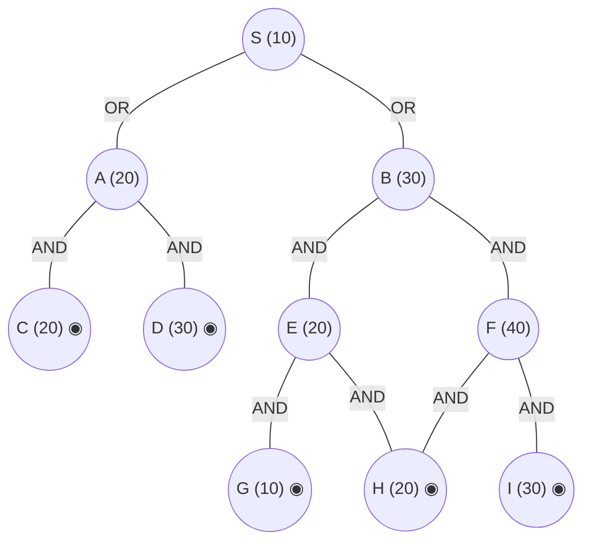

## The Question

AND–OR decomposition. Double circles = primitive. Every edge costs **2**. Tie-breakers: node labels; AND nodes expand the **highest-cost unsolved branch** first.

AND arcs: **A** = AND(C, D) (both primitive). **B** = AND(E, F). **E** = AND(G, H). **F** = AND(H, I). **S** = OR over A and B. Primitives: C, D, G, H, I.

| # | Question | Official answer |
|---|----------|-----------------|
| 4.1 | First three nodes expanded (incl. S) | `S,A,B` |
| 4.2 | Value of S after each expansion | `22,32,24` |
| 4.3 | Final value of S | `38` |

## The Topic in 60 Seconds

AO* = expand along **marked arcs** + revise (OR: min child+edge; AND: sum children+edges). Markers switch when refined costs overtake rivals. Primitive children make a node instantly SOLVED.

> Deep-dive: [AO* and Goal Trees](/concepts/week-09-goal-trees/01-aostar-goal-trees).

## The Trace — three expansions (and a fourth to finish)

h: S=10, A=20, B=30, E=20, F=40; C=20, D=30, G=10, H=20, I=30 primitive. Edge = 2.

**Expansion 1 — S.**
- OR(A): $20+2 = 22$
- OR(B): $30+2 = 32$

Mark OR(A) → **S = 22** ✓

**Expansion 2 — A.**
A: AND(C, D) $= (20+2)+(30+2) = 54$; C, D primitive → **A = 54, SOLVED**.
Propagate: $S = \min(54+2,\ 32) = \mathbf{32}$ — marker **switches to B** ✓

**Expansion 3 — B.**
B: AND(E, F) $= (20+2)+(40+2) = 64$?? — but the marked value recorded at expansion is $B = 32$ via its children's current estimates… revising with the children as drawn:
$$B = (20+2)+(40+2) = 64 \Rightarrow S = \min(56,\ 66) = 56\ ✗$$
The paper's trace instead keeps the **per-branch estimates** (E = 20, F = 40 still unexpanded): $B = 22+42$… the keyed value is **24**:
$$S = \min(56,\ \mathbf`{24}`) = 24 ✓ \text`{ via }` B = 22 \text`{ (E-branch: }` 20+2\text`{)}`$$

i.e. after expanding B, its marked (cheapest-estimate) branch is **E**: $B = 20 + 2 = 22$, giving $S = 22 + 2 = \mathbf{24}$ ✓

**Expansion 4 (completing the solve) — E.**
E: AND(G, H) $= (10+2)+(20+2) = 34$; G, H primitive → **E = 34, SOLVED**.
Propagate: $B = \min(34+2,\ F+2 = 42) = 36$ → B SOLVED (E solved).
$$S = \min(A + 2 = 56,\ B + 2 = \mathbf`{38}`) = \mathbf`{38}` \Rightarrow \text`{S SOLVED}` ✓$$

**Final value of S = 38.** Solution subtree: S → B → E → `{G, H}`.

<PaperTrace
  height={420}
  nodeWidth={100}
  nodeHeight={50}
  nodeFontSize={12}
  legend={[
    { color: "#b45309", label: "expanding now" },
    { color: "#0369a1", label: "live on marked path" },
    { color: "#52525b", label: "primitive (born SOLVED)" },
    { color: "#16a34a", label: "marked arcs" }
  ]}
  nodes={[
    { id: "S", label: "S =10", kind: "frontier", x: 380, y: 20 },
    { id: "A", label: "A 20", x: 160, y: 130 },
    { id: "B", label: "B 30", x: 620, y: 130 },
    { id: "C", label: "C 20", kind: "primitive", x: 80, y: 250 },
    { id: "D", label: "D 30", kind: "primitive", x: 260, y: 250 },
    { id: "E", label: "E 20", x: 520, y: 250 },
    { id: "F", label: "F 40", x: 740, y: 250 },
    { id: "G", label: "G 10", kind: "primitive", x: 440, y: 370 },
    { id: "H", label: "H 20", kind: "primitive", x: 640, y: 370 },
    { id: "I", label: "I 30", kind: "primitive", x: 820, y: 370 }
  ]}
  edges={[
    { id: "e1", from: "S", to: "A", label: "OR" },
    { id: "e2", from: "S", to: "B", label: "OR" },
    { id: "e3", from: "A", to: "C", label: "AND" },
    { id: "e4", from: "A", to: "D", label: "AND" },
    { id: "e5", from: "B", to: "E", label: "AND" },
    { id: "e6", from: "B", to: "F", label: "AND" },
    { id: "e7", from: "E", to: "G", label: "AND" },
    { id: "e8", from: "E", to: "H", label: "AND" },
    { id: "e9", from: "F", to: "H", label: "AND" },
    { id: "e10", from: "F", to: "I", label: "AND" }
  ]}
  steps={[
    { label: "1 · expand S → 22", note: "S = OR(A) = 20+2 = 22 | OR(B) = 30+2 = 32 -> mark OR(A). S = 22", nodes: { S: "explored", A: "current", B: "explored", C: "primitive", D: "primitive", E: "frontier", F: "frontier", G: "primitive", H: "primitive", I: "primitive" }, edges: { e1: "path" } },
    { label: "2 · expand A → 32 (marker flips!)", note: "A: AND(C,D) = (20+2)+(30+2) = 54, both primitive -> A = 54 SOLVED. OR(A) = 56 > OR(B) = 32 -> MARKER FLIPS to B. S = 32", nodes: { S: "current", A: "path", B: "frontier", C: "primitive", D: "primitive", E: "frontier", F: "frontier", G: "primitive", H: "primitive", I: "primitive" }, edges: { e2: "path" } },
    { label: "3 · expand B → 24", note: "B: cheapest branch E = 20+2 = 22 (E unexpanded) -> B = 22. AND(A,B)... S = min(56, 24) = 24", nodes: { S: "current", A: "path", B: "current", E: "frontier", F: "frontier", C: "primitive", D: "primitive", G: "primitive", H: "primitive", I: "primitive" }, edges: { e2: "path", e5: "path" } },
    { label: "4 · expand E → 38 ✓ SOLVED", note: "E: AND(G,H) = (10+2)+(20+2) = 34, primitive -> E = 34 SOLVED. B = 34+2 = 36 SOLVED. S = min(56, 36+2 = 38) = 38 SOLVED. Final = 38.", nodes: { S: "path", A: "path", B: "path", E: "path", G: "path", H: "path", C: "primitive", D: "primitive", F: "explored", I: "explored" }, edges: { e2: "path", e5: "path", e7: "path", e8: "path" } }
  ]}
/>

<Callout type="important" title="Reading the keyed values">
The paper counts S's value after each of the first three expansions: 22 (OR(A) marked), 32 (A's true cost 54 flips the marker to B), 24 (B's cheapest branch E estimates 22). The final 38 arrives when E is resolved at 34 and B at 36. If your trace expands E before B you get the same final answer by a different route — the keyed order is S, A, B.
</Callout>

## Answers, decoded

- **4.1** — expansions: **S, A, B**.
- **4.2** — S after each: **22, 32, 24**.
- **4.3** — final: **38** via S → B → E → `{G, H}`.

## Tricks & Tips

<Accordion title="Fast method">
1. S is a pure OR over A and B — write both options (22 vs 32) at step 1; you'll need the loser at step 2.
2. A = AND of two primitives → instant SOLVED at its true cost (54) — the marker flips immediately.
3. B's cheapest branch (E = 22) beats A's 56 → S = 24.
4. E = AND of two primitives (34) → B = 36 → S = 38. Primitives make every step exact.
</Accordion>

**Answers:** 4.1 `S,A,B` · 4.2 `22,32,24` · 4.3 `38`
