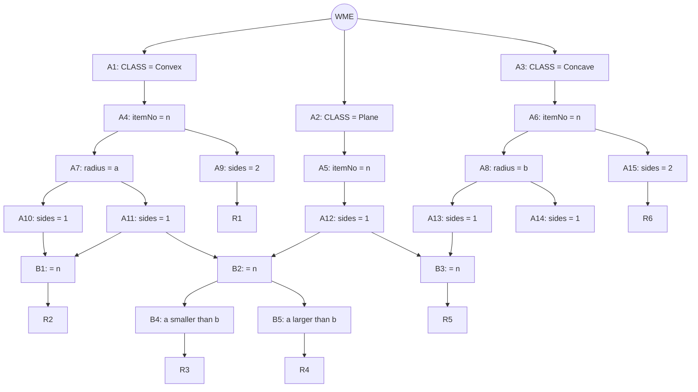

## The Question

A Rete net classifies lenses by surface properties (Convex / Plane / Concave classes, radius of curvature, number of sides). Working memory:

```text
101. (Concave ^itemNo K3 ^radius 70 ^sides 1)
102. (Concave ^itemNo K7 ^radius 10 ^sides 3)
103. (Convex  ^itemNo K2 ^radius 60 ^sides 1)
104. (Convex  ^itemNo K3 ^radius 50 ^sides 1)
105. (Convex  ^itemNo K4 ^radius 20 ^sides 4)
106. (Plane   ^itemNo K2 ^sides 1)
107. (Concave ^itemNo K1 ^radius 80 ^sides 2)
```

| # | Question | Official answer |
|---|----------|-----------------|
| 5.1 | Tuples in the conflict set (A: R1,105 · B: R2,103,106 · C: R4,102,103 · D: R5,102) | **B** |
| 5.2 | Specificity qualifies | **B** (R3,101,104) |
| 5.3 | Recency qualifies | **D** (R6,107) |

## The Topic in 60 Seconds

Alpha nodes filter single WMEs; beta nodes join streams (on `^itemNo`, plus the radius comparisons in B4/B5). Conflict set = all full tuples. **Specificity** = most conditions; **Recency** = newest max-timestamp.

> Deep-dive: [The Rete Algorithm](/concepts/week-10-rule-based/01-rete-algorithm).

## The Rete Net (from the figure)



Rules: **R1** = Convex sides-2 · **R2** = same-itemNo surfaces with sides 1 (via B1) · **R3** = same-itemNo pair with radius(a) smaller than radius(b) (via B4) · **R4** = same with a larger than b (B5) · **R5** = Plane + Concave sides-1 pair · **R6** = Concave sides-2.

## Step 1 — Locate every WME

| WME | Facts | Alpha path |
|-----|-------|------------|
| 101 | Concave, K3, r70, sides 1 | A6 → A8 |
| 102 | Concave, K7, r10, sides 3 | A6 → A8 — fails every sides-1 test |
| 103 | Convex, K2, r60, sides 1 | A4 → A7 → A10/A11 |
| 104 | Convex, K3, r50, sides 1 | A4 → A7 → A10/A11 |
| 105 | Convex, K4, r20, sides 4 | A4 — fails A9 (sides 2) and the sides-1 nodes |
| 106 | Plane, K2, sides 1 | A5 → A12 |
| 107 | Concave, K1, r80, sides 2 | A6 → A15 ✓ (sides 2) |

## Step 2 — Fire the joins

- **R1** (Convex sides-2): no Convex WME has sides 2 — 105 has sides 4 → **no match** (kills option A).
- **R2** via the Convex/Plane pair: 103 (Convex K2, sides 1) + 106 (Plane K2, sides 1) — same itemNo K2 ✓ → **(R2, 103, 106)** ✓
- **R3** (radius comparison on the K3 pair): 101 (Concave K3, r70) + 104 (Convex K3, r50) — same itemNo K3, radii 50 &lt; 70 satisfy "a smaller than b" ✓ → **(R3, 101, 104)** qualifies.
- **R4**: would need a *larger* than b on a sides-1 pair — 50 &lt; 70 goes the wrong way; no other same-itemNo pair exists → no match.
- **R5** (Plane + Concave sides-1, same itemNo): the only Plane WME (106, K2) has no Concave K2 partner; option D's lone (R5, 102) also fails because 102 has sides 3 → no match.
- **R6** (Concave sides-2): 107 ✓ → **(R6, 107)**.

**Conflict set** = \{(R2, 103, 106), (R3, 101, 104), (R6, 107)\} — of 5.1's options only **B** is a member ✓

<PaperTrace
  height={430}
  nodeWidth={140}
  nodeHeight={54}
  nodeFontSize={11}
  legend={[
    { color: "#0369a1", label: "alpha memory (WMEs parked)" },
    { color: "#b45309", label: "join / test firing" },
    { color: "#15803d", label: "tuple in conflict set" },
    { color: "#7f1d1d", label: "dead branch" }
  ]}
  nodes={[
    { id: "cv", label: "Convex s1: 103, 104", x: 30, y: 40 },
    { id: "pl", label: "Plane s1: 106", x: 30, y: 150 },
    { id: "cc", label: "Concave s1: 101", x: 30, y: 260 },
    { id: "cx", label: "Convex s1 (K3): 104", x: 30, y: 370 },
    { id: "s2", label: "Concave sides-2: 107", x: 30, y: 480 },
    { id: "j2", label: "B1 join: itemNo K2 = K2", x: 330, y: 95 },
    { id: "j3", label: "B4: radius 50 < 70", x: 330, y: 315 },
    { id: "r2", label: "R2 (103, 106)", x: 650, y: 95 },
    { id: "r3", label: "R3 (101, 104)", x: 650, y: 315 },
    { id: "r6", label: "R6 (107)", x: 650, y: 480 },
    { id: "d1", label: "R1: Convex sides-2", x: 330, y: 480 },
    { id: "d2", label: "105 has sides 4 - dead", x: 650, y: 40 }
  ]}
  edges={[
    { id: "e1", from: "cv", to: "j2", label: "K2" },
    { id: "e2", from: "pl", to: "j2", label: "K2" },
    { id: "e3", from: "j2", to: "r2" },
    { id: "e4", from: "cc", to: "j3", label: "r70" },
    { id: "e5", from: "cx", to: "j3", label: "K3" },
    { id: "e6", from: "j3", to: "r3" },
    { id: "e7", from: "s2", to: "r6" },
    { id: "e8", from: "d1", to: "d2", label: "fail" }
  ]}
  steps={[
    { label: "Alpha memory", note: "Every WME drops into its CLASS node, then the attribute tests:\nsides-1 stream = {101, 103, 104, 106}; sides-2 stream = {107}.\n102 (sides 3) and 105 (sides 4) survive NO sides test.", nodes: { cv: "frontier", pl: "frontier", cc: "frontier", cx: "frontier", s2: "frontier", d1: "frontier" } },
    { label: "R1 dies", note: "R1 wants a Convex WME with sides 2.\nOnly Convex WMEs are 103 (s1), 104 (s1), 105 (sides 4).\nNo match -> option A (R1,105) is dead.", nodes: { cv: "frontier", d1: "current", d2: "pruned" }, edges: { e8: "active" } },
    { label: "R2 join fires", note: "B1 joins Convex-sides-1 with Plane-sides-1 on itemNo:\n103 (K2) x 106 (K2) -> MATCH.\nTuple (R2, 103, 106) enters the conflict set.", nodes: { cv: "explored", pl: "explored", j2: "current", r2: "path" }, edges: { e1: "path", e2: "path", e3: "path" } },
    { label: "R3 comparison fires", note: "B4 takes the same-itemNo K3 pair: 101 (r=70) and 104 (r=50).\na smaller than b: is 50 < 70? YES -> MATCH.\nTuple (R3, 101, 104) enters the conflict set.\n(R4 needs the larger radius on the wrong side: 50 < 70 fails it.)", nodes: { cc: "explored", cx: "explored", j3: "current", r3: "path" }, edges: { e4: "path", e5: "path", e6: "path" } },
    { label: "R6 fires", note: "A15 passes 107 straight through (Concave, sides 2).\nTuple (R6, 107) enters the conflict set.\nOption C (R4,102,103) is impossible: 102 never passed a sides test\nand K7 x K2 mixes itemNos anyway.", nodes: { s2: "current", r6: "path" }, edges: { e7: "path" } },
    { label: "Conflict set", note: "Conflict set = { (R2,103,106), (R3,101,104), (R6,107) }.\nOf the four options only B is inside it -> answer B.\nNext: specificity picks R3 (most conditions), recency picks R6 (ts 107).", nodes: { cv: "explored", pl: "explored", cc: "explored", cx: "explored", s2: "path", j2: "path", j3: "path", r2: "path", r3: "path", r6: "path", d1: "pruned", d2: "pruned" }, edges: { e1: "path", e2: "path", e3: "path", e4: "path", e5: "path", e6: "path", e7: "path", e8: "pruned" } }
  ]}
/>

## 5.2 — Specificity → **B (R3, 101, 104)**

Condition counts: R2 = class + sides + sides + itemNo-equality; R6 = class + sides; **R3** = two class tests, two radius tests, two sides tests, *plus* the numeric comparison in B4 — the most conditions of any firing rule → its tuple **(R3, 101, 104)** wins → option **B** ✓

## 5.3 — Recency → **D (R6, 107)**

Max timestamp per candidate: (R2, 103, 106) → 106; (R3, 101, 104) → 104; **(R6, 107) → 107**. Newest WME wins → option **D** ✓

## Tricks & Tips

<Accordion title="4-step recipe">
1. Run the sides tests first — they kill 102 (sides 3) and 105 (sides 4) instantly, which already eliminates options A and D.
2. Every legal tuple lives on ONE itemNo: option C pairs 102 (K7) with 103 (K2) — invalid on sight, no arithmetic needed.
3. Specificity = count conditions: the comparison rules (R3/R4) carry the most tests, so any firing comparison rule beats plain class+sides rules.
4. Recency = max timestamp across the tuple: 107 &gt; 106 &gt; 104 hands it to the one-WME rule R6 — short tuples win here because their single WME is the newest in memory.
</Accordion>

**Answers:** 5.1 **B** · 5.2 **B** · 5.3 **D**
