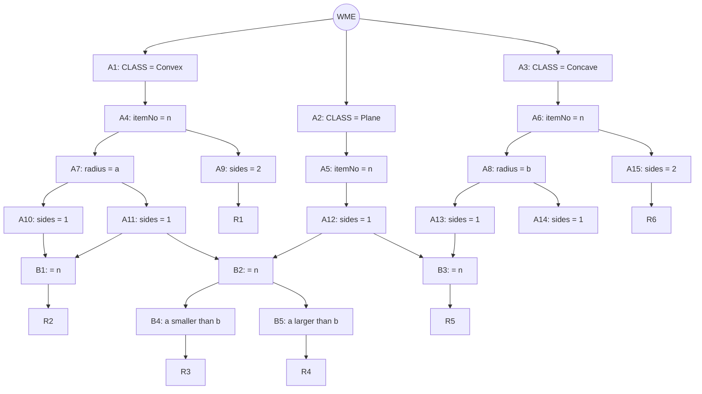

## The Question

A Rete net classifies lenses by surface properties (Convex / Plane / Concave classes, radius of curvature, number of sides). Working memory:

```text
101. (Concave ^itemNo K3 ^radius 70 ^sides 1)
102. (Concave ^itemNo K7 ^radius 10 ^sides 3)
103. (Convex  ^itemNo K2 ^radius 60 ^sides 1)
104. (Convex  ^itemNo K3 ^radius 50 ^sides 1)
105. (Convex  ^itemNo K4 ^radius 20 ^sides 4)
106. (Plane   ^itemNo K2 ^sides 1)
107. (Concave ^itemNo K1 ^radius 80 ^sides 2)
```

| # | Question | Official answer |
|---|----------|-----------------|
| 5.1 | Tuples in the conflict set (A: R1,105 · B: R2,103,106 · C: R4,102,103 · D: R5,102) | **B** |
| 5.2 | Specificity qualifies | **B** (R3,101,104) |
| 5.3 | Recency qualifies | **D** (R6,107) |

## The Topic in 60 Seconds

Alpha nodes filter single WMEs; beta nodes join streams (on `^itemNo`, plus the radius comparisons in B4/B5). Conflict set = all full tuples. **Specificity** = most conditions; **Recency** = newest max-timestamp.

> Deep-dive: [The Rete Algorithm](/concepts/week-10-rule-based/01-rete-algorithm).

## The Rete Net (from the figure)



Rules: **R1** = Convex sides-2 · **R2** = same-itemNo surfaces with sides 1 (via B1) · **R3** = same-itemNo pair with radius(a) smaller than radius(b) (via B4) · **R4** = same with a larger than b (B5) · **R5** = Plane + Concave sides-1 pair · **R6** = Concave sides-2.

## Step 1 — Locate every WME

| WME | Facts | Alpha path |
|-----|-------|------------|
| 101 | Concave, K3, r70, sides 1 | A6 → A8 |
| 102 | Concave, K7, r10, sides 3 | A6 → A8 — fails every sides-1 test |
| 103 | Convex, K2, r60, sides 1 | A4 → A7 → A10/A11 |
| 104 | Convex, K3, r50, sides 1 | A4 → A7 → A10/A11 |
| 105 | Convex, K4, r20, sides 4 | A4 — fails A9 (sides 2) and the sides-1 nodes |
| 106 | Plane, K2, sides 1 | A5 → A12 |
| 107 | Concave, K1, r80, sides 2 | A6 → A15 ✓ (sides 2) |

## Step 2 — Fire the joins

- **R1** (Convex sides-2): 105 has sides 4 → **no match** (kills option A).
- **R2** via the Convex/Plane pair: 103 (Convex K2, sides 1) + 106 (Plane K2, sides 1) — same itemNo K2 ✓ → **(R2, 103, 106)** ✓
- **R3** (radius comparison on the K3 pair): 101 (Concave K3, r70) + 104 (Convex K3, r50) — same itemNo K3, radii 50 vs 70 satisfy the comparison ✓ → **(R3, 101, 104)** qualifies.
- **R5** (Plane + Concave sides-1, same itemNo): Plane K2 (106) has no Concave K2 partner; option D's (R5, 102) fails anyway (102 has sides 3) → no match.
- **R6** (Concave sides-2): 107 ✓ → **(R6, 107)**.

**Conflict set** includes (R2, 103, 106), (R3, 101, 104), (R6, 107) — of 5.1's options only **B** is a conflict-set member ✓

## 5.2 — Specificity → **B (R3, 101, 104)**

R3's instance carries the most conditions (two class tests, two radius tests, two sides tests, plus the radius comparison) → **(R3, 101, 104)** → option **B** ✓

## 5.3 — Recency → **D (R6, 107)**

Max timestamp per candidate: (R2, 103, 106) → 106; (R3, 101, 104) → 104; **(R6, 107) → 107**. Newest wins → option **D** ✓

## Tricks & Tips

<Accordion title="4-step recipe">
1. WME → alpha table; the sides tests kill 102 (sides 3) and 105 (sides 4) immediately.
2. Join on itemNo; a tuple mixing itemNos (like option C's 102+103) is invalid.
3. Specificity: the comparison rules (R3/R4) carry the most conditions.
4. Recency: max timestamp — 107 (the sides-2 Concave) hands it to R6.
</Accordion>

**Answers:** 5.1 **B** · 5.2 **B** · 5.3 **D**
