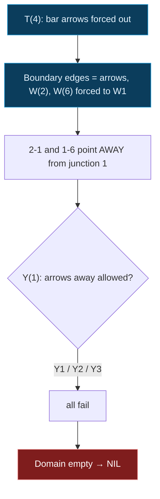

## The Question

The paper's junction dictionary (same catalog as the 2025 papers): L1-L6, W1-W3, Y1-Y3, T1-T4, with in-plane rotations allowed. Two drawings to label; both official answers are **NIL**.

| # | Drawing | Official answer |
|---|---------|-----------------|
| 7.1 | "House": apex 5 over centre 7, walls to 3 and 1, inner Y at 2 | NIL |
| 7.2 | "Podium": top bar 3-4-5, centre stem to 1, dangling edges at 2 and 6 | NIL |

## The Topic in 60 Seconds

Each junction must realize one legal dictionary pattern; shared edges agree at both ends (same label, same arrow direction). Any junction with an empty domain means **NIL**.

Key structural rules:

- **T-junction**: the two collinear bar edges carry arrows pointing *away* from the T.
- **Edges running off the page** must be occluding **arrows** (a +/- edge joins two visible faces and cannot dangle).
- **W1** is the only W pattern with arrows on its diagonals — and they point *into* the W.
- **Y patterns** allow arrows pointing *into* the Y (Y1), or all minus (Y2), or all plus (Y3) — never arrows pointing away.

> Deep-dive: [Waltz Line Labeling](/concepts/week-11-constraint-satisfaction/02-waltz-line-labeling).

## 7.1 — The house drawing → NIL

Junctions: apex **5 = W** (fan of three: to 4, 7, 6), **7 = T** (bar 5-7-2 collinear, stem 7-6), **2 = Y** (edges to 7, 3, 1 at ~120 degrees), **4 = L**, **6 = W**, **3 = W**, **1 = W**.

Propagation:

1. **T(7)**: bar arrows point away from the T — edge 5-7 = arrow **into 5**, edge 7-2 = arrow **into 2**. Stem 7-6 still free (T1/T2/T3/T4).
2. **W(5)**: edge 7-5 arrives as an arrow into 5. W1 is the only W pattern with arrows on its diagonals, and they point *into* the junction. So W1 at 5: one of `{4-5, 6-5}` is the + stem, the other diagonal is an arrow into 5.
3. If 6-5 were that arrow: from 6's side it points **away** from 6 — no W pattern allows an away-arrow. Dead. So **4-5 = arrow into 5**, stem **6-5 = +**.
4. **L(4)**: 5-4 arrives as an arrow *away* from 4 — only **L4** (both arrows away) permits that, so **4-3 = arrow into 3**.
5. **Y(2)**: edge 7-2 arrives as an arrow into 2 (from the T bar). Y patterns need the remaining edges `{3-2, 1-2}` to be `{arrow-into-2, minus}`. An arrow into 2 is an arrow *away* from 3 (and from 1) — no W pattern allows an away-arrow on any edge.
6. So 3-2 = **minus**. At **W(3)** that forces the W3 shape (+, minus, +), which needs **4-3 = +**. But step 4 fixed 4-3 as an **arrow into 3**. Contradiction — the domain at junction 3 empties.

**Answer: NIL**

## 7.2 — The podium drawing → NIL

Identical structure to the 2025 T1 paper's Waltz question (same podium: top bar 3-4-5, stem 4-1, diagonals 2-1 and 1-6, dangling edges at 2 and 6).

Junctions: 3 = **L**, 4 = **T**, 5 = **L**, 1 = **Y**, 2 = **W**, 6 = **W**.

1. **T(4)**: bar arrows forced outward — edge 3-4 = arrow into 3, edge 4-5 = arrow into 5.
2. **Boundary edges** (dangling at 2 and 6) must be occluding arrows; the only W pattern with an arrow diagonal is **W1**, pointing *into* the W. So at 2: edge 2-1 = arrow into 2, stem 2-3 = +; at 6: edge 1-6 = arrow into 6, stem 5-6 = +.
3. The L junctions 3 and 5 survive (arrow-in + plus = L5/L6 shapes).
4. **Y(1)**: both diagonals 2-1 and 1-6 now carry arrows pointing **away** from junction 1. No Y pattern allows that (Y1 wants arrows in, Y2 all minus, Y3 all plus). Domain empties.

**Answer: NIL**

## Tricks & Tips

<Accordion title="The 4-step Waltz exam method">
1. Classify junctions first (2 edges = L; collinear pair = T; 3-edge fan = W; ~120 degree trio = Y).
2. Start at the T — its bar arrows are forced outward.
3. Boundary/dangling edges are arrows; in a W that forces W1 (arrows into the junction).
4. Propagate; a wiped-out domain means answer NIL. Do not enumerate labelings — kill early.
</Accordion>

**Answers:** 7.1 NIL · 7.2 NIL
