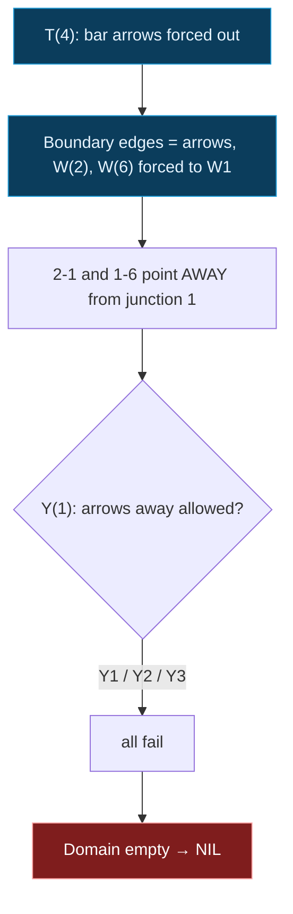

## The Question

The paper's junction dictionary (same catalog as the 2025 papers): L1-L6, W1-W3, Y1-Y3, T1-T4, with in-plane rotations allowed. Two drawings to label; both official answers are **NIL**.

| # | Drawing | Official answer |
|---|---------|-----------------|
| 7.1 | "House": apex 5 over centre 7, walls to 3 and 1, inner Y at 2 | NIL |
| 7.2 | "Podium": top bar 3-4-5, centre stem to 1, dangling edges at 2 and 6 | NIL |

## The Topic in 60 Seconds

Each junction must realize one legal dictionary pattern; shared edges agree at both ends (same label, same arrow direction). Any junction with an empty domain means **NIL**.

Key structural rules:

- **T-junction**: the two collinear bar edges carry arrows pointing *away* from the T.
- **Edges running off the page** must be occluding **arrows** (a +/- edge joins two visible faces and cannot dangle).
- **W1** is the only W pattern with arrows on its diagonals — and they point *into* the W.
- **Y patterns** allow arrows pointing *into* the Y (Y1), or all minus (Y2), or all plus (Y3) — never arrows pointing away.

> Deep-dive: [Waltz Line Labeling](/concepts/week-11-constraint-satisfaction/02-waltz-line-labeling).

## 7.1 — The house drawing → NIL

Junctions: apex **5 = W** (fan of three: to 4, 7, 6), **7 = T** (bar 5-7-2 collinear, stem 7-6), **2 = Y** (edges to 7, 3, 1 at ~120 degrees), **4 = L**, **6 = W**, **3 = W**, **1 = W**.

Propagation:

1. **T(7)**: bar arrows point away from the T — edge 5-7 = arrow **into 5**, edge 7-2 = arrow **into 2**. Stem 7-6 still free (T1/T2/T3/T4).
2. **W(5)**: edge 7-5 arrives as an arrow into 5. W1 is the only W pattern with arrows on its diagonals, and they point *into* the junction. So W1 at 5: one of `{4-5, 6-5}` carries the other in-arrow.
3. If 6-5 were that arrow: from 6's side it points **away** from 6 — no W pattern allows an away-arrow. Dead. So **4-5 = arrow into 5**, and the stem **6-5 = +**.
4. **L(4)**: 5-4 arrives as an arrow *away* from 4 — only **L4** (both arrows away) permits that, so **4-3 = arrow into 3**.
5. **Y(2)**: edge 7-2 arrives as an arrow into 2 (from the T bar). Y patterns need the remaining edges `{3-2, 1-2}` to be `{arrow-into-2, minus}`. An arrow along 3-2 would be an arrow *away* from 3 — no W pattern allows an away-arrow on any edge.
6. So 3-2 = **minus**. At **W(3)** that forces the W3 shape (+, minus, +), which needs **4-3 = +**. But step 4 fixed 4-3 as an **arrow into 3**. Contradiction — the domain at junction 3 empties.

**Answer: NIL**

<StepGraph
  height={430}
  nodeWidth={84}
  nodeHeight={46}
  nodeFontSize={11}
  legend={[
    { color: "#e5e7eb", label: "junction with open domain" },
    { color: "#b45309", label: "junction being forced" },
    { color: "#15803d", label: "edge pinned" },
    { color: "#7f1d1d", label: "domain wiped out (NIL)" }
  ]}
  steps={[
    {
      label: "Domains open",
      note: "Junctions: 5=W{W1,W2,W3}  7=T{T1-T4}  2=Y{Y1,Y2,Y3}\n4=L{L1-L6}  6=W{W1-W3}  3=W{W1-W3}  1=W{W1-W3}",
      elements: [
        { data: { id: "n5", label: "5: W1-W3", type: "unassigned" }, position: { x: 300, y: 30 } },
        { data: { id: "n4", label: "4: L1-L6", type: "unassigned" }, position: { x: 120, y: 140 } },
        { data: { id: "n6", label: "6: W1-W3", type: "unassigned" }, position: { x: 480, y: 140 } },
        { data: { id: "n7", label: "7: T1-T4", type: "unassigned" }, position: { x: 300, y: 155 } },
        { data: { id: "n3", label: "3: W1-W3", type: "unassigned" }, position: { x: 50, y: 300 } },
        { data: { id: "n1", label: "1: W1-W3", type: "unassigned" }, position: { x: 550, y: 300 } },
        { data: { id: "n2", label: "2: Y1-Y3", type: "unassigned" }, position: { x: 300, y: 320 } },
        { data: { id: "h1", source: "n5", target: "n4" } },
        { data: { id: "h2", source: "n5", target: "n7" } },
        { data: { id: "h3", source: "n5", target: "n6" } },
        { data: { id: "h4", source: "n7", target: "n2" } },
        { data: { id: "h5", source: "n7", target: "n6" } },
        { data: { id: "h6", source: "n4", target: "n3" } },
        { data: { id: "h7", source: "n2", target: "n3" } },
        { data: { id: "h8", source: "n2", target: "n1" } },
        { data: { id: "h9", source: "n6", target: "n1" } },
        { data: { id: "h10", source: "n3", target: "n1" } }
      ],
    },
    {
      label: "T(7) bars out",
      note: "T bar arrows point AWAY from the T:\nedge 7-5 = arrow into 5; edge 7-2 = arrow into 2.\nStem 7-6 still free.",
      elements: [
        { data: { id: "n5", label: "5: W1-W3", type: "frontier" }, position: { x: 300, y: 30 } },
        { data: { id: "n4", label: "4: L1-L6", type: "unassigned" }, position: { x: 120, y: 140 } },
        { data: { id: "n6", label: "6: W1-W3", type: "unassigned" }, position: { x: 480, y: 140 } },
        { data: { id: "n7", label: "7: T bar out", type: "current" }, position: { x: 300, y: 155 } },
        { data: { id: "n3", label: "3: W1-W3", type: "unassigned" }, position: { x: 50, y: 300 } },
        { data: { id: "n1", label: "1: W1-W3", type: "unassigned" }, position: { x: 550, y: 300 } },
        { data: { id: "n2", label: "2: Y1-Y3", type: "frontier" }, position: { x: 300, y: 320 } },
        { data: { id: "h1", source: "n5", target: "n4" } },
        { data: { id: "h2", source: "n5", target: "n7", label: "arr->5", type: "active" } },
        { data: { id: "h3", source: "n5", target: "n6" } },
        { data: { id: "h4", source: "n7", target: "n2", label: "arr->2", type: "active" } },
        { data: { id: "h5", source: "n7", target: "n6" } },
        { data: { id: "h6", source: "n4", target: "n3" } },
        { data: { id: "h7", source: "n2", target: "n3" } },
        { data: { id: "h8", source: "n2", target: "n1" } },
        { data: { id: "h9", source: "n6", target: "n1" } },
        { data: { id: "h10", source: "n3", target: "n1" } }
      ],
    },
    {
      label: "W(5) = W1",
      note: "An arrow enters 5 on a diagonal -> only W1 fits.\nPutting the second in-arrow on 6-5 would fire AWAY from 6:\nno W allows an away-arrow -> dead.\nSo 4-5 = arrow into 5; stem 6-5 = +.",
      elements: [
        { data: { id: "n5", label: "5: W1", type: "path" }, position: { x: 300, y: 30 } },
        { data: { id: "n4", label: "4: L?", type: "frontier" }, position: { x: 120, y: 140 } },
        { data: { id: "n6", label: "6: W, +stem", type: "frontier" }, position: { x: 480, y: 140 } },
        { data: { id: "n7", label: "7: T bar out", type: "explored" }, position: { x: 300, y: 155 } },
        { data: { id: "n3", label: "3: W1-W3", type: "unassigned" }, position: { x: 50, y: 300 } },
        { data: { id: "n1", label: "1: W1-W3", type: "unassigned" }, position: { x: 550, y: 300 } },
        { data: { id: "n2", label: "2: Y1-Y3", type: "frontier" }, position: { x: 300, y: 320 } },
        { data: { id: "h1", source: "n5", target: "n4", label: "arr->5", type: "path" } },
        { data: { id: "h2", source: "n5", target: "n7", label: "arr->5", type: "path" } },
        { data: { id: "h3", source: "n5", target: "n6", label: "+", type: "path" } },
        { data: { id: "h4", source: "n7", target: "n2", label: "arr->2", type: "path" } },
        { data: { id: "h5", source: "n7", target: "n6" } },
        { data: { id: "h6", source: "n4", target: "n3" } },
        { data: { id: "h7", source: "n2", target: "n3" } },
        { data: { id: "h8", source: "n2", target: "n1" } },
        { data: { id: "h9", source: "n6", target: "n1" } },
        { data: { id: "h10", source: "n3", target: "n1" } }
      ],
    },
    {
      label: "L(4) = L4",
      note: "Edge 5-4 arrives as an arrow AWAY from 4.\nOnly L4 (both arrows away) allows that.\nSo 4-3 = arrow INTO 3.",
      elements: [
        { data: { id: "n5", label: "5: W1", type: "path" }, position: { x: 300, y: 30 } },
        { data: { id: "n4", label: "4: L4", type: "path" }, position: { x: 120, y: 140 } },
        { data: { id: "n6", label: "6: W, +stem", type: "frontier" }, position: { x: 480, y: 140 } },
        { data: { id: "n7", label: "7: T bar out", type: "explored" }, position: { x: 300, y: 155 } },
        { data: { id: "n3", label: "3: arr-in!", type: "frontier" }, position: { x: 50, y: 300 } },
        { data: { id: "n1", label: "1: W1-W3", type: "unassigned" }, position: { x: 550, y: 300 } },
        { data: { id: "n2", label: "2: Y1-Y3", type: "frontier" }, position: { x: 300, y: 320 } },
        { data: { id: "h1", source: "n5", target: "n4", label: "arr->5", type: "path" } },
        { data: { id: "h2", source: "n5", target: "n7", label: "arr->5", type: "path" } },
        { data: { id: "h3", source: "n5", target: "n6", label: "+", type: "path" } },
        { data: { id: "h4", source: "n7", target: "n2", label: "arr->2", type: "path" } },
        { data: { id: "h5", source: "n7", target: "n6" } },
        { data: { id: "h6", source: "n4", target: "n3", label: "arr->3", type: "active" } },
        { data: { id: "h7", source: "n2", target: "n3" } },
        { data: { id: "h8", source: "n2", target: "n1" } },
        { data: { id: "h9", source: "n6", target: "n1" } },
        { data: { id: "h10", source: "n3", target: "n1" } }
      ],
    },
    {
      label: "Y(2) pins 3-2 = -",
      note: "7-2 already enters 2 as an arrow.\nThe other two edges must be {arrow-into-2, -} (Y1)\nor all-minus (Y2).\nAn arrow along 3-2 would point AWAY from 3 - no W/Y allows it.\nSo 3-2 = minus.",
      elements: [
        { data: { id: "n5", label: "5: W1", type: "path" }, position: { x: 300, y: 30 } },
        { data: { id: "n4", label: "4: L4", type: "path" }, position: { x: 120, y: 140 } },
        { data: { id: "n6", label: "6: W, +stem", type: "frontier" }, position: { x: 480, y: 140 } },
        { data: { id: "n7", label: "7: T bar out", type: "explored" }, position: { x: 300, y: 155 } },
        { data: { id: "n3", label: "3: arr-in + -", type: "frontier" }, position: { x: 50, y: 300 } },
        { data: { id: "n1", label: "1: W1-W3", type: "unassigned" }, position: { x: 550, y: 300 } },
        { data: { id: "n2", label: "2: Y ok", type: "explored" }, position: { x: 300, y: 320 } },
        { data: { id: "h1", source: "n5", target: "n4", label: "arr->5", type: "path" } },
        { data: { id: "h2", source: "n5", target: "n7", label: "arr->5", type: "path" } },
        { data: { id: "h3", source: "n5", target: "n6", label: "+", type: "path" } },
        { data: { id: "h4", source: "n7", target: "n2", label: "arr->2", type: "path" } },
        { data: { id: "h5", source: "n7", target: "n6" } },
        { data: { id: "h6", source: "n4", target: "n3", label: "arr->3", type: "path" } },
        { data: { id: "h7", source: "n2", target: "n3", label: "-", type: "active" } },
        { data: { id: "h8", source: "n2", target: "n1" } },
        { data: { id: "h9", source: "n6", target: "n1" } },
        { data: { id: "h10", source: "n3", target: "n1" } }
      ],
    },
    {
      label: "W(3) wipes out",
      note: "At 3 we hold: 4-3 = arrow IN, 3-2 = minus.\nThe minus forces shape W3 = (+,-,+), demanding 4-3 = +.\nBut 4-3 is pinned as an ARROW. No W or Y pattern accepts\n{arrow-in, minus, ...} -> domain at 3 EMPTY -> NIL.",
      elements: [
        { data: { id: "n5", label: "5: W1", type: "path" }, position: { x: 300, y: 30 } },
        { data: { id: "n4", label: "4: L4", type: "path" }, position: { x: 120, y: 140 } },
        { data: { id: "n6", label: "6: W, +stem", type: "pruned" }, position: { x: 480, y: 140 } },
        { data: { id: "n7", label: "7: T bar out", type: "explored" }, position: { x: 300, y: 155 } },
        { data: { id: "n3", label: "3: EMPTY", type: "pruned" }, position: { x: 50, y: 300 } },
        { data: { id: "n1", label: "1: never reached", type: "unassigned" }, position: { x: 550, y: 300 } },
        { data: { id: "n2", label: "2: Y ok", type: "explored" }, position: { x: 300, y: 320 } },
        { data: { id: "h1", source: "n5", target: "n4", label: "arr->5", type: "path" } },
        { data: { id: "h2", source: "n5", target: "n7", label: "arr->5", type: "path" } },
        { data: { id: "h3", source: "n5", target: "n6", type: "pruned" } },
        { data: { id: "h4", source: "n7", target: "n2", label: "arr->2", type: "path" } },
        { data: { id: "h5", source: "n7", target: "n6", type: "pruned" } },
        { data: { id: "h6", source: "n4", target: "n3", label: "+ vs arr", type: "pruned" } },
        { data: { id: "h7", source: "n2", target: "n3", label: "-", type: "pruned" } },
        { data: { id: "h8", source: "n2", target: "n1", type: "border" } },
        { data: { id: "h9", source: "n6", target: "n1", type: "border" } },
        { data: { id: "h10", source: "n3", target: "n1", type: "border" } }
      ],
    },
  ]}
/>

## 7.2 — The podium drawing → NIL

Same structure as the 2025 papers' podium: top bar 3-4-5, stem 4-1, diagonals 2-1 and 1-6, stems 2-3 and 5-6, dangling edges hanging off 2 and 6.

Junctions: 3 = **L**, 4 = **T**, 5 = **L**, 1 = **Y**, 2 = **W**, 6 = **W**.

1. **T(4)**: bar arrows forced outward — edge 3-4 = arrow into 3, edge 4-5 = arrow into 5.
2. **Boundary edges** (dangling at 2 and 6) must be occluding arrows; the only W pattern with arrow diagonals is **W1**, pointing *into* the W. So at 2: diagonal 2-1 = arrow into 2 (and the dangle too), stem 2-3 = +; at 6: diagonal 1-6 = arrow into 6, stem 5-6 = +.
3. The L junctions 3 and 5 survive (arrow-in + plus = legal L5/L6 shapes).
4. **Y(1)**: both diagonals 2-1 and 1-6 now carry arrows pointing **away** from junction 1. No Y pattern allows that (Y1 wants arrows in, Y2 all minus, Y3 all plus). Domain empties → **NIL**.

<StepGraph
  height={420}
  nodeWidth={84}
  nodeHeight={46}
  nodeFontSize={11}
  legend={[
    { color: "#e5e7eb", label: "open domain" },
    { color: "#b45309", label: "being forced" },
    { color: "#15803d", label: "pinned edge / surviving junction" },
    { color: "#7f1d1d", label: "wiped out (NIL)" }
  ]}
  steps={[
    {
      label: "Domains open",
      note: "Junctions: 3=L  4=T{T1-T4}  5=L  1=Y{Y1-Y3}  2=W{W1-W3}  6=W{W1-W3}",
      elements: [
        { data: { id: "p4", label: "4: T1-T4", type: "unassigned" }, position: { x: 300, y: 30 } },
        { data: { id: "p3", label: "3: L1-L6", type: "unassigned" }, position: { x: 130, y: 115 } },
        { data: { id: "p5", label: "5: L1-L6", type: "unassigned" }, position: { x: 470, y: 115 } },
        { data: { id: "p1", label: "1: Y1-Y3", type: "unassigned" }, position: { x: 300, y: 190 } },
        { data: { id: "p2", label: "2: W1-W3", type: "unassigned" }, position: { x: 150, y: 310 } },
        { data: { id: "p6", label: "6: W1-W3", type: "unassigned" }, position: { x: 450, y: 310 } },
        { data: { id: "px", label: "off-page", type: "terminal" }, position: { x: 60, y: 400 } },
        { data: { id: "py", label: "off-page", type: "terminal" }, position: { x: 540, y: 400 } },
        { data: { id: "k1", source: "p3", target: "p4" } },
        { data: { id: "k2", source: "p4", target: "p5" } },
        { data: { id: "k3", source: "p4", target: "p1" } },
        { data: { id: "k4", source: "p2", target: "p1" } },
        { data: { id: "k5", source: "p1", target: "p6" } },
        { data: { id: "k6", source: "p2", target: "p3" } },
        { data: { id: "k7", source: "p5", target: "p6" } },
        { data: { id: "k8", source: "p2", target: "px" } },
        { data: { id: "k9", source: "p6", target: "py" } }
      ],
    },
    {
      label: "T(4) bars out",
      note: "Bar arrows point away from the T:\n3-4 = arrow into 3; 4-5 = arrow into 5. Stem 4-1 free.",
      elements: [
        { data: { id: "p4", label: "4: T bar out", type: "current" }, position: { x: 300, y: 30 } },
        { data: { id: "p3", label: "3: arr-in", type: "frontier" }, position: { x: 130, y: 115 } },
        { data: { id: "p5", label: "5: arr-in", type: "frontier" }, position: { x: 470, y: 115 } },
        { data: { id: "p1", label: "1: Y1-Y3", type: "unassigned" }, position: { x: 300, y: 190 } },
        { data: { id: "p2", label: "2: W1-W3", type: "unassigned" }, position: { x: 150, y: 310 } },
        { data: { id: "p6", label: "6: W1-W3", type: "unassigned" }, position: { x: 450, y: 310 } },
        { data: { id: "px", label: "off-page", type: "terminal" }, position: { x: 60, y: 400 } },
        { data: { id: "py", label: "off-page", type: "terminal" }, position: { x: 540, y: 400 } },
        { data: { id: "k1", source: "p3", target: "p4", label: "arr->3", type: "path" } },
        { data: { id: "k2", source: "p4", target: "p5", label: "arr->5", type: "path" } },
        { data: { id: "k3", source: "p4", target: "p1" } },
        { data: { id: "k4", source: "p2", target: "p1" } },
        { data: { id: "k5", source: "p1", target: "p6" } },
        { data: { id: "k6", source: "p2", target: "p3" } },
        { data: { id: "k7", source: "p5", target: "p6" } },
        { data: { id: "k8", source: "p2", target: "px" } },
        { data: { id: "k9", source: "p6", target: "py" } }
      ],
    },
    {
      label: "Dangles force W1s",
      note: "Dangling edges must be occluding arrows; only W1 carries\narrows (pointing INTO the W).\nAt 2: 2-1 = arrow into 2, stem 2-3 = +. Same at 6:\n1-6 = arrow into 6, stem 5-6 = +. L(3), L(5) survive (arr-in + plus).",
      elements: [
        { data: { id: "p4", label: "4: T bar out", type: "explored" }, position: { x: 300, y: 30 } },
        { data: { id: "p3", label: "3: L ok", type: "path" }, position: { x: 130, y: 115 } },
        { data: { id: "p5", label: "5: L ok", type: "path" }, position: { x: 470, y: 115 } },
        { data: { id: "p1", label: "1: Y1-Y3", type: "current" }, position: { x: 300, y: 190 } },
        { data: { id: "p2", label: "2: W1", type: "path" }, position: { x: 150, y: 310 } },
        { data: { id: "p6", label: "6: W1", type: "path" }, position: { x: 450, y: 310 } },
        { data: { id: "px", label: "off-page", type: "terminal" }, position: { x: 60, y: 400 } },
        { data: { id: "py", label: "off-page", type: "terminal" }, position: { x: 540, y: 400 } },
        { data: { id: "k1", source: "p3", target: "p4", label: "arr->3", type: "path" } },
        { data: { id: "k2", source: "p4", target: "p5", label: "arr->5", type: "path" } },
        { data: { id: "k3", source: "p4", target: "p1" } },
        { data: { id: "k4", source: "p2", target: "p1", label: "arr->2", type: "path" } },
        { data: { id: "k5", source: "p1", target: "p6", label: "arr->6", type: "path" } },
        { data: { id: "k6", source: "p2", target: "p3", label: "+", type: "path" } },
        { data: { id: "k7", source: "p5", target: "p6", label: "+", type: "path" } },
        { data: { id: "k8", source: "p2", target: "px", label: "arr", type: "path" } },
        { data: { id: "k9", source: "p6", target: "py", label: "arr", type: "path" } }
      ],
    },
    {
      label: "Y(1) wipes out",
      note: "Both diagonals now leave 1 as arrows (they enter 2 and 6).\nY1 wants arrows IN, Y2 all minus, Y3 all plus -\nno pattern takes two arrows OUT. Domain at 1 EMPTY -> NIL.",
      elements: [
        { data: { id: "p4", label: "4: T bar out", type: "explored" }, position: { x: 300, y: 30 } },
        { data: { id: "p3", label: "3: L ok", type: "path" }, position: { x: 130, y: 115 } },
        { data: { id: "p5", label: "5: L ok", type: "path" }, position: { x: 470, y: 115 } },
        { data: { id: "p1", label: "1: EMPTY", type: "pruned" }, position: { x: 300, y: 190 } },
        { data: { id: "p2", label: "2: W1", type: "path" }, position: { x: 150, y: 310 } },
        { data: { id: "p6", label: "6: W1", type: "path" }, position: { x: 450, y: 310 } },
        { data: { id: "px", label: "off-page", type: "terminal" }, position: { x: 60, y: 400 } },
        { data: { id: "py", label: "off-page", type: "terminal" }, position: { x: 540, y: 400 } },
        { data: { id: "k1", source: "p3", target: "p4", label: "arr->3", type: "path" } },
        { data: { id: "k2", source: "p4", target: "p5", label: "arr->5", type: "path" } },
        { data: { id: "k3", source: "p4", target: "p1", type: "border" } },
        { data: { id: "k4", source: "p2", target: "p1", label: "arr away", type: "pruned" } },
        { data: { id: "k5", source: "p1", target: "p6", label: "arr away", type: "pruned" } },
        { data: { id: "k6", source: "p2", target: "p3", label: "+", type: "path" } },
        { data: { id: "k7", source: "p5", target: "p6", label: "+", type: "path" } },
        { data: { id: "k8", source: "p2", target: "px", label: "arr", type: "path" } },
        { data: { id: "k9", source: "p6", target: "py", label: "arr", type: "path" } }
      ],
    },
  ]}
/>

## Tricks & Tips

<Accordion title="The kill-chain method">
1. Classify junctions first (2 edges = L; collinear pair = T; 3-edge fan = W; ~120 degree trio = Y) — the classification alone tells you which patterns are even candidates.
2. Start every propagation at the T: its bar arrows are forced outward before you make any choice, pinning two edges for free.
3. Boundary/dangling edges are always occluding arrows; inside a W that forces W1 (the only W with arrows, pointing in). Watch what those arrows do at the FAR end — an arrow entering a neighbour is an arrow leaving it.
4. Neither drawing survives its own forcing: the house dies because W3 needs + where L4 fired an arrow (junction 3); the podium dies because both diagonals leave the Y as arrows (junction 1). One wiped-out domain = answer NIL — do not enumerate labelings, eliminate early.
</Accordion>

**Answers:** 7.1 NIL · 7.2 NIL
