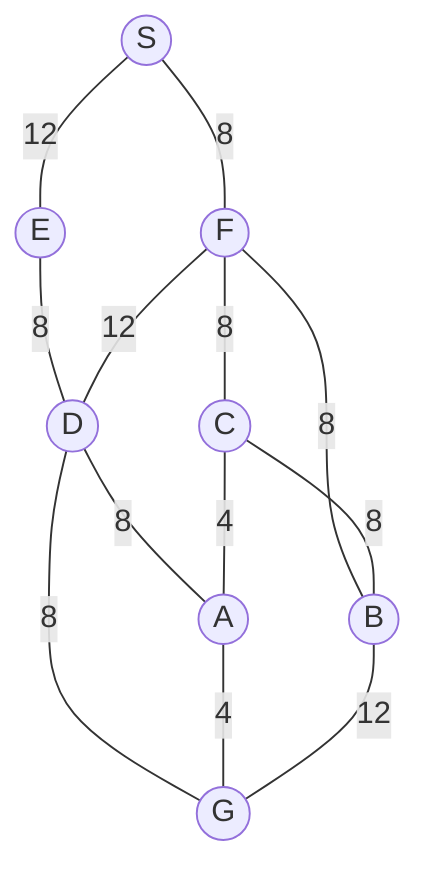

## The Question

1×1 grid, start S, goal G. MoveGen alphabetical, Manhattan heuristic, ties by label. The h values are **given** in the paper: h(S)=10, h(E)=9, h(F)=10, h(D)=4, h(C)=6, h(B)=7, h(A)=3, h(G)=0.

| # | Question | Official answer |
|---|----------|-----------------|
| 1.1 | Best First Search path | `S,E,D,G` |
| 1.2 | A* path | `S,F,C,A,G` |
| 1.3 | Branch-and-Bound path | `S,F,C,A,G` |
| 1.4 | Who finds the shortest path? (multi-select) | **B, C** |
| 1.5 | Admissibility | **A** — admissible |

## The Topic in 60 Seconds

BFS sorts by h, A\* by f = g + h, BnB by g on full paths. A\* is optimal when h never overestimates.

> Deep-dive: [A* Search](/concepts/week-03-heuristic-search/01-a-star-search), [Best First Search](/concepts/week-03-heuristic-search/09-best-first-search), [Branch and Bound](/concepts/week-03-heuristic-search/05-branch-and-bound).

## 1.1 — Best First Search → `S,E,D,G`

| Step | OPEN (node : h) | Pick |
|------|-----------------|------|
| 1 | S : 10 | **S** → E(9), F(10) |
| 2 | E : 9, F : 10 | **E** → D(4) |
| 3 | D : 4, F : 10 | **D** → A(3), G(0) |
| 4 | G : 0, A : 3, … | **G** — goal! |

Path: **S → E → D → G**, cost 12 + 8 + 8 = 28.

## 1.2 — A* → `S,F,C,A,G`

| Step | OPEN (node : f = g+h) | Pick |
|------|------------------------|------|
| 1 | S : 0+10 = **10** | **S** → E : 12+9 = 21, F : 8+10 = **18** |
| 2 | F : **18**, E : 21 | **F** → D : 20+4 = 24, C : 16+6 = **22**, B : 16+7 = 23 |
| 3 | C : **22**, B : 23, D : 24 | **C** → A : 20+3 = **23**, B via C: 24+7 = 31 (keep) |
| 4 | A : **23**, B : 23, D : 24 | **A** (tie A&lt;B) → G : 24+0 = **24** |
| 5 | B : 23, G : **24** | **B** first (23 < 24) → G via B: 28+0 = 28 (keep) |
| 6 | G : **24** | **G** — goal! |

Path: **S → F → C → A → G**, cost 8+8+4+4 = 24.

<PaperTrace
  height={380}
  nodeWidth={100}
  nodeHeight={50}
  nodeFontSize={13}
  legend={[
    { color: "#b45309", label: "expanding" },
    { color: "#0369a1", label: "in OPEN (f = g+h)" },
    { color: "#4b5563", label: "expanded" },
    { color: "#16a34a", label: "returned path" }
  ]}
  nodes={[
    { id: "S", x: 40, y: 200 },
    { id: "E", x: 220, y: 340 },
    { id: "F", x: 220, y: 60 },
    { id: "D", x: 420, y: 200 },
    { id: "C", x: 620, y: 60 },
    { id: "B", x: 620, y: 340 },
    { id: "A", x: 820, y: 200 },
    { id: "G", x: 820, y: 40 }
  ]}
  edges={[
    { id: "e1", from: "S", to: "E", label: "12" },
    { id: "e2", from: "S", to: "F", label: "8" },
    { id: "e3", from: "E", to: "D", label: "8" },
    { id: "e4", from: "F", to: "D", label: "12" },
    { id: "e5", from: "F", to: "C", label: "8" },
    { id: "e6", from: "F", to: "B", label: "8" },
    { id: "e7", from: "D", to: "A", label: "8" },
    { id: "e8", from: "D", to: "G", label: "8" },
    { id: "e9", from: "C", to: "A", label: "4" },
    { id: "e10", from: "C", to: "B", label: "8" },
    { id: "e11", from: "A", to: "G", label: "4" },
    { id: "e12", from: "B", to: "G", label: "12" }
  ]}
  steps={[
    { label: "Init", note: "OPEN = {S(g=0, h=10, f=10)}", nodes: { S: "frontier" } },
    { label: "Expand S", note: "E: g=12, h=9 → f=21 | F: g=8, h=10 → f=18 | OPEN = {F(18), E(21)}", nodes: { S: "explored", F: "frontier", E: "frontier" } },
    { label: "Expand F", note: "D: g=20, h=4 → f=24 | C: g=16, h=6 → f=22 | B: g=16, h=7 → f=23 | OPEN = {C(22), B(23), D(24)}", nodes: { S: "explored", F: "current", C: "frontier", B: "frontier", D: "frontier", E: "frontier" } },
    { label: "Expand C", note: "A: g=20, h=3 → f=23 | B via C: g=24 → f=31 (keep 23) | OPEN = {A(23), B(23), D(24)}", nodes: { F: "explored", C: "current", A: "frontier", B: "frontier", D: "frontier", E: "frontier" } },
    { label: "Expand A", note: "G: g=24, h=0 → f=24 | OPEN = {B(23), G(24), D(24)}", nodes: { C: "explored", A: "current", G: "frontier", B: "frontier", D: "frontier", E: "frontier" } },
    { label: "Expand B", note: "G via B: g=28 → f=28 (keep 24) | OPEN = {G(24), D(24)}", nodes: { A: "explored", B: "current", G: "frontier", D: "frontier", E: "frontier" } },
    { label: "GOAL: S→F→C→A", note: "Pick G (f=24) = GOAL. Path S,F,C,A,G cost 24 - optimal (h admissible).", nodes: { S: "path", F: "path", C: "path", A: "path", G: "goal" }, edges: { e2: "path", e5: "path", e9: "path", e11: "path" } }
  ]}
/>

## 1.3 — Branch-and-Bound → `S,F,C,A,G`

| Pop | OPEN (path : g) | Extend |
|-----|-----------------|--------|
| S : 0 | SE : 12, SF : 8 | |
| SF : 8 | SFD : 20, SFC : 16, SFB : 16 | |
| SFC : 16 (tie SFB, C < B) | SFCA : 24, SFCB : 24 | |
| SFB : 16 | SFBG : 28 | |
| SFCA : 24 (tie SFCB, A < B) | SFCAG : **24** ← goal | |
| SFCAG : **24** | all open ≥ 24 → **optimal** | |

Path: **S → F → C → A → G**, cost 24 ✓

## 1.4 — Shortest path → **B, C (both)**

A* and BnB both returned 24; BFS returned 28 → **B and C** (multi-select!).

## 1.5 — Admissibility → **A (admissible)**

Every h ≤ true cost: h(A)=3 ≤ 4, h(D)=4 ≤ 8, h(C)=6 ≤ 8, h(B)=7 ≤ 12, h(F)=10 ≤ 16, h(E)=9 ≤ 20, h(S)=10 ≤ 24 → **admissible** ✓ — which is why A* hit the optimum.

## Tricks & Tips

<Accordion title="Exam shortcuts">
1. The h values are printed — build the table before tracing.
2. Watch 1.4: it is **multi-select** — both optimal algorithms must be ticked.
3. A\* step 5 is the trap: B (23) pops before G (24); expanding B must not distract you — G's 24 still wins.
</Accordion>

**Answers:** 1.1 `S,E,D,G` · 1.2 `S,F,C,A,G` · 1.3 `S,F,C,A,G` · 1.4 **B, C** · 1.5 **A**
