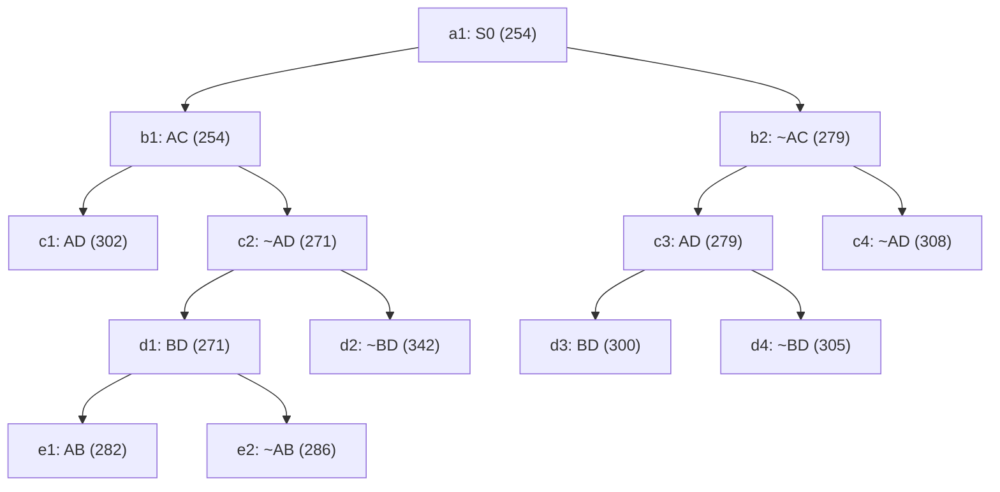

## The Question

TSP BnB snapshot when the optimal tour is discovered.

| # | Question | Official answer |
|---|----------|-----------------|
| 2.1 | 2nd–5th nodes refined | `b1,c2,d1,b2` |
| 2.2 | Optimal tour node + cost | `e1,282` |
| 2.3 | Number of cities | `5` |
| 2.4 | Tour from A | `A,B,D,E,C` |

## The Topic in 60 Seconds

Refine = pop the cheapest open node, insert its two children. Childless snapshot nodes are tours. Stop when a tour pops with no cheaper open node.

> Deep-dive: [Reading BnB Trees](/concepts/week-05-optimal-tsp/01-bnb-tree-reading), [Branch and Bound](/concepts/week-03-heuristic-search/05-branch-and-bound).

## 2.1 — Refine order → `b1,c2,d1,b2`

| Pop | Queue (min first) | Action |
|-----|-------------------|--------|
| 1 | a1 : 254 | refine → b1(254), b2(279) |
| 2 | b1 : 254, b2 : 279 | refine **b1** → c1(302), c2(271) |
| 3 | c2 : 271, b2 : 279, c1 : 302 | refine **c2** → d1(271), d2(342) |
| 4 | d1 : 271, b2 : 279, c1 : 302, d2 : 342 | refine **d1** → e1(282), e2(286) |
| 5 | b2 : 279, e1 : 282, e2 : 286, … | refine **b2** → c3(279), c4(308) |

## 2.2 — Optimal tour → `e1`, cost `282`

Pop c3(279) → d3(300), d4(305). Queue: `{e1 : 282, e2 : 286, d3 : 300, c4 : 308, d4 : 305}`. Minimum **e1 : 282** is a **leaf** — a tour — and everything else ≥ 286 → **e1 = optimal, 282** ✓

## 2.3 — Cities → `5`

Path root→e1: **AC in, ~AD, BD in, AB in**. Degrees: A–2 full (C, B), B–2 full (A, D), D–1, C–1, E–0. D's remaining partner: D–E (AD excluded); C then takes E. Tour: **A–B–D–E–C–A** → 5 cities ✓

## 2.4 — Tour from A → `A,B,D,E,C`

The forced cycle above ✓ (reverse A,C,E,D,B equivalent).

<Graph
  height={430}
  nodeWidth={110}
  nodeHeight={56}
  nodeFontSize={12}
  layout={{ name: "preset" }}
  elements={[
    { data: { id: "a1", label: "a1: S0 254", type: "current" }, position: { x: 380, y: 20 } },
    { data: { id: "b1", label: "b1: AC 254", type: "current" }, position: { x: 180, y: 110 } },
    { data: { id: "b2", label: "b2: ~AC 279", type: "current" }, position: { x: 600, y: 110 } },
    { data: { id: "c1", label: "c1: AD 302", type: "explored" }, position: { x: 40, y: 200 } },
    { data: { id: "c2", label: "c2: ~AD 271", type: "current" }, position: { x: 300, y: 200 } },
    { data: { id: "c3", label: "c3: AD 279", type: "explored" }, position: { x: 540, y: 200 } },
    { data: { id: "c4", label: "c4: ~AD 308" }, position: { x: 740, y: 200 } },
    { data: { id: "d1", label: "d1: BD 271", type: "current" }, position: { x: 240, y: 290 } },
    { data: { id: "d2", label: "d2: ~BD 342" }, position: { x: 380, y: 290 } },
    { data: { id: "d3", label: "d3: BD 300" }, position: { x: 500, y: 290 } },
    { data: { id: "d4", label: "d4: ~BD 305" }, position: { x: 630, y: 290 } },
    { data: { id: "e1", label: "e1: AB 282 ✓", type: "path" }, position: { x: 180, y: 380 } },
    { data: { id: "e2", label: "e2: ~AB 286" }, position: { x: 310, y: 380 } },
    { data: { id: "x1", source: "a1", target: "b1" } },
    { data: { id: "x2", source: "a1", target: "b2" } },
    { data: { id: "x3", source: "b1", target: "c1" } },
    { data: { id: "x4", source: "b1", target: "c2" } },
    { data: { id: "x5", source: "c2", target: "d1" } },
    { data: { id: "x6", source: "c2", target: "d2" } },
    { data: { id: "x7", source: "d1", target: "e1" } },
    { data: { id: "x8", source: "d1", target: "e2" } },
    { data: { id: "x9", source: "b2", target: "c3" } },
    { data: { id: "x10", source: "b2", target: "c4" } },
    { data: { id: "x11", source: "c3", target: "d3" } },
    { data: { id: "x12", source: "c3", target: "d4" } },
  ]}
/>

*Amber = refined in order b1 → c2 → d1 → b2. Green = e1, the 282 tour.*

## Tricks & Tips

<Accordion title="Fast method">
1. Sorted queue with (cost, ref#); refine only nodes with children in the snapshot.
2. Optimal = cheapest leaf popped while all open bounds ≥ it.
3. Cities: complete degrees from the winner's chain; the excluded AD forces D-E and C-E.
</Accordion>

**Answers:** 2.1 `b1,c2,d1,b2` · 2.2 `e1,282` · 2.3 `5` · 2.4 `A,B,D,E,C`
