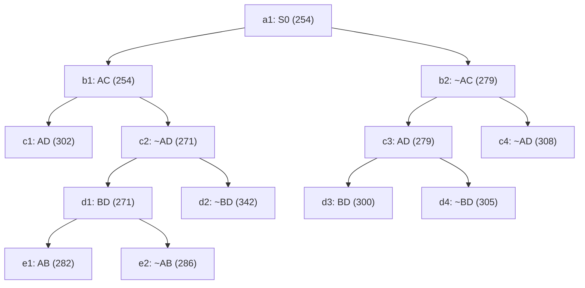

## The Question

TSP BnB snapshot when the optimal tour is discovered.

| # | Question | Official answer |
|---|----------|-----------------|
| 2.1 | 2nd–5th nodes refined | `b1,c2,d1,b2` |
| 2.2 | Optimal tour node + cost | `e1,282` |
| 2.3 | Number of cities | `5` |
| 2.4 | Tour from A | `A,B,D,E,C` |

## The Topic in 60 Seconds

Refine = pop the cheapest open node, insert its two children. Childless snapshot nodes are tours. Stop when a tour pops with no cheaper open node.

> Deep-dive: [Reading BnB Trees](/concepts/week-05-optimal-tsp/01-bnb-tree-reading), [Branch and Bound](/concepts/week-03-heuristic-search/05-branch-and-bound).

## 2.1 — Refine order → `b1,c2,d1,b2`

Pop the minimum bound each round; refining replaces the popped node by its two children.

| Pop | Queue before (bound) | Refine | Children added |
|-----|----------------------|--------|----------------|
| 1 | a1 : 254 | **a1** | b1 : 254, b2 : 279 |
| 2 | b1 : 254, b2 : 279 | **b1** | c1 : 302, c2 : 271 |
| 3 | c2 : 271, b2 : 279, c1 : 302 | **c2** | d1 : 271, d2 : 342 |
| 4 | d1 : 271, b2 : 279, c1 : 302, d2 : 342 | **d1** | e1 : 282, e2 : 286 |
| 5 | b2 : 279, e1 : 282, e2 : 286, c1 : 302, d2 : 342 | **b2** | c3 : 279, c4 : 308 |

## 2.2 — Optimal tour → `e1`, cost `282`

Pop c3(279) → adds d3(300), d4(305). Queue sorted: `{e1 : 282, e2 : 286, d3 : 300, c1 : 302, d4 : 305, c4 : 308, d2 : 342}`.

The minimum **e1 : 282** has no children in the snapshot — it is a **complete tour** — and every other open bound is ≥ 286 > 282. Nothing cheaper can ever appear → **e1 = optimal, 282** ✓

## 2.3 — Cities → `5`

Chain root→e1: **AC in → ~AD excluded → BD in → AB in**. Fixed edges: A–C, B–D, A–B.

Degrees: A = 2 (C, B) full · B = 2 (D, A) full · C = 1 (A) · D = 1 (B) · E = 0.

AD is excluded, so D's missing partner cannot be A → forced **D–E**; then C's missing partner is E too → **C–E**. One closed cycle:

$$A - B - D - E - C - A \Rightarrow \textbf{5 cities} ✓$$

## 2.4 — Tour from A → `A,B,D,E,C`

The forced cycle above read from A ✓ (the reverse A,C,E,D,B is the same tour).

<PaperTrace
  height={430}
  nodeWidth={110}
  nodeHeight={56}
  nodeFontSize={12}
  legend={[
    { color: "#b45309", label: "refining now" },
    { color: "#0369a1", label: "open (waiting)" },
    { color: "#4b5563", label: "already refined" },
    { color: "#15803d", label: "optimal tour (leaf)" }
  ]}
  nodes={[
    { id: "a1", label: "a1: S0 254", x: 400, y: 20 },
    { id: "b1", label: "b1: AC 254", x: 200, y: 110 },
    { id: "b2", label: "b2: ~AC 279", x: 620, y: 110 },
    { id: "c1", label: "c1: AD 302", x: 60, y: 200 },
    { id: "c2", label: "c2: ~AD 271", x: 320, y: 200 },
    { id: "c3", label: "c3: AD 279", x: 520, y: 200 },
    { id: "c4", label: "c4: ~AD 308", x: 740, y: 200 },
    { id: "d1", label: "d1: BD 271", x: 200, y: 290 },
    { id: "d2", label: "d2: ~BD 342", x: 380, y: 290 },
    { id: "d3", label: "d3: BD 300", x: 500, y: 290 },
    { id: "d4", label: "d4: ~BD 305", x: 650, y: 290 },
    { id: "e1", label: "e1: AB 282", x: 120, y: 380 },
    { id: "e2", label: "e2: ~AB 286", x: 270, y: 380 }
  ]}
  edges={[
    { id: "x1", from: "a1", to: "b1" },
    { id: "x2", from: "a1", to: "b2" },
    { id: "x3", from: "b1", to: "c1" },
    { id: "x4", from: "b1", to: "c2" },
    { id: "x5", from: "c2", to: "d1" },
    { id: "x6", from: "c2", to: "d2" },
    { id: "x7", from: "d1", to: "e1" },
    { id: "x8", from: "d1", to: "e2" },
    { id: "x9", from: "b2", to: "c3" },
    { id: "x10", from: "b2", to: "c4" },
    { id: "x11", from: "c3", to: "d3" },
    { id: "x12", from: "c3", to: "d4" }
  ]}
  steps={[
    { label: "Queue: a1(254)", note: "OPEN = { a1:254 }", nodes: { a1: "frontier" } },
    { label: "Refine a1", note: "Pop a1:254 -> insert b1:254, b2:279\nOPEN = { b1:254, b2:279 }", nodes: { a1: "explored", b1: "frontier", b2: "frontier" } },
    { label: "Refine b1", note: "Pop b1:254 -> insert c1:302, c2:271\nOPEN = { c2:271, b2:279, c1:302 }", nodes: { a1: "explored", b1: "current", b2: "frontier", c1: "frontier", c2: "frontier" }, edges: { x1: "path" } },
    { label: "Refine c2", note: "Pop c2:271 -> insert d1:271, d2:342\nOPEN = { d1:271, b2:279, c1:302, d2:342 }", nodes: { a1: "explored", b1: "explored", b2: "frontier", c1: "frontier", c2: "current", d1: "frontier", d2: "frontier" }, edges: { x1: "path", x4: "active" } },
    { label: "Refine d1", note: "Pop d1:271 -> insert e1:282, e2:286\nOPEN = { b2:279, e1:282, e2:286, c1:302, d2:342 }", nodes: { a1: "explored", b1: "explored", b2: "frontier", c1: "frontier", c2: "explored", d1: "current", d2: "frontier", e1: "frontier", e2: "frontier" }, edges: { x1: "path", x4: "path", x5: "active" } },
    { label: "Refine b2", note: "Pop b2:279 -> insert c3:279, c4:308\nOPEN = { c3:279, e1:282, e2:286, c1:302, d2:342, c4:308 }", nodes: { a1: "explored", b1: "explored", b2: "current", c1: "frontier", c2: "explored", d1: "explored", d2: "frontier", e1: "frontier", e2: "frontier", c3: "frontier", c4: "frontier" }, edges: { x2: "active" } },
    { label: "Pop c3", note: "Pop c3:279 -> insert d3:300, d4:305\nOPEN = { e1:282, e2:286, d3:300, c1:302, d4:305, c4:308, d2:342 }", nodes: { a1: "explored", b1: "explored", b2: "explored", c1: "frontier", c2: "explored", d1: "explored", d2: "frontier", e1: "frontier", e2: "frontier", c3: "current", c4: "frontier", d3: "frontier", d4: "frontier" }, edges: { x2: "path", x9: "active" } },
    { label: "Tour: e1 = 282", note: "Min e1:282 is a LEAF = complete tour.\nAll other open bounds >= 286 > 282 -> OPTIMAL.\nForced cycle: A-B-D-E-C-A (5 cities).", nodes: { a1: "explored", b1: "explored", b2: "explored", c1: "frontier", c2: "explored", d1: "explored", d2: "frontier", e1: "path", e2: "frontier", c3: "explored", c4: "frontier", d3: "frontier", d4: "frontier" }, edges: { x1: "path", x4: "path", x5: "path", x7: "path" } }
  ]}
/>

*Amber = refined in order b1 → c2 → d1 → b2. Green = e1, the 282 tour.*

## Tricks & Tips

<Accordion title="Fast method">
1. Simulate the queue as sorted pairs (bound, ref#): after refining b1, its exclude-child c2 (271) jumps ahead of the untouched b2 (279) — that inversion drives the whole refine order.
2. Refine exactly five times here: a1, b1, c2, d1, b2. Stop refining the moment a leaf reaches the top of the queue.
3. Optimality check is one comparison: e1 : 282 vs next-best e2 : 286.
4. Reconstruct degrees from the winner's chain (AC, BD, AB in; AD out): A and B close instantly, ~AD forces D–E, and C's dangling degree forces C–E. Five junctions, one cycle: A-B-D-E-C-A.
</Accordion>

**Answers:** 2.1 `b1,c2,d1,b2` · 2.2 `e1,282` · 2.3 `5` · 2.4 `A,B,D,E,C`
