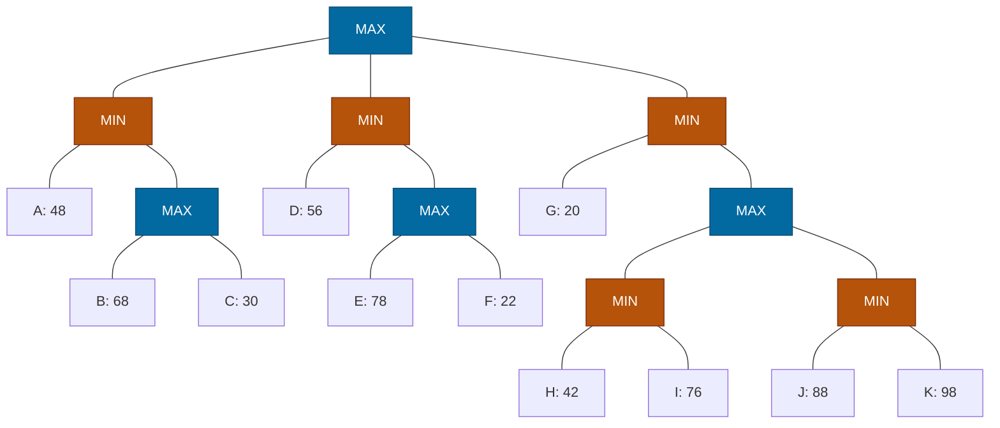

## The Question

Squares = MAX, circles = MIN. Leaves A–K. Tie-breaker: deepest, then leftmost.

| # | Question | Official answer |
|---|----------|-----------------|
| 3.1 | Valid strategies (A: A,C · B: A,D,G · C: G,J,K · D: D,E,F) | **A and C** |
| 3.2 | Best strategy leaves | `D,E` |
| 3.3 | Alpha-Beta pruned | `C,F,H,I,J,K` |
| 3.4 | SSS* solved | `A,D,E,G` |

## The Topic in 60 Seconds

- **Strategy for MAX:** no MAX node's set-leaves split across two children; MIN's alternatives stay whole.
- **Best strategy** maximizes min(leaves) = root value.
- **α-β:** cutoff when α ≥ β. **SSS\*:** solves leaves line-by-line.

> Deep-dive: [Game Strategies](/concepts/week-07-game-search/03-game-strategies), [Alpha-Beta Pruning](/concepts/week-07-game-search/02-alpha-beta-pruning), [SSS*](/concepts/week-03-heuristic-search/03-sss-star).

## Step 0 — Back up

- $X_1 = \max(68, 30) = 68$; $M_1 = \min(48, 68) = 48$
- $X_2 = \max(78, 22) = 78$; $M_2 = \min(56, 78) = 56$
- $Y_3 = \min(42, 76) = 42$; $Z_3 = \min(88, 98) = 88$; $X_3 = \max(42, 88) = 88$; $M_3 = \min(20, 88) = 20$
- $\text{Root} = \max(48, 56, 20) = \mathbf{56}$ via $M_2$

## 3.1 — Valid strategies → **A (A,C) and C (G,J,K)**

| Option | Check | Verdict |
|--------|-------|---------|
| **A: A,C** | Root→$M_1$ ✓; $M_1$ keeps A, $X_1$; $X_1$ → C only ✓ | **Valid** |
| B: A,D,G | Root splits across $M_1$/$M_2$/$M_3$ | Invalid |
| **C: G,J,K** | Root→$M_3$ ✓; $M_3$ keeps G, $X_3$; $X_3$ → $Y_3$ only; $Y_3$ keeps J,K ✓ | **Valid** |
| D: D,E,F | $X_2$: E direct **and** F via $Y_3$ — split! (wait — F is under $X_2$ directly in this tree? No: F is a direct leaf of $X_2$ alongside E — E and F are both children of $X_2$ → set `{D,E,F}` has E and F from $X_2$ — both children → split!) | Invalid |

## 3.2 — Best strategy → `D,E`

Root → $M_2$ (56). $M_2$ keeps D and $X_2$; $X_2$ picks E (78 beats 22). Leaves **`{D, E}`**, guarantee min(56, 78) = 56 = game value ✓

## 3.3 — Alpha-Beta prunes → `C,F,H,I,J,K`

| Node | Window | Happening |
|------|--------|-----------|
| $M_1$ (MIN) | $(-\infty, \infty)$ | A = 48 → β = 48 |
| $X_1$ (MAX) | $(-\infty, 48)$ | B = 68 ≥ 48 → **β-cutoff** — C pruned! |
| Root | α = 48 | |
| $M_2$ (MIN) | $(48, \infty)$ | D = 56 → β = 56 |
| $X_2$ (MAX) | $(48, 56)$ | E = 78 ≥ 56 → **β-cutoff** — F pruned! |
| Root | α = 56 | |
| $M_3$ (MIN) | $(56, \infty)$ | G = 20 ≤ 56 → **α-cutoff** — $X_3$ (H, I, J, K) pruned! |

Pruned: **C, F, H, I, J, K** ✓ — only A, B, D, E, G inspected.

<PaperTrace
  height={400}
  nodeWidth={100}
  nodeHeight={50}
  nodeFontSize={12}
  legend={[
    { color: "#0369a1", label: "MAX (square)" },
    { color: "#b45309", label: "MIN (circle)" },
    { color: "#16a34a", label: "inspected / value path" },
    { color: "#4b5563", label: "pruned" }
  ]}
  nodes={[
    { id: "R", label: "MAX", kind: "max", x: 430, y: 20 },
    { id: "M1", label: "MIN", kind: "min", x: 150, y: 120 },
    { id: "M2", label: "MIN", kind: "min", x: 430, y: 120 },
    { id: "M3", label: "MIN", kind: "min", x: 710, y: 120 },
    { id: "A", label: "A: 48", x: 40, y: 230 },
    { id: "X1", label: "MAX", kind: "max", x: 210, y: 230 },
    { id: "B", label: "B: 68", x: 140, y: 340 },
    { id: "C", label: "C: 30", x: 270, y: 340 },
    { id: "D", label: "D: 56", x: 340, y: 230 },
    { id: "X2", label: "MAX", kind: "max", x: 480, y: 230 },
    { id: "E", label: "E: 78", x: 420, y: 340 },
    { id: "F", label: "F: 22", x: 550, y: 340 },
    { id: "G", label: "G: 20", x: 660, y: 230 },
    { id: "X3", label: "MAX", kind: "max", x: 790, y: 230 },
    { id: "Y3", label: "MIN", kind: "min", x: 720, y: 340 },
    { id: "Z3", label: "MIN", kind: "min", x: 860, y: 340 },
    { id: "H", label: "H: 42", x: 650, y: 450 },
    { id: "I", label: "I: 76", x: 780, y: 450 },
    { id: "J", label: "J: 88", x: 800, y: 450 },
    { id: "K", label: "K: 98", x: 920, y: 450 }
  ]}
  edges={[
    { id: "x1", from: "R", to: "M1" },
    { id: "x2", from: "R", to: "M2" },
    { id: "x3", from: "R", to: "M3" },
    { id: "x4", from: "M1", to: "A" },
    { id: "x5", from: "M1", to: "X1" },
    { id: "x6", from: "X1", to: "B" },
    { id: "x7", from: "X1", to: "C" },
    { id: "x8", from: "M2", to: "D" },
    { id: "x9", from: "M2", to: "X2" },
    { id: "x10", from: "X2", to: "E" },
    { id: "x11", from: "X2", to: "F" },
    { id: "x12", from: "M3", to: "G" },
    { id: "x13", from: "M3", to: "X3" },
    { id: "x14", from: "X3", to: "Y3" },
    { id: "x15", from: "X3", to: "Z3" },
    { id: "x16", from: "Y3", to: "H" },
    { id: "x17", from: "Y3", to: "I" },
    { id: "x18", from: "Z3", to: "J" },
    { id: "x19", from: "Z3", to: "K" }
  ]}
  steps={[
    { label: "1 · M1: A=48", note: "M1 (MIN): A = 48 -> beta = 48.", nodes: { R: "max", M1: "current", A: "path" } },
    { label: "2 · X1: B=68 cutoff", note: "X1 (MAX) window (-inf, 48): B = 68 >= 48 -> BETA-CUTOFF. C pruned! M1 = 48. Root: alpha = 48.", nodes: { R: "current", M1: "path", A: "path", X1: "current", B: "path", C: "explored" } },
    { label: "3 · M2: D=56", note: "M2 (MIN) window (48, inf): D = 56 -> beta = 56.", nodes: { R: "max", M2: "current", D: "frontier", M1: "path", A: "path" } },
    { label: "4 · X2: E=78 cutoff", note: "X2 (MAX) window (48, 56): E = 78 >= 56 -> BETA-CUTOFF. F pruned! M2 = 56. Root: alpha = 56.", nodes: { R: "current", M2: "path", D: "path", X2: "current", E: "path", F: "explored" } },
    { label: "5 · M3: G=20 cutoff · Root=56", note: "M3 (MIN) window (56, inf): G = 20 <= 56 -> ALPHA-CUTOFF. H, I, J, K pruned! Root = max(48, 56, 20) = 56 via M2. Pruned: C, F, H, I, J, K.", nodes: { R: "path", M1: "path", M2: "path", M3: "current", A: "path", B: "path", D: "path", E: "path", G: "path", X1: "explored", X2: "explored", X3: "explored", C: "explored", F: "explored", Y3: "explored", Z3: "explored", H: "explored", I: "explored", J: "explored", K: "explored" } }
  ]}
/>

## 3.4 — SSS* solves → `A,D,E,G`

1. **A solved** (48) → $M_1 \le 48$; $X_1$ live merit 48: **B solved** (68 ≥ 48) → $X_1$ proven → C never expanded. $M_1$ solved 48.
2. $M_2$ line (∞): **D solved** (56) → $X_2$ live merit 56: **E solved** (78 ≥ 56) → $X_2$ proven → F never expanded. $M_2$ solved 56.
3. $M_3$ line (merit 56): **G solved** (20 ≤ 56) → $M_3 = 20$; $X_3$ (H, I, J, K) never needed.
4. Root = 56. Solved: **A, D, E, G** ✓ (the paper also accepted A,D,G,E — same set, different order.)

## Tricks & Tips

<Accordion title="Speed routines">
1. Back up MAX squares first, then MINs, then root.
2. Strategy validity: no split at any MAX node — check each option in seconds.
3. Best strategy: walk the value down; verify min(56, 78) = 56.
4. Every MIN here opens with a low first leaf → β-cutoffs inside the MAX children and a final α-cutoff at M3.
</Accordion>

**Answers:** 3.1 **A, C** · 3.2 `D,E` · 3.3 `C,F,H,I,J,K` · 3.4 `A,D,E,G`
