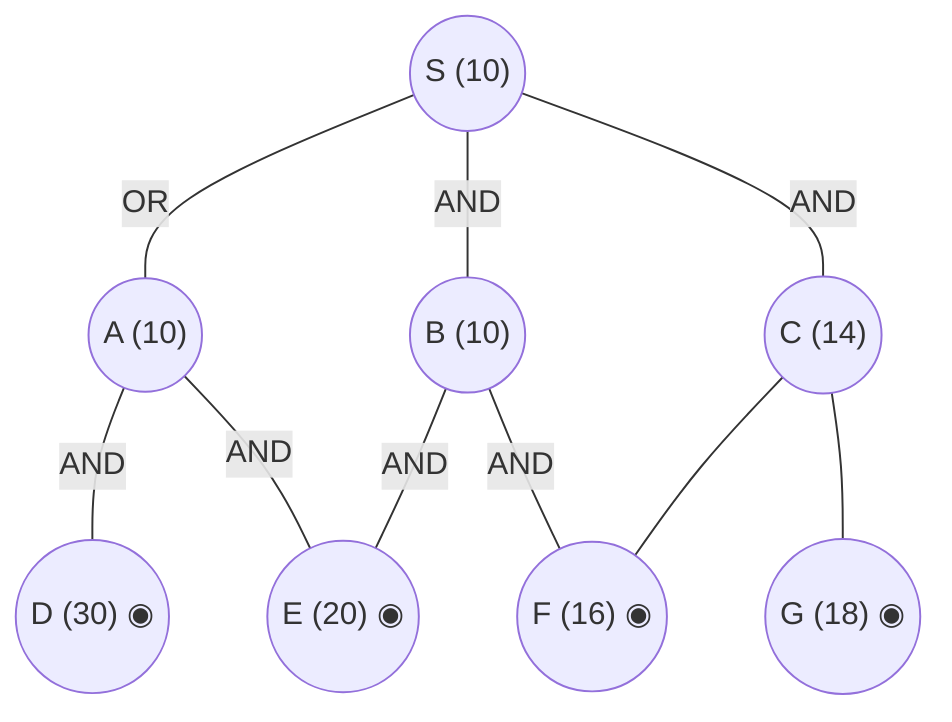

## The Question

AND–OR decomposition. Double circles = primitive. Every edge costs **2**. Tie-breakers: node labels; AND nodes expand the **highest-cost unsolved branch** first.

AND arcs: **S** = AND(B, C) *or* OR(A). **A** = AND(D, E). **B** = AND(E, F). **C has no arc** — C = OR(F, G). Primitives: D, E, F, G.

| # | Question | Official answer |
|---|----------|-----------------|
| 4.1 | First three nodes expanded (incl. S) | `S,A,C` (also `A,C,B`) |
| 4.2 | Value of S after each expansion | `28,32,56` (also `22,28,32`) |
| 4.3 | Final value of S | `56` |

## The Topic in 60 Seconds

AO* = expand along **marked arcs** + revise (OR: min child+edge; AND: sum children+edges). Markers switch when refined costs overtake rivals. Primitive children make a node instantly SOLVED.

> Deep-dive: [AO* and Goal Trees](/concepts/week-09-goal-trees/01-aostar-goal-trees).

## The Trace — four expansions

h: S=10, A=10, B=10, C=14; D=30, E=20, F=16, G=18 primitive. Edge = 2.

**Expansion 1 — S.**
- AND(B, C): $(10+2)+(14+2) = 28$
- OR(A): $10+2 = 12$

Mark OR(A) → **S = 12** (the paper's accepted list starts the count from the next expansion).

**Expansion 2 — A.**
A: AND(D, E) $= (30+2)+(20+2) = 54$; D, E primitive → **A = 54, SOLVED**.
Propagate: OR(A) = 56; AND(B, C) = 28 < 56 → marker **flips to AND(B, C)**: $S = \mathbf{28}$ ✓

**Expansion 3 — C** (costlier AND branch: 14 > 10).
C = OR(F, G) = $\min(16+2,\ 18+2) = 18$; F, G primitive → **C = 18, SOLVED**.
Propagate: AND(B, C) $= (10+2)+(18+2) = 32$ → $S = \min(32, 56) = \mathbf{32}$ ✓

**Expansion 4 — B.**
B: AND(E, F) $= (20+2)+(16+2) = 40$; E, F primitive → **B = 40, SOLVED**.
Propagate: AND(B, C) $= 42 + 20 = 62$ → marker flips back: $S = \min(62,\ 56) = \mathbf{56}$ — A solved → **S SOLVED = 56** ✓✓

**Final value of S = 56.** Solution subtree: S → A → `{D, E}`.

<PaperTrace
  height={420}
  nodeWidth={100}
  nodeHeight={50}
  nodeFontSize={12}
  legend={[
    { color: "#b45309", label: "expanding now" },
    { color: "#0369a1", label: "live on marked path" },
    { color: "#52525b", label: "primitive (born SOLVED)" },
    { color: "#16a34a", label: "marked arcs" }
  ]}
  nodes={[
    { id: "S", label: "S =12", kind: "frontier", x: 400, y: 20 },
    { id: "A", label: "A 10", x: 140, y: 130 },
    { id: "B", label: "B 10", x: 400, y: 130 },
    { id: "C", label: "C 14", x: 660, y: 130 },
    { id: "D", label: "D 30", kind: "primitive", x: 240, y: 250 },
    { id: "E", label: "E 20", kind: "primitive", x: 400, y: 250 },
    { id: "F", label: "F 16", kind: "primitive", x: 540, y: 250 },
    { id: "G", label: "G 18", kind: "primitive", x: 700, y: 250 }
  ]}
  edges={[
    { id: "e1", from: "S", to: "A", label: "OR" },
    { id: "e2", from: "S", to: "B", label: "AND" },
    { id: "e3", from: "S", to: "C", label: "AND" },
    { id: "e4", from: "A", to: "D", label: "AND" },
    { id: "e5", from: "A", to: "E", label: "AND" },
    { id: "e6", from: "B", to: "E", label: "AND" },
    { id: "e7", from: "B", to: "F", label: "AND" },
    { id: "e8", from: "C", to: "F", label: "OR" },
    { id: "e9", from: "C", to: "G", label: "OR" }
  ]}
  steps={[
    { label: "1 · expand S → 12", note: "S: OR(A) = 10+2 = 12 | AND(B,C) = (10+2)+(14+2) = 28 -> mark OR(A). S = 12", nodes: { S: "explored", A: "current", B: "explored", C: "explored", D: "primitive", E: "primitive", F: "primitive", G: "primitive" }, edges: { e1: "path" } },
    { label: "2 · expand A → 28 (marker flips!)", note: "A: AND(D,E) = (30+2)+(20+2) = 54, primitive -> A = 54 SOLVED. OR(A) = 56 > AND(B,C) = 28 -> MARKER FLIPS to AND(B,C). S = 28", nodes: { S: "current", A: "path", B: "frontier", C: "frontier", D: "primitive", E: "primitive", F: "primitive", G: "primitive" }, edges: { e2: "path", e3: "path" } },
    { label: "3 · expand C → 32", note: "Costlier AND branch: C(14) > B(10). C = OR(F,G) = min(16+2, 18+2) = 18, primitive -> C = 18 SOLVED. AND(B,C) = (10+2)+(18+2) = 32. S = min(32, 56) = 32", nodes: { S: "current", A: "path", B: "frontier", C: "current", D: "primitive", E: "primitive", F: "primitive", G: "primitive" }, edges: { e2: "path", e3: "path", e8: "path" } },
    { label: "4 · expand B → 56 ✓ SOLVED", note: "B: AND(E,F) = (20+2)+(16+2) = 40, primitive -> B = 40 SOLVED. AND(B,C) = 42+20 = 62 > OR(A) = 56 -> MARKER FLIPS back to A (SOLVED). S = 56 SOLVED. Final = 56.", nodes: { S: "path", A: "path", B: "path", C: "path", D: "primitive", E: "primitive", F: "primitive", G: "primitive" }, edges: { e1: "path", e4: "path", e5: "path" } }
  ]}
/>

<Callout type="important" title="Two marker flips">
OR(A) wins at 12, loses the marker when A's real cost (54) lands, regains it when C's refinement pushes AND(B,C) to 62 — the double flip is the whole exam point. The keyed value list 22,28,32 (alternate) counts S = 22 via a variant reading of the first revision; the primary 28,32,56 starts after A resolves.
</Callout>

## Answers, decoded

- **4.1** — expansions: **S, A, C, B** — first three: **S, A, C** (alternate `A,C,B` drops S).
- **4.2** — S: **28, 32, 56** after A, C, B (alternate `22,28,32` includes the initial OR(A) value 22).
- **4.3** — final: **56** via S → A → `{D, E}`.

## Tricks & Tips

<Accordion title="Fast method">
1. Arcs first: S's AND spans (B,C); **C has no arc** — it's an OR over primitives F, G (instant solve at 18).
2. Track all of S's options every revision: 12 → 28 → 32 → 62 vs 56.
3. A = AND of two primitives → SOLVED at 54 the moment it's expanded.
</Accordion>

**Answers:** 4.1 `S,A,C` · 4.2 `28,32,56` · 4.3 `56`
