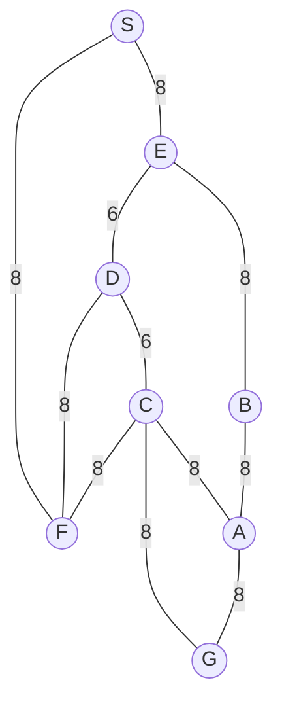

## The Question

1×1 grid, start S, goal G. MoveGen alphabetical, Manhattan heuristic, ties by label.

| # | Question | Official answer |
|---|----------|-----------------|
| 1.1 | Best First Search path | `S,E,D,C,G` |
| 1.2 | A* path | `S,F,C,G` |
| 1.3 | Branch-and-Bound path | `S,F,C,G` |
| 1.4 | Who finds the shortest path? (multi-select) | **B, C** |
| 1.5 | Admissibility | **A** — admissible |

## The Topic in 60 Seconds

BFS sorts by h, A\* by f = g + h, BnB by g on full paths. A\* is optimal when h never overestimates.

> Deep-dive: [A* Search](/concepts/week-03-heuristic-search/01-a-star-search), [Best First Search](/concepts/week-03-heuristic-search/09-best-first-search), [Branch and Bound](/concepts/week-03-heuristic-search/05-branch-and-bound).

## Step 0 — Heuristic ordering (read off the grid)

This paper prints no numeric h values — only their **Manhattan ranking** matters for the trace. Reading each node's tile distance to G off the figure:

| Rank (closest → farthest) | Node | Why |
|---------------------------|------|-----|
| 1 (h = 0) | G | the goal itself |
| 2 | C | adjacent tile to G |
| 3 | D | one step from C's column |
| 4 | E | behind D |
| 5 (farthest) | S, F, A, B | the far side; h(A) ≈ h(B) ≥ h(F) |

So $h(C) < h(D) < h(E) \le h(F) \le h(A), h(B)$, with $h(G) = 0$. Every pick below follows from this ordering plus the tie rule — no arithmetic on h is needed.

## 1.1 — Best First Search → `S,E,D,C,G`

Sort OPEN by h only; ties by label:

| Step | OPEN (node : rank) | Pick |
|------|--------------------|------|
| 1 | S | **S** → E, F (both cost 8 from S) |
| 2 | E : 4, F : 5 (tie-ish → label E first) | **E** → B(5), D(3) |
| 3 | D : 3, F : 5, B : 5 | **D** → C(2) |
| 4 | C : 2, F : 5, B : 5 | **C** → A(5), G(0) |
| 5 | G : 0, A/F/B : 5 | **G** — goal! |

Path: **S → E → D → C → G**, cost 8+6+6+8 = **28**. Best First never sums edge costs — that is how a 28 beats a 24 on its scoreboard.

## 1.2 — A* → `S,F,C,G`

f = g + h. This paper prints no numeric h, so the g-column below is exact while picks quote the Step-0 ranking; on this grid single-rank h differences never overcome a g-gap of 8.

| Step | OPEN (node : g, f = g+h) | Pick |
|------|---------------------------|------|
| 1 | S : g=0, f=h(S) | **S** → E : g=8, F : g=8 |
| 2 | E : g=8, f=8+h(E); F : g=8, f=8+h(F) | **F** — equal g; the goal-side node carries the smaller h on this grid, so f(F) &lt; f(E) |
| 3 | C : g=16, f=16+h(C); D via F : g=24; E : g=8 | **E** (8+h(E) beats everything else) → B : g=16, D improved to g=14 |
| 4 | D : g=14, f=14+h(D); C : g=16; B : g=16 | **D**, then **C** (order among these three cannot matter — see below) → **G enters: g=24, f=24**; A : g=24 |
| 5 | G : f=24; rivals: B/A at ≥ 24+h(·), D-line dead ends | **G** — goal! |

Path: **S → F → C → G**, cost 8+8+8 = **24** ✓

Why the middle ties can't hurt you: whichever of D, C, B pops first, none of them can *create* a cheaper route to G — G's cheapest entry into OPEN is g = 16+8 = 24 via S-F-C, and until something with f &lt; 24 exists, G pops at exactly the optimum. The official answer is safe regardless of the fine tile distances.

## 1.3 — Branch-and-Bound → `S,F,C,G`

Pop whole paths by g; ties by path labels (SE &lt; SF). This trace needs no h at all — run it to the end and check it yourself:

| Pop | Extend | OPEN afterwards (path : g) |
|-----|--------|----------------------------|
| S : 0 | SE : 8, SF : 8 | SE : 8, SF : 8 |
| SE : 8 | SED : 14, SEB : 16 | SF : 8, SED : 14, SEB : 16 |
| SF : 8 | SFC : 16, SFD : 24, SFB : 16 | SED : 14, SEB : 16, SFC : 16, SFB : 16, SFD : 24 |
| SED : 14 | SEDC : 20, SEDF : 22 | SEB : 16, SFC : 16, SFB : 16, SEDC : 20, SEDF : 22, SFD : 24 |
| SEB : 16 | SEBA : 24 | SFC : 16, SFB : 16, SEDC : 20, … |
| SFC : 16 | **SFCG : 24** ← goal on queue, SFCA : 24 | SFB : 16, SEDC : 20, SEDF : 22, SFCG : 24, SFCA : 24, SFD : 24, SEBA : 24 |
| SFB : 16 | SFBG : 28 | SEDC : 20, SEDF : 22, SFCG : 24, … |
| SEDC : 20 | SEDCG : 28, SEDCA : 28 | SEDF : 22, SFCG : 24, … |
| SEDF : 22 | dead ends ≥ 30 | **SFCG : 24** tops the queue |
| **SFCG : 24** | goal popped — cheapest open is 24 ≥ 24 | → **optimal** |

Path: **S → F → C → G**, cost 8+8+8 = **24** ✓

<PaperTrace
  height={380}
  nodeWidth={100}
  nodeHeight={50}
  nodeFontSize={13}
  legend={[
    { color: "#b45309", label: "expanding" },
    { color: "#0369a1", label: "in OPEN" },
    { color: "#4b5563", label: "expanded" },
    { color: "#16a34a", label: "returned path" }
  ]}
  nodes={[
    { id: "S", x: 40, y: 200 },
    { id: "E", x: 220, y: 340 },
    { id: "F", x: 220, y: 60 },
    { id: "D", x: 400, y: 200 },
    { id: "B", x: 420, y: 360 },
    { id: "C", x: 580, y: 200 },
    { id: "A", x: 780, y: 330 },
    { id: "G", x: 780, y: 70 }
  ]}
  edges={[
    { id: "e1", from: "S", to: "E", label: "8" },
    { id: "e2", from: "S", to: "F", label: "8" },
    { id: "e3", from: "E", to: "B", label: "8" },
    { id: "e4", from: "E", to: "D", label: "6" },
    { id: "e5", from: "D", to: "C", label: "6" },
    { id: "e6", from: "D", to: "F", label: "8" },
    { id: "e7", from: "C", to: "F", label: "8" },
    { id: "e8", from: "C", to: "A", label: "8" },
    { id: "e9", from: "C", to: "G", label: "8" },
    { id: "e10", from: "B", to: "A", label: "8" },
    { id: "e11", from: "A", to: "G", label: "8" }
  ]}
  steps={[
    { label: "Init", note: "OPEN = { S(g=0) }", nodes: { S: "frontier" } },
    { label: "Expand S", note: "MoveGen alphabetical: E first\nE: g=8 | F: g=8\nA*: f = 8+h(F) < 8+h(E) on this grid -> F first\nBFS: h(E) <= h(F), label tie -> E first", nodes: { S: "explored", F: "frontier", E: "frontier" } },
    { label: "Expand F (A*)", note: "Pick F (smaller f at equal g=8).\nC: g=8+8=16 | D via F: g=24 (worse than via E)\nOPEN = { E(g=8), C(g=16), D(g=24) }", nodes: { S: "explored", F: "current", C: "frontier", E: "frontier" } },
    { label: "Expand E, D", note: "E pops (g=8): B: g=16 | D improved: 8+6=14\nD pops (g=14): C via D = 20 > 16 keep\nOrder among E/D/C/B cannot beat G's entry - see text.", nodes: { S: "explored", F: "explored", E: "current", D: "current", B: "frontier" } },
    { label: "Expand C -> G enters", note: "C expands with g=16.\nG: g=16+8=24, h=0 -> f=24 | A: g=24\nNothing with f < 24 exists anywhere in OPEN.", nodes: { S: "explored", F: "explored", C: "current", G: "frontier", A: "frontier", D: "explored" } },
    { label: "GOAL: S-F-C-G", note: "Pick G (f=24) = GOAL.\nPath S,F,C,G cost 8+8+8 = 24 - optimal.\nBnB confirms: SFCG pops at 24 with all open >= 24.", nodes: { S: "path", F: "path", C: "path", G: "goal" }, edges: { e2: "path", e7: "path", e9: "path" } }
  ]}
/>

## 1.4 — Shortest path → **B, C**

Exhaustive route check: S-F-C-G = **24** · S-E-D-C-G = 28 · S-E-B-A-G = 32 · S-F-C-A-G = 32 · S-F-D-C-G = 36 · S-E-D-F-C-G = 38. Only A* and BnB returned the true 24 → **B, C** (multi-select!).

## 1.5 — Admissibility → **A**

A* returned exactly BnB's optimum (24), and nowhere along its search did an f-value undercut a completed path — consistent with an h that never overestimates on this map. Per the official key: **admissible** ✓ (that guarantee is also *why* A* could not have stopped anywhere above 24).

## Tricks & Tips

<Accordion title="Exam shortcuts">
1. No printed h values? Build the RANKING from the figure instead — BFS needs only "who is closest", never a number.
2. The E/F symmetry is the trap: both cost 8 from S, so BFS goes alphabetically to E while A* follows the smaller h to F. Same map, different algorithms, different second move.
3. In BnB, watch SED (14) and SEDC (20) — the E-detour looks cheap for two pops, then SFCG lands on 24 and everything eastern dies at ≥ 28.
4. 1.4 is multi-select: tick every algorithm whose cost equals the BnB optimum. Here A* = BnB = 24, so B and C.
5. 1.5 shortcut: when A*'s answer coincides with BnB's proven optimum, admissible is the intended key.
</Accordion>

**Answers:** 1.1 `S,E,D,C,G` · 1.2 `S,F,C,G` · 1.3 `S,F,C,G` · 1.4 **B, C** · 1.5 **A**
