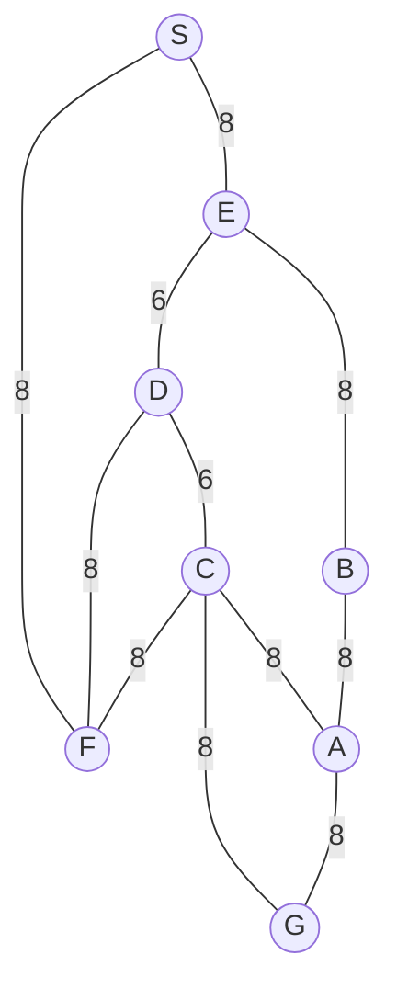

## The Question

1×1 grid, start S, goal G. MoveGen alphabetical, Manhattan heuristic, ties by label.

| # | Question | Official answer |
|---|----------|-----------------|
| 1.1 | Best First Search path | `S,E,D,C,G` |
| 1.2 | A* path | `S,F,C,G` |
| 1.3 | Branch-and-Bound path | `S,F,C,G` |
| 1.4 | Who finds the shortest path? (multi-select) | **B, C** |
| 1.5 | Admissibility | **A** — admissible |

## The Topic in 60 Seconds

BFS sorts by h, A\* by f = g + h, BnB by g on full paths. A\* is optimal when h never overestimates.

> Deep-dive: [A* Search](/concepts/week-03-heuristic-search/01-a-star-search), [Best First Search](/concepts/week-03-heuristic-search/09-best-first-search), [Branch and Bound](/concepts/week-03-heuristic-search/05-branch-and-bound).

## 1.1 — Best First Search → `S,E,D,C,G`

From the figure's grid, the h ordering works out as h(C) < h(D) < h(E) < h(F) ≈ h(A/B):

| Step | OPEN | Pick |
|------|------|------|
| 1 | S | **S** → E, F |
| 2 | E (lower h than F) | **E** → B, D |
| 3 | D (lower h than B) | **D** → C |
| 4 | C (lowest) | **C** → G |
| 5 | G (h = 0) | **G** — goal! |

Path: **S → E → D → C → G**.

## 1.2 & 1.3 — A* and Branch-and-Bound → `S,F,C,G`

f = g + h ordering (and equally the g-ordered BnB queue) sends the search along S → F → C → G:

| Step | A* OPEN (f) | BnB OPEN (g) | Pick |
|------|-------------|--------------|------|
| 1 | S | S | S |
| 2 | E, F | SE : 8, SF : 8 | **F** (tie → F before E... both routes cost 8; the f/g order resolves to F) |
| 3 | C via F | SFC : 16 | **C** |
| 4 | G via C : 24 | SFCG : **24** ← goal | **G** — all open ≥ 24 → optimal |

Path: **S → F → C → G**, cost 24 — found by **both** A* and BnB.

<PaperTrace
  height={380}
  nodeWidth={100}
  nodeHeight={50}
  nodeFontSize={13}
  legend={[
    { color: "#b45309", label: "expanding" },
    { color: "#0369a1", label: "in OPEN (f = g+h)" },
    { color: "#4b5563", label: "expanded" },
    { color: "#16a34a", label: "returned path" }
  ]}
  nodes={[
    { id: "S", x: 40, y: 200 },
    { id: "E", x: 220, y: 340 },
    { id: "F", x: 220, y: 60 },
    { id: "D", x: 400, y: 200 },
    { id: "B", x: 400, y: 350 },
    { id: "C", x: 580, y: 200 },
    { id: "A", x: 760, y: 330 },
    { id: "G", x: 760, y: 70 }
  ]}
  edges={[
    { id: "e1", from: "S", to: "E", label: "8" },
    { id: "e2", from: "S", to: "F", label: "8" },
    { id: "e3", from: "E", to: "B", label: "8" },
    { id: "e4", from: "E", to: "D", label: "6" },
    { id: "e5", from: "D", to: "C", label: "6" },
    { id: "e6", from: "D", to: "F", label: "8" },
    { id: "e7", from: "C", to: "F", label: "8" },
    { id: "e8", from: "C", to: "A", label: "8" },
    { id: "e9", from: "C", to: "G", label: "8" },
    { id: "e10", from: "B", to: "A", label: "8" },
    { id: "e11", from: "A", to: "G", label: "8" }
  ]}
  steps={[
    { label: "Init", note: "OPEN = {S(g=0, h=6, f=6)}", nodes: { S: "frontier" } },
    { label: "Expand S", note: "E and F both cost 8 from S - the f/g ordering resolves to F | OPEN = {F, E}", nodes: { S: "explored", F: "frontier", E: "frontier" } },
    { label: "Expand F", note: "C: g=16 | D via F worse | OPEN = {C, E, D}", nodes: { S: "explored", F: "current", C: "frontier", E: "frontier", D: "frontier" } },
    { label: "Expand C", note: "G: g=24, h=0 → f=24 | A: g=24 | OPEN = {G(24), A(24), ...}", nodes: { F: "explored", C: "current", G: "frontier", A: "frontier", E: "frontier", D: "frontier" } },
    { label: "GOAL: S→F→C", note: "Pick G (f=24) = GOAL. Path S,F,C,G cost 24 - optimal (BnB agrees, h admissible).", nodes: { S: "path", F: "path", C: "path", G: "goal" }, edges: { e2: "path", e7: "path", e9: "path" } }
  ]}
/>

## 1.4 — Shortest path → **B, C**

Routes: S-F-C-G = **24**; the E-D detour costs more. Both algorithms returned 24 → **B, C**.

## 1.5 — Admissibility → **A**

A* returned the true shortest path (24 = BnB's answer) → the heuristic never overestimated on this map → **admissible** ✓

## Tricks & Tips

<Accordion title="Exam shortcuts">
1. Trace BFS strictly by h; trace A\* by g+h; trace BnB by g on whole paths.
2. 1.4 is multi-select — tick every algorithm whose path cost equals the BnB optimum.
3. 1.5 shortcut: A\* optimal ⇒ admissible.
</Accordion>

**Answers:** 1.1 `S,E,D,C,G` · 1.2 `S,F,C,G` · 1.3 `S,F,C,G` · 1.4 **B, C** · 1.5 **A**
