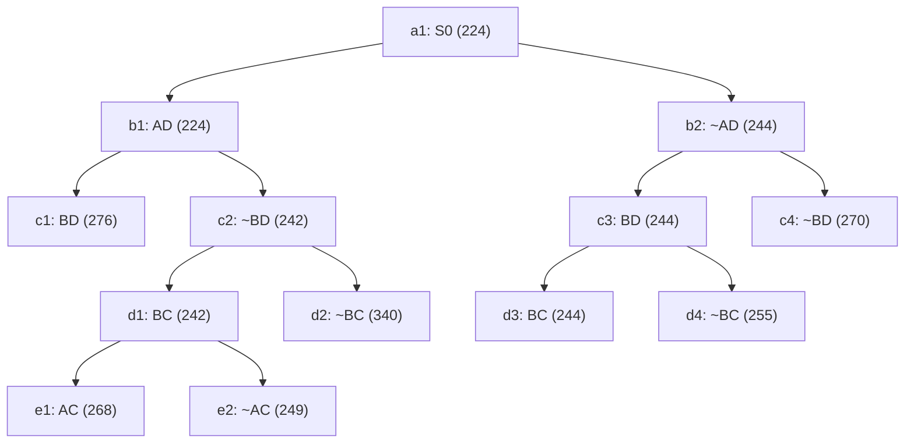

## The Question

TSP BnB snapshot when the optimal tour is discovered.

| # | Question | Official answer |
|---|----------|-----------------|
| 2.1 | 2nd–5th nodes refined | `b1,c2,d1,b2` |
| 2.2 | Optimal tour node + cost | `d3,244` |
| 2.3 | Number of cities | `5` |
| 2.4 | Tour from A | `A,C,B,D,E` |

## The Topic in 60 Seconds

Refine = pop the cheapest open node, insert its two children. Childless snapshot nodes are tours. Stop when a tour pops with no cheaper open node.

> Deep-dive: [Reading BnB Trees](/concepts/week-05-optimal-tsp/01-bnb-tree-reading), [Branch and Bound](/concepts/week-03-heuristic-search/05-branch-and-bound).

## 2.1 — Refine order → `b1,c2,d1,b2`

Pop the minimum bound each round; refining replaces the popped node by its two children.

| Pop | Queue before (bound) | Refine | Children added |
|-----|----------------------|--------|----------------|
| 1 | a1 : 224 | **a1** | b1 : 224, b2 : 244 |
| 2 | b1 : 224, b2 : 244 | **b1** | c1 : 276, c2 : 242 |
| 3 | c2 : 242, b2 : 244, c1 : 276 | **c2** | d1 : 242, d2 : 340 |
| 4 | d1 : 242, b2 : 244, c1 : 276, d2 : 340 | **d1** | e1 : 268, e2 : 249 |
| 5 | b2 : 244, e2 : 249, e1 : 268, c4 : 270, c1 : 276, d2 : 340 | **b2** | c3 : 244, c4 : 270 |

Note how each include-node leaves its exclude-child *cheaper than everything else* (c2 : 242 under b1, then d1 : 242 under c2) — that cascade fixes the refine order on its own.

## 2.2 — Optimal tour → `d3`, cost `244`

Pop c3(244) → adds d3(244), d4(255). Queue sorted: `{d3 : 244, e2 : 249, e1 : 268, c4 : 270, c1 : 276, d4 : 255, d2 : 340}` — i.e. min = **d3 : 244**, next-best e2 : 249.

**d3** has no children in the snapshot — it is a **complete tour** — and every other open bound is ≥ 249 > 244. Nothing cheaper can ever appear → **d3 = optimal, 244** ✓

## 2.3 — Cities → `5`

Chain root→d3: **~AD excluded → BD in → BC in**. Fixed edges: B–D, B–C.

Degrees: B = 2 (D, C) full · C = 1 (B) · D = 1 (B) · A = 0 · E = 0.

AD is excluded, so A cannot pair with D → A's two partners are **C and E**. Now C is full (B, A), and D still needs one partner — only E remains → **D–E**. One closed cycle:

$$A - C - B - D - E - A \Rightarrow \textbf{5 cities} ✓$$

## 2.4 — Tour from A → `A,C,B,D,E`

The forced cycle above read from A ✓ (the reverse A,E,D,B,C is the same tour).

<PaperTrace
  height={430}
  nodeWidth={110}
  nodeHeight={56}
  nodeFontSize={12}
  legend={[
    { color: "#b45309", label: "refining now" },
    { color: "#0369a1", label: "open (waiting)" },
    { color: "#4b5563", label: "already refined" },
    { color: "#15803d", label: "optimal tour (leaf)" }
  ]}
  nodes={[
    { id: "a1", label: "a1: S0 224", x: 400, y: 20 },
    { id: "b1", label: "b1: AD 224", x: 200, y: 110 },
    { id: "b2", label: "b2: ~AD 244", x: 620, y: 110 },
    { id: "c1", label: "c1: BD 276", x: 60, y: 200 },
    { id: "c2", label: "c2: ~BD 242", x: 320, y: 200 },
    { id: "c3", label: "c3: BD 244", x: 520, y: 200 },
    { id: "c4", label: "c4: ~BD 270", x: 740, y: 200 },
    { id: "d1", label: "d1: BC 242", x: 200, y: 290 },
    { id: "d2", label: "d2: ~BC 340", x: 360, y: 290 },
    { id: "d3", label: "d3: BC 244", x: 500, y: 290 },
    { id: "d4", label: "d4: ~BC 255", x: 650, y: 290 },
    { id: "e1", label: "e1: AC 268", x: 120, y: 380 },
    { id: "e2", label: "e2: ~AC 249", x: 260, y: 380 }
  ]}
  edges={[
    { id: "x1", from: "a1", to: "b1" },
    { id: "x2", from: "a1", to: "b2" },
    { id: "x3", from: "b1", to: "c1" },
    { id: "x4", from: "b1", to: "c2" },
    { id: "x5", from: "b2", to: "c3" },
    { id: "x6", from: "b2", to: "c4" },
    { id: "x7", from: "c2", to: "d1" },
    { id: "x8", from: "c2", to: "d2" },
    { id: "x9", from: "c3", to: "d3" },
    { id: "x10", from: "c3", to: "d4" },
    { id: "x11", from: "d1", to: "e1" },
    { id: "x12", from: "d1", to: "e2" }
  ]}
  steps={[
    { label: "Queue: a1(224)", note: "OPEN = { a1:224 }", nodes: { a1: "frontier" } },
    { label: "Refine a1", note: "Pop a1:224 -> insert b1:224, b2:244\nOPEN = { b1:224, b2:244 }", nodes: { a1: "explored", b1: "frontier", b2: "frontier" } },
    { label: "Refine b1", note: "Pop b1:224 -> insert c1:276, c2:242\nOPEN = { c2:242, b2:244, c1:276 }", nodes: { a1: "explored", b1: "current", b2: "frontier", c1: "frontier", c2: "frontier" }, edges: { x1: "path" } },
    { label: "Refine c2", note: "Pop c2:242 -> insert d1:242, d2:340\nOPEN = { d1:242, b2:244, c1:276, d2:340 }", nodes: { a1: "explored", b1: "explored", b2: "frontier", c1: "frontier", c2: "current", d1: "frontier", d2: "frontier" }, edges: { x1: "path", x4: "active" } },
    { label: "Refine d1", note: "Pop d1:242 -> insert e1:268, e2:249\nOPEN = { b2:244, e2:249, e1:268, c1:276, d2:340 }", nodes: { a1: "explored", b1: "explored", b2: "frontier", c1: "frontier", c2: "explored", d1: "current", d2: "frontier", e1: "frontier", e2: "frontier" }, edges: { x1: "path", x4: "path", x7: "active" } },
    { label: "Refine b2", note: "Pop b2:244 -> insert c3:244, c4:270\nOPEN = { c3:244, e2:249, e1:268, c4:270, c1:276, d2:340 }", nodes: { a1: "explored", b1: "explored", b2: "current", c1: "frontier", c2: "explored", d1: "explored", d2: "frontier", e1: "frontier", e2: "frontier", c3: "frontier", c4: "frontier" }, edges: { x2: "active" } },
    { label: "Pop c3", note: "Pop c3:244 -> insert d3:244, d4:255\nOPEN sorted = { d3:244, e2:249, d4:255, e1:268, c4:270, c1:276, d2:340 }", nodes: { a1: "explored", b1: "explored", b2: "explored", c1: "frontier", c2: "explored", d1: "explored", d2: "frontier", e1: "frontier", e2: "frontier", c3: "current", c4: "frontier", d3: "frontier", d4: "frontier" }, edges: { x2: "path", x5: "active" } },
    { label: "Tour: d3 = 244", note: "Min d3:244 is a LEAF = complete tour.\nNext-best bound is e2:249 > 244 -> OPTIMAL.\nForced cycle: A-C-B-D-E-A (5 cities).", nodes: { a1: "explored", b1: "explored", b2: "explored", c1: "frontier", c2: "explored", d1: "explored", d2: "frontier", e1: "frontier", e2: "frontier", c3: "explored", c4: "frontier", d3: "path", d4: "frontier" }, edges: { x2: "path", x5: "path", x9: "path" } }
  ]}
/>

*Amber = refined in order b1 → c2 → d1 → b2. Green = d3, the 244 tour.*

## Tricks & Tips

<Accordion title="Fast method">
1. Simulate the queue as sorted pairs (bound, ref#): refining an include-node drops its exclude-child at the top of the queue (c2 : 242, then d1 : 242), which is what forces the order b1, c2, d1.
2. Refine exactly five times here: a1, b1, c2, d1, b2. Stop refining as soon as a leaf reaches the top.
3. Optimality check is one comparison: d3 : 244 vs next-best e2 : 249.
4. Reconstruct degrees from the winner's chain (~AD out, BD and BC in): B closes instantly, ~AD hands A its two partners C and E, and D's dangling degree lands on E. Five junctions, one cycle: A-C-B-D-E-A.
</Accordion>

**Answers:** 2.1 `b1,c2,d1,b2` · 2.2 `d3,244` · 2.3 `5` · 2.4 `A,C,B,D,E`
