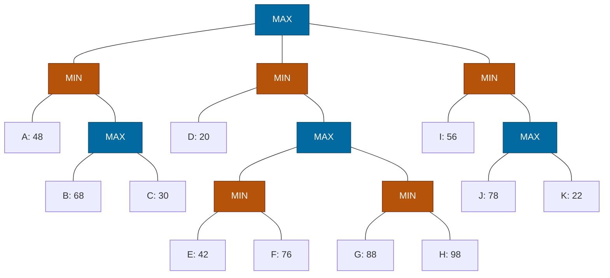

## The Question

Root = MAX; circles = MIN, squares = MAX. Leaves A–K.

| # | Question | Official answer |
|---|----------|-----------------|
| 3.1 | Valid strategies (A: A,B · B: A,D,I · C: D,G,H · D: C,H,K) | **A and C** |
| 3.2 | Best strategy leaves | `I,J` |
| 3.3 | Alpha-Beta pruned | `C,E,F,G,H,K` |
| 3.4 | SSS* solved | `A,D,I,J` |

## The Topic in 60 Seconds

- **Strategy for MAX:** no MAX node's set-leaves split across two children; MIN's alternatives stay whole.
- **Best strategy** maximizes min(leaves) = root value.
- **α-β:** cutoff when α ≥ β. **SSS\*:** solves leaves line-by-line.

> Deep-dive: [Game Strategies](/concepts/week-07-game-search/03-game-strategies), [Alpha-Beta Pruning](/concepts/week-07-game-search/02-alpha-beta-pruning), [SSS*](/concepts/week-03-heuristic-search/03-sss-star).

## Step 0 — Back up

- $N_1 = \max(68, 30) = 68$; $L_1 = \min(48, 68) = 48$
- $N_3 = \min(42, 76) = 42$; $N_4 = \min(88, 98) = 88$; $N_2 = \max(42, 88) = 88$; $L_2 = \min(20, 88) = 20$
- $N_5 = \max(78, 22) = 78$; $L_3 = \min(56, 78) = 56$
- $\text{Root} = \max(48, 20, 56) = \mathbf{56}$ via $L_3$

## 3.1 — Valid strategies → **A (A,B) and C (D,G,H)**

| Option | Check | Verdict |
|--------|-------|---------|
| **A: A,B** | Root→$L_1$ ✓; $L_1$ keeps A, $N_1$; $N_1$ keeps B **and** C — both included ✓ | **Valid** |
| B: A,D,I | Root splits across $L_1$/$L_2$/$L_3$ | Invalid |
| **C: D,G,H** | Root→$L_2$ ✓; $L_2$ keeps D, $N_2$; $N_2$ keeps $N_3$, $N_4$; $N_3$ → nothing... wait: set has G,H (under $N_4$) only from that pair ✓; $N_4$ keeps G,H ✓ | **Valid** |
| D: C,H,K | $N_1$: C ✓; Root: C via $L_1$, H via $L_2$, K via $L_3$ — split! | Invalid |

## 3.2 — Best strategy → `I,J`

Root → $L_3$ (56). $L_3$ keeps I and $N_5$; $N_5$ picks J (78 beats 22). Leaves **`{I, J}`**, guarantee min(56, 78) = 56 = game value ✓

## 3.3 — Alpha-Beta prunes → `C,E,F,G,H,K`

| Node | Window | Happening |
|------|--------|-----------|
| $L_1$ (MIN) | $(-\infty, \infty)$ | A = 48 → β = 48 |
| $N_1$ (MAX) | $(-\infty, 48)$ | B = 68 ≥ 48 → **β-cutoff** — C pruned! |
| Root | α = 48 | |
| $L_2$ (MIN) | $(48, \infty)$ | D = 20 ≤ 48 → **α-cutoff** — $N_2$ (E,F,G,H) pruned! |
| Root | α = 48 | |
| $L_3$ (MIN) | $(48, \infty)$ | I = 56 → β = 56 |
| $N_5$ (MAX) | $(48, 56)$ | J = 78 ≥ 56 → **β-cutoff** — K pruned! |

Pruned: **C, E, F, G, H, K** ✓ — inspected: A, B, D, I, J.

<PaperTrace
  height={400}
  nodeWidth={100}
  nodeHeight={50}
  nodeFontSize={12}
  legend={[
    { color: "#0369a1", label: "MAX (square)" },
    { color: "#b45309", label: "MIN (circle)" },
    { color: "#16a34a", label: "inspected / value path" },
    { color: "#4b5563", label: "pruned" }
  ]}
  nodes={[
    { id: "R", label: "MAX", kind: "max", x: 430, y: 20 },
    { id: "L1", label: "MIN", kind: "min", x: 150, y: 120 },
    { id: "L2", label: "MIN", kind: "min", x: 430, y: 120 },
    { id: "L3", label: "MIN", kind: "min", x: 710, y: 120 },
    { id: "A", label: "A: 48", x: 40, y: 230 },
    { id: "N1", label: "MAX", kind: "max", x: 210, y: 230 },
    { id: "B", label: "B: 68", x: 140, y: 340 },
    { id: "C", label: "C: 30", x: 270, y: 340 },
    { id: "D", label: "D: 20", x: 340, y: 230 },
    { id: "N2", label: "MAX", kind: "max", x: 480, y: 230 },
    { id: "N3", label: "MIN", kind: "min", x: 420, y: 340 },
    { id: "N4", label: "MIN", kind: "min", x: 550, y: 340 },
    { id: "E", label: "E: 42", x: 360, y: 450 },
    { id: "F", label: "F: 76", x: 480, y: 450 },
    { id: "G", label: "G: 88", x: 500, y: 450 },
    { id: "H", label: "H: 98", x: 620, y: 450 },
    { id: "I", label: "I: 56", x: 660, y: 230 },
    { id: "N5", label: "MAX", kind: "max", x: 790, y: 230 },
    { id: "J", label: "J: 78", x: 730, y: 340 },
    { id: "K", label: "K: 22", x: 860, y: 340 }
  ]}
  edges={[
    { id: "x1", from: "R", to: "L1" },
    { id: "x2", from: "R", to: "L2" },
    { id: "x3", from: "R", to: "L3" },
    { id: "x4", from: "L1", to: "A" },
    { id: "x5", from: "L1", to: "N1" },
    { id: "x6", from: "N1", to: "B" },
    { id: "x7", from: "N1", to: "C" },
    { id: "x8", from: "L2", to: "D" },
    { id: "x9", from: "L2", to: "N2" },
    { id: "x10", from: "N2", to: "N3" },
    { id: "x11", from: "N2", to: "N4" },
    { id: "x12", from: "N3", to: "E" },
    { id: "x13", from: "N3", to: "F" },
    { id: "x14", from: "N4", to: "G" },
    { id: "x15", from: "N4", to: "H" },
    { id: "x16", from: "L3", to: "I" },
    { id: "x17", from: "L3", to: "N5" },
    { id: "x18", from: "N5", to: "J" },
    { id: "x19", from: "N5", to: "K" }
  ]}
  steps={[
    { label: "1 · L1: A=48", note: "L1 (MIN): A = 48 -> beta = 48.", nodes: { R: "max", L1: "current", A: "path" } },
    { label: "2 · N1: B=68 cutoff", note: "N1 (MAX) window (-inf, 48): B = 68 >= 48 -> BETA-CUTOFF. C pruned! L1 = 48. Root: alpha = 48.", nodes: { R: "current", L1: "path", A: "path", N1: "current", B: "path", C: "explored" } },
    { label: "3 · L2: D=20 cutoff", note: "L2 (MIN) window (48, inf): D = 20 <= 48 -> ALPHA-CUTOFF. N2 (E, F, G, H) pruned! L2 = 20.", nodes: { R: "max", L2: "current", D: "path", N2: "explored", E: "explored", F: "explored", G: "explored", H: "explored" } },
    { label: "4 · L3: I=56", note: "L3 (MIN) window (48, inf): I = 56 -> beta = 56.", nodes: { R: "max", L3: "current", I: "path" } },
    { label: "5 · N5: J=78 cutoff · Root=56", note: "N5 (MAX) window (48, 56): J = 78 >= 56 -> BETA-CUTOFF. K pruned! L3 = 56. Root = max(48, 20, 56) = 56 via L3. Pruned: C, E, F, G, H, K.", nodes: { R: "path", L1: "path", L2: "path", L3: "path", A: "path", B: "path", D: "path", I: "path", J: "path", N1: "explored", N2: "explored", N3: "explored", N4: "explored", N5: "explored", C: "explored", E: "explored", F: "explored", G: "explored", H: "explored", K: "explored" } }
  ]}
/>

## 3.4 — SSS* solves → `A,D,I,J`

1. **A solved** (48) → $L_1 \le 48$; $N_1$ live merit 48: **B solved** (68 ≥ 48) → $N_1$ proven → C pruned; B discarded (can't improve 48). $L_1$ solved 48.
2. $L_2$ line (∞): **D solved** (20 ≤ 48) → $L_2$ solved 20; $N_2$ (E–H) pruned (merit 20).
3. $L_3$ line: **I solved** (56) → $N_5$ live merit 56: **J solved** (78 ≥ 56) → $N_5$ proven → K pruned. $L_3$ solved 56.
4. Root = 56. Solved: **A, D, I, J** ✓

## Tricks & Tips

<Accordion title="Speed routines">
1. Back up the MAX squares first, then MINs, then root.
2. D = 20 is a scissors: it α-cuts the whole $N_2$ subtree at $L_2$.
3. Best strategy: walk the value down; verify min(56, 78) = 56.
4. SSS\* solved = evaluated leaves (A, D, I, J); B is evaluated-but-discarded.
</Accordion>

**Answers:** 3.1 **A, C** · 3.2 `I,J` · 3.3 `C,E,F,G,H,K` · 3.4 `A,D,I,J`
