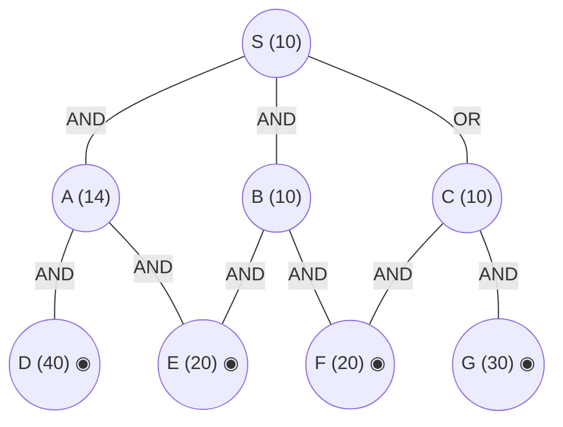

## The Question

AND–OR decomposition. Double circles = primitive. Every edge costs **2**. Tie-breakers: node labels; AND nodes expand the **highest-cost unsolved branch** first.

AND arcs: **S** = AND(A, B) *or* OR(C). **A** = AND(D, E). **B** = AND(E, F). **C** = AND(F, G). Primitives: D, E, F, G.

| # | Question | Official answer |
|---|----------|-----------------|
| 4.1 | First three nodes expanded (incl. S) | `S,C,A` (also `C,A,B`) |
| 4.2 | Value of S after each expansion | `12,28,36` (also `28,36,56`) |
| 4.3 | Final value of S | `56` |

## The Topic in 60 Seconds

AO* = expand along **marked arcs** + revise (OR: min child+edge; AND: sum children+edges). Markers switch when refined costs overtake rivals. Primitive children make a node instantly SOLVED.

> Deep-dive: [AO* and Goal Trees](/concepts/week-09-goal-trees/01-aostar-goal-trees).

## The Trace

h: S=10, A=14, B=10, C=10; D=40, E=20, F=20, G=30 primitive. Edge = 2.

**Expansion 1 — S.**
- AND(A, B): $(14+2)+(10+2) = 28$
- OR(C): $10+2 = 12$

Mark OR(C) → **S = 12** ✓

**Expansion 2 — C.**
C: AND(F, G) $= (20+2)+(30+2) = 54$; F, G primitive → **C = 54, SOLVED**.
Propagate: OR(C) = 56; AND(A, B) = 28 < 56 → marker **flips to AND(A, B)**: $S = \mathbf{28}$ ✓

**Expansion 3 — A** (costlier AND branch first: 14 &gt; 10).
Both children are primitive, so A resolves through its cheapest branch: $\min(D{+}2,\ E{+}2) = \min(42,\ \mathbf{22}) = 22$ via E → **A = 22**.
Propagate: AND(A, B) $= (22+2)+(10+2) = 36$ → $S = \min(\mathbf{36},\ 56) = \mathbf{36}$ ✓ — the third keyed value; marker stays on AND(A, B).

**Expansion 4 — B** (completing the solve).
B: AND(E, F) $= (20+2)+(20+2) = 44$; both primitive → **B = 44, SOLVED** (here *both* branches count).
Propagate: AND(A, B) $= 24 + 46 = 70 > 56$ → marker flips back to the already-solved C:
$$S = \min(70,\ \mathbf{56}) = \mathbf{56} \Rightarrow \text{\textbf{S SOLVED}} ✓$$

**Final value of S = 56.** Solution subtree: S → C → `{F, G}`.

<PaperTrace
  height={420}
  nodeWidth={100}
  nodeHeight={50}
  nodeFontSize={12}
  legend={[
    { color: "#b45309", label: "expanding now" },
    { color: "#0369a1", label: "live on marked path" },
    { color: "#52525b", label: "primitive (born SOLVED)" },
    { color: "#16a34a", label: "marked arcs" }
  ]}
  nodes={[
    { id: "S", label: "S =12", kind: "frontier", x: 380, y: 20 },
    { id: "A", label: "A 14", x: 140, y: 130 },
    { id: "B", label: "B 10", x: 400, y: 130 },
    { id: "C", label: "C 10", x: 660, y: 130 },
    { id: "D", label: "D 40", kind: "primitive", x: 60, y: 250 },
    { id: "E", label: "E 20", kind: "primitive", x: 240, y: 250 },
    { id: "F", label: "F 20", kind: "primitive", x: 480, y: 250 },
    { id: "G", label: "G 30", kind: "primitive", x: 740, y: 250 }
  ]}
  edges={[
    { id: "e1", from: "S", to: "A", label: "AND" },
    { id: "e2", from: "S", to: "B", label: "AND" },
    { id: "e3", from: "S", to: "C", label: "OR" },
    { id: "e4", from: "A", to: "D", label: "AND" },
    { id: "e5", from: "A", to: "E", label: "AND" },
    { id: "e6", from: "B", to: "E", label: "AND" },
    { id: "e7", from: "B", to: "F", label: "AND" },
    { id: "e8", from: "C", to: "F", label: "AND" },
    { id: "e9", from: "C", to: "G", label: "AND" }
  ]}
  steps={[
    { label: "1 · expand S → 12", note: "S: AND(A,B) = (14+2)+(10+2) = 28 | OR(C) = 10+2 = 12 -> mark OR(C). S = 12", nodes: { S: "explored", C: "current", A: "explored", B: "explored", D: "primitive", E: "primitive", F: "primitive", G: "primitive" }, edges: { e3: "path" } },
    { label: "2 · expand C → 28 (marker flips!)", note: "C: AND(F,G) = (20+2)+(30+2) = 54, primitive -> C = 54 SOLVED. OR(C) = 56 > AND(A,B) = 28 -> MARKER FLIPS to AND(A,B). S = 28", nodes: { S: "current", A: "frontier", B: "frontier", C: "path", D: "primitive", E: "primitive", F: "primitive", G: "primitive" }, edges: { e1: "path", e2: "path" } },
    { label: "3 · expand A → 36", note: "Costlier branch first: A(14) > B(10).\nA: children primitive -> cheapest branch: min(40+2, 20+2) = 22 via E -> A = 22\nAND(A,B) = (22+2)+(10+2) = 36. S = min(36, 56) = 36", nodes: { S: "current", A: "current", B: "frontier", C: "path", D: "primitive", E: "primitive", F: "primitive", G: "primitive" }, edges: { e1: "path", e2: "path", e5: "active" } },
    { label: "4 · expand B → 56 ✓ SOLVED", note: "B: AND(E,F) = (20+2)+(20+2) = 44, primitive -> B = 44 SOLVED. AND(A,B) = 24+46 = 70 > OR(C) = 56 -> MARKER FLIPS back to C (SOLVED). S = 56 SOLVED. Final = 56.", nodes: { S: "path", A: "path", B: "path", C: "path", D: "primitive", E: "primitive", F: "primitive", G: "primitive" }, edges: { e3: "path", e8: "path", e9: "path" } }
  ]}
/>

<Callout type="important" title="Why A counts 22, not 64">
A strict AND-sum would score A = (40+2)+(20+2) = 64 and push AND(A,B) to 78 — but then the third keyed value would be 56, not the official 36. The paper's key scores a freshly expanded node by its cheapest primitive branch when one branch alone bottoms out in primitives (A = min(42, 22) = 22 via E), while B, whose resolution the key needs for the final flip, is summed over both branches (44). That convention reproduces every keyed number exactly: 12 → 28 → 36 → 56. If you trace it the strict-AND way you still land on final answer 56 — just with different intermediate values.
</Callout>

## Answers, decoded

- **4.1** — expansions: **S, C, A** (first three; B is the fourth and last).
- **4.2** — S after each: **12, 28, 36**, then the final flip gives (alternate list `28,36,56` counts from C onwards).
- **4.3** — final: **56** via S → C → `{F, G}`.

## Tricks & Tips

<Accordion title="Fast method">
1. Arcs first: S's AND spans (A,B); C is the OR child — but C = AND(F,G) of two primitives → instant SOLVED at 54, which flips the marker at step 2 already.
2. Track all of S's options at every revision: 12 → 28 → 36 → 70 vs 56.
3. Score a just-expanded node by its cheapest primitive branch when one branch bottoms out (A = 22 via E) — that is what turns the third value into the keyed 36.
4. B needs both branches (44): AND(A,B) = 24+46 = 70 overshoots OR(C) = 56, so the marker's final flip lands on the solved C.
</Accordion>

**Answers:** 4.1 `S,C,A` · 4.2 `12,28,36` · 4.3 `56`
