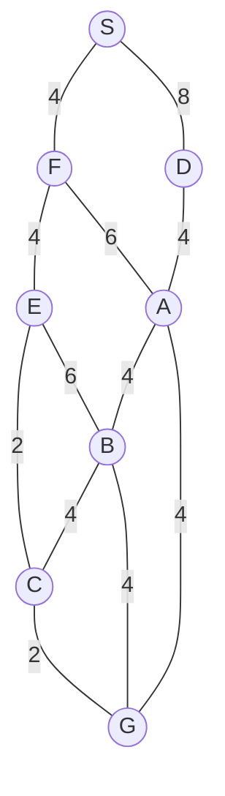

## The Question

1×1 grid, start S (top), goal G. MoveGen alphabetical, Manhattan heuristic, ties by label.

| # | Question | Official answer |
|---|----------|-----------------|
| 1.1 | Best First Search path | `S,D,A,G` |
| 1.2 | A* path | `S,F,A,G` |
| 1.3 | Branch-and-Bound path | `S,F,E,C,G` |
| 1.4 | Who finds the shortest path? | **C** — Branch-and-Bound |
| 1.5 | Admissibility | **B** — inadmissible |

## The Topic in 60 Seconds

BFS sorts by h, A\* by f = g + h, BnB by g on full paths. A\* is optimal only when h is admissible.

> Deep-dive: [A* Search](/concepts/week-03-heuristic-search/01-a-star-search), [Best First Search](/concepts/week-03-heuristic-search/09-best-first-search), [Branch and Bound](/concepts/week-03-heuristic-search/05-branch-and-bound).

## 1.1 — Best First Search → `S,D,A,G`

From the figure's grid, the h-ordering sends BFS left first: h(D) < h(F) at S.

| Step | OPEN | Pick |
|------|------|------|
| 1 | S | **S** → F, D |
| 2 | D (lower h than F) | **D** → A |
| 3 | A (lower h than F) | **A** → G |
| 4 | G (h = 0) | **G** — goal! |

Path: **S → D → A → G**.

## 1.2 — A* → `S,F,A,G`

f = g + h ordering picks F first (its f beats D's), then A, then G:

Path: **S → F → A → G**, cost 4 + 6 + 4 = 14.

<PaperTrace
  height={380}
  nodeWidth={100}
  nodeHeight={50}
  nodeFontSize={13}
  legend={[
    { color: "#b45309", label: "expanding" },
    { color: "#0369a1", label: "in OPEN (f = g+h)" },
    { color: "#4b5563", label: "expanded" },
    { color: "#16a34a", label: "returned path" }
  ]}
  nodes={[
    { id: "S", x: 300, y: 30 },
    { id: "F", x: 150, y: 140 },
    { id: "D", x: 460, y: 140 },
    { id: "E", x: 60, y: 260 },
    { id: "A", x: 300, y: 260 },
    { id: "C", x: 590, y: 260 },
    { id: "B", x: 450, y: 380 },
    { id: "G", x: 300, y: 500 }
  ]}
  edges={[
    { id: "e1", from: "S", to: "F", label: "4" },
    { id: "e2", from: "S", to: "D", label: "8" },
    { id: "e3", from: "F", to: "E", label: "4" },
    { id: "e4", from: "F", to: "A", label: "6" },
    { id: "e5", from: "D", to: "A", label: "4" },
    { id: "e6", from: "E", to: "C", label: "2" },
    { id: "e7", from: "E", to: "B", label: "6" },
    { id: "e8", from: "A", to: "B", label: "4" },
    { id: "e9", from: "A", to: "G", label: "4" },
    { id: "e10", from: "B", to: "C", label: "4" },
    { id: "e11", from: "B", to: "G", label: "4" },
    { id: "e12", from: "C", to: "G", label: "2" }
  ]}
  steps={[
    { label: "Init", note: "OPEN = {S(g=0, h=4, f=4)}", nodes: { S: "frontier" } },
    { label: "Expand S", note: "F beats D on f | OPEN = {F, D}", nodes: { S: "explored", F: "frontier", D: "frontier" } },
    { label: "Expand F", note: "E: g=8 | A: g=10 | OPEN = {E, A, D}", nodes: { S: "explored", F: "current", E: "frontier", A: "frontier", D: "frontier" } },
    { label: "Expand A", note: "G: g=14 | B: g=14 | OPEN = {G, B, E, D}", nodes: { F: "explored", A: "current", G: "frontier", B: "frontier", E: "frontier", D: "frontier" } },
    { label: "GOAL: S→F→A", note: "Pick G (f=14) = GOAL. Path S,F,A,G cost 14 - NOT optimal (h inadmissible). BnB finds S,F,E,C,G = 12.", nodes: { S: "path", F: "path", A: "path", G: "goal" }, edges: { e1: "path", e4: "path", e9: "path" } }
  ]}
/>

## 1.3 — Branch-and-Bound → `S,F,E,C,G`

The g-ordered queue assembles the eastern chain: S-F (4) → S-F-E (8) → S-F-E-C (10) → S-F-E-C-G (**12**) — goal popped with every open path ≥ 12 → optimal.

Path: **S → F → E → C → G**, cost 12 ✓ the true shortest.

## 1.4 — Shortest path → **C (Branch-and-Bound only)**

A* returned 14, BnB returned 12 → **C**.

## 1.5 — Admissibility → **B (inadmissible)**

A* missed the optimum ⇒ h overestimates somewhere on the true best route (the E/C corner) → **inadmissible** → **B** ✓

## Tricks & Tips

<Accordion title="Exam shortcuts">
1. Trace BFS by h, A\* by g+h, BnB by g on whole paths.
2. 1.4/1.5 agree: A\* suboptimal ⇒ inadmissible h.
3. The BnB answer is always the shortest — use it to grade the other two.
</Accordion>

**Answers:** 1.1 `S,D,A,G` · 1.2 `S,F,A,G` · 1.3 `S,F,E,C,G` · 1.4 **C** · 1.5 **B**
