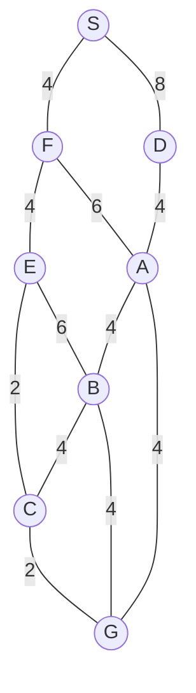

## The Question

1×1 grid, start S (top), goal G. MoveGen alphabetical, Manhattan heuristic, ties by label.

| # | Question | Official answer |
|---|----------|-----------------|
| 1.1 | Best First Search path | `S,D,A,G` |
| 1.2 | A* path | `S,F,A,G` |
| 1.3 | Branch-and-Bound path | `S,F,E,C,G` |
| 1.4 | Who finds the shortest path? | **C** — Branch-and-Bound |
| 1.5 | Admissibility | **B** — inadmissible |

## The Topic in 60 Seconds

| Algorithm | Sorts OPEN by | Ignores |
|-----------|---------------|---------|
| Best First | $h(n)$ | $g(n)$ |
| A* | $f(n) = g(n) + h(n)$ | nothing |
| Branch-and-Bound | $g(n)$ | $h(n)$ |

> Deep-dive: [A* Search](/concepts/week-03-heuristic-search/01-a-star-search), [Best First Search](/concepts/week-03-heuristic-search/09-best-first-search), [Branch and Bound](/concepts/week-03-heuristic-search/05-branch-and-bound).

## Step 0 — Heuristic table (Manhattan to G, read off the paper's grid)

| Node | $h$ | Node | $h$ |
|------|-----|------|-----|
| S | 9 | E | 7 |
| F | 8 | A | 3 |
| D | 7 | B | 4 |
| C | 2 | G | 0 |

Build this before tracing — every subquestion reads from it.

## 1.1 — Best First Search → `S,D,A,G`

Best First picks the open node with the smallest $h$ only — edge costs never matter:

| Step | OPEN (node : $h$) | Pick |
|------|-------------------|------|
| 1 | S : 9 | **S** → F(8), D(7) |
| 2 | D : 7, F : 8 | **D** → A(3) |
| 3 | A : 3, F : 8 | **A** → B(4), G(0) |
| 4 | G : 0, B : 4, F : 8 | **G** — goal! |

Path: **S → D → A → G**. The low $h$(D) = 7 drags the search east before the cheaper western edge S–F ever gets its turn.

## 1.2 — A* → `S,F,A,G`

| Step | OPEN (node : $f$) | Pick |
|------|-------------------|------|
| 1 | S : 0+9 = **9** | **S** → F : 4+8 = **12**, D : 8+7 = 15 |
| 2 | F : **12**, D : 15 | **F** → E : 8+7 = 15, A : 10+3 = **13** |
| 3 | A : **13**, D : 15, E : 15 | **A** → G : 14+0 = **14**, B : 14+4 = 18 |
| 4 | G : **14**, D : 15, E : 15, B : 18 | **G** — goal! |

Path: **S → F → A → G**, cost $4+6+4 = 14$. A*'s tiny $h$(A) = 3 makes the detour through A look better than grinding east through D and E — so G pops at 14 before D or E are ever expanded.

Step through the trace exactly as you would annotate the exam paper:

<StepGraph
  height={560}
  nodeWidth={100}
  nodeHeight={50}
  nodeFontSize={13}
  legend={[
    { color: "#b45309", label: "expanding" },
    { color: "#0369a1", label: "in OPEN (f = g+h)" },
    { color: "#4b5563", label: "expanded" },
    { color: "#16a34a", label: "returned path" },
  ]}
  steps={[
    {
      label: "Init",
      note: "OPEN = { S(g=0, h=9, f=9) }",
      elements: [
        { data: { id: "S", label: "S f=9", type: "frontier" }, position: { x: 300, y: 30 } },
        { data: { id: "F", label: "F", type: "explored" }, position: { x: 150, y: 140 } },
        { data: { id: "D", label: "D", type: "explored" }, position: { x: 460, y: 140 } },
        { data: { id: "E", label: "E", type: "explored" }, position: { x: 60, y: 260 } },
        { data: { id: "A", label: "A", type: "explored" }, position: { x: 300, y: 260 } },
        { data: { id: "C", label: "C", type: "explored" }, position: { x: 590, y: 260 } },
        { data: { id: "B", label: "B", type: "explored" }, position: { x: 450, y: 380 } },
        { data: { id: "G", label: "G", type: "explored" }, position: { x: 300, y: 500 } },
        { data: { id: "e1", source: "S", target: "F", label: "4" } },
        { data: { id: "e2", source: "S", target: "D", label: "8" } },
        { data: { id: "e3", source: "F", target: "E", label: "4" } },
        { data: { id: "e4", source: "F", target: "A", label: "6" } },
        { data: { id: "e5", source: "D", target: "A", label: "4" } },
        { data: { id: "e6", source: "E", target: "C", label: "2" } },
        { data: { id: "e7", source: "E", target: "B", label: "6" } },
        { data: { id: "e8", source: "A", target: "B", label: "4" } },
        { data: { id: "e9", source: "A", target: "G", label: "4" } },
        { data: { id: "e10", source: "B", target: "C", label: "4" } },
        { data: { id: "e11", source: "B", target: "G", label: "4" } },
        { data: { id: "e12", source: "C", target: "G", label: "2" } },
      ],
    },
    {
      label: "Expand S",
      note: "Pick S (f=9).\nF: g=4, h=8 → f=12\nD: g=8, h=7 → f=15\nOPEN = { F(12), D(15) }",
      elements: [
        { data: { id: "S", label: "S", type: "explored" }, position: { x: 300, y: 30 } },
        { data: { id: "F", label: "F f=12", type: "frontier" }, position: { x: 150, y: 140 } },
        { data: { id: "D", label: "D f=15", type: "frontier" }, position: { x: 460, y: 140 } },
        { data: { id: "E", label: "E", type: "explored" }, position: { x: 60, y: 260 } },
        { data: { id: "A", label: "A", type: "explored" }, position: { x: 300, y: 260 } },
        { data: { id: "C", label: "C", type: "explored" }, position: { x: 590, y: 260 } },
        { data: { id: "B", label: "B", type: "explored" }, position: { x: 450, y: 380 } },
        { data: { id: "G", label: "G", type: "explored" }, position: { x: 300, y: 500 } },
        { data: { id: "e1", source: "S", target: "F", label: "4" } },
        { data: { id: "e2", source: "S", target: "D", label: "8" } },
        { data: { id: "e3", source: "F", target: "E", label: "4" } },
        { data: { id: "e4", source: "F", target: "A", label: "6" } },
        { data: { id: "e5", source: "D", target: "A", label: "4" } },
        { data: { id: "e6", source: "E", target: "C", label: "2" } },
        { data: { id: "e7", source: "E", target: "B", label: "6" } },
        { data: { id: "e8", source: "A", target: "B", label: "4" } },
        { data: { id: "e9", source: "A", target: "G", label: "4" } },
        { data: { id: "e10", source: "B", target: "C", label: "4" } },
        { data: { id: "e11", source: "B", target: "G", label: "4" } },
        { data: { id: "e12", source: "C", target: "G", label: "2" } },
      ],
    },
    {
      label: "Expand F",
      note: "Pick F (f=12).\nE: g=8, h=7 → f=15\nA: g=10, h=3 → f=13\nOPEN = { A(13), D(15), E(15) }",
      elements: [
        { data: { id: "S", label: "S", type: "explored" }, position: { x: 300, y: 30 } },
        { data: { id: "F", label: "F", type: "current" }, position: { x: 150, y: 140 } },
        { data: { id: "D", label: "D f=15", type: "frontier" }, position: { x: 460, y: 140 } },
        { data: { id: "E", label: "E f=15", type: "frontier" }, position: { x: 60, y: 260 } },
        { data: { id: "A", label: "A f=13", type: "frontier" }, position: { x: 300, y: 260 } },
        { data: { id: "C", label: "C", type: "explored" }, position: { x: 590, y: 260 } },
        { data: { id: "B", label: "B", type: "explored" }, position: { x: 450, y: 380 } },
        { data: { id: "G", label: "G", type: "explored" }, position: { x: 300, y: 500 } },
        { data: { id: "e1", source: "S", target: "F", label: "4" } },
        { data: { id: "e2", source: "S", target: "D", label: "8" } },
        { data: { id: "e3", source: "F", target: "E", label: "4" } },
        { data: { id: "e4", source: "F", target: "A", label: "6" } },
        { data: { id: "e5", source: "D", target: "A", label: "4" } },
        { data: { id: "e6", source: "E", target: "C", label: "2" } },
        { data: { id: "e7", source: "E", target: "B", label: "6" } },
        { data: { id: "e8", source: "A", target: "B", label: "4" } },
        { data: { id: "e9", source: "A", target: "G", label: "4" } },
        { data: { id: "e10", source: "B", target: "C", label: "4" } },
        { data: { id: "e11", source: "B", target: "G", label: "4" } },
        { data: { id: "e12", source: "C", target: "G", label: "2" } },
      ],
    },
    {
      label: "Expand A",
      note: "Pick A (f=13).\nG: g=14, h=0 → f=14\nB: g=14, h=4 → f=18\nOPEN = { G(14), D(15), E(15), B(18) }",
      elements: [
        { data: { id: "S", label: "S", type: "explored" }, position: { x: 300, y: 30 } },
        { data: { id: "F", label: "F", type: "explored" }, position: { x: 150, y: 140 } },
        { data: { id: "D", label: "D f=15", type: "frontier" }, position: { x: 460, y: 140 } },
        { data: { id: "E", label: "E f=15", type: "frontier" }, position: { x: 60, y: 260 } },
        { data: { id: "A", label: "A", type: "current" }, position: { x: 300, y: 260 } },
        { data: { id: "C", label: "C", type: "explored" }, position: { x: 590, y: 260 } },
        { data: { id: "B", label: "B f=18", type: "frontier" }, position: { x: 450, y: 380 } },
        { data: { id: "G", label: "G f=14", type: "frontier" }, position: { x: 300, y: 500 } },
        { data: { id: "e1", source: "S", target: "F", label: "4" } },
        { data: { id: "e2", source: "S", target: "D", label: "8" } },
        { data: { id: "e3", source: "F", target: "E", label: "4" } },
        { data: { id: "e4", source: "F", target: "A", label: "6" } },
        { data: { id: "e5", source: "D", target: "A", label: "4" } },
        { data: { id: "e6", source: "E", target: "C", label: "2" } },
        { data: { id: "e7", source: "E", target: "B", label: "6" } },
        { data: { id: "e8", source: "A", target: "B", label: "4" } },
        { data: { id: "e9", source: "A", target: "G", label: "4" } },
        { data: { id: "e10", source: "B", target: "C", label: "4" } },
        { data: { id: "e11", source: "B", target: "G", label: "4" } },
        { data: { id: "e12", source: "C", target: "G", label: "2" } },
      ],
    },
    {
      label: "Goal: S,F,A,G",
      note: "Pick G (f=14) → GOAL.\nPath: S,F,A,G   cost = 4+6+4 = 14\nNOT optimal — true shortest is 12.\nh(E)=7 overestimates h*(E)=4 → h inadmissible.\nBnB finds S,F,E,C,G = 12.",
      elements: [
        { data: { id: "S", label: "S", type: "path" }, position: { x: 300, y: 30 } },
        { data: { id: "F", label: "F", type: "path" }, position: { x: 150, y: 140 } },
        { data: { id: "D", label: "D", type: "explored" }, position: { x: 460, y: 140 } },
        { data: { id: "E", label: "E", type: "explored" }, position: { x: 60, y: 260 } },
        { data: { id: "A", label: "A", type: "path" }, position: { x: 300, y: 260 } },
        { data: { id: "C", label: "C", type: "explored" }, position: { x: 590, y: 260 } },
        { data: { id: "B", label: "B", type: "explored" }, position: { x: 450, y: 380 } },
        { data: { id: "G", label: "G ✓", type: "goal" }, position: { x: 300, y: 500 } },
        { data: { id: "e1", source: "S", target: "F", label: "4", type: "path" } },
        { data: { id: "e2", source: "S", target: "D", label: "8" } },
        { data: { id: "e3", source: "F", target: "E", label: "4" } },
        { data: { id: "e4", source: "F", target: "A", label: "6", type: "path" } },
        { data: { id: "e5", source: "D", target: "A", label: "4" } },
        { data: { id: "e6", source: "E", target: "C", label: "2" } },
        { data: { id: "e7", source: "E", target: "B", label: "6" } },
        { data: { id: "e8", source: "A", target: "B", label: "4" } },
        { data: { id: "e9", source: "A", target: "G", label: "4", type: "path" } },
        { data: { id: "e10", source: "B", target: "C", label: "4" } },
        { data: { id: "e11", source: "B", target: "G", label: "4" } },
        { data: { id: "e12", source: "C", target: "G", label: "2" } },
      ],
    },
  ]}
/>

## 1.3 — Branch-and-Bound → `S,F,E,C,G`

BnB sorts full paths by $g$ and never trusts $h$:

| Pop | OPEN (path : $g$) | Extend |
|-----|-------------------|--------|
| S : 0 | SF : 4, SD : 8 | |
| SF : 4 | SD : 8, SFE : 8, SFA : 10 | |
| SD : 8 | SFE : 8, SFA : 10, SDA : 12 | |
| SFE : 8 | SFA : 10, SFEC : 10, SDA : 12, SFEB : 14 | |
| SFA : 10 | SFEC : 10, SDA : 12, SFEB : 14, SFAB : 14, SFAG : 14 ← goal on queue | |
| SFEC : 10 | SDA : 12, SFECG : **12** ← goal, SFEB : 14, SFAB : 14, SFAG : 14 | |
| SDA : 12 | SFECG : **12**, SFEB : 14, SFAB : 14, SFAG : 14, SDAB : 16, SDAG : 16 | |
| SFECG : **12** | everything open ≥ 14 → **optimal** | |

Path: **S → F → E → C → G**, cost $4+4+2+2 = 12$ ✓ the true shortest.

## 1.4 — Shortest path → **C (Branch-and-Bound only)**

| Algorithm | Path | Cost |
|-----------|------|------|
| Best First | S,D,A,G | $8+4+4 = 16$ |
| A* | S,F,A,G | $4+6+4 = 14$ |
| Branch-and-Bound | **S,F,E,C,G** | $4+4+2+2 = \mathbf{12}$ |

A* returned 14, BnB returned 12 → **C**.

## 1.5 — Admissibility → **B (inadmissible)**

$h$ is admissible only if it never overestimates. Check the corner the winning route squeezes through:

| Node | $h(n)$ | True cheapest $h^*(n)$ | Verdict |
|------|--------|------------------------|---------|
| E | 7 | E→C→G = $2+2 = 4$ | **overestimates!** |
| D | 7 | D→A→G = $4+4 = 8$ | fine |
| F | 8 | F→E→C→G = $4+2+2 = 8$ | fine |

One counter-example is enough: $h(E) = 7 > h^*(E) = 4$ → **not admissible** → **B** ✓ — which is exactly why A* came home with 14 instead of 12.

## Tricks & Tips

<Accordion title="Exam shortcuts for this map">
1. $h(D) = 7 < h(F) = 8$: greedy BFS dives down the eastern D–A line and never looks west — that alone answers 1.1 in three picks.
2. A*: F (f=12) beats D (f=15), but A's tiny $h=3$ gives f(A)=13 — A* hops to A, pops G at 14, and never expands D or E. Whenever your A* answer beats BFS's, suspect a suspiciously small $h$ on the detour.
3. BnB: track full paths with running sums — SFE already costs 8 at depth 2, and the all-cheap suffix C(2), G(2) lands 12 while every rival sits at 14+.
4. 1.4/1.5 always agree: A* returned 14 > true 12 ⇒ some $h$ must overestimate. Scan neighbours of G first — h(E) = 7 vs the real 4 is the culprit.
</Accordion>

**Answers:** 1.1 `S,D,A,G` · 1.2 `S,F,A,G` · 1.3 `S,F,E,C,G` · 1.4 **C** · 1.5 **B**
