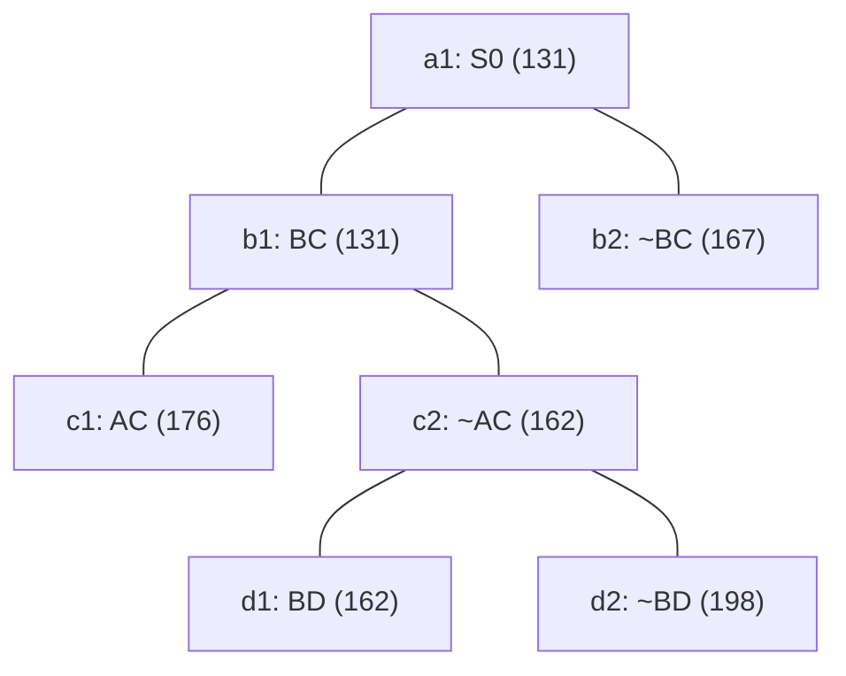

## The Question

TSP BnB snapshot when the optimal tour is discovered.

| # | Question | Official answer |
|---|----------|-----------------|
| 2.1 | 2nd–4th nodes refined | `b1,c2,d1` |
| 2.2 | Optimal tour node + cost | `d1,162` |
| 2.3 | Number of cities | `5` |
| 2.4 | Tour from A | `A,D,B,C,E` |

## The Topic in 60 Seconds

Refine = pop the cheapest open node, insert its two children. Childless snapshot nodes are tours. Stop when a tour pops with no cheaper open node.

> Deep-dive: [Reading BnB Trees](/concepts/week-05-optimal-tsp/01-bnb-tree-reading), [Branch and Bound](/concepts/week-03-heuristic-search/05-branch-and-bound).

## 2.1 — Refine order → `b1,c2,d1`

| Pop | Queue (min first) | Action |
|-----|-------------------|--------|
| 1 | a1 : 131 | refine → b1(131), b2(167) |
| 2 | b1 : 131, b2 : 167 | refine **b1** → c1(176), c2(162) |
| 3 | c2 : 162, b2 : 167, c1 : 176 | refine **c2** → d1(162), d2(198) |
| 4 | d1 : 162, b2 : 167, c1 : 176, d2 : 198 | refine **d1** (the paper counts this selection) — next: leaf popped |

## 2.2 — Optimal tour → `d1`, cost `162`

After d1 is refined the queue is `{b2 : 167, c1 : 176, d2 : 198}` plus d1's children — d1's line completes at **162**, and every open bound ≥ 167 → **d1 = optimal tour, cost 162** ✓

## 2.3 — Cities → `5`

Path root→d1: **BC in, ~AC, BD in**. Degrees: B–2 full (C, D), C–1, D–1, A–0, E–0. A pairs with D and E (AC excluded); C closes with E. Tour: **A–D–B–C–E–A** → 5 cities ✓

## 2.4 — Tour from A → `A,D,B,C,E`

The forced cycle above ✓ (reverse A,E,C,B,D equivalent).

<Graph
  height={380}
  nodeWidth={110}
  nodeHeight={56}
  nodeFontSize={12}
  layout={{ name: "preset" }}
  elements={[
    { data: { id: "a1", label: "a1: S0 131", type: "current" }, position: { x: 300, y: 20 } },
    { data: { id: "b1", label: "b1: BC 131", type: "current" }, position: { x: 150, y: 120 } },
    { data: { id: "b2", label: "b2: ~BC 167", type: "explored" }, position: { x: 470, y: 120 } },
    { data: { id: "c1", label: "c1: AC 176" }, position: { x: 60, y: 220 } },
    { data: { id: "c2", label: "c2: ~AC 162", type: "current" }, position: { x: 280, y: 220 } },
    { data: { id: "d1", label: "d1: BD 162 ✓", type: "path" }, position: { x: 200, y: 320 } },
    { data: { id: "d2", label: "d2: ~BD 198" }, position: { x: 360, y: 320 } },
    { data: { id: "x1", source: "a1", target: "b1" } },
    { data: { id: "x2", source: "a1", target: "b2" } },
    { data: { id: "x3", source: "b1", target: "c1" } },
    { data: { id: "x4", source: "b1", target: "c2" } },
    { data: { id: "x5", source: "c2", target: "d1" } },
    { data: { id: "x6", source: "c2", target: "d2" } },
  ]}
/>

*Amber = refined in order b1 → c2 → d1. Green = d1, the 162 tour.*

## Tricks & Tips

<Accordion title="Fast method">
1. Sorted queue with (cost, ref#); this tree is only 3 refinements deep.
2. Optimal = cheapest leaf popped while all open bounds ≥ it.
3. Cities: the excluded AC forces A-D and C-E around the fixed B-C, B-D spine.
</Accordion>

**Answers:** 2.1 `b1,c2,d1` · 2.2 `d1,162` · 2.3 `5` · 2.4 `A,D,B,C,E`
