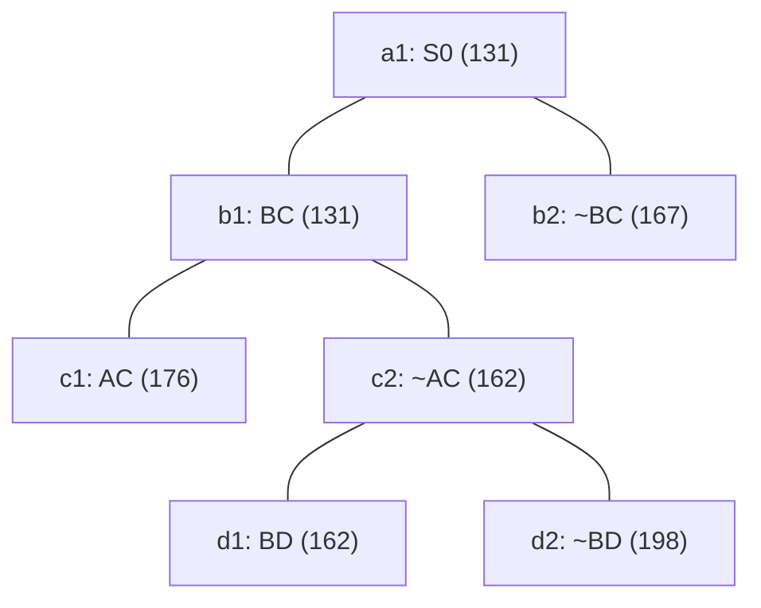

## The Question

TSP BnB snapshot when the optimal tour is discovered.

| # | Question | Official answer |
|---|----------|-----------------|
| 2.1 | 2nd–4th nodes refined | `b1,c2,d1` |
| 2.2 | Optimal tour node + cost | `d1,162` |
| 2.3 | Number of cities | `5` |
| 2.4 | Tour from A | `A,D,B,C,E` |

## The Topic in 60 Seconds

Refine = pop the cheapest open node, insert its two children. Childless snapshot nodes are tours. Stop when a tour pops with no cheaper open node.

> Deep-dive: [Reading BnB Trees](/concepts/week-05-optimal-tsp/01-bnb-tree-reading), [Branch and Bound](/concepts/week-03-heuristic-search/05-branch-and-bound).

## 2.1 — Refine order → `b1,c2,d1`

Simulate the priority queue:

| Pop | Queue (min first) | Action |
|-----|-------------------|--------|
| 1 | a1 : 131 | process a1 → insert b1(131), b2(167) |
| 2 | b1 : 131, b2 : 167 | process **b1** → insert c1(176), c2(162) |
| 3 | c2 : 162, b2 : 167, c1 : 176 | process **c2** → insert d1(162), d2(198) |
| 4 | d1 : 162, b2 : 167, c1 : 176, d2 : 198 | process **d1** — it is a leaf → tour discovered, stop |

The 2nd–4th nodes processed are **b1, c2, d1** ✓ (d1 is the tour pop itself; the paper counts it among the processed nodes).

## 2.2 — Optimal tour → `d1`, cost `162`

At pop 4, d1 (bound 162) is childless in the snapshot — a complete tour — and every other open bound is ≥ 167. Nothing cheaper can exist anywhere in the tree → **d1 = optimal tour at cost 162** ✓.

<Callout type="tip" title="Leaf vs internal">
c2's bound (162) ties d1's, but c2 has children — it was refined, so it is a set of candidate tours, not a tour. Only childless nodes can be tours.
</Callout>

## 2.3 — Cities → `5`

Reconstruct the cycle d1's decisions force. Path root→d1: **BC included** (b1), **AC excluded** (c2), **BD included** (d1):

| City | Degree so far | Forced partner(s) |
|------|---------------|-------------------|
| B | C, D — full | done |
| C | B — needs 1 more | AC excluded → **E** |
| D | B — needs 1 more | **A** (E already taken by C) |
| A | — needs 2 | **D** and **E** |

Cycle: **A–D–B–C–E–A** → 5 distinct cities ✓

## 2.4 — Tour from A → `A,D,B,C,E`

The forced cycle above rotated to start at A: **A, D, B, C, E** (reverse A,E,C,B,D equivalent) ✓

Step through the queue — amber marks each pop in order, green is the winning tour:

<PaperTrace
  height={400}
  nodeWidth={110}
  nodeHeight={56}
  nodeFontSize={12}
  legend={[
    { color: "#b45309", label: "popping now" },
    { color: "#4b5563", label: "already processed" },
    { color: "#0369a1", label: "waiting in OPEN" },
    { color: "#16a34a", label: "optimal tour (162)" },
  ]}
  nodes={[
    { id: "a1", label: "a1: S0 131", x: 300, y: 20 },
    { id: "b1", label: "b1: BC 131", x: 150, y: 120 },
    { id: "b2", label: "b2: ~BC 167", x: 470, y: 120 },
    { id: "c1", label: "c1: AC 176", x: 60, y: 220 },
    { id: "c2", label: "c2: ~AC 162", x: 280, y: 220 },
    { id: "d1", label: "d1: BD 162", x: 200, y: 320 },
    { id: "d2", label: "d2: ~BD 198", x: 380, y: 320 },
  ]}
  edges={[
    { id: "x1", from: "a1", to: "b1" },
    { id: "x2", from: "a1", to: "b2" },
    { id: "x3", from: "b1", to: "c1" },
    { id: "x4", from: "b1", to: "c2" },
    { id: "x5", from: "c2", to: "d1" },
    { id: "x6", from: "c2", to: "d2" },
  ]}
  steps={[
    {
      label: "Pop a1 : 131",
      note: "OPEN = [ a1:131 ]\na1 has children → refined.\nInsert b1:131 (BC), b2:167 (~BC).\nOPEN = [ b1:131, b2:167 ]",
      nodes: { a1: "current" },
    },
    {
      label: "Pop b1 : 131",
      note: "Min = b1 (131). Refined.\nInsert c1:176 (AC), c2:162 (~AC).\nOPEN = [ c2:162, b2:167, c1:176 ]",
      nodes: { a1: "explored", b1: "current" },
    },
    {
      label: "Pop c2 : 162",
      note: "~BC side waits: b2 (167) > c2 (162).\nc2 refined.\nInsert d1:162 (BD), d2:198 (~BD).\nOPEN = [ d1:162, b2:167, c1:176, d2:198 ]",
      nodes: { a1: "explored", b1: "explored", c2: "current" },
    },
    {
      label: "Pop d1 : 162 = TOUR",
      note: "d1 is childless = complete tour, and it is the minimum.\nEvery open bound ≥ 167 > 162 → optimal.\nTour: A-D-B-C-E-A, cost 162.",
      nodes: { a1: "explored", b1: "explored", c2: "explored", d1: "path", b2: "frontier", c1: "frontier", d2: "frontier" },
    },
  ]}
/>

## Tricks & Tips

<Accordion title="Fast method for this tree">
1. Sorted queue by (bound, insertion): after refining b1, the ~AC child (162) jumps ahead of the untouched ~BC side (167) — that jump is what makes the order b1, c2, d1 instead of b1, b2.
2. Optimal = cheapest childless node popped while all open bounds ≥ it. Here d1 (162) vs the rest ≥ 167 — no gap-checking needed beyond one glance.
3. Cities: write the include/exclude chain (BC∈, AC∉, BD∈), fill degrees to exactly 2 everywhere, and the cycle falls out forced: A-D-B-C-E.
4. Don't count the tour pop as an extra refinement when asked for the count separately — but if the key lists the 2nd–4th *processed* nodes, the tour pop is included.
</Accordion>

**Answers:** 2.1 `b1,c2,d1` · 2.2 `d1,162` · 2.3 `5` · 2.4 `A,D,B,C,E`
