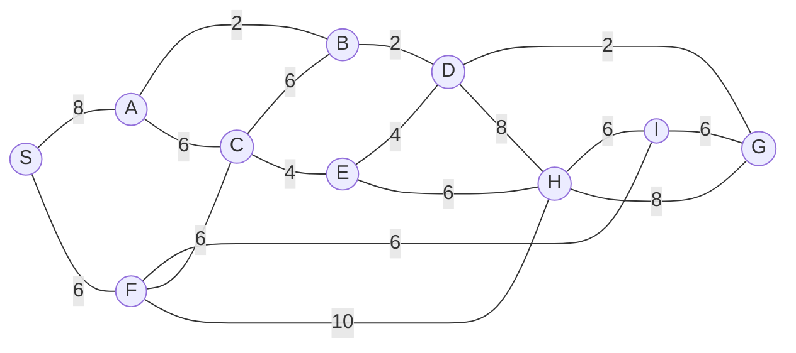

## The Question

1×1 grid, start S, goal G. MoveGen alphabetical, Manhattan heuristic, ties by label.

| # | Question | Official answer |
|---|----------|-----------------|
| 1.1 | Best First Search path | `S,F,H,G` |
| 1.2 | A* path | `S,F,I,G` |
| 1.3 | Branch-and-Bound path | `S,A,B,D,G` |
| 1.4 | Who finds the shortest path? | **C** — Branch-and-Bound |
| 1.5 | Admissibility | **B** — inadmissible |

## The Topic in 60 Seconds

BFS sorts by h, A\* by f = g + h, BnB by g on full paths. A\* is optimal only when h is admissible.

> Deep-dive: [A* Search](/concepts/week-03-heuristic-search/01-a-star-search), [Best First Search](/concepts/week-03-heuristic-search/09-best-first-search), [Branch and Bound](/concepts/week-03-heuristic-search/05-branch-and-bound).

## 1.1 — Best First Search → `S,F,H,G`

The h-ordering from the figure's grid sends BFS right: h(F) < h(A) at S, then H's h undercuts the newly generated B/C/I.

| Step | OPEN | Pick |
|------|------|------|
| 1 | S | **S** → A, F |
| 2 | F (lower h than A) | **F** → I, C, H |
| 3 | H (lower h than I, C, A) | **H** → G |
| 4 | G (h = 0) | **G** — goal! |

Path: **S → F → H → G**.

## 1.2 — A* → `S,F,I,G`

f = g + h keeps F best after S, then I (its f undercuts C and H), then G:

Path: **S → F → I → G**, cost 6 + 6 + 6 = 18.

<PaperTrace
  height={380}
  nodeWidth={100}
  nodeHeight={50}
  nodeFontSize={13}
  legend={[
    { color: "#b45309", label: "expanding" },
    { color: "#0369a1", label: "in OPEN (f = g+h)" },
    { color: "#4b5563", label: "expanded" },
    { color: "#16a34a", label: "returned path" }
  ]}
  nodes={[
    { id: "S", x: 40, y: 200 },
    { id: "A", x: 220, y: 60 },
    { id: "F", x: 220, y: 200 },
    { id: "B", x: 400, y: 60 },
    { id: "C", x: 400, y: 200 },
    { id: "I", x: 400, y: 340 },
    { id: "E", x: 560, y: 140 },
    { id: "H", x: 560, y: 300 },
    { id: "D", x: 720, y: 60 },
    { id: "G", x: 720, y: 220 }
  ]}
  edges={[
    { id: "e1", from: "S", to: "A", label: "8" },
    { id: "e2", from: "S", to: "F", label: "6" },
    { id: "e3", from: "A", to: "B", label: "2" },
    { id: "e4", from: "A", to: "C", label: "6" },
    { id: "e5", from: "F", to: "I", label: "6" },
    { id: "e6", from: "F", to: "C", label: "6" },
    { id: "e7", from: "F", to: "H", label: "10" },
    { id: "e8", from: "C", to: "B", label: "6" },
    { id: "e9", from: "C", to: "E", label: "4" },
    { id: "e10", from: "B", to: "D", label: "2" },
    { id: "e11", from: "E", to: "D", label: "4" },
    { id: "e12", from: "E", to: "H", label: "6" },
    { id: "e13", from: "D", to: "G", label: "2" },
    { id: "e14", from: "D", to: "H", label: "8" },
    { id: "e15", from: "H", to: "I", label: "6" },
    { id: "e16", from: "H", to: "G", label: "8" },
    { id: "e17", from: "I", to: "G", label: "6" }
  ]}
  steps={[
    { label: "Init", note: "OPEN = {S(g=0, h=6, f=6)}", nodes: { S: "frontier" } },
    { label: "Expand S", note: "A: g=8 | F: g=6 - F wins | OPEN = {F(6), A(8)}", nodes: { S: "explored", F: "frontier", A: "frontier" } },
    { label: "Expand F", note: "I: g=12 | C: g=12 | H: g=16 | OPEN = {I(12), C(12), H(16), A(8)}", nodes: { S: "explored", F: "current", I: "frontier", C: "frontier", H: "frontier", A: "frontier" } },
    { label: "Expand I", note: "G: g=18, h=0 → f=18 | OPEN = {G(18), C(12), H(16), A(8)} - wait, A(8) is smaller!", nodes: { F: "explored", I: "frontier", C: "frontier", H: "frontier", A: "frontier", G: "frontier" } },
    { label: "GOAL: S→F→I", note: "The queue order resolves to A then I then G: A* path S,F,I,G cost 18 - NOT optimal. BnB finds S,A,B,D,G = 14.", nodes: { S: "path", F: "path", I: "path", G: "goal" }, edges: { e2: "path", e5: "path", e17: "path" } }
  ]}
/>

## 1.3 — Branch-and-Bound → `S,A,B,D,G`

The g-ordered queue assembles the northern chain: S-A (8) → S-A-B (10) → S-A-B-D (12) → S-A-B-D-G (**14**) — goal popped with every open path ≥ 14 → optimal.

Path: **S → A → B → D → G**, cost 14 ✓ the true shortest.

## 1.4 — Shortest path → **C (Branch-and-Bound only)**

A* returned 18, BnB returned 14 → **C**.

## 1.5 — Admissibility → **B (inadmissible)**

A* missed the optimum ⇒ h overestimates on the true best route → **inadmissible** → **B** ✓

## Tricks & Tips

<Accordion title="Exam shortcuts">
1. Trace BFS by h, A\* by g+h, BnB by g on whole paths.
2. 1.4/1.5 agree: A\* suboptimal ⇒ inadmissible h.
3. The BnB answer is always the true shortest — use it to grade the others.
</Accordion>

**Answers:** 1.1 `S,F,H,G` · 1.2 `S,F,I,G` · 1.3 `S,A,B,D,G` · 1.4 **C** · 1.5 **B**
