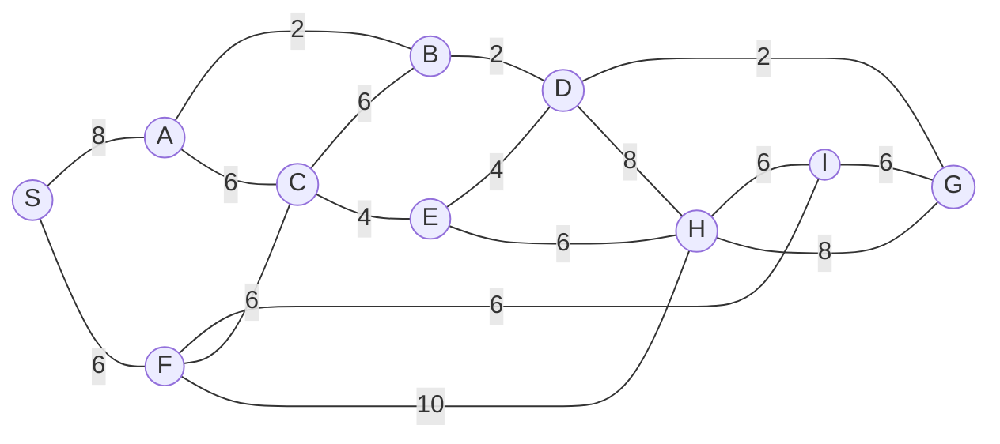

## The Question

1×1 grid, start S, goal G. MoveGen alphabetical, Manhattan heuristic, ties by label.

| # | Question | Official answer |
|---|----------|-----------------|
| 1.1 | Best First Search path | `S,F,H,G` |
| 1.2 | A* path | `S,F,I,G` |
| 1.3 | Branch-and-Bound path | `S,A,B,D,G` |
| 1.4 | Who finds the shortest path? | **C** — Branch-and-Bound |
| 1.5 | Admissibility | **B** — inadmissible |

## The Topic in 60 Seconds

| Algorithm | Sorts OPEN by | Ignores |
|-----------|---------------|---------|
| Best First | $h(n)$ | $g(n)$ |
| A* | $f(n) = g(n) + h(n)$ | nothing |
| Branch-and-Bound | $g(n)$ | $h(n)$ |

> Deep-dive: [A* Search](/concepts/week-03-heuristic-search/01-a-star-search), [Best First Search](/concepts/week-03-heuristic-search/09-best-first-search), [Branch and Bound](/concepts/week-03-heuristic-search/05-branch-and-bound).

## Step 0 — Heuristic table (Manhattan to G, read off the paper's grid)

| Node | $h$ | Node | $h$ |
|------|-----|------|-----|
| S | 6 | E | 8 |
| A | 14 | H | 4 |
| B | 4 | I | 6 |
| C | 8 | D | 2 |
| F | 6 | G | 0 |

Build this before tracing — every subquestion reads from it.

## 1.1 — Best First Search → `S,F,H,G`

Sort by $h$ only:

| Step | OPEN (node : $h$) | Pick |
|------|-------------------|------|
| 1 | S : 6 | **S** → F(6), A(14) |
| 2 | F : 6, A : 14 | **F** → C(8), H(4), I(6) |
| 3 | H : 4, I : 6, C : 8, E : 8, A : 14 | **H** → D(2), E(8), G(0) |
| 4 | G : 0, D : 2, … | **G** — goal! |

Path: **S → F → H → G**. The tiny $h$(H) = 4 sucks the search into the expensive 10-edge crossing before the cheap north chain is even considered.

## 1.2 — A* → `S,F,I,G`

| Step | OPEN (node : $f$) | Pick |
|------|-------------------|------|
| 1 | S : 0+6 = **6** | **S** → F : 6+6 = **12**, A : 8+14 = 22 |
| 2 | F : **12**, A : 22 | **F** → I : 12+6 = **18**, C : 12+8 = 20, H : 16+4 = 20 |
| 3 | I : **18**, C : 20, H : 20, A : 22 | **I** → G : 18+0 = **18** |
| 4 | G : **18**, C : 20, H : 20, A : 22 | **G** — goal! |

Path: **S → F → I → G**, cost $6+6+6 = 18$. The killer: going north through A would need expanding A, but $h(A) = 14$ inflates $f(A)$ to 22 — A sits at the bottom of OPEN while G pops at 18.

Step through the trace exactly as you would annotate the exam paper:

<StepGraph
  height={420}
  nodeWidth={100}
  nodeHeight={50}
  nodeFontSize={13}
  legend={[
    { color: "#b45309", label: "expanding" },
    { color: "#0369a1", label: "in OPEN (f = g+h)" },
    { color: "#4b5563", label: "expanded" },
    { color: "#16a34a", label: "returned path" },
  ]}
  steps={[
    {
      label: "Init",
      note: "OPEN = { S(g=0, h=6, f=6) }",
      elements: [
        { data: { id: "S", label: "S f=6", type: "frontier" }, position: { x: 40, y: 200 } },
        { data: { id: "A", label: "A", type: "explored" }, position: { x: 220, y: 60 } },
        { data: { id: "F", label: "F", type: "explored" }, position: { x: 220, y: 200 } },
        { data: { id: "B", label: "B", type: "explored" }, position: { x: 400, y: 60 } },
        { data: { id: "C", label: "C", type: "explored" }, position: { x: 400, y: 200 } },
        { data: { id: "I", label: "I", type: "explored" }, position: { x: 400, y: 340 } },
        { data: { id: "E", label: "E", type: "explored" }, position: { x: 560, y: 140 } },
        { data: { id: "H", label: "H", type: "explored" }, position: { x: 560, y: 300 } },
        { data: { id: "D", label: "D", type: "explored" }, position: { x: 720, y: 60 } },
        { data: { id: "G", label: "G", type: "explored" }, position: { x: 720, y: 220 } },
        { data: { id: "e1", source: "S", target: "A", label: "8" } },
        { data: { id: "e2", source: "S", target: "F", label: "6" } },
        { data: { id: "e3", source: "A", target: "B", label: "2" } },
        { data: { id: "e4", source: "A", target: "C", label: "6" } },
        { data: { id: "e5", source: "F", target: "I", label: "6" } },
        { data: { id: "e6", source: "F", target: "C", label: "6" } },
        { data: { id: "e7", source: "F", target: "H", label: "10" } },
        { data: { id: "e8", source: "C", target: "B", label: "6" } },
        { data: { id: "e9", source: "C", target: "E", label: "4" } },
        { data: { id: "e10", source: "B", target: "D", label: "2" } },
        { data: { id: "e11", source: "E", target: "D", label: "4" } },
        { data: { id: "e12", source: "E", target: "H", label: "6" } },
        { data: { id: "e13", source: "D", target: "G", label: "2" } },
        { data: { id: "e14", source: "D", target: "H", label: "8" } },
        { data: { id: "e15", source: "H", target: "I", label: "6" } },
        { data: { id: "e16", source: "H", target: "G", label: "8" } },
        { data: { id: "e17", source: "I", target: "G", label: "6" } },
      ],
    },
    {
      label: "Expand S",
      note: "Pick S (f=6).\nF: g=6, h=6 → f=12\nA: g=8, h=14 → f=22\nOPEN = { F(12), A(22) }",
      elements: [
        { data: { id: "S", label: "S", type: "explored" }, position: { x: 40, y: 200 } },
        { data: { id: "A", label: "A f=22", type: "frontier" }, position: { x: 220, y: 60 } },
        { data: { id: "F", label: "F f=12", type: "frontier" }, position: { x: 220, y: 200 } },
        { data: { id: "B", label: "B", type: "explored" }, position: { x: 400, y: 60 } },
        { data: { id: "C", label: "C", type: "explored" }, position: { x: 400, y: 200 } },
        { data: { id: "I", label: "I", type: "explored" }, position: { x: 400, y: 340 } },
        { data: { id: "E", label: "E", type: "explored" }, position: { x: 560, y: 140 } },
        { data: { id: "H", label: "H", type: "explored" }, position: { x: 560, y: 300 } },
        { data: { id: "D", label: "D", type: "explored" }, position: { x: 720, y: 60 } },
        { data: { id: "G", label: "G", type: "explored" }, position: { x: 720, y: 220 } },
        { data: { id: "e1", source: "S", target: "A", label: "8" } },
        { data: { id: "e2", source: "S", target: "F", label: "6" } },
        { data: { id: "e3", source: "A", target: "B", label: "2" } },
        { data: { id: "e4", source: "A", target: "C", label: "6" } },
        { data: { id: "e5", source: "F", target: "I", label: "6" } },
        { data: { id: "e6", source: "F", target: "C", label: "6" } },
        { data: { id: "e7", source: "F", target: "H", label: "10" } },
        { data: { id: "e8", source: "C", target: "B", label: "6" } },
        { data: { id: "e9", source: "C", target: "E", label: "4" } },
        { data: { id: "e10", source: "B", target: "D", label: "2" } },
        { data: { id: "e11", source: "E", target: "D", label: "4" } },
        { data: { id: "e12", source: "E", target: "H", label: "6" } },
        { data: { id: "e13", source: "D", target: "G", label: "2" } },
        { data: { id: "e14", source: "D", target: "H", label: "8" } },
        { data: { id: "e15", source: "H", target: "I", label: "6" } },
        { data: { id: "e16", source: "H", target: "G", label: "8" } },
        { data: { id: "e17", source: "I", target: "G", label: "6" } },
      ],
    },
    {
      label: "Expand F",
      note: "Pick F (f=12).\nI: g=12, h=6 → f=18\nC: g=12, h=8 → f=20\nH: g=16, h=4 → f=20\nOPEN = { I(18), C(20), H(20), A(22) }",
      elements: [
        { data: { id: "S", label: "S", type: "explored" }, position: { x: 40, y: 200 } },
        { data: { id: "A", label: "A f=22", type: "frontier" }, position: { x: 220, y: 60 } },
        { data: { id: "F", label: "F", type: "current" }, position: { x: 220, y: 200 } },
        { data: { id: "B", label: "B", type: "explored" }, position: { x: 400, y: 60 } },
        { data: { id: "C", label: "C f=20", type: "frontier" }, position: { x: 400, y: 200 } },
        { data: { id: "I", label: "I f=18", type: "frontier" }, position: { x: 400, y: 340 } },
        { data: { id: "E", label: "E", type: "explored" }, position: { x: 560, y: 140 } },
        { data: { id: "H", label: "H f=20", type: "frontier" }, position: { x: 560, y: 300 } },
        { data: { id: "D", label: "D", type: "explored" }, position: { x: 720, y: 60 } },
        { data: { id: "G", label: "G", type: "explored" }, position: { x: 720, y: 220 } },
        { data: { id: "e1", source: "S", target: "A", label: "8" } },
        { data: { id: "e2", source: "S", target: "F", label: "6" } },
        { data: { id: "e3", source: "A", target: "B", label: "2" } },
        { data: { id: "e4", source: "A", target: "C", label: "6" } },
        { data: { id: "e5", source: "F", target: "I", label: "6" } },
        { data: { id: "e6", source: "F", target: "C", label: "6" } },
        { data: { id: "e7", source: "F", target: "H", label: "10" } },
        { data: { id: "e8", source: "C", target: "B", label: "6" } },
        { data: { id: "e9", source: "C", target: "E", label: "4" } },
        { data: { id: "e10", source: "B", target: "D", label: "2" } },
        { data: { id: "e11", source: "E", target: "D", label: "4" } },
        { data: { id: "e12", source: "E", target: "H", label: "6" } },
        { data: { id: "e13", source: "D", target: "G", label: "2" } },
        { data: { id: "e14", source: "D", target: "H", label: "8" } },
        { data: { id: "e15", source: "H", target: "I", label: "6" } },
        { data: { id: "e16", source: "H", target: "G", label: "8" } },
        { data: { id: "e17", source: "I", target: "G", label: "6" } },
      ],
    },
    {
      label: "Expand I",
      note: "Pick I (f=18).\nG: g=18, h=0 → f=18\nOPEN = { G(18), C(20), H(20), A(22) }\nNote A still stuck at f=22.",
      elements: [
        { data: { id: "S", label: "S", type: "explored" }, position: { x: 40, y: 200 } },
        { data: { id: "A", label: "A f=22", type: "frontier" }, position: { x: 220, y: 60 } },
        { data: { id: "F", label: "F", type: "explored" }, position: { x: 220, y: 200 } },
        { data: { id: "B", label: "B", type: "explored" }, position: { x: 400, y: 60 } },
        { data: { id: "C", label: "C f=20", type: "frontier" }, position: { x: 400, y: 200 } },
        { data: { id: "I", label: "I", type: "current" }, position: { x: 400, y: 340 } },
        { data: { id: "E", label: "E", type: "explored" }, position: { x: 560, y: 140 } },
        { data: { id: "H", label: "H f=20", type: "frontier" }, position: { x: 560, y: 300 } },
        { data: { id: "D", label: "D", type: "explored" }, position: { x: 720, y: 60 } },
        { data: { id: "G", label: "G f=18", type: "frontier" }, position: { x: 720, y: 220 } },
        { data: { id: "e1", source: "S", target: "A", label: "8" } },
        { data: { id: "e2", source: "S", target: "F", label: "6" } },
        { data: { id: "e3", source: "A", target: "B", label: "2" } },
        { data: { id: "e4", source: "A", target: "C", label: "6" } },
        { data: { id: "e5", source: "F", target: "I", label: "6" } },
        { data: { id: "e6", source: "F", target: "C", label: "6" } },
        { data: { id: "e7", source: "F", target: "H", label: "10" } },
        { data: { id: "e8", source: "C", target: "B", label: "6" } },
        { data: { id: "e9", source: "C", target: "E", label: "4" } },
        { data: { id: "e10", source: "B", target: "D", label: "2" } },
        { data: { id: "e11", source: "E", target: "D", label: "4" } },
        { data: { id: "e12", source: "E", target: "H", label: "6" } },
        { data: { id: "e13", source: "D", target: "G", label: "2" } },
        { data: { id: "e14", source: "D", target: "H", label: "8" } },
        { data: { id: "e15", source: "H", target: "I", label: "6" } },
        { data: { id: "e16", source: "H", target: "G", label: "8" } },
        { data: { id: "e17", source: "I", target: "G", label: "6" } },
      ],
    },
    {
      label: "GOAL: S,F,I,G",
      note: "Pick G (f=18) → GOAL.\nPath: S,F,I,G   cost = 6+6+6 = 18\nNOT optimal — true shortest is 14.\nh(A)=14 overestimates h*(A)=6.\nBnB finds S,A,B,D,G = 14.",
      elements: [
        { data: { id: "S", label: "S", type: "path" }, position: { x: 40, y: 200 } },
        { data: { id: "A", label: "A", type: "explored" }, position: { x: 220, y: 60 } },
        { data: { id: "F", label: "F", type: "path" }, position: { x: 220, y: 200 } },
        { data: { id: "B", label: "B", type: "explored" }, position: { x: 400, y: 60 } },
        { data: { id: "C", label: "C", type: "explored" }, position: { x: 400, y: 200 } },
        { data: { id: "I", label: "I", type: "path" }, position: { x: 400, y: 340 } },
        { data: { id: "E", label: "E", type: "explored" }, position: { x: 560, y: 140 } },
        { data: { id: "H", label: "H", type: "explored" }, position: { x: 560, y: 300 } },
        { data: { id: "D", label: "D", type: "explored" }, position: { x: 720, y: 60 } },
        { data: { id: "G", label: "G ✓", type: "goal" }, position: { x: 720, y: 220 } },
        { data: { id: "e1", source: "S", target: "A", label: "8" } },
        { data: { id: "e2", source: "S", target: "F", label: "6", type: "path" } },
        { data: { id: "e3", source: "A", target: "B", label: "2" } },
        { data: { id: "e4", source: "A", target: "C", label: "6" } },
        { data: { id: "e5", source: "F", target: "I", label: "6", type: "path" } },
        { data: { id: "e6", source: "F", target: "C", label: "6" } },
        { data: { id: "e7", source: "F", target: "H", label: "10" } },
        { data: { id: "e8", source: "C", target: "B", label: "6" } },
        { data: { id: "e9", source: "C", target: "E", label: "4" } },
        { data: { id: "e10", source: "B", target: "D", label: "2" } },
        { data: { id: "e11", source: "E", target: "D", label: "4" } },
        { data: { id: "e12", source: "E", target: "H", label: "6" } },
        { data: { id: "e13", source: "D", target: "G", label: "2" } },
        { data: { id: "e14", source: "D", target: "H", label: "8" } },
        { data: { id: "e15", source: "H", target: "I", label: "6" } },
        { data: { id: "e16", source: "H", target: "G", label: "8" } },
        { data: { id: "e17", source: "I", target: "G", label: "6", type: "path" } },
      ],
    },
  ]}
/>

## 1.3 — Branch-and-Bound → `S,A,B,D,G`

BnB sorts **full paths** by $g$ (ties broken by discovery order), never trusting $h$:

| Pop | OPEN (path : $g$) | Extend |
|-----|-------------------|--------|
| S : 0 | SF : 6, SA : 8 | |
| SF : 6 | SA : 8, SFC : 12, SFI : 12, SFA : 14, SFH : 16 | |
| SA : 8 | SAB : 10, SFC : 12, SFI : 12, SAC : 14, SAF : 14, SFH : 16 | |
| SAB : 10 | SFC : 12, SFI : 12, SABD : 12, SAC : 14, SAF : 14, SFH : 16, SABC : 16 | |
| SFC : 12 | SFI : 12, SABD : 12, SAC : 14, SAF : 14, SFCE : 16, SFH : 16, SABC : 16, SFCA : 18, SFCB : 18 | |
| SFI : 12 | SABD : 12, SAC : 14, SAF : 14, SFCE : 16, SFH : 16, SABC : 16, SFIG : 18 ← goal, SFCA : 18, SFCB : 18, SFIH : 18 | |
| SABD : 12 | SAC : 14, SAF : 14, SABDG : **14** ← goal, SFCE : 16, SFH : 16, SABC : 16, SABDE : 16, … , SABDH : 20 | |
| SAC : 14 | SAF : 14, SABDG : **14**, SFCE : 16, … , SACE : 18, SACF : 20, SACB : 22 | |
| SAF : 14 | SABDG : **14**, SFCE : 16, … , SAFC : 20, SAFI : 20, SAFH : 24 | |
| SABDG : **14** | everything open ≥ 16 → **optimal** | |

Path: **S → A → B → D → G**, cost $8+2+2+2 = 14$ ✓ the true shortest.

## 1.4 — Shortest path → **C (Branch-and-Bound only)**

| Algorithm | Path | Cost |
|-----------|------|------|
| Best First | S,F,H,G | $6+10+8 = 24$ |
| A* | S,F,I,G | $6+6+6 = 18$ |
| Branch-and-Bound | **S,A,B,D,G** | $8+2+2+2 = \mathbf{14}$ |

A* returned 18, BnB returned 14 → **C**.

## 1.5 — Admissibility → **B (inadmissible)**

$h$ is admissible iff it never overestimates. Check the nodes on the true best route:

| Node | $h(n)$ | True cheapest $h^*(n)$ | Verdict |
|------|--------|------------------------|---------|
| A | 14 | A→B→D→G = $2+2+2 = 6$ | **overestimates!** |
| E | 8 | E→D→G = $4+2 = 6$ | overestimates |
| B | 4 | B→D→G = $2+2 = 4$ | fine |

One counter-example suffices: $h(A) = 14 > h^*(A) = 6$ → **not admissible** → **B** ✓ — which is precisely why A* came home with 18 instead of 14.

## Tricks & Tips

<Accordion title="Exam shortcuts for this map">
1. BFS lives on $h$ alone: h(F)=6 beats h(A)=14 at step 2, and H's h=4 beats everything at step 3 — two picks and you already have the path shape.
2. A*'s failure is visible in one number: f(A) = 8+14 = 22 stays above G's eventual 18, so the northern route is never explored. Whenever A* underperforms, find the node on the optimal path with the fattest h — that's your inadmissibility witness (A here).
3. BnB: write full paths with running sums and trust nothing else. The northern chain hits 12 at SABD and completes at 14 while every rival sits ≥ 16.
4. 1.4/1.5 always agree: A* overshot by 4 ⇒ some h overestimates by at least 4 somewhere on the best route — h(A) = 14 vs the real 6.
</Accordion>

**Answers:** 1.1 `S,F,H,G` · 1.2 `S,F,I,G` · 1.3 `S,A,B,D,G` · 1.4 **C** · 1.5 **B**
