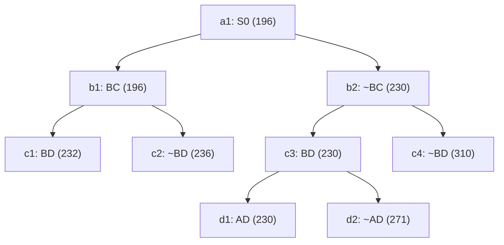

## The Question

TSP BnB snapshot when the optimal tour is discovered.

| # | Question | Official answer |
|---|----------|-----------------|
| 2.1 | 2nd–4th nodes refined | `b1,b2,c3` |
| 2.2 | Optimal tour node + cost | `d1,230` |
| 2.3 | Number of cities | `5` |
| 2.4 | Tour from A | `A,C,E,B,D` |

## The Topic in 60 Seconds

Refine = pop the cheapest open node, insert its two children. Childless snapshot nodes are tours. Stop when a tour pops with no cheaper open node.

> Deep-dive: [Reading BnB Trees](/concepts/week-05-optimal-tsp/01-bnb-tree-reading), [Branch and Bound](/concepts/week-03-heuristic-search/05-branch-and-bound).

## 2.1 — Refine order → `b1,b2,c3`

Simulate the priority queue:

| Pop | Queue (min first) | Action |
|-----|-------------------|--------|
| 1 | a1 : 196 | refine a1 → insert b1(196), b2(230) |
| 2 | b1 : 196, b2 : 230 | refine **b1** → insert c1(232), c2(236) |
| 3 | b2 : 230, c1 : 232, c2 : 236 | refine **b2** → insert c3(230), c4(310) |
| 4 | c3 : 230, c1 : 232, c2 : 236, c4 : 310 | refine **c3** → insert d1(230), d2(271) |
| 5 | d1 : 230, c1 : 232, … | **d1 is a leaf → tour discovered, stop** |

The 2nd–4th refinements are **b1, b2, c3** ✓ — note the rare pattern where b2 (~BC side, bound 230) legitimately outranks b1's children (232, 236), so the exclude-branch is refined *before* BD's descendants.

## 2.2 — Optimal tour → `d1`, cost `230`

Queue after pop 4: `{d1 : 230, c1 : 232, c2 : 236, c4 : 310, d2 : 271}`. The minimum, **d1**, is childless in the snapshot — a complete tour — and everything else is ≥ 232 → **d1 = optimal tour at cost 230** ✓

<Callout type="tip" title="Leaf vs internal">
c3's bound ties d1's at 230, but c3 has children — it was refined, so it represents a set of candidate tours, not a tour itself. Only childless nodes can be tours.
</Callout>

## 2.3 — Cities → `5`

Reconstruct the cycle d1's decisions force. Path root→d1: **~BC excluded** (b2), **BD included** (c3), **AD included** (d1):

| City | Degree so far | Forced partner(s) |
|------|---------------|-------------------|
| D | B, A — full | done |
| B | D — needs 1 more | BC excluded → **E** |
| A | D — needs 1 more | **C** (E already taken by B) |
| C | — needs 2 | **A** and **E** |

Cycle: **A–C–E–B–D–A** → 5 distinct cities ✓

## 2.4 — Tour from A → `A,C,E,B,D`

The forced cycle above rotated to start at A: **A, C, E, B, D** (reverse A,D,B,E,C equivalent) ✓

Step through the queue — amber marks each refinement in order, green is the winning tour:

<PaperTrace
  height={400}
  nodeWidth={110}
  nodeHeight={56}
  nodeFontSize={12}
  legend={[
    { color: "#b45309", label: "refining now" },
    { color: "#4b5563", label: "already refined" },
    { color: "#0369a1", label: "waiting in OPEN" },
    { color: "#16a34a", label: "optimal tour (230)" },
  ]}
  nodes={[
    { id: "a1", label: "a1: S0 196", x: 300, y: 20 },
    { id: "b1", label: "b1: BC 196", x: 150, y: 120 },
    { id: "b2", label: "b2: ~BC 230", x: 470, y: 120 },
    { id: "c1", label: "c1: BD 232", x: 60, y: 220 },
    { id: "c2", label: "c2: ~BD 236", x: 260, y: 220 },
    { id: "c3", label: "c3: BD 230", x: 440, y: 220 },
    { id: "c4", label: "c4: ~BD 310", x: 640, y: 220 },
    { id: "d1", label: "d1: AD 230", x: 380, y: 320 },
    { id: "d2", label: "d2: ~AD 271", x: 520, y: 320 },
  ]}
  edges={[
    { id: "x1", from: "a1", to: "b1" },
    { id: "x2", from: "a1", to: "b2" },
    { id: "x3", from: "b1", to: "c1" },
    { id: "x4", from: "b1", to: "c2" },
    { id: "x5", from: "b2", to: "c3" },
    { id: "x6", from: "b2", to: "c4" },
    { id: "x7", from: "c3", to: "d1" },
    { id: "x8", from: "c3", to: "d2" },
  ]}
  steps={[
    {
      label: "Refine a1 : 196",
      note: "OPEN = [ a1:196 ]\na1 has children → refined.\nInsert b1:196 (BC), b2:230 (~BC).\nOPEN = [ b1:196, b2:230 ]",
      nodes: { a1: "current" },
    },
    {
      label: "Refine b1 : 196",
      note: "Min = b1 (196). Refined.\nInsert c1:232 (BD), c2:236 (~BD).\nOPEN = [ b2:230, c1:232, c2:236 ]",
      nodes: { a1: "explored", b1: "current" },
    },
    {
      label: "Refine b2 : 230",
      note: "~BC (230) beats BD's children (232+)!\nb2 refined.\nInsert c3:230 (BD), c4:310 (~BD).\nOPEN = [ c3:230, c1:232, c2:236, c4:310 ]",
      nodes: { a1: "explored", b1: "explored", b2: "current" },
    },
    {
      label: "Refine c3 : 230",
      note: "c3 refined.\nInsert d1:230 (AD), d2:271 (~AD).\nOPEN = [ d1:230, c1:232, c2:236, c4:310, d2:271 ]",
      nodes: { a1: "explored", b1: "explored", b2: "explored", c3: "current" },
    },
    {
      label: "Pop d1 : 230 = TOUR",
      note: "d1 is childless = complete tour, and it is the minimum.\nEverything open ≥ 232 > 230 → optimal.\nTour: A-C-E-B-D-A, cost 230.",
      nodes: { a1: "explored", b1: "explored", b2: "explored", c3: "explored", d1: "path", c1: "frontier", c2: "frontier", c4: "frontier", d2: "frontier" },
    },
  ]}
/>

## Tricks & Tips

<Accordion title="Fast method for this tree">
1. Sorted queue by (bound, insertion): the exam's twist is that b2 (230) outranks both of b1's children (232, 236) — check the whole queue after every insertion instead of diving down one branch.
2. Optimal = cheapest childless node popped while all open bounds ≥ it. Here d1 (230) vs the rest ≥ 232.
3. Cities: write the include/exclude chain (~BC, BD∈, AD∈), fill degrees to exactly 2 everywhere, and the cycle falls out forced: A-C-E-B-D.
4. Don't count the tour pop as a refinement when asked how many nodes were refined — but do count it if asked which nodes were selected/processed in order.
</Accordion>

**Answers:** 2.1 `b1,b2,c3` · 2.2 `d1,230` · 2.3 `5` · 2.4 `A,C,E,B,D`
