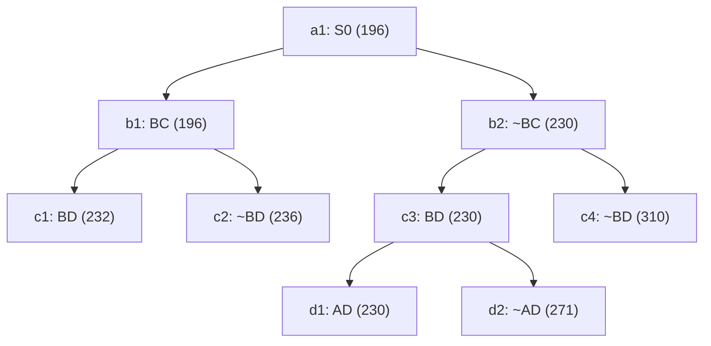

## The Question

TSP BnB snapshot when the optimal tour is discovered.

| # | Question | Official answer |
|---|----------|-----------------|
| 2.1 | 2nd–4th nodes refined | `b1,b2,c3` |
| 2.2 | Optimal tour node + cost | `d1,230` |
| 2.3 | Number of cities | `5` |
| 2.4 | Tour from A | `A,C,E,B,D` |

## The Topic in 60 Seconds

Refine = pop the cheapest open node, insert its two children. Childless snapshot nodes are tours. Stop when a tour pops with no cheaper open node.

> Deep-dive: [Reading BnB Trees](/concepts/week-05-optimal-tsp/01-bnb-tree-reading), [Branch and Bound](/concepts/week-03-heuristic-search/05-branch-and-bound).

## 2.1 — Refine order → `b1,b2,c3`

| Pop | Queue (min first) | Action |
|-----|-------------------|--------|
| 1 | a1 : 196 | refine → b1(196), b2(230) |
| 2 | b1 : 196, b2 : 230 | refine **b1** → c1(232), c2(236) |
| 3 | b2 : 230, c1 : 232, c2 : 236 | refine **b2** → c3(230), c4(310) |
| 4 | c3 : 230, c1 : 232, c2 : 236, c4 : 310 | refine **c3** → d1(230), d2(271) |

Note the rare pattern: b2 (230) outranks b1's children (232, 236) — the ~BC side is refined **before** BD's.

## 2.2 — Optimal tour → `d1`, cost `230`

Queue after pop 4: `{d1 : 230, c1 : 232, c2 : 236, c4 : 310, d2 : 271}`. Minimum **d1 : 230** is a **leaf** — a tour — and everything else ≥ 232 → **d1 = optimal, 230** ✓

## 2.3 — Cities → `5`

Path root→d1: **~BC, BD, AD**. Degrees: D–2 full (B, A), B–1, A–1, C–0, E–0. BC excluded → B pairs with E; C then pairs with A and E. Tour: **A–C–E–B–D–A** → 5 cities ✓

## 2.4 — Tour from A → `A,C,E,B,D`

The forced cycle above ✓ (reverse A,D,B,E,C equivalent).

<Graph
  height={380}
  nodeWidth={110}
  nodeHeight={56}
  nodeFontSize={12}
  layout={{ name: "preset" }}
  elements={[
    { data: { id: "a1", label: "a1: S0 196", type: "current" }, position: { x: 300, y: 20 } },
    { data: { id: "b1", label: "b1: BC 196", type: "current" }, position: { x: 150, y: 120 } },
    { data: { id: "b2", label: "b2: ~BC 230", type: "current" }, position: { x: 470, y: 120 } },
    { data: { id: "c1", label: "c1: BD 232" }, position: { x: 60, y: 220 } },
    { data: { id: "c2", label: "c2: ~BD 236" }, position: { x: 260, y: 220 } },
    { data: { id: "c3", label: "c3: BD 230", type: "current" }, position: { x: 440, y: 220 } },
    { data: { id: "c4", label: "c4: ~BD 310" }, position: { x: 640, y: 220 } },
    { data: { id: "d1", label: "d1: AD 230 ✓", type: "path" }, position: { x: 380, y: 320 } },
    { data: { id: "d2", label: "d2: ~AD 271" }, position: { x: 520, y: 320 } },
    { data: { id: "x1", source: "a1", target: "b1" } },
    { data: { id: "x2", source: "a1", target: "b2" } },
    { data: { id: "x3", source: "b1", target: "c1" } },
    { data: { id: "x4", source: "b1", target: "c2" } },
    { data: { id: "x5", source: "b2", target: "c3" } },
    { data: { id: "x6", source: "b2", target: "c4" } },
    { data: { id: "x7", source: "c3", target: "d1" } },
    { data: { id: "x8", source: "c3", target: "d2" } },
  ]}
/>

*Amber = refined in order b1 → b2 → c3. Green = d1, the 230 tour.*

## Tricks & Tips

<Accordion title="Fast method">
1. Sorted queue with (cost, ref#) — here the ~BC branch (230) legitimately outranks BD's children (232+).
2. Optimal = cheapest leaf popped while all open bounds ≥ it.
3. Cities: the excluded BC forces B-E and the A-C-E spine around the fixed B-D, A-D edges.
</Accordion>

**Answers:** 2.1 `b1,b2,c3` · 2.2 `d1,230` · 2.3 `5` · 2.4 `A,C,E,B,D`
