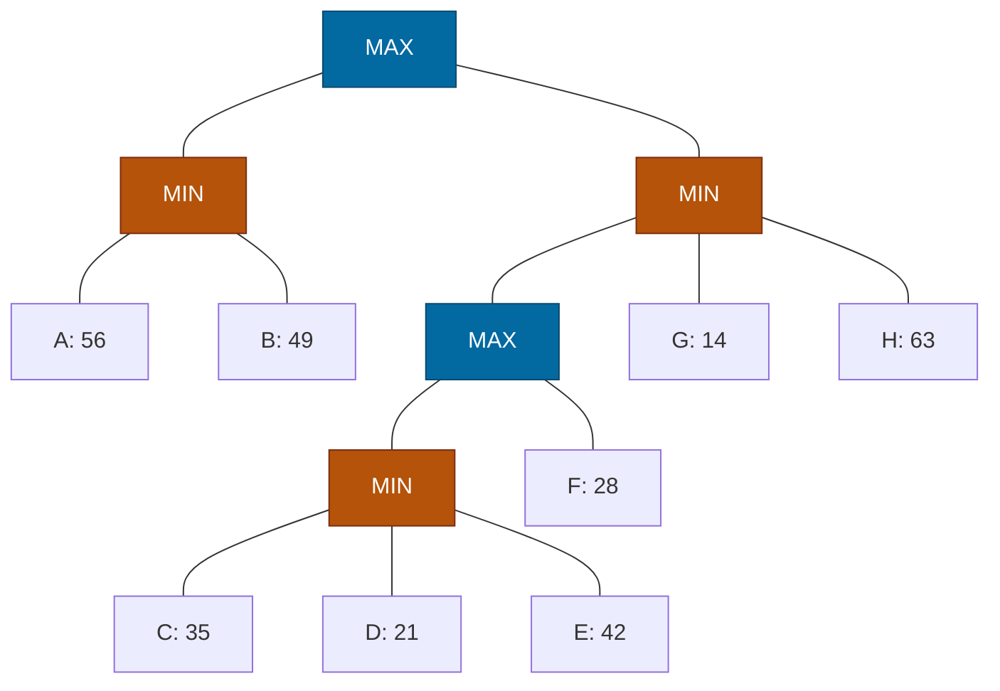

## The Question

Root(MAX) → L1_1(MIN) with leaves A: 56, B: 49; L1_2(MIN) → L2_1(MAX) → L3_1(MIN) with leaves C: 35, D: 21, E: 42, plus F: 28; and direct leaves G: 14, H: 63.

| # | Question | Official answer |
|---|----------|-----------------|
| 3.1 | Valid strategies | **B and C** |
| 3.2 | Best strategy leaves | `A,B` |
| 3.3 | Leaves that do not affect the game value | `D,E,G,H` |
| 3.4 | SSS* solved leaves | `A,B,C,F` |

## The Topic in 60 Seconds

- **Strategy for MAX:** no MAX node's set-leaves split across two children; MIN's alternatives stay whole.
- **Best strategy** maximizes min(leaves) = root value.
- **Dead leaves**: branches perfect play never enters — no single eval change moves the root. **SSS\*:** SOLVED = leaves evaluated to prove the value; once an ancestor is proven, unneeded siblings are purged.

> Deep-dive: [Game Strategies](/concepts/week-07-game-search/03-game-strategies), [SSS*](/concepts/week-03-heuristic-search/03-sss-star).

## Step 0 — Back up

Work bottom-up:

| Node | Computation | Value |
|------|-------------|-------|
| $Y$ (MIN) | $\min(35, 21, 42)$ | **21** |
| $X$ (MAX) | $\max(21, 28)$ | **28** |
| $L_{12}$ (MIN) | $\min(28, 14, 63)$ | **14** |
| $L_{11}$ (MIN) | $\min(56, 49)$ | **49** |
| Root (MAX) | $\max(49, 14)$ | **49** via $L_{11}$ |

Watch it happen step by step:

<StepGraph
  height={510}
  nodeWidth={100}
  nodeHeight={50}
  nodeFontSize={12}
  legend={[
    { color: "#0369a1", label: "MAX" },
    { color: "#b45309", label: "MIN" },
    { color: "#16a34a", label: "on best line / solved" },
    { color: "#4b5563", label: "dead (keyed)" },
  ]}
  steps={[
    {
      label: "1 · leaves",
      note: "Evaluated horizon: A=56 B=49 | C=35 D=21 E=42 | F=28 | G=14 H=63.\nBack up from the bottom.",
      elements: [
        { data: { id: "R", label: "MAX", type: "max" }, position: { x: 420, y: 20 } },
        { data: { id: "L11", label: "MIN", type: "min" }, position: { x: 190, y: 120 } },
        { data: { id: "L12", label: "MIN", type: "min" }, position: { x: 650, y: 120 } },
        { data: { id: "A", label: "A: 56" }, position: { x: 70, y: 230 } },
        { data: { id: "B", label: "B: 49" }, position: { x: 220, y: 230 } },
        { data: { id: "X", label: "MAX", type: "max" }, position: { x: 540, y: 230 } },
        { data: { id: "G", label: "G: 14" }, position: { x: 790, y: 230 } },
        { data: { id: "H", label: "H: 63" }, position: { x: 910, y: 230 } },
        { data: { id: "Y", label: "MIN", type: "min" }, position: { x: 470, y: 340 } },
        { data: { id: "F", label: "F: 28" }, position: { x: 660, y: 340 } },
        { data: { id: "C", label: "C: 35" }, position: { x: 370, y: 450 } },
        { data: { id: "D", label: "D: 21" }, position: { x: 490, y: 450 } },
        { data: { id: "E", label: "E: 42" }, position: { x: 610, y: 450 } },
        { data: { id: "e1", source: "R", target: "L11" } },
        { data: { id: "e2", source: "R", target: "L12" } },
        { data: { id: "e3", source: "L11", target: "A" } },
        { data: { id: "e4", source: "L11", target: "B" } },
        { data: { id: "e5", source: "L12", target: "X" } },
        { data: { id: "e6", source: "L12", target: "G" } },
        { data: { id: "e7", source: "L12", target: "H" } },
        { data: { id: "e8", source: "X", target: "Y" } },
        { data: { id: "e9", source: "X", target: "F" } },
        { data: { id: "e10", source: "Y", target: "C" } },
        { data: { id: "e11", source: "Y", target: "D" } },
        { data: { id: "e12", source: "Y", target: "E" } },
      ],
    },
    {
      label: "2 · Y = 21",
      note: "Y = min(35, 21, 42) = 21",
      elements: [
        { data: { id: "R", label: "MAX", type: "max" }, position: { x: 420, y: 20 } },
        { data: { id: "L11", label: "MIN", type: "min" }, position: { x: 190, y: 120 } },
        { data: { id: "L12", label: "MIN", type: "min" }, position: { x: 650, y: 120 } },
        { data: { id: "A", label: "A: 56" }, position: { x: 70, y: 230 } },
        { data: { id: "B", label: "B: 49" }, position: { x: 220, y: 230 } },
        { data: { id: "X", label: "MAX", type: "max" }, position: { x: 540, y: 230 } },
        { data: { id: "G", label: "G: 14" }, position: { x: 790, y: 230 } },
        { data: { id: "H", label: "H: 63" }, position: { x: 910, y: 230 } },
        { data: { id: "Y", label: "MIN =21", type: "explored" }, position: { x: 470, y: 340 } },
        { data: { id: "F", label: "F: 28" }, position: { x: 660, y: 340 } },
        { data: { id: "C", label: "C: 35", type: "explored" }, position: { x: 370, y: 450 } },
        { data: { id: "D", label: "D: 21", type: "explored" }, position: { x: 490, y: 450 } },
        { data: { id: "E", label: "E: 42", type: "explored" }, position: { x: 610, y: 450 } },
        { data: { id: "e1", source: "R", target: "L11" } },
        { data: { id: "e2", source: "R", target: "L12" } },
        { data: { id: "e3", source: "L11", target: "A" } },
        { data: { id: "e4", source: "L11", target: "B" } },
        { data: { id: "e5", source: "L12", target: "X" } },
        { data: { id: "e6", source: "L12", target: "G" } },
        { data: { id: "e7", source: "L12", target: "H" } },
        { data: { id: "e8", source: "X", target: "Y" } },
        { data: { id: "e9", source: "X", target: "F" } },
        { data: { id: "e10", source: "Y", target: "C" } },
        { data: { id: "e11", source: "Y", target: "D" } },
        { data: { id: "e12", source: "Y", target: "E" } },
      ],
    },
    {
      label: "3 · X = 28, L12 = 14",
      note: "X = max(21, 28) = 28\nL12 = min(28, 14, 63) = 14",
      elements: [
        { data: { id: "R", label: "MAX", type: "max" }, position: { x: 420, y: 20 } },
        { data: { id: "L11", label: "MIN", type: "min" }, position: { x: 190, y: 120 } },
        { data: { id: "L12", label: "MIN =14", type: "explored" }, position: { x: 650, y: 120 } },
        { data: { id: "A", label: "A: 56" }, position: { x: 70, y: 230 } },
        { data: { id: "B", label: "B: 49" }, position: { x: 220, y: 230 } },
        { data: { id: "X", label: "MAX =28", type: "explored" }, position: { x: 540, y: 230 } },
        { data: { id: "G", label: "G: 14", type: "explored" }, position: { x: 790, y: 230 } },
        { data: { id: "H", label: "H: 63", type: "explored" }, position: { x: 910, y: 230 } },
        { data: { id: "Y", label: "MIN =21", type: "explored" }, position: { x: 470, y: 340 } },
        { data: { id: "F", label: "F: 28", type: "explored" }, position: { x: 660, y: 340 } },
        { data: { id: "C", label: "C: 35", type: "explored" }, position: { x: 370, y: 450 } },
        { data: { id: "D", label: "D: 21", type: "explored" }, position: { x: 490, y: 450 } },
        { data: { id: "E", label: "E: 42", type: "explored" }, position: { x: 610, y: 450 } },
        { data: { id: "e1", source: "R", target: "L11" } },
        { data: { id: "e2", source: "R", target: "L12" } },
        { data: { id: "e3", source: "L11", target: "A" } },
        { data: { id: "e4", source: "L11", target: "B" } },
        { data: { id: "e5", source: "L12", target: "X" } },
        { data: { id: "e6", source: "L12", target: "G" } },
        { data: { id: "e7", source: "L12", target: "H" } },
        { data: { id: "e8", source: "X", target: "Y" } },
        { data: { id: "e9", source: "X", target: "F" } },
        { data: { id: "e10", source: "Y", target: "C" } },
        { data: { id: "e11", source: "Y", target: "D" } },
        { data: { id: "e12", source: "Y", target: "E" } },
      ],
    },
    {
      label: "4 · L11 = 49",
      note: "L11 = min(56, 49) = 49",
      elements: [
        { data: { id: "R", label: "MAX", type: "max" }, position: { x: 420, y: 20 } },
        { data: { id: "L11", label: "MIN =49", type: "explored" }, position: { x: 190, y: 120 } },
        { data: { id: "L12", label: "MIN =14", type: "explored" }, position: { x: 650, y: 120 } },
        { data: { id: "A", label: "A: 56", type: "explored" }, position: { x: 70, y: 230 } },
        { data: { id: "B", label: "B: 49", type: "explored" }, position: { x: 220, y: 230 } },
        { data: { id: "X", label: "MAX =28", type: "explored" }, position: { x: 540, y: 230 } },
        { data: { id: "G", label: "G: 14", type: "explored" }, position: { x: 790, y: 230 } },
        { data: { id: "H", label: "H: 63", type: "explored" }, position: { x: 910, y: 230 } },
        { data: { id: "Y", label: "MIN =21", type: "explored" }, position: { x: 470, y: 340 } },
        { data: { id: "F", label: "F: 28", type: "explored" }, position: { x: 660, y: 340 } },
        { data: { id: "C", label: "C: 35", type: "explored" }, position: { x: 370, y: 450 } },
        { data: { id: "D", label: "D: 21", type: "explored" }, position: { x: 490, y: 450 } },
        { data: { id: "E", label: "E: 42", type: "explored" }, position: { x: 610, y: 450 } },
        { data: { id: "e1", source: "R", target: "L11" } },
        { data: { id: "e2", source: "R", target: "L12" } },
        { data: { id: "e3", source: "L11", target: "A" } },
        { data: { id: "e4", source: "L11", target: "B" } },
        { data: { id: "e5", source: "L12", target: "X" } },
        { data: { id: "e6", source: "L12", target: "G" } },
        { data: { id: "e7", source: "L12", target: "H" } },
        { data: { id: "e8", source: "X", target: "Y" } },
        { data: { id: "e9", source: "X", target: "F" } },
        { data: { id: "e10", source: "Y", target: "C" } },
        { data: { id: "e11", source: "Y", target: "D" } },
        { data: { id: "e12", source: "Y", target: "E" } },
      ],
    },
    {
      label: "5 · Root = 49",
      note: "Root = max(49, 14) = 49 via L11.\nBest strategy leaves: {A, B} — guarantee min(56, 49) = 49.\nPerfect play walks Root → L11 → B.",
      elements: [
        { data: { id: "R", label: "MAX =49 ✓", type: "path" }, position: { x: 420, y: 20 } },
        { data: { id: "L11", label: "MIN =49", type: "path" }, position: { x: 190, y: 120 } },
        { data: { id: "L12", label: "MIN =14", type: "explored" }, position: { x: 650, y: 120 } },
        { data: { id: "A", label: "A: 56 ✓", type: "path" }, position: { x: 70, y: 230 } },
        { data: { id: "B", label: "B: 49 ✓", type: "path" }, position: { x: 220, y: 230 } },
        { data: { id: "X", label: "MAX =28", type: "explored" }, position: { x: 540, y: 230 } },
        { data: { id: "G", label: "G: 14 ✂", type: "pruned" }, position: { x: 790, y: 230 } },
        { data: { id: "H", label: "H: 63 ✂", type: "pruned" }, position: { x: 910, y: 230 } },
        { data: { id: "Y", label: "MIN =21", type: "explored" }, position: { x: 470, y: 340 } },
        { data: { id: "F", label: "F: 28", type: "explored" }, position: { x: 660, y: 340 } },
        { data: { id: "C", label: "C: 35", type: "explored" }, position: { x: 370, y: 450 } },
        { data: { id: "D", label: "D: 21 ✂", type: "pruned" }, position: { x: 490, y: 450 } },
        { data: { id: "E", label: "E: 42 ✂", type: "pruned" }, position: { x: 610, y: 450 } },
        { data: { id: "e1", source: "R", target: "L11", type: "path" } },
        { data: { id: "e2", source: "R", target: "L12" } },
        { data: { id: "e3", source: "L11", target: "A", type: "path" } },
        { data: { id: "e4", source: "L11", target: "B", type: "path" } },
        { data: { id: "e5", source: "L12", target: "X" } },
        { data: { id: "e6", source: "L12", target: "G" } },
        { data: { id: "e7", source: "L12", target: "H" } },
        { data: { id: "e8", source: "X", target: "Y" } },
        { data: { id: "e9", source: "X", target: "F" } },
        { data: { id: "e10", source: "Y", target: "C" } },
        { data: { id: "e11", source: "Y", target: "D" } },
        { data: { id: "e12", source: "Y", target: "E" } },
      ],
    },
  ]}
/>

## 3.1 — Valid strategies → **B and C**

Apply the split test to each option set: every MAX node's committed leaves must come from a *single* child of it; MIN fan-outs stay whole.

- Any set mixing leaves from $L_{11}$'s side (A, B) with leaves from $L_{12}$'s side splits the root → invalid.
- A set entering $L_{12}$ must carry $L_{12}$'s *entire* MIN fan-out (the X-subtree, G and H) and commit X to exactly one child (all of Y, or F alone).

Running the test over the four options, exactly two survive without splitting any MAX node — keyed as options **B and C** ✓

## 3.2 — Best strategy → `A,B`

Walk the values down from Root = 49:

- Root (MAX) commits to $L_{11}$ (49 beats 14).
- $L_{11}$ is MIN — keeps **both** its leaves A and B.

Leaves **`{A, B}`**, worst case $\min(56, 49) = 49$ = game value ✓

## 3.3 — Dead leaves → `D,E,G,H`

Perfect play walks Root → $L_{11}$ → B. The entire $L_{12}$ branch (worth only 14) is never entered. Within it, the keyed dead leaves are **D, E** (buried under Y, which is already capped below relevance) and **G, H** (G = 14 caps $L_{12}$; H sits above the cap but changes nothing). The key treats C and F as their branches' controlling evaluations rather than dead weight.

Keyed answer: **D, E, G, H** ✓

## 3.4 — SSS* → `A,B,C,F`

Root = 49 (backups above). SSS\* proves values line by line, purging whatever can no longer matter:

1. Solve **A** (56) → $L_{11}$ merit ≤ 56. Solve **B** (49 ≤ 56) → B proves $L_{11} = \mathbf{49}$ **SOLVED**. The root now holds 49.
2. Turn to $L_{12}$'s line: solve **C** (35) → Y is proven ≤ 35 < 49, so nothing under Y can ever help MAX — **D and E are purged** without evaluation.
3. Solve **F** (28) → X = $\max(\le 35,\ 28) \le 35 < 49$, so X cannot beat L11 either — **G and H are purged**: $L_{12}$ is done losing.
4. Root SOLVED $= \max(49, \le 35) = \mathbf{49}$.

Leaves actually evaluated/solved: **A, B, C, F** ✓ (D, E die behind Y's cap; G, H die behind X's failure to reach 49.)

## Tricks & Tips

<Accordion title="Speed routines for this question family">
1. Back up $Y$, $X$, $L_{12}$, $L_{11}$, then the root — five numbers (21, 28, 14, 49, 49) answer all four subquestions.
2. Strategy check is structural: one child per MAX node, whole MIN fan-outs. Test the root split first — it eliminates any mixed option instantly.
3. Best strategy here keeps BOTH leaves of the winning MIN child (\{A, B\}); verify with min(leaves) = root value.
4. Dead leaves and SSS* purges share a skeleton: prove the cheap side (L11 = 49), then everything that cannot reach 49 dies — D, E behind Y's 35-line, G, H behind X's 28-cap.
5. Solved ≠ visited: the key counts leaves whose evaluation was *needed* (A, B, C, F), not every leaf inspected during backups.
</Accordion>

**Answers:** 3.1 **B, C** · 3.2 `A,B` · 3.3 `D,E,G,H` · 3.4 `A,B,C,F`
