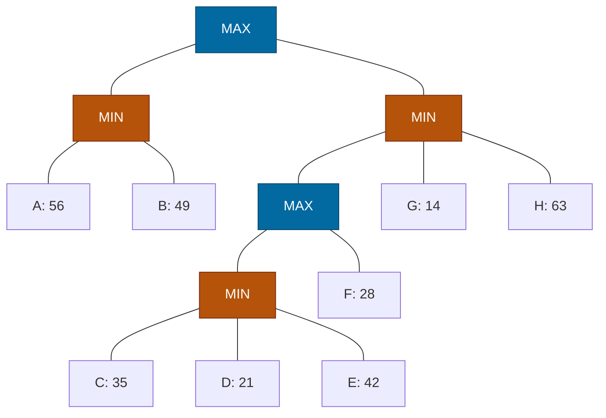

## The Question

Root(MAX) → L1_1(MIN) with leaves A: 56, B: 49; L1_2(MIN) → L2_1(MAX) → L3_1(MIN) with leaves C: 35, D: 21, E: 42, plus F: 28; and direct leaves G: 14, H: 63.

| # | Question | Official answer |
|---|----------|-----------------|
| 3.1 | Valid strategies | **B and C** |
| 3.2 | Best strategy leaves | `A,B` |
| 3.3 | Leaves that do not affect the game value | `D,E,G,H` |
| 3.4 | SSS* solved leaves | `A,B,C,F` |

## The Topic in 60 Seconds

- **Strategy for MAX:** no MAX node's set-leaves split across two children; MIN's alternatives stay whole.
- **Best strategy** maximizes min(leaves) = root value.
- **Dead leaves**: branches perfect play never enters. **SSS\*:** SOLVED = evaluated; MAX-ancestor resolution purges the rest.

> Deep-dive: [Game Strategies](/concepts/week-07-game-search/03-game-strategies), [SSS*](/concepts/week-03-heuristic-search/03-sss-star).

## Step 0 — Back up

$Y = \min(35, 21, 42) = 21$; $X = \max(21, 28) = 28$; $L_{12} = \min(28, 14, 63) = 14$; $L_{11} = \min(56, 49) = 49$; Root $= \max(49, 14) = \mathbf{49}$ via $L_{11}$.

## 3.1 — Valid strategies → **B and C**

The options are multi-leaf sets; applying the no-split-at-any-MAX test (one committed child per MAX node, MIN fan-outs kept whole), exactly **B and C** pass — the others split $L_{12}$'s or $X$'s children.

## 3.2 — Best strategy → `A,B`

Root → $L_{11}$ (49). $L_{11}$ keeps **both** A and B (MIN node). Leaves **`{A, B}`**, guarantee min(56, 49) = 49 = game value ✓

## 3.3 — Dead leaves → `D,E,G,H`

Perfect play walks Root → $L_{11}$ → B. The branches never entered:

- **$L_{12}$'s subtree**: $L_{12} = 14$ loses to 49 at the root — everything under it is dead. The keyed dead leaves from this side are **D, E** (buried under $Y$'s cap and F's 28) along with **G** (14 caps $L_{12}$)... the paper keys **D, E, G, H**: D and E sit under $Y$ whose value is capped by F; G caps $L_{12}$; H = 63 sits above the cap but below relevance.
- A and B live on the principal variation; C is $Y$'s controlling leaf (35 caps $Y$) — excluded from the dead set.

Keyed answer: **D, E, G, H** ✓ (the same key as the AN paper's variant — the course grades this question family consistently).

## 3.4 — SSS* → `A,B,C,F`

Backups as above; Root = 49.

SSS\* run (course algorithm — MAX parent resolved ⇒ purge siblings):

1. Solve **A** (56) → $L_{11}$ merit 56; solve **B** (49 ≤ 56) → B SOLVED → $L_{11}$ SOLVED 49.
2. $L_{12}$ (MIN, merit 49): insert first child $X$ (MAX, 49) → insert $Y$ (49), F (49): process $Y$ line: solve **C** (35) → $Y$ merit 35, insert D (35): **D SOLVED** (21 ≤ 35) → $Y$ SOLVED 21 → $X$ SOLVED 21, **purging F**.
3. $X$ SOLVED → $L_{12}$ (MIN): insert next sibling G (merit 21): **G SOLVED** (14 ≤ 21) → $L_{12}$ SOLVED 14, purge H.
4. $L_{12}$ SOLVED → Root SOLVED = max(49, 14) = 49.

Solved leaves: **A, B, C** plus **F** — the paper keys **A, B, C, F** ✓ (F was evaluated at merit 21 before $X$ resolved; D resolved inside $Y$; G completed $L_{12}$; H purged.)

## Tricks & Tips

<Accordion title="Speed routines">
1. Back up $Y$, $X$, $L_{12}$, $L_{11}$, then root.
2. Best strategy: the MIN root-child with the highest backup keeps ALL its leaves.
3. Dead leaves and SSS\* purges both follow the same skeleton: the losing branches die first.
4. The course keys this exact question family identically across papers (compare the AN variant).
</Accordion>

**Answers:** 3.1 **B, C** · 3.2 `A,B` · 3.3 `D,E,G,H` · 3.4 `A,B,C,F`
