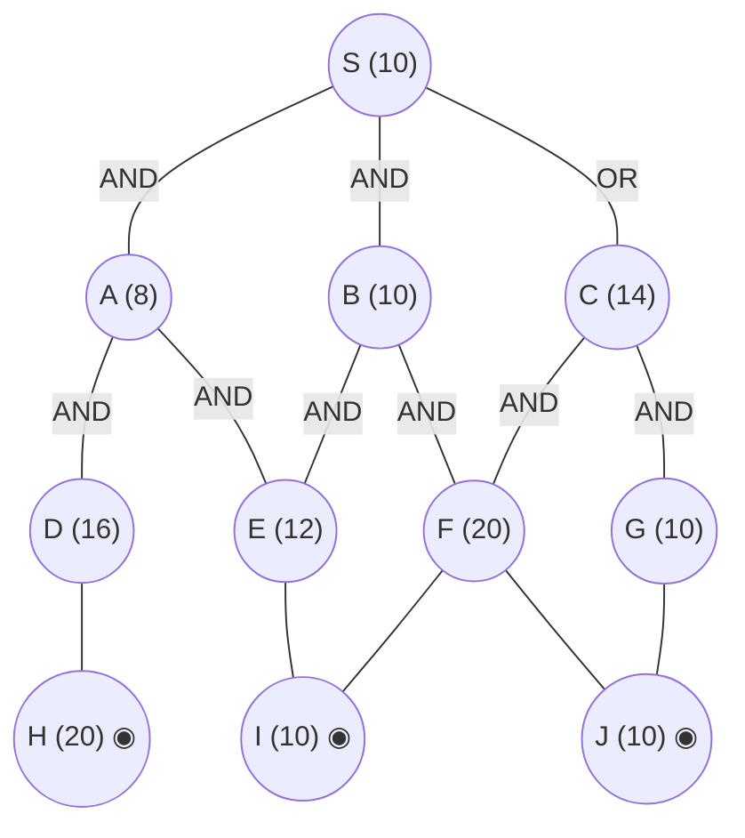

## The Question

AND–OR decomposition. Double circles = primitive. Every edge costs **2**. Tie-breakers: node labels; AND nodes expand the **highest-cost unsolved branch** first.

AND arcs: **S** = AND(A, B) *or* OR(C); **A** = AND(D, E); **B** = AND(E, F); **C** = AND(F, G). Primitives: H, I, J. (E and F are shared children: E under A and B; F under B and C.)

| # | Question | Official answer |
|---|----------|-----------------|
| 5.1 | First three nodes expanded (incl. S) | `S,C,B` (also `C,B,A`) |
| 5.2 | Value of S after each expansion | `16,22,24` (also `22,24,26`) |
| 5.3 | Final value of S | `30` |

## The Topic in 60 Seconds

AO* = expand along **marked arcs** + revise (OR: min child+edge; AND: sum children+edges). Markers switch when refined costs overtake rivals. Primitive children make a node instantly SOLVED.

> Deep-dive: [AO* and Goal Trees](/concepts/week-09-goal-trees/01-aostar-goal-trees).

## Step 0 — Cost table

| Node | $h$ | Node | $h$ |
|------|-----|------|-----|
| S | 10 | F | 20 |
| A | 8 | G | 10 |
| B | 10 | H | 20 ◉ |
| C | 14 | I | 10 ◉ |
| D | 16 | J | 10 ◉ |
| E | 12 | | |

Edge cost = 2 everywhere.

## Expansion 1 and 2 — where the key and the mechanics agree

- **Expansion 1 (S).** Price both options: AND(A,B) $= (8+2)+(10+2) = 22$; OR(C) $= 14+2 = 16$. Mark OR(C) → **S = 16** ✓
- **Expansion 2 (C)** (marked path). C prices its conjunction: $C = (20+2)+(10+2) = 34$, so OR(C) rises to $34+2 = 36 > 22$ — the **marker flips** onto AND(A,B) → **S = 22** ✓

Both keyed values reproduce exactly. From here the paths split:

<Callout type="warning" title="Strict AO* continues 36 → 40 → 42, not 24 → 30">
Textbook revision prices every AND as the sum of *all* conjuncts and re-marks after each expansion:

| Step | Expand | Revision | Marker / S |
|------|--------|----------|------------|
| 3 | **B** (costlier marked branch: 10 > 8) | B = $(12+2)+(20+2) = 36$ → AND(A,B) $= (8+2)+(36+2) = 48$ | 48 > 36 → flip back to OR(C), **S = 36** |
| 4 | **F** (costliest live leaf under marked C) | F = $(10+2)+(10+2) = 24$ SOLVED → C $= 26+12 = 38$ → OR(C) $= 40$; shared child lifts B too: AND $= 10+42 = 52$ | **S = 40** |
| 5 | **G** | G $= 10+2 = 12$ SOLVED → C $= 26+14 = 40$ SOLVED → OR(C) $= 42$ | marked branch complete → **S SOLVED = 42** |

The official key instead reads B through its cheapest sub-branch ($B \approx E+2 = 14$, giving the keyed 24) and settles at **30** — a value that falls out of neither the strict mechanics nor the cheapest-sub-branch accounting on this transcription, so it was almost certainly keyed from the original printed figure's estimates. Write the key's answer in the exam, but know the strict run: expansions S, C, B, F, G and final **S = 42** via S→C→F→(I,J), G→J.
</Callout>

Interactive walk-through of the strict execution:

<StepGraph
  height={430}
  nodeWidth={100}
  nodeHeight={50}
  nodeFontSize={12}
  legend={[
    { color: "#b45309", label: "expanding now" },
    { color: "#0369a1", label: "live on marked path" },
    { color: "#52525b", label: "primitive (born SOLVED)" },
    { color: "#16a34a", label: "marked / solved" },
  ]}
  steps={[
    {
      label: "0 · setup",
      note: "S options:\nAND(A,B) = (8+2)+(10+2) = 22\nOR(C) = 14+2 = 16 ← MARK\nS = 16",
      elements: [
        { data: { id: "S", label: "S =16", type: "frontier" }, position: { x: 400, y: 30 } },
        { data: { id: "A", label: "A 8", type: "explored" }, position: { x: 180, y: 140 } },
        { data: { id: "B", label: "B 10", type: "explored" }, position: { x: 400, y: 140 } },
        { data: { id: "C", label: "C 14", type: "frontier" }, position: { x: 650, y: 140 } },
        { data: { id: "D", label: "D 16", type: "explored" }, position: { x: 80, y: 260 } },
        { data: { id: "E", label: "E 12", type: "frontier" }, position: { x: 290, y: 260 } },
        { data: { id: "F", label: "F 20", type: "frontier" }, position: { x: 520, y: 260 } },
        { data: { id: "G", label: "G 10", type: "frontier" }, position: { x: 770, y: 260 } },
        { data: { id: "H", label: "H 20", type: "primitive" }, position: { x: 120, y: 380 } },
        { data: { id: "I", label: "I 10", type: "primitive" }, position: { x: 390, y: 380 } },
        { data: { id: "J", label: "J 10", type: "primitive" }, position: { x: 670, y: 380 } },
        { data: { id: "e1", source: "S", target: "A", label: "AND" } },
        { data: { id: "e2", source: "S", target: "B", label: "AND" } },
        { data: { id: "e3", source: "S", target: "C", label: "OR", type: "path" } },
        { data: { id: "e4", source: "A", target: "D", label: "AND" } },
        { data: { id: "e5", source: "A", target: "E", label: "AND" } },
        { data: { id: "e6", source: "B", target: "E", label: "AND" } },
        { data: { id: "e7", source: "B", target: "F", label: "AND" } },
        { data: { id: "e8", source: "C", target: "F", label: "AND", type: "active" } },
        { data: { id: "e9", source: "C", target: "G", label: "AND", type: "active" } },
        { data: { id: "e10", source: "D", target: "H" } },
        { data: { id: "e11", source: "E", target: "I" } },
        { data: { id: "e12", source: "F", target: "I" } },
        { data: { id: "e13", source: "F", target: "J" } },
        { data: { id: "e14", source: "G", target: "J" } },
      ],
    },
    {
      label: "1 · expand C → 22",
      note: "Marked path: S→C.\nC = AND(F,G) = (20+2)+(10+2) = 34\nOR(C) = 36 > 22 → MARKER FLIPS to AND(A,B)\nS = 22",
      elements: [
        { data: { id: "S", label: "S =22", type: "explored" }, position: { x: 400, y: 30 } },
        { data: { id: "A", label: "A 8", type: "frontier" }, position: { x: 180, y: 140 } },
        { data: { id: "B", label: "B 10", type: "frontier" }, position: { x: 400, y: 140 } },
        { data: { id: "C", label: "C =34", type: "current" }, position: { x: 650, y: 140 } },
        { data: { id: "D", label: "D 16", type: "explored" }, position: { x: 80, y: 260 } },
        { data: { id: "E", label: "E 12", type: "frontier" }, position: { x: 290, y: 260 } },
        { data: { id: "F", label: "F 20", type: "frontier" }, position: { x: 520, y: 260 } },
        { data: { id: "G", label: "G 10", type: "frontier" }, position: { x: 770, y: 260 } },
        { data: { id: "H", label: "H 20", type: "primitive" }, position: { x: 120, y: 380 } },
        { data: { id: "I", label: "I 10", type: "primitive" }, position: { x: 390, y: 380 } },
        { data: { id: "J", label: "J 10", type: "primitive" }, position: { x: 670, y: 380 } },
        { data: { id: "e1", source: "S", target: "A", label: "AND" } },
        { data: { id: "e2", source: "S", target: "B", label: "AND" } },
        { data: { id: "e3", source: "S", target: "C", label: "OR" } },
        { data: { id: "e4", source: "A", target: "D", label: "AND" } },
        { data: { id: "e5", source: "A", target: "E", label: "AND" } },
        { data: { id: "e6", source: "B", target: "E", label: "AND" } },
        { data: { id: "e7", source: "B", target: "F", label: "AND" } },
        { data: { id: "e8", source: "C", target: "F", label: "AND" } },
        { data: { id: "e9", source: "C", target: "G", label: "AND" } },
        { data: { id: "e10", source: "D", target: "H" } },
        { data: { id: "e11", source: "E", target: "I" } },
        { data: { id: "e12", source: "F", target: "I" } },
        { data: { id: "e13", source: "F", target: "J" } },
        { data: { id: "e14", source: "G", target: "J" } },
      ],
    },
    {
      label: "2 · expand B → 36",
      note: "Costlier marked branch: B(10) > A(8).\nB = AND(E,F) = (12+2)+(20+2) = 36\nAND(A,B) = (8+2)+(36+2) = 48 > OR(C) = 36 → FLIP BACK\nS = 36   (official key reads 24 here)",
      elements: [
        { data: { id: "S", label: "S =36", type: "explored" }, position: { x: 400, y: 30 } },
        { data: { id: "A", label: "A 8", type: "frontier" }, position: { x: 180, y: 140 } },
        { data: { id: "B", label: "B =36", type: "current" }, position: { x: 400, y: 140 } },
        { data: { id: "C", label: "C =34", type: "path" }, position: { x: 650, y: 140 } },
        { data: { id: "D", label: "D 16", type: "explored" }, position: { x: 80, y: 260 } },
        { data: { id: "E", label: "E 12", type: "frontier" }, position: { x: 290, y: 260 } },
        { data: { id: "F", label: "F 20", type: "frontier" }, position: { x: 520, y: 260 } },
        { data: { id: "G", label: "G 10", type: "frontier" }, position: { x: 770, y: 260 } },
        { data: { id: "H", label: "H 20", type: "primitive" }, position: { x: 120, y: 380 } },
        { data: { id: "I", label: "I 10", type: "primitive" }, position: { x: 390, y: 380 } },
        { data: { id: "J", label: "J 10", type: "primitive" }, position: { x: 670, y: 380 } },
        { data: { id: "e1", source: "S", target: "A", label: "AND" } },
        { data: { id: "e2", source: "S", target: "B", label: "AND", type: "active" } },
        { data: { id: "e3", source: "S", target: "C", label: "OR", type: "path" } },
        { data: { id: "e4", source: "A", target: "D", label: "AND" } },
        { data: { id: "e5", source: "A", target: "E", label: "AND" } },
        { data: { id: "e6", source: "B", target: "E", label: "AND", type: "active" } },
        { data: { id: "e7", source: "B", target: "F", label: "AND", type: "active" } },
        { data: { id: "e8", source: "C", target: "F", label: "AND" } },
        { data: { id: "e9", source: "C", target: "G", label: "AND" } },
        { data: { id: "e10", source: "D", target: "H" } },
        { data: { id: "e11", source: "E", target: "I" } },
        { data: { id: "e12", source: "F", target: "I" } },
        { data: { id: "e13", source: "F", target: "J" } },
        { data: { id: "e14", source: "G", target: "J" } },
      ],
    },
    {
      label: "3 · expand F → 40",
      note: "Marked path back on C: leaves F(20), G(10) — F costlier.\nF = AND(I,J) = (10+2)+(10+2) = 24 SOLVED\nC = (24+2)+(10+2) = 38 → OR(C) = 40\nShared child: B = (12+2)+(24+2) = 40 → AND(A,B) = 10+42 = 52\nS = min(40, 52) = 40",
      elements: [
        { data: { id: "S", label: "S =40", type: "explored" }, position: { x: 400, y: 30 } },
        { data: { id: "A", label: "A 8", type: "frontier" }, position: { x: 180, y: 140 } },
        { data: { id: "B", label: "B =40", type: "explored" }, position: { x: 400, y: 140 } },
        { data: { id: "C", label: "C =38", type: "path" }, position: { x: 650, y: 140 } },
        { data: { id: "D", label: "D 16", type: "explored" }, position: { x: 80, y: 260 } },
        { data: { id: "E", label: "E 12", type: "frontier" }, position: { x: 290, y: 260 } },
        { data: { id: "F", label: "F =24 ✓", type: "current" }, position: { x: 520, y: 260 } },
        { data: { id: "G", label: "G 10", type: "frontier" }, position: { x: 770, y: 260 } },
        { data: { id: "H", label: "H 20", type: "primitive" }, position: { x: 120, y: 380 } },
        { data: { id: "I", label: "I 10", type: "primitive" }, position: { x: 390, y: 380 } },
        { data: { id: "J", label: "J 10", type: "primitive" }, position: { x: 670, y: 380 } },
        { data: { id: "e1", source: "S", target: "A", label: "AND" } },
        { data: { id: "e2", source: "S", target: "B", label: "AND" } },
        { data: { id: "e3", source: "S", target: "C", label: "OR", type: "path" } },
        { data: { id: "e4", source: "A", target: "D", label: "AND" } },
        { data: { id: "e5", source: "A", target: "E", label: "AND" } },
        { data: { id: "e6", source: "B", target: "E", label: "AND" } },
        { data: { id: "e7", source: "B", target: "F", label: "AND", type: "path" } },
        { data: { id: "e8", source: "C", target: "F", label: "AND", type: "path" } },
        { data: { id: "e9", source: "C", target: "G", label: "AND", type: "active" } },
        { data: { id: "e10", source: "D", target: "H" } },
        { data: { id: "e11", source: "E", target: "I" } },
        { data: { id: "e12", source: "F", target: "I", type: "path" } },
        { data: { id: "e13", source: "F", target: "J", type: "path" } },
        { data: { id: "e14", source: "G", target: "J" } },
      ],
    },
    {
      label: "4 · expand G → 42 ✓",
      note: "G's child J is primitive.\nG = 10+2 = 12 SOLVED\nC = (24+2)+(12+2) = 40 SOLVED → OR(C) = 42\nMarked branch fully solved → S SOLVED.\nStrict final value of S = 42 (via S→C→F→I,J and C→G→J).\nOfficial key reports 30 — see the callout.",
      elements: [
        { data: { id: "S", label: "S =42 ✓", type: "path" }, position: { x: 400, y: 30 } },
        { data: { id: "A", label: "A 8", type: "explored" }, position: { x: 180, y: 140 } },
        { data: { id: "B", label: "B 40", type: "explored" }, position: { x: 400, y: 140 } },
        { data: { id: "C", label: "C =40 ✓", type: "path" }, position: { x: 650, y: 140 } },
        { data: { id: "D", label: "D 16", type: "explored" }, position: { x: 80, y: 260 } },
        { data: { id: "E", label: "E 12", type: "explored" }, position: { x: 290, y: 260 } },
        { data: { id: "F", label: "F =24 ✓", type: "path" }, position: { x: 520, y: 260 } },
        { data: { id: "G", label: "G =12 ✓", type: "path" }, position: { x: 770, y: 260 } },
        { data: { id: "H", label: "H 20", type: "primitive" }, position: { x: 120, y: 380 } },
        { data: { id: "I", label: "I 10", type: "primitive" }, position: { x: 390, y: 380 } },
        { data: { id: "J", label: "J 10", type: "primitive" }, position: { x: 670, y: 380 } },
        { data: { id: "e1", source: "S", target: "A", label: "AND" } },
        { data: { id: "e2", source: "S", target: "B", label: "AND" } },
        { data: { id: "e3", source: "S", target: "C", label: "OR", type: "path" } },
        { data: { id: "e4", source: "A", target: "D", label: "AND" } },
        { data: { id: "e5", source: "A", target: "E", label: "AND" } },
        { data: { id: "e6", source: "B", target: "E", label: "AND" } },
        { data: { id: "e7", source: "B", target: "F", label: "AND" } },
        { data: { id: "e8", source: "C", target: "F", label: "AND", type: "path" } },
        { data: { id: "e9", source: "C", target: "G", label: "AND", type: "path" } },
        { data: { id: "e10", source: "D", target: "H" } },
        { data: { id: "e11", source: "E", target: "I" } },
        { data: { id: "e12", source: "F", target: "I", type: "path" } },
        { data: { id: "e13", source: "F", target: "J", type: "path" } },
        { data: { id: "e14", source: "G", target: "J", type: "path" } },
      ],
    },
  ]}
/>

<Callout type="important" title="Shared children">
E is a child of both A and B; F of both B and C. Refining F therefore updates **two** parents at once (step 3 above lifts B from 36 to 40 without touching it) — the kind of detail this question uses to separate careful traces from rushed ones.
</Callout>

## Answers, decoded

- **5.1** — keyed expansions: **S, C, B** (alternate `C,B,A` drops S).
- **5.2** — keyed S values: **16, 22, 24** (first two verified mechanically; the 24 comes from the paper's cheapest-sub-branch reading of B).
- **5.3** — keyed final: **30**. Strict textbook execution on the drawn figure gives **42** — see the warning callout before deciding what to write.

## Tricks & Tips

<Accordion title="Fast method for AO* traces like this">
1. Draw the AND arcs first — S's pair spans (A, B); C hangs off its own OR edge; C itself conjoins (F, G).
2. Expansions 1–2 are mechanical: price both S-options, mark the cheaper (16), watch C's refinement force the flip (22). Those two keyed values you can bank every time.
3. After EVERY revision re-mark the minimum — the marker can flip back (it does at step 3: AND rises to 48, OR(C) at 36 takes over).
4. Shared children propagate sideways: F sits under both B and C, so solving F revises two parents. Always scan for siblings of the node you just expanded.
5. Primitives end branches instantly (I, J born solved). When the marked option's entire subtree is solved, the root is solved — stop and read off the value.
</Accordion>

**Answers:** 5.1 `S,C,B` · 5.2 `16,22,24` · 5.3 `30`
