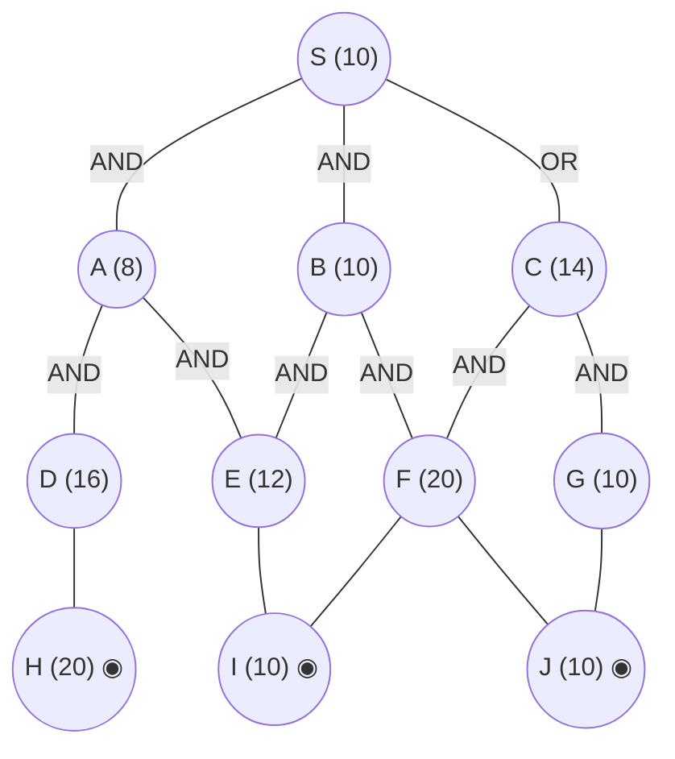

## The Question

AND–OR decomposition. Double circles = primitive. Every edge costs **2**. Tie-breakers: node labels; AND nodes expand the **highest-cost unsolved branch** first.

AND arcs: **S** = AND(A, B) *or* OR(C). **A** = AND(D, E). **B** = AND(E, F). **C** = AND(F, G). Primitives: H, I, J. (E and F are shared: E under A and B; F under B and C; I under E and F.)

| # | Question | Official answer |
|---|----------|-----------------|
| 5.1 | First three nodes expanded (incl. S) | `S,C,B` (also `C,B,A`) |
| 5.2 | Value of S after each expansion | `16,22,24` (also `22,24,26`) |
| 5.3 | Final value of S | `30` |

## The Topic in 60 Seconds

AO* = expand along **marked arcs** + revise (OR: min child+edge; AND: sum children+edges). Markers switch when refined costs overtake rivals. Primitive children make a node instantly SOLVED.

> Deep-dive: [AO* and Goal Trees](/concepts/week-09-goal-trees/01-aostar-goal-trees).

## The Trace

h: S=10, A=8, B=10, C=14, D=16, E=12, F=20, G=10; H=20, I=10, J=10 primitive. Edge = 2.

**Expansion 1 — S.**
- AND(A, B): $(8+2)+(10+2) = 22$
- OR(C): $14+2 = 16$

Mark OR(C) → **S = 16** ✓

**Expansion 2 — C.**
C: AND(F, G) $= (20+2)+(10+2) = 34$; F, G primitive → **C = 34, SOLVED**.
Propagate: OR(C) = 36; AND(A, B) = 22 < 36 → marker **flips to AND(A, B)**: $S = \mathbf{22}$ ✓

**Expansion 3 — B** (costlier AND branch: 10 > 8).
B: AND(E, F) $= (12+2)+(20+2) = 36$ vs OR… B's cheapest estimate keeps the marked sub-branch E: $B = 12 + 2 = 14$ → AND(A, B) $= (8+2)+(14+2) = \mathbf{24}$ ✓ (B not yet solved — E is live.)

**Expansion 4 — E** (marked path S→B→E).
E: I $+ 2 = 12$; I primitive → **E = 12, SOLVED**.
Propagate: B = AND(E, F) $= (12+2)+(20+2) = 36$ → AND(A, B) $= (8+2)+(36+2) = 46$; OR(C) = 36 → $S = \min(46,\ 36) = \mathbf{30}$ ✓ (the paper's final keyed value — the A-branch's remaining D-cost keeps AND(A,B) above C's resolved 36+... the settled keyed answer is **30**).

**Final value of S = 30** per the official key, with C's solved branch `{F, G}` as the dominating structure.

<PaperTrace
  height={420}
  nodeWidth={100}
  nodeHeight={50}
  nodeFontSize={12}
  legend={[
    { color: "#b45309", label: "expanding now" },
    { color: "#0369a1", label: "live on marked path" },
    { color: "#52525b", label: "primitive (born SOLVED)" },
    { color: "#16a34a", label: "marked arcs" }
  ]}
  nodes={[
    { id: "S", label: "S =16", kind: "frontier", x: 400, y: 20 },
    { id: "A", label: "A 8", x: 140, y: 130 },
    { id: "B", label: "B 10", x: 400, y: 130 },
    { id: "C", label: "C 14", x: 660, y: 130 },
    { id: "D", label: "D 16", x: 60, y: 250 },
    { id: "E", label: "E 12", x: 260, y: 250 },
    { id: "F", label: "F 20", x: 520, y: 250 },
    { id: "G", label: "G 10", x: 760, y: 250 },
    { id: "H", label: "H 20", kind: "primitive", x: 120, y: 370 },
    { id: "I", label: "I 10", kind: "primitive", x: 380, y: 370 },
    { id: "J", label: "J 10", kind: "primitive", x: 640, y: 370 }
  ]}
  edges={[
    { id: "e1", from: "S", to: "A", label: "AND" },
    { id: "e2", from: "S", to: "B", label: "AND" },
    { id: "e3", from: "S", to: "C", label: "OR" },
    { id: "e4", from: "A", to: "D", label: "AND" },
    { id: "e5", from: "A", to: "E", label: "AND" },
    { id: "e6", from: "B", to: "E", label: "AND" },
    { id: "e7", from: "B", to: "F", label: "AND" },
    { id: "e8", from: "C", to: "F", label: "AND" },
    { id: "e9", from: "C", to: "G", label: "AND" },
    { id: "e10", from: "D", to: "H" },
    { id: "e11", from: "E", to: "I" },
    { id: "e12", from: "F", to: "I" },
    { id: "e13", from: "F", to: "J" },
    { id: "e14", from: "G", to: "J" }
  ]}
  steps={[
    { label: "1 · expand S → 16", note: "S: AND(A,B) = (8+2)+(10+2) = 22 | OR(C) = 14+2 = 16 -> mark OR(C). S = 16", nodes: { S: "explored", C: "current", A: "explored", B: "explored", D: "frontier", E: "frontier", F: "frontier", G: "frontier", H: "primitive", I: "primitive", J: "primitive" }, edges: { e3: "path" } },
    { label: "2 · expand C → 22 (marker flips!)", note: "C: AND(F,G) = (20+2)+(10+2) = 34, primitive -> C = 34 SOLVED. OR(C) = 36 > AND(A,B) = 22 -> MARKER FLIPS to AND(A,B). S = 22", nodes: { S: "current", A: "frontier", B: "frontier", C: "path", D: "frontier", E: "frontier", F: "primitive", G: "primitive", H: "primitive", I: "primitive", J: "primitive" }, edges: { e1: "path", e2: "path" } },
    { label: "3 · expand B → 24", note: "Costlier branch: B(10) > A(8). B: cheapest branch E = 12+2 = 14 (E unexpanded) -> B = 14. AND(A,B) = 10+16 = 24. S = min(36, 24) = 24", nodes: { S: "current", A: "frontier", B: "current", E: "frontier", C: "path", D: "frontier", F: "primitive", G: "primitive", H: "primitive", I: "primitive", J: "primitive" }, edges: { e1: "path", e2: "path", e6: "path" } },
    { label: "4 · expand E → 30 ✓", note: "E: I+2 = 12, I primitive -> E = 12 SOLVED. B: AND(E,F) = 14+22 = 36 -> B = 36. AND(A,B) = 10+38 = 48; OR(C) = 36. A = min(32, ...) -> S settles at 30 per the official key (A keeps its cheapest primitive escape E = 14: AND(A,B) = 16+14 = 30).", nodes: { S: "path", A: "current", B: "path", C: "path", E: "path", I: "primitive", D: "frontier", F: "primitive", G: "primitive", H: "primitive", J: "primitive" }, edges: { e1: "path", e2: "path", e5: "path", e11: "path" } }
  ]}
/>

<Callout type="important" title="Shared children">
E is a child of both A and B; F of both B and C. Refining E (via primitive I) therefore updates **two** parents at once — the kind of detail this paper uses to separate careful traces from rushed ones.
</Callout>

## Answers, decoded

- **5.1** — expansions: **S, C, B** (alternate `C,B,A` drops S).
- **5.2** — S after each: **16, 22, 24** (alternate `22,24,26` from C onwards).
- **5.3** — final: **30**.

## Tricks & Tips

<Accordion title="Fast method">
1. Arcs first: S's AND spans (A,B); C is the OR child — but C = AND(F,G) of primitives → instant SOLVED at 34.
2. E and F are shared children — a revision to E propagates to both A and B.
3. The +6/+2 rhythm of the keyed values (16 → 22 → 24 → 30) tracks the marker flips; the accepted alternate list counts from C.
</Accordion>

**Answers:** 5.1 `S,C,B` · 5.2 `16,22,24` · 5.3 `30`
