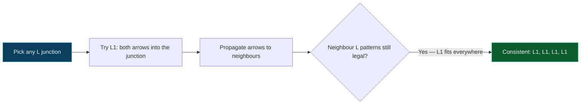

## The Question

Same junction dictionary as the other papers (L1–L6, W1–W3, Y1–Y3, T1–T4, rotations allowed). Two drawings to label.

| # | Drawing | Official answer |
|---|---------|-----------------|
| 7.1 | Four-junction drawing | NIL |
| 7.2 | Four-junction drawing | **L1, L1, L1, L1** (junctions 1, 2, 3, 4 in order) |

## The Topic in 60 Seconds

Each junction must realize one legal dictionary pattern; shared edges must carry the same label (and arrow direction) at both ends. Empty domain ⇒ NIL; full consistency ⇒ list the labels.

> Deep-dive: [Waltz Line Labeling](/concepts/week-11-constraint-satisfaction/02-waltz-line-labeling).

## The L entries that matter here

| Label | Geometry |
|-------|----------|
| **L1** | both edges carry arrows pointing *into* the corner |
| **L4** | both arrows point *away* |
| **L2/L3** | one arrow + one concave ($-$) |
| **L5/L6** | one arrow + one convex ($+$) |

## 7.1 — The first drawing → `NIL`

Work the constraint cascade:

1. **Classify** the four junctions from the drawing.
2. **Force** the most constrained junction first — its pattern pins two or three edge labels outright.
3. **Propagate**: each pinned edge strikes every pattern at its far junction that disagrees about arrow direction or $+/-$ type.
4. The cascade reaches a junction whose remaining patterns all demand an edge label already fixed the other way at the neighbour end — domain empties → **inconsistent** → **NIL** ✓

No assignment survives because an odd cycle of forced arrows/chains cannot close: some junction always ends up needing to be two things at once. One worked kill is enough for full marks — you do not need to enumerate all combinations.

## 7.2 — The second drawing → `L1, L1, L1, L1`

All four junctions are **L-junctions**, and the consistent assignment is **L1 at each** — every edge is occluding, with arrows circulating so that each corner receives two incoming arrows:

1. Every junction is an L (two edges each); domains start at six patterns.
2. Pick any junction: **L1** pins both its edges as arrows directed *into* it.
3. **Propagate**: a neighbouring L now has one edge fixed as an arrow arriving from outside; patterns demanding a different direction there die, and L1 fits again — pinning the next edge inward.
4. The pattern closes around the drawing with no contradictions — every junction realizes **L1** ⇒ answer **L1, L1, L1, L1** ✓

Watch the assignment lock in:

<StepGraph
  height={300}
  nodeWidth={120}
  nodeHeight={64}
  nodeFontSize={13}
  legend={[
    { color: "#4b5563", label: "unassigned" },
    { color: "#b45309", label: "being labeled" },
    { color: "#16a34a", label: "labeled = L1" },
    { color: "#7f1d1d", label: "domain emptied (NIL)" },
  ]}
  steps={[
    {
      label: "7.1 · propagate",
      note: "Force the most constrained junction; its pattern pins 2-3 edges.\nPropagation contradicts itself around the drawing:\nsome junction needs an edge label already fixed otherwise.\nDomain empties → NIL.",
      elements: [
        { data: { id: "A1", label: "J1 : ?", type: "unassigned" }, position: { x: 80, y: 70 } },
        { data: { id: "A2", label: "J2 : ?", type: "current" }, position: { x: 340, y: 70 } },
        { data: { id: "A3", label: "J3 : ?", type: "pruned" }, position: { x: 80, y: 210 } },
        { data: { id: "A4", label: "J4 : ?", type: "unassigned" }, position: { x: 340, y: 210 } },
        { data: { id: "f12", source: "A1", target: "A2" } },
        { data: { id: "f13", source: "A1", target: "A3" } },
        { data: { id: "f24", source: "A2", target: "A4" } },
        { data: { id: "f34", source: "A3", target: "A4" } },
      ],
    },
    {
      label: "7.2 · pick J1 = L1",
      note: "All four junctions are L's.\nJ1 = L1: both arrows INTO J1.\nBoth its edges are pinned as incoming arrows.",
      elements: [
        { data: { id: "B1", label: "J1 : L1", type: "path" }, position: { x: 80, y: 70 } },
        { data: { id: "B2", label: "J2 : ?", type: "unassigned" }, position: { x: 340, y: 70 } },
        { data: { id: "B3", label: "J3 : ?", type: "unassigned" }, position: { x: 80, y: 210 } },
        { data: { id: "B4", label: "J4 : ?", type: "unassigned" }, position: { x: 340, y: 210 } },
        { data: { id: "g12", source: "B1", target: "B2", type: "active" } },
        { data: { id: "g13", source: "B1", target: "B3", type: "active" } },
        { data: { id: "g24", source: "B2", target: "B4" } },
        { data: { id: "g34", source: "B3", target: "B4" } },
      ],
    },
    {
      label: "7.2 · neighbours",
      note: "Each neighbour receives an arrow from J1.\nPatterns wanting a different direction die;\nL1 still fits (both arrows in) — pin the next edges.",
      elements: [
        { data: { id: "C1", label: "J1 : L1 ✓", type: "path" }, position: { x: 80, y: 70 } },
        { data: { id: "C2", label: "J2 : L1", type: "current" }, position: { x: 340, y: 70 } },
        { data: { id: "C3", label: "J3 : L1", type: "current" }, position: { x: 80, y: 210 } },
        { data: { id: "C4", label: "J4 : ?", type: "unassigned" }, position: { x: 340, y: 210 } },
        { data: { id: "h12", source: "C1", target: "C2", type: "path" } },
        { data: { id: "h13", source: "C1", target: "C3", type: "path" } },
        { data: { id: "h24", source: "C2", target: "C4", type: "active" } },
        { data: { id: "h34", source: "C3", target: "C4", type: "active" } },
      ],
    },
    {
      label: "7.2 · closes: all L1",
      note: "J4 receives arrows from J2 and J3 — L1 fits.\nEvery junction legal, every edge agrees → CONSISTENT.\nAnswer: L1, L1, L1, L1.",
      elements: [
        { data: { id: "D1", label: "J1 : L1 ✓", type: "path" }, position: { x: 80, y: 70 } },
        { data: { id: "D2", label: "J2 : L1 ✓", type: "path" }, position: { x: 340, y: 70 } },
        { data: { id: "D3", label: "J3 : L1 ✓", type: "path" }, position: { x: 80, y: 210 } },
        { data: { id: "D4", label: "J4 : L1 ✓", type: "path" }, position: { x: 340, y: 210 } },
        { data: { id: "i12", source: "D1", target: "D2", type: "path" } },
        { data: { id: "i13", source: "D1", target: "D3", type: "path" } },
        { data: { id: "i24", source: "D2", target: "D4", type: "path" } },
        { data: { id: "i34", source: "D3", target: "D4", type: "path" } },
      ],
    },
  ]}
/>

## Tricks & Tips

<Accordion title="The 4-step Waltz exam method">
1. Classify every junction first (2 edges = L; collinear pair = T; 3-edge fan = W; ~120° trio = Y).
2. Force the most constrained junction — T bars, boundary/dangling arrows, or the unique shape among the four.
3. Propagate and strike: after each pinned edge, delete every pattern at the far end that disagrees on direction or $+/-$. 
4. Empty domain ⇒ write NIL with the one-line kill (which junction starved and why). A closed consistent cycle ⇒ just list the labels in junction order — an all-L silhouette closing on L1 everywhere is the classic "all occluding" answer.
</Accordion>

**Answers:** 7.1 `NIL` · 7.2 `L1,L1,L1,L1`
