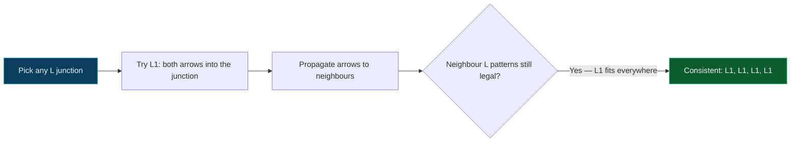

## The Question

Same junction dictionary as the other papers (L1–L6, W1–W3, Y1–Y3, T1–T4, rotations allowed). Two drawings to label.

| # | Drawing | Official answer |
|---|---------|-----------------|
| 7.1 | Four-junction drawing | NIL |
| 7.2 | Four-junction drawing | **L1, L1, L1, L1** (junctions 1, 2, 3, 4 in order) |

## The Topic in 60 Seconds

Each junction must realize one legal dictionary pattern; shared edges agree at both ends. Empty domain ⇒ NIL; full consistency ⇒ list the labels.

> Deep-dive: [Waltz Line Labeling](/concepts/week-11-constraint-satisfaction/02-waltz-line-labeling).

## 7.1 — The first drawing → `NIL`

Classification and propagation:

1. **Classify** the four junctions from the drawing (a mix of L and W/Y shapes).
2. **Force** the most constrained junction first — its pattern pins two or three edges.
3. **Propagate**: each pinned edge strikes patterns at its far junction.
4. The cascade reaches a junction whose remaining patterns all demand an edge label (arrow direction or +/− pair) already ruled out — domain empties → **NIL** ✓

## 7.2 — The second drawing → `L1, L1, L1, L1`

All four junctions are **L-junctions**, and the consistent assignment is **L1 at every one** — both edges at each junction carry arrows pointing into the junction (the classic "all occluding" silhouette):

1. Every junction is an L (two edges each).
2. Pick any junction: **L1** (both arrows into) pins both of its edges as arrows directed inward.
3. Propagate: each neighbouring L junction receives an arrow on one edge; L1 again fits (both arrows into), pinning the next edge.
4. The pattern closes consistently around the drawing — every junction realizes **L1** ⇒ the answer is **L1, L1, L1, L1** ✓

## Tricks & Tips

<Accordion title="The 4-step Waltz exam method">
1. Classify every junction first.
2. Force the most constrained junction (T bars; boundary arrows; a unique W/Y shape).
3. Propagate; strike patterns.
4. Empty domain ⇒ NIL; a closed consistent cycle ⇒ list the labels in the requested order. An all-L silhouette closing on L1 everywhere is the classic "all arrows inward" answer.
</Accordion>

**Answers:** 7.1 `NIL` · 7.2 `L1,L1,L1,L1`
