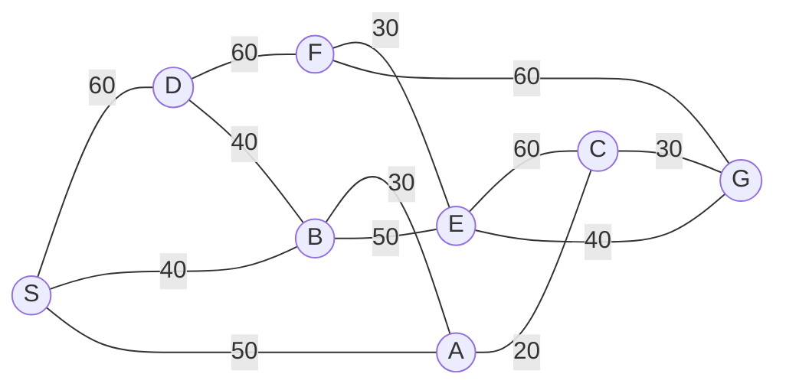

## The Question

A map on a uniform grid (each tile 10×10). Start **S**, goal **G**. MoveGen returns neighbours in alphabetical order. Heuristic = **Manhattan Distance**. Tie-breaker: node labels.

**Subquestions**

| # | Question | Official answer |
|---|----------|-----------------|
| 1.1 | Path found by Best First Search | `S,D,F,G` |
| 1.2 | Path found by A* | `S,B,E,G` |
| 1.3 | Path found by Branch-and-Bound (acyclic) | `S,A,C,G` |
| 1.4 | Which algorithm finds the **shortest** path? | **B** — Branch-and-Bound |
| 1.5 | Is the heuristic admissible? | **B** — Not admissible |

## The Topic in 60 Seconds

All three algorithms keep a list of partial paths and repeatedly **pick one, expand it** — they differ only in *how they pick*:

| Algorithm | Picks the node with smallest | Ignores |
|-----------|------------------------------|---------|
| **Best First Search** (greedy) | $h(n)$ — estimated distance to goal | cost already paid |
| **A\*** | $f(n) = g(n) + h(n)$ | nothing — balances both |
| **Branch-and-Bound** | $g(n)$ — exact cost so far | the heuristic entirely |

- $g(n)$ = exact cost of the path from S to $n$
- $h(n)$ = heuristic estimate from $n$ to G

> Deep-dive: [A* Search](/concepts/week-03-heuristic-search/01-a-star-search), [Best First Search](/concepts/week-03-heuristic-search/09-best-first-search), [Branch and Bound](/concepts/week-03-heuristic-search/05-branch-and-bound).

## Step 0 — Precompute the heuristic table

Manhattan distance on the grid: $h(n) = 10 \times (|x_n - x_G| + |y_n - y_G|)$ with G at (90, 60).

| Node | Coordinates | $h(n)$ |
|------|-------------|--------|
| S | (0, 30) | $90 + 30 = 120$ |
| A | (30, 0) | $60 + 60 = 120$ |
| B | (30, 30) | $60 + 30 = 90$ |
| D | (20, 50) | $70 + 10 = 80$ |
| E | (50, 60) | $40 + 0 = 40$ |
| F | (50, 90) | $40 + 30 = 70$ |
| C | (70, 0) | $20 + 60 = 80$ |
| G | (90, 60) | $0$ |

Build this table **before** tracing anything — every subquestion reads from it.

## 1.1 — Best First Search → `S,D,F,G`

Best First picks the open node with the **smallest $h$** only.

| Step | Open list (node : $h$) | Pick | Expand → add |
|------|------------------------|------|--------------|
| 1 | S : 120 | **S** | D : 80, B : 90, A : 120 |
| 2 | D : 80, B : 90, A : 120 | **D** | F : 70 (B, S already seen) |
| 3 | F : 70, B : 90, A : 120 | **F** | E : 40, G : 0 |
| 4 | G : 0, E : 40, B : 90, A : 120 | **G** — goal! | — |

Path: **S → D → F → G**. Notice BFS never looked at edge costs — it just slid downhill on $h$. Step through the trace exactly as you would write it in the exam:

<StepGraph
  height={440}
  nodeWidth={110}
  nodeHeight={54}
  nodeFontSize={13}
  legend={[
    { color: "#b45309", label: "picking now" },
    { color: "#0369a1", label: "in OPEN" },
    { color: "#4b5563", label: "expanded" },
    { color: "#16a34a", label: "final path" },
  ]}
  steps={[
    {
      label: "Init",
      note: "OPEN = { S(h=120) }",
      elements: [
        { data: { id: "S", label: "S", type: "frontier" }, position: { x: 40, y: 220 } },
        { data: { id: "A", label: "A", type: "explored" }, position: { x: 260, y: 380 } },
        { data: { id: "B", label: "B", type: "explored" }, position: { x: 260, y: 220 } },
        { data: { id: "D", label: "D", type: "explored" }, position: { x: 200, y: 60 } },
        { data: { id: "E", label: "E", type: "explored" }, position: { x: 480, y: 80 } },
        { data: { id: "F", label: "F", type: "explored" }, position: { x: 480, y: 220 } },
        { data: { id: "C", label: "C", type: "explored" }, position: { x: 700, y: 380 } },
        { data: { id: "G", label: "G", type: "explored" }, position: { x: 900, y: 120 } },
        { data: { id: "e1", source: "S", target: "D", label: "60" } },
        { data: { id: "e2", source: "S", target: "B", label: "40" } },
        { data: { id: "e3", source: "S", target: "A", label: "50" } },
        { data: { id: "e4", source: "D", target: "F", label: "60" } },
        { data: { id: "e5", source: "D", target: "B", label: "40" } },
        { data: { id: "e6", source: "B", target: "A", label: "30" } },
        { data: { id: "e7", source: "B", target: "E", label: "50" } },
        { data: { id: "e8", source: "A", target: "C", label: "20" } },
        { data: { id: "e9", source: "F", target: "E", label: "30" } },
        { data: { id: "e10", source: "F", target: "G", label: "60" } },
        { data: { id: "e11", source: "E", target: "C", label: "60" } },
        { data: { id: "e12", source: "E", target: "G", label: "40" } },
        { data: { id: "e13", source: "C", target: "G", label: "30" } },
      ],
    },
    {
      label: "Expand S",
      note: "Pick S (smallest h = 120).\nMoveGen(S) → D(80), B(90), A(120)\nOPEN = { D(80), B(90), A(120) }",
      elements: [
        { data: { id: "S", label: "S", type: "explored" }, position: { x: 40, y: 220 } },
        { data: { id: "A", label: "A (120)", type: "frontier" }, position: { x: 260, y: 380 } },
        { data: { id: "B", label: "B (90)", type: "frontier" }, position: { x: 260, y: 220 } },
        { data: { id: "D", label: "D (80)", type: "frontier" }, position: { x: 200, y: 60 } },
        { data: { id: "E", label: "E", type: "explored" }, position: { x: 480, y: 80 } },
        { data: { id: "F", label: "F", type: "explored" }, position: { x: 480, y: 220 } },
        { data: { id: "C", label: "C", type: "explored" }, position: { x: 700, y: 380 } },
        { data: { id: "G", label: "G", type: "explored" }, position: { x: 900, y: 120 } },
        { data: { id: "e1", source: "S", target: "D", label: "60" } },
        { data: { id: "e2", source: "S", target: "B", label: "40" } },
        { data: { id: "e3", source: "S", target: "A", label: "50" } },
        { data: { id: "e4", source: "D", target: "F", label: "60" } },
        { data: { id: "e5", source: "D", target: "B", label: "40" } },
        { data: { id: "e6", source: "B", target: "A", label: "30" } },
        { data: { id: "e7", source: "B", target: "E", label: "50" } },
        { data: { id: "e8", source: "A", target: "C", label: "20" } },
        { data: { id: "e9", source: "F", target: "E", label: "30" } },
        { data: { id: "e10", source: "F", target: "G", label: "60" } },
        { data: { id: "e11", source: "E", target: "C", label: "60" } },
        { data: { id: "e12", source: "E", target: "G", label: "40" } },
        { data: { id: "e13", source: "C", target: "G", label: "30" } },
      ],
    },
    {
      label: "Expand D",
      note: "Pick D (h = 80, cheapest in OPEN).\nMoveGen(D) → F(70); B, S already seen\nOPEN = { F(70), B(90), A(120) }",
      elements: [
        { data: { id: "S", label: "S", type: "explored" }, position: { x: 40, y: 220 } },
        { data: { id: "A", label: "A (120)", type: "frontier" }, position: { x: 260, y: 380 } },
        { data: { id: "B", label: "B (90)", type: "frontier" }, position: { x: 260, y: 220 } },
        { data: { id: "D", label: "D", type: "current" }, position: { x: 200, y: 60 } },
        { data: { id: "E", label: "E", type: "explored" }, position: { x: 480, y: 80 } },
        { data: { id: "F", label: "F (70)", type: "frontier" }, position: { x: 480, y: 220 } },
        { data: { id: "C", label: "C", type: "explored" }, position: { x: 700, y: 380 } },
        { data: { id: "G", label: "G", type: "explored" }, position: { x: 900, y: 120 } },
        { data: { id: "e1", source: "S", target: "D", label: "60" } },
        { data: { id: "e2", source: "S", target: "B", label: "40" } },
        { data: { id: "e3", source: "S", target: "A", label: "50" } },
        { data: { id: "e4", source: "D", target: "F", label: "60" } },
        { data: { id: "e5", source: "D", target: "B", label: "40" } },
        { data: { id: "e6", source: "B", target: "A", label: "30" } },
        { data: { id: "e7", source: "B", target: "E", label: "50" } },
        { data: { id: "e8", source: "A", target: "C", label: "20" } },
        { data: { id: "e9", source: "F", target: "E", label: "30" } },
        { data: { id: "e10", source: "F", target: "G", label: "60" } },
        { data: { id: "e11", source: "E", target: "C", label: "60" } },
        { data: { id: "e12", source: "E", target: "G", label: "40" } },
        { data: { id: "e13", source: "C", target: "G", label: "30" } },
      ],
    },
    {
      label: "Expand F",
      note: "Pick F (h = 70).\nMoveGen(F) → E(40), G(0)\nOPEN = { G(0), E(40), B(90), A(120) }",
      elements: [
        { data: { id: "S", label: "S", type: "explored" }, position: { x: 40, y: 220 } },
        { data: { id: "A", label: "A (120)", type: "frontier" }, position: { x: 260, y: 380 } },
        { data: { id: "B", label: "B (90)", type: "frontier" }, position: { x: 260, y: 220 } },
        { data: { id: "D", label: "D", type: "explored" }, position: { x: 200, y: 60 } },
        { data: { id: "E", label: "E (40)", type: "frontier" }, position: { x: 480, y: 80 } },
        { data: { id: "F", label: "F", type: "current" }, position: { x: 480, y: 220 } },
        { data: { id: "C", label: "C", type: "explored" }, position: { x: 700, y: 380 } },
        { data: { id: "G", label: "G (0)", type: "frontier" }, position: { x: 900, y: 120 } },
        { data: { id: "e1", source: "S", target: "D", label: "60" } },
        { data: { id: "e2", source: "S", target: "B", label: "40" } },
        { data: { id: "e3", source: "S", target: "A", label: "50" } },
        { data: { id: "e4", source: "D", target: "F", label: "60" } },
        { data: { id: "e5", source: "D", target: "B", label: "40" } },
        { data: { id: "e6", source: "B", target: "A", label: "30" } },
        { data: { id: "e7", source: "B", target: "E", label: "50" } },
        { data: { id: "e8", source: "A", target: "C", label: "20" } },
        { data: { id: "e9", source: "F", target: "E", label: "30" } },
        { data: { id: "e10", source: "F", target: "G", label: "60" } },
        { data: { id: "e11", source: "E", target: "C", label: "60" } },
        { data: { id: "e12", source: "E", target: "G", label: "40" } },
        { data: { id: "e13", source: "C", target: "G", label: "30" } },
      ],
    },
    {
      label: "Goal: S,D,F,G",
      note: "Pick G (h = 0) → GOAL.\nPath: S,D,F,G    cost = 60+60+60 = 180",
      elements: [
        { data: { id: "S", label: "S", type: "path" }, position: { x: 40, y: 220 } },
        { data: { id: "A", label: "A", type: "explored" }, position: { x: 260, y: 380 } },
        { data: { id: "B", label: "B", type: "explored" }, position: { x: 260, y: 220 } },
        { data: { id: "D", label: "D", type: "path" }, position: { x: 200, y: 60 } },
        { data: { id: "E", label: "E", type: "explored" }, position: { x: 480, y: 80 } },
        { data: { id: "F", label: "F", type: "path" }, position: { x: 480, y: 220 } },
        { data: { id: "C", label: "C", type: "explored" }, position: { x: 700, y: 380 } },
        { data: { id: "G", label: "G ✓", type: "goal" }, position: { x: 900, y: 120 } },
        { data: { id: "e1", source: "S", target: "D", label: "60", type: "path" } },
        { data: { id: "e2", source: "S", target: "B", label: "40" } },
        { data: { id: "e3", source: "S", target: "A", label: "50" } },
        { data: { id: "e4", source: "D", target: "F", label: "60", type: "path" } },
        { data: { id: "e5", source: "D", target: "B", label: "40" } },
        { data: { id: "e6", source: "B", target: "A", label: "30" } },
        { data: { id: "e7", source: "B", target: "E", label: "50" } },
        { data: { id: "e8", source: "A", target: "C", label: "20" } },
        { data: { id: "e9", source: "F", target: "E", label: "30" } },
        { data: { id: "e10", source: "F", target: "G", label: "60", type: "path" } },
        { data: { id: "e11", source: "E", target: "C", label: "60" } },
        { data: { id: "e12", source: "E", target: "G", label: "40" } },
        { data: { id: "e13", source: "C", target: "G", label: "30" } },
      ],
    },
  ]}
/>

## 1.2 — A* → `S,B,E,G`

A* picks the open node with the smallest $f(n) = g(n) + h(n)$.

| Step | Open list (node : $g$, $h$, $f$) | Pick | Updates |
|------|----------------------------------|------|---------|
| 1 | S : 0, 120, **120** | **S** | B : 40, 90, **130** · A : 50, 120, 170 · D : 60, 80, 140 |
| 2 | B : **130**, D : 140, A : 170 | **B** | A via B: $g=70$ → 190 (worse than 170, keep 50/170) · E : 90, 40, **130** · D via B: $g=80$ → 160 (worse than 140, keep) |
| 3 | E : **130**, D : 140, A : 170 | **E** | G : 130, 0, **130** · C : 150, 80, 230 |
| 4 | G : **130**, D : 140, A : 170, C : 230 | **G** — goal! | — |

Path: **S → B → E → G**, cost $40 + 50 + 40 = 130$.

<StepGraph
  height={440}
  nodeWidth={110}
  nodeHeight={54}
  nodeFontSize={13}
  legend={[
    { color: "#b45309", label: "expanding" },
    { color: "#0369a1", label: "in OPEN (f = g+h)" },
    { color: "#4b5563", label: "expanded / rejected" },
    { color: "#16a34a", label: "returned path" },
  ]}
  steps={[
    {
      label: "Init",
      note: "OPEN = { S(g=0, h=120, f=120) }",
      elements: [
        { data: { id: "S", label: "S f=120", type: "frontier" }, position: { x: 40, y: 220 } },
        { data: { id: "A", label: "A", type: "explored" }, position: { x: 260, y: 380 } },
        { data: { id: "B", label: "B", type: "explored" }, position: { x: 260, y: 220 } },
        { data: { id: "D", label: "D", type: "explored" }, position: { x: 200, y: 60 } },
        { data: { id: "E", label: "E", type: "explored" }, position: { x: 480, y: 80 } },
        { data: { id: "F", label: "F", type: "explored" }, position: { x: 480, y: 220 } },
        { data: { id: "C", label: "C", type: "explored" }, position: { x: 700, y: 380 } },
        { data: { id: "G", label: "G", type: "explored" }, position: { x: 900, y: 120 } },
        { data: { id: "e1", source: "S", target: "D", label: "60" } },
        { data: { id: "e2", source: "S", target: "B", label: "40" } },
        { data: { id: "e3", source: "S", target: "A", label: "50" } },
        { data: { id: "e4", source: "D", target: "F", label: "60" } },
        { data: { id: "e5", source: "D", target: "B", label: "40" } },
        { data: { id: "e6", source: "B", target: "A", label: "30" } },
        { data: { id: "e7", source: "B", target: "E", label: "50" } },
        { data: { id: "e8", source: "A", target: "C", label: "20" } },
        { data: { id: "e9", source: "F", target: "E", label: "30" } },
        { data: { id: "e10", source: "F", target: "G", label: "60" } },
        { data: { id: "e11", source: "E", target: "C", label: "60" } },
        { data: { id: "e12", source: "E", target: "G", label: "40" } },
        { data: { id: "e13", source: "C", target: "G", label: "30" } },
      ],
    },
    {
      label: "Expand S",
      note: "Pick S (f=120).\nB: g=40, h=90 → f=130\nA: g=50, h=120 → f=170\nD: g=60, h=80 → f=140\nOPEN = { B(130), D(140), A(170) }",
      elements: [
        { data: { id: "S", label: "S", type: "explored" }, position: { x: 40, y: 220 } },
        { data: { id: "A", label: "A f=170", type: "frontier" }, position: { x: 260, y: 380 } },
        { data: { id: "B", label: "B f=130", type: "frontier" }, position: { x: 260, y: 220 } },
        { data: { id: "D", label: "D f=140", type: "frontier" }, position: { x: 200, y: 60 } },
        { data: { id: "E", label: "E", type: "explored" }, position: { x: 480, y: 80 } },
        { data: { id: "F", label: "F", type: "explored" }, position: { x: 480, y: 220 } },
        { data: { id: "C", label: "C", type: "explored" }, position: { x: 700, y: 380 } },
        { data: { id: "G", label: "G", type: "explored" }, position: { x: 900, y: 120 } },
        { data: { id: "e1", source: "S", target: "D", label: "60" } },
        { data: { id: "e2", source: "S", target: "B", label: "40" } },
        { data: { id: "e3", source: "S", target: "A", label: "50" } },
        { data: { id: "e4", source: "D", target: "F", label: "60" } },
        { data: { id: "e5", source: "D", target: "B", label: "40" } },
        { data: { id: "e6", source: "B", target: "A", label: "30" } },
        { data: { id: "e7", source: "B", target: "E", label: "50" } },
        { data: { id: "e8", source: "A", target: "C", label: "20" } },
        { data: { id: "e9", source: "F", target: "E", label: "30" } },
        { data: { id: "e10", source: "F", target: "G", label: "60" } },
        { data: { id: "e11", source: "E", target: "C", label: "60" } },
        { data: { id: "e12", source: "E", target: "G", label: "40" } },
        { data: { id: "e13", source: "C", target: "G", label: "30" } },
      ],
    },
    {
      label: "Expand B",
      note: "Pick B (f=130).\nA via B: g=70 → f=190 (worse than 170, keep 170)\nE: g=90, h=40 → f=130\nD via B: g=80 → f=160 (worse than 140, keep)\nOPEN = { E(130), D(140), A(170) }",
      elements: [
        { data: { id: "S", label: "S", type: "explored" }, position: { x: 40, y: 220 } },
        { data: { id: "A", label: "A f=170", type: "frontier" }, position: { x: 260, y: 380 } },
        { data: { id: "B", label: "B", type: "current" }, position: { x: 260, y: 220 } },
        { data: { id: "D", label: "D f=140", type: "frontier" }, position: { x: 200, y: 60 } },
        { data: { id: "E", label: "E f=130", type: "frontier" }, position: { x: 480, y: 80 } },
        { data: { id: "F", label: "F", type: "explored" }, position: { x: 480, y: 220 } },
        { data: { id: "C", label: "C", type: "explored" }, position: { x: 700, y: 380 } },
        { data: { id: "G", label: "G", type: "explored" }, position: { x: 900, y: 120 } },
        { data: { id: "e1", source: "S", target: "D", label: "60" } },
        { data: { id: "e2", source: "S", target: "B", label: "40" } },
        { data: { id: "e3", source: "S", target: "A", label: "50" } },
        { data: { id: "e4", source: "D", target: "F", label: "60" } },
        { data: { id: "e5", source: "D", target: "B", label: "40" } },
        { data: { id: "e6", source: "B", target: "A", label: "30" } },
        { data: { id: "e7", source: "B", target: "E", label: "50" } },
        { data: { id: "e8", source: "A", target: "C", label: "20" } },
        { data: { id: "e9", source: "F", target: "E", label: "30" } },
        { data: { id: "e10", source: "F", target: "G", label: "60" } },
        { data: { id: "e11", source: "E", target: "C", label: "60" } },
        { data: { id: "e12", source: "E", target: "G", label: "40" } },
        { data: { id: "e13", source: "C", target: "G", label: "30" } },
      ],
    },
    {
      label: "Expand E",
      note: "Pick E (f=130).\nG: g=130, h=0 → f=130\nC: g=150, h=80 → f=230\nOPEN = { G(130), D(140), A(170), C(230) }",
      elements: [
        { data: { id: "S", label: "S", type: "explored" }, position: { x: 40, y: 220 } },
        { data: { id: "A", label: "A f=170", type: "frontier" }, position: { x: 260, y: 380 } },
        { data: { id: "B", label: "B", type: "explored" }, position: { x: 260, y: 220 } },
        { data: { id: "D", label: "D f=140", type: "frontier" }, position: { x: 200, y: 60 } },
        { data: { id: "E", label: "E", type: "current" }, position: { x: 480, y: 80 } },
        { data: { id: "F", label: "F", type: "explored" }, position: { x: 480, y: 220 } },
        { data: { id: "C", label: "C f=230", type: "frontier" }, position: { x: 700, y: 380 } },
        { data: { id: "G", label: "G f=130", type: "frontier" }, position: { x: 900, y: 120 } },
        { data: { id: "e1", source: "S", target: "D", label: "60" } },
        { data: { id: "e2", source: "S", target: "B", label: "40" } },
        { data: { id: "e3", source: "S", target: "A", label: "50" } },
        { data: { id: "e4", source: "D", target: "F", label: "60" } },
        { data: { id: "e5", source: "D", target: "B", label: "40" } },
        { data: { id: "e6", source: "B", target: "A", label: "30" } },
        { data: { id: "e7", source: "B", target: "E", label: "50" } },
        { data: { id: "e8", source: "A", target: "C", label: "20" } },
        { data: { id: "e9", source: "F", target: "E", label: "30" } },
        { data: { id: "e10", source: "F", target: "G", label: "60" } },
        { data: { id: "e11", source: "E", target: "C", label: "60" } },
        { data: { id: "e12", source: "E", target: "G", label: "40" } },
        { data: { id: "e13", source: "C", target: "G", label: "30" } },
      ],
    },
    {
      label: "Goal: S,B,E,G",
      note: "Pick G (f=130, smallest) → GOAL.\nPath: S,B,E,G    cost = 40+50+40 = 130\n(Not optimal! h is inadmissible — see 1.5.)",
      elements: [
        { data: { id: "S", label: "S", type: "path" }, position: { x: 40, y: 220 } },
        { data: { id: "A", label: "A", type: "explored" }, position: { x: 260, y: 380 } },
        { data: { id: "B", label: "B", type: "path" }, position: { x: 260, y: 220 } },
        { data: { id: "D", label: "D", type: "explored" }, position: { x: 200, y: 60 } },
        { data: { id: "E", label: "E", type: "path" }, position: { x: 480, y: 80 } },
        { data: { id: "F", label: "F", type: "explored" }, position: { x: 480, y: 220 } },
        { data: { id: "C", label: "C", type: "explored" }, position: { x: 700, y: 380 } },
        { data: { id: "G", label: "G ✓", type: "goal" }, position: { x: 900, y: 120 } },
        { data: { id: "e1", source: "S", target: "D", label: "60" } },
        { data: { id: "e2", source: "S", target: "B", label: "40", type: "path" } },
        { data: { id: "e3", source: "S", target: "A", label: "50" } },
        { data: { id: "e4", source: "D", target: "F", label: "60" } },
        { data: { id: "e5", source: "D", target: "B", label: "40" } },
        { data: { id: "e6", source: "B", target: "A", label: "30" } },
        { data: { id: "e7", source: "B", target: "E", label: "50", type: "path" } },
        { data: { id: "e8", source: "A", target: "C", label: "20" } },
        { data: { id: "e9", source: "F", target: "E", label: "30" } },
        { data: { id: "e10", source: "F", target: "G", label: "60" } },
        { data: { id: "e11", source: "E", target: "C", label: "60" } },
        { data: { id: "e12", source: "E", target: "G", label: "40", type: "path" } },
        { data: { id: "e13", source: "C", target: "G", label: "30" } },
      ],
    },
  ]}
/>

<Callout type="warning" title="Wait — is that really optimal?">
A* returned cost 130, but 1.4 says the *shortest* path costs 100 (via A and C). A* can only be trusted to be optimal when $h$ is **admissible** — and 1.5 shows it is not. A single inadmissible node poisoned the search: the inflated $h(C) = 80$ scared A* away from the genuinely cheap S–A–C–G route.
</Callout>

## 1.3 — Branch-and-Bound → `S,A,C,G`

BnB picks the open path with the **smallest $g$** and never extends a path that revisits a node (the "avoids cyclic expansions" note).

| Step | Open paths (path : $g$) | Pick | Extend with |
|------|--------------------------|------|-------------|
| 1 | S : 0 | **S** | SB : 40, SA : 50, SD : 60 |
| 2 | SB : 40, SA : 50, SD : 60 | **SB** | SBA : 70, SBE : 90, SBD : 80 |
| 3 | SA : 50, SD : 60, SBA : 70, SBD : 80, SBE : 90 | **SA** | SAC : 70 |
| 4 | SD : 60, SBA : 70, SAC : 70, SBD : 80, SBE : 90 | **SD** | SDF : 120, SDB : 100 |
| 5 | SBA : 70, SAC : 70, SBD : 80, SBE : 90, SDB : 100, SDF : 120 | **SBA** | SBAC : 90 |
| 6 | SAC : 70, SBD : 80, SBE : 90, SBAC : 90, SDB : 100, SDF : 120 | **SAC** | SACG : **100** ← goal on the queue |
| 7 | SBE : 90, SBAC : 90, SACG : 100, SDB : 100, SDF : 120 | **SBD** | SBDF : 140 |
| 8 | SBE : 90, SBAC : 90, SACG : 100, SDB : 100, SDF : 120, SBDF : 140 | **SBE** | SBEG : 130, SBEC : 150 |
| 9 | SBAC : 90, SACG : 100, SDB : 100, SDF : 120, SBEG : 130, SBDF : 140, SBEC : 150 | **SBAC** | SBACG : 120 |
| 10 | SACG : **100**, everything else ≥ 100 | **SACG** — cheapest, done | — |

Path: **S → A → C → G**, cost $50 + 20 + 30 = 100$.

<Callout type="tip" title="Why BnB can stop">
Every remaining open path already costs $\geq 100$, so none of them can ever beat SACG. That is the whole trick of Branch-and-Bound: the first goal node pulled from the queue *while all alternatives are no cheaper* is provably optimal.
</Callout>

<StepGraph
  height={440}
  nodeWidth={110}
  nodeHeight={54}
  nodeFontSize={13}
  legend={[
    { color: "#b45309", label: "path being extended" },
    { color: "#0369a1", label: "in OPEN (sorted by g)" },
    { color: "#4b5563", label: "not reachable now" },
    { color: "#16a34a", label: "optimal path (cost 100)" },
  ]}
  steps={[
    {
      label: "Init",
      note: "OPEN = [ S:0 ]",
      elements: [
        { data: { id: "S", label: "S:0", type: "frontier" }, position: { x: 40, y: 220 } },
        { data: { id: "A", label: "A", type: "explored" }, position: { x: 260, y: 380 } },
        { data: { id: "B", label: "B", type: "explored" }, position: { x: 260, y: 220 } },
        { data: { id: "D", label: "D", type: "explored" }, position: { x: 200, y: 60 } },
        { data: { id: "E", label: "E", type: "explored" }, position: { x: 480, y: 80 } },
        { data: { id: "F", label: "F", type: "explored" }, position: { x: 480, y: 220 } },
        { data: { id: "C", label: "C", type: "explored" }, position: { x: 700, y: 380 } },
        { data: { id: "G", label: "G", type: "explored" }, position: { x: 900, y: 120 } },
        { data: { id: "e1", source: "S", target: "D", label: "60" } },
        { data: { id: "e2", source: "S", target: "B", label: "40" } },
        { data: { id: "e3", source: "S", target: "A", label: "50" } },
        { data: { id: "e4", source: "D", target: "F", label: "60" } },
        { data: { id: "e5", source: "D", target: "B", label: "40" } },
        { data: { id: "e6", source: "B", target: "A", label: "30" } },
        { data: { id: "e7", source: "B", target: "E", label: "50" } },
        { data: { id: "e8", source: "A", target: "C", label: "20" } },
        { data: { id: "e9", source: "F", target: "E", label: "30" } },
        { data: { id: "e10", source: "F", target: "G", label: "60" } },
        { data: { id: "e11", source: "E", target: "C", label: "60" } },
        { data: { id: "e12", source: "E", target: "G", label: "40" } },
        { data: { id: "e13", source: "C", target: "G", label: "30" } },
      ],
    },
    {
      label: "Extend S",
      note: "Pop S(0). Acyclic extensions:\nS,B:40   S,A:50   S,D:60\nOPEN = [ SB:40, SA:50, SD:60 ]",
      elements: [
        { data: { id: "S", label: "S", type: "explored" }, position: { x: 40, y: 220 } },
        { data: { id: "A", label: "A 50", type: "frontier" }, position: { x: 260, y: 380 } },
        { data: { id: "B", label: "B 40", type: "frontier" }, position: { x: 260, y: 220 } },
        { data: { id: "D", label: "D 60", type: "frontier" }, position: { x: 200, y: 60 } },
        { data: { id: "E", label: "E", type: "explored" }, position: { x: 480, y: 80 } },
        { data: { id: "F", label: "F", type: "explored" }, position: { x: 480, y: 220 } },
        { data: { id: "C", label: "C", type: "explored" }, position: { x: 700, y: 380 } },
        { data: { id: "G", label: "G", type: "explored" }, position: { x: 900, y: 120 } },
        { data: { id: "e1", source: "S", target: "D", label: "60" } },
        { data: { id: "e2", source: "S", target: "B", label: "40" } },
        { data: { id: "e3", source: "S", target: "A", label: "50" } },
        { data: { id: "e4", source: "D", target: "F", label: "60" } },
        { data: { id: "e5", source: "D", target: "B", label: "40" } },
        { data: { id: "e6", source: "B", target: "A", label: "30" } },
        { data: { id: "e7", source: "B", target: "E", label: "50" } },
        { data: { id: "e8", source: "A", target: "C", label: "20" } },
        { data: { id: "e9", source: "F", target: "E", label: "30" } },
        { data: { id: "e10", source: "F", target: "G", label: "60" } },
        { data: { id: "e11", source: "E", target: "C", label: "60" } },
        { data: { id: "e12", source: "E", target: "G", label: "40" } },
        { data: { id: "e13", source: "C", target: "G", label: "30" } },
      ],
    },
    {
      label: "Extend SB",
      note: "Pop SB(40).\nS,B,A:70   S,B,D:80   S,B,E:90\nOPEN = [ SA:50, SD:60, SBA:70, SBD:80, SBE:90 ]",
      elements: [
        { data: { id: "S", label: "S", type: "explored" }, position: { x: 40, y: 220 } },
        { data: { id: "A", label: "A 50/70", type: "frontier" }, position: { x: 260, y: 380 } },
        { data: { id: "B", label: "B", type: "current" }, position: { x: 260, y: 220 } },
        { data: { id: "D", label: "D 60/80", type: "frontier" }, position: { x: 200, y: 60 } },
        { data: { id: "E", label: "E 90", type: "frontier" }, position: { x: 480, y: 80 } },
        { data: { id: "F", label: "F", type: "explored" }, position: { x: 480, y: 220 } },
        { data: { id: "C", label: "C", type: "explored" }, position: { x: 700, y: 380 } },
        { data: { id: "G", label: "G", type: "explored" }, position: { x: 900, y: 120 } },
        { data: { id: "e1", source: "S", target: "D", label: "60" } },
        { data: { id: "e2", source: "S", target: "B", label: "40" } },
        { data: { id: "e3", source: "S", target: "A", label: "50" } },
        { data: { id: "e4", source: "D", target: "F", label: "60" } },
        { data: { id: "e5", source: "D", target: "B", label: "40" } },
        { data: { id: "e6", source: "B", target: "A", label: "30" } },
        { data: { id: "e7", source: "B", target: "E", label: "50" } },
        { data: { id: "e8", source: "A", target: "C", label: "20" } },
        { data: { id: "e9", source: "F", target: "E", label: "30" } },
        { data: { id: "e10", source: "F", target: "G", label: "60" } },
        { data: { id: "e11", source: "E", target: "C", label: "60" } },
        { data: { id: "e12", source: "E", target: "G", label: "40" } },
        { data: { id: "e13", source: "C", target: "G", label: "30" } },
      ],
    },
    {
      label: "Extend SA",
      note: "Pop SA(50).\nS,A,C:70\nOPEN = [ SD:60, SBA:70, SAC:70, SBD:80, SBE:90 ]",
      elements: [
        { data: { id: "S", label: "S", type: "explored" }, position: { x: 40, y: 220 } },
        { data: { id: "A", label: "A", type: "current" }, position: { x: 260, y: 380 } },
        { data: { id: "B", label: "B", type: "explored" }, position: { x: 260, y: 220 } },
        { data: { id: "D", label: "D 60", type: "frontier" }, position: { x: 200, y: 60 } },
        { data: { id: "E", label: "E 90", type: "frontier" }, position: { x: 480, y: 80 } },
        { data: { id: "F", label: "F", type: "explored" }, position: { x: 480, y: 220 } },
        { data: { id: "C", label: "C 70", type: "frontier" }, position: { x: 700, y: 380 } },
        { data: { id: "G", label: "G", type: "explored" }, position: { x: 900, y: 120 } },
        { data: { id: "e1", source: "S", target: "D", label: "60" } },
        { data: { id: "e2", source: "S", target: "B", label: "40" } },
        { data: { id: "e3", source: "S", target: "A", label: "50" } },
        { data: { id: "e4", source: "D", target: "F", label: "60" } },
        { data: { id: "e5", source: "D", target: "B", label: "40" } },
        { data: { id: "e6", source: "B", target: "A", label: "30" } },
        { data: { id: "e7", source: "B", target: "E", label: "50" } },
        { data: { id: "e8", source: "A", target: "C", label: "20" } },
        { data: { id: "e9", source: "F", target: "E", label: "30" } },
        { data: { id: "e10", source: "F", target: "G", label: "60" } },
        { data: { id: "e11", source: "E", target: "C", label: "60" } },
        { data: { id: "e12", source: "E", target: "G", label: "40" } },
        { data: { id: "e13", source: "C", target: "G", label: "30" } },
      ],
    },
    {
      label: "Extend SD",
      note: "Pop SD(60).\nS,D,B:100   S,D,F:120\nOPEN = [ SBA:70, SAC:70, SBD:80, SBE:90, SDB:100, SDF:120 ]",
      elements: [
        { data: { id: "S", label: "S", type: "explored" }, position: { x: 40, y: 220 } },
        { data: { id: "A", label: "A", type: "explored" }, position: { x: 260, y: 380 } },
        { data: { id: "B", label: "B", type: "explored" }, position: { x: 260, y: 220 } },
        { data: { id: "D", label: "D", type: "current" }, position: { x: 200, y: 60 } },
        { data: { id: "E", label: "E 90", type: "frontier" }, position: { x: 480, y: 80 } },
        { data: { id: "F", label: "F 120", type: "frontier" }, position: { x: 480, y: 220 } },
        { data: { id: "C", label: "C 70", type: "frontier" }, position: { x: 700, y: 380 } },
        { data: { id: "G", label: "G", type: "explored" }, position: { x: 900, y: 120 } },
        { data: { id: "e1", source: "S", target: "D", label: "60" } },
        { data: { id: "e2", source: "S", target: "B", label: "40" } },
        { data: { id: "e3", source: "S", target: "A", label: "50" } },
        { data: { id: "e4", source: "D", target: "F", label: "60" } },
        { data: { id: "e5", source: "D", target: "B", label: "40" } },
        { data: { id: "e6", source: "B", target: "A", label: "30" } },
        { data: { id: "e7", source: "B", target: "E", label: "50" } },
        { data: { id: "e8", source: "A", target: "C", label: "20" } },
        { data: { id: "e9", source: "F", target: "E", label: "30" } },
        { data: { id: "e10", source: "F", target: "G", label: "60" } },
        { data: { id: "e11", source: "E", target: "C", label: "60" } },
        { data: { id: "e12", source: "E", target: "G", label: "40" } },
        { data: { id: "e13", source: "C", target: "G", label: "30" } },
      ],
    },
    {
      label: "Extend SBA",
      note: "Pop SBA(70) — tie 70 with SAC, B < A.\nS,B,A,C:90\nOPEN = [ SAC:70, SBD:80, SBE:90, SBAC:90, SDB:100, SDF:120 ]",
      elements: [
        { data: { id: "S", label: "S", type: "explored" }, position: { x: 40, y: 220 } },
        { data: { id: "A", label: "A", type: "current" }, position: { x: 260, y: 380 } },
        { data: { id: "B", label: "B", type: "explored" }, position: { x: 260, y: 220 } },
        { data: { id: "D", label: "D", type: "explored" }, position: { x: 200, y: 60 } },
        { data: { id: "E", label: "E 90", type: "frontier" }, position: { x: 480, y: 80 } },
        { data: { id: "F", label: "F 120", type: "frontier" }, position: { x: 480, y: 220 } },
        { data: { id: "C", label: "C 70/90", type: "frontier" }, position: { x: 700, y: 380 } },
        { data: { id: "G", label: "G", type: "explored" }, position: { x: 900, y: 120 } },
        { data: { id: "e1", source: "S", target: "D", label: "60" } },
        { data: { id: "e2", source: "S", target: "B", label: "40" } },
        { data: { id: "e3", source: "S", target: "A", label: "50" } },
        { data: { id: "e4", source: "D", target: "F", label: "60" } },
        { data: { id: "e5", source: "D", target: "B", label: "40" } },
        { data: { id: "e6", source: "B", target: "A", label: "30" } },
        { data: { id: "e7", source: "B", target: "E", label: "50" } },
        { data: { id: "e8", source: "A", target: "C", label: "20" } },
        { data: { id: "e9", source: "F", target: "E", label: "30" } },
        { data: { id: "e10", source: "F", target: "G", label: "60" } },
        { data: { id: "e11", source: "E", target: "C", label: "60" } },
        { data: { id: "e12", source: "E", target: "G", label: "40" } },
        { data: { id: "e13", source: "C", target: "G", label: "30" } },
      ],
    },
    {
      label: "Extend SAC → goal on queue",
      note: "Pop SAC(70).\nS,A,C,G:100 ← GOAL on queue (not done yet!)\nOPEN = [ SBD:80, SBE:90, SBAC:90, SACG:100, SDB:100, SDF:120 ]",
      elements: [
        { data: { id: "S", label: "S", type: "explored" }, position: { x: 40, y: 220 } },
        { data: { id: "A", label: "A", type: "explored" }, position: { x: 260, y: 380 } },
        { data: { id: "B", label: "B", type: "explored" }, position: { x: 260, y: 220 } },
        { data: { id: "D", label: "D", type: "explored" }, position: { x: 200, y: 60 } },
        { data: { id: "E", label: "E 90", type: "frontier" }, position: { x: 480, y: 80 } },
        { data: { id: "F", label: "F 120", type: "frontier" }, position: { x: 480, y: 220 } },
        { data: { id: "C", label: "C", type: "current" }, position: { x: 700, y: 380 } },
        { data: { id: "G", label: "G 100", type: "frontier" }, position: { x: 900, y: 120 } },
        { data: { id: "e1", source: "S", target: "D", label: "60" } },
        { data: { id: "e2", source: "S", target: "B", label: "40" } },
        { data: { id: "e3", source: "S", target: "A", label: "50" } },
        { data: { id: "e4", source: "D", target: "F", label: "60" } },
        { data: { id: "e5", source: "D", target: "B", label: "40" } },
        { data: { id: "e6", source: "B", target: "A", label: "30" } },
        { data: { id: "e7", source: "B", target: "E", label: "50" } },
        { data: { id: "e8", source: "A", target: "C", label: "20" } },
        { data: { id: "e9", source: "F", target: "E", label: "30" } },
        { data: { id: "e10", source: "F", target: "G", label: "60" } },
        { data: { id: "e11", source: "E", target: "C", label: "60" } },
        { data: { id: "e12", source: "E", target: "G", label: "40" } },
        { data: { id: "e13", source: "C", target: "G", label: "30" } },
      ],
    },
    {
      label: "Extend SBD",
      note: "Pop SBD(80). D's only unvisited neighbour: F.\nS,B,D,F:140\nOPEN = [ SBE:90, SBAC:90, SACG:100, SDB:100, SDF:120, SBDF:140 ]",
      elements: [
        { data: { id: "S", label: "S", type: "explored" }, position: { x: 40, y: 220 } },
        { data: { id: "A", label: "A", type: "explored" }, position: { x: 260, y: 380 } },
        { data: { id: "B", label: "B", type: "explored" }, position: { x: 260, y: 220 } },
        { data: { id: "D", label: "D", type: "explored" }, position: { x: 200, y: 60 } },
        { data: { id: "E", label: "E 90", type: "frontier" }, position: { x: 480, y: 80 } },
        { data: { id: "F", label: "F 140", type: "frontier" }, position: { x: 480, y: 220 } },
        { data: { id: "C", label: "C", type: "explored" }, position: { x: 700, y: 380 } },
        { data: { id: "G", label: "G 100", type: "frontier" }, position: { x: 900, y: 120 } },
        { data: { id: "e1", source: "S", target: "D", label: "60" } },
        { data: { id: "e2", source: "S", target: "B", label: "40" } },
        { data: { id: "e3", source: "S", target: "A", label: "50" } },
        { data: { id: "e4", source: "D", target: "F", label: "60" } },
        { data: { id: "e5", source: "D", target: "B", label: "40" } },
        { data: { id: "e6", source: "B", target: "A", label: "30" } },
        { data: { id: "e7", source: "B", target: "E", label: "50" } },
        { data: { id: "e8", source: "A", target: "C", label: "20" } },
        { data: { id: "e9", source: "F", target: "E", label: "30" } },
        { data: { id: "e10", source: "F", target: "G", label: "60" } },
        { data: { id: "e11", source: "E", target: "C", label: "60" } },
        { data: { id: "e12", source: "E", target: "G", label: "40" } },
        { data: { id: "e13", source: "C", target: "G", label: "30" } },
      ],
    },
    {
      label: "Optimal: S,A,C,G",
      note: "Queue drains in cost order: SBE(90), SBAC(90) → SBACG(120)...\nPop SACG(100): GOAL. Every open path ≥ 100 → cannot be beaten.\nPath: S,A,C,G    cost = 50+20+30 = 100 ✓ SHORTEST",
      elements: [
        { data: { id: "S", label: "S", type: "path" }, position: { x: 40, y: 220 } },
        { data: { id: "A", label: "A", type: "path" }, position: { x: 260, y: 380 } },
        { data: { id: "B", label: "B", type: "explored" }, position: { x: 260, y: 220 } },
        { data: { id: "D", label: "D", type: "explored" }, position: { x: 200, y: 60 } },
        { data: { id: "E", label: "E", type: "explored" }, position: { x: 480, y: 80 } },
        { data: { id: "F", label: "F", type: "explored" }, position: { x: 480, y: 220 } },
        { data: { id: "C", label: "C", type: "path" }, position: { x: 700, y: 380 } },
        { data: { id: "G", label: "G ✓", type: "goal" }, position: { x: 900, y: 120 } },
        { data: { id: "e1", source: "S", target: "D", label: "60" } },
        { data: { id: "e2", source: "S", target: "B", label: "40" } },
        { data: { id: "e3", source: "S", target: "A", label: "50", type: "path" } },
        { data: { id: "e4", source: "D", target: "F", label: "60" } },
        { data: { id: "e5", source: "D", target: "B", label: "40" } },
        { data: { id: "e6", source: "B", target: "A", label: "30" } },
        { data: { id: "e7", source: "B", target: "E", label: "50" } },
        { data: { id: "e8", source: "A", target: "C", label: "20", type: "path" } },
        { data: { id: "e9", source: "F", target: "E", label: "30" } },
        { data: { id: "e10", source: "F", target: "G", label: "60" } },
        { data: { id: "e11", source: "E", target: "C", label: "60" } },
        { data: { id: "e12", source: "E", target: "G", label: "40" } },
        { data: { id: "e13", source: "C", target: "G", label: "30", type: "path" } },
      ],
    },
  ]}
/>

## 1.4 — Which algorithm finds the shortest path? → **B**

Compare the three answers:

| Algorithm | Path | Cost |
|-----------|------|------|
| Best First | S,D,F,G | $60+60+60 = 180$ |
| A* | S,B,E,G | $40+50+40 = 130$ |
| Branch-and-Bound | **S,A,C,G** | $50+20+30 = \mathbf{100}$ |

Only **B (Branch-and-Bound)** found the shortest path — because it optimizes on exact costs $g$ alone and never trusts the heuristic.

## 1.5 — Admissibility → **B (not admissible)**

$h$ is admissible iff it **never overestimates** the true remaining cost: $0 \le h(n) \le h^*(n)$. Compute the true cheapest cost-to-go for each node and compare:

| Node | $h(n)$ | True cost $h^*(n)$ | Verdict |
|------|--------|--------------------|---------|
| C | 80 | C→G = 30 | **overestimates!** |
| F | 70 | F→G = 60 | overestimates |
| A | 120 | A→C→G = 50 | overestimates |

One counter-example is enough: $h(C) = 80 > h^*(C) = 30$, so the heuristic is **not admissible** → option **B**.

## Tricks & Tips for This Question Family

<Accordion title="Exam shortcuts — the 5-minute method">
1. **Heuristic table first.** One table of $h$ values answers 1.1, 1.2 and 1.5. Never trace without it.
2. **BFS = sort by $h$ only.** If two nodes tie, alphabetical order. Stop the moment G has the smallest $h$ in the open list.
3. **A\* = sort by $g+h$.** Re-check updates: only overwrite a node's $g$ if the new path is *cheaper*.
4. **BnB = sort by $g$ only.** Write the open list as full paths (S,A,C…) — the path *is* the node, and the answer path falls out of the queue automatically.
5. **Admissibility in 30 seconds:** scan the table for *any* node with $h(n) > h^*(n)$. Check the neighbours of G first — that's where overestimates usually hide.
6. **Sanity check for 1.4:** the shortest path is whatever BnB returned (BnB is always optimal). If A\* disagreed, the heuristic *must* be inadmissible — the two subquestions always agree with each other.
</Accordion>

<Quiz
  question="In this map, why did A* miss the shortest path S,A,C,G?"
  options={[
    { label: "A", text: "A* never expands node C" },
    { label: "B", text: "h(C)=80 overestimates the true cost 30, making the A–C route look expensive" },
    { label: "C", text: "A* does not guarantee shortest paths, ever" },
    { label: "D", text: "The tie-breaker forced B before A" },
  ]}
  correctAnswer="B"
  explanation="With an admissible h, A* is optimal. Here h(C) inflated f on the cheap route, so G was dequeued via E first."
/>

**Answers:** 1.1 `S,D,F,G` · 1.2 `S,B,E,G` · 1.3 `S,A,C,G` · 1.4 **B** · 1.5 **B**
