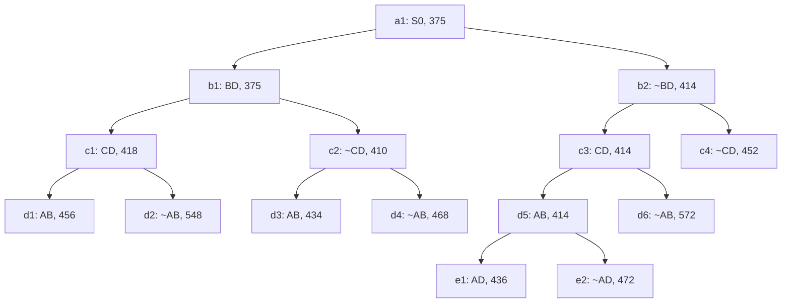

## The Question

A TSP Branch-and-Bound run stops the moment it *discovers* the optimal tour. The tree below is that snapshot. Each node shows an edge decision (`BD` = include edge B–D, `~BD` = exclude it), a lower-bound cost, and a reference number (used for ties).

| # | Question | Official answer |
|---|----------|-----------------|
| 2.1 | How many nodes were **refined** to discover the optimal tour? | `7` |
| 2.2 | Node of the optimal tour + its cost | `d3,434` |
| 2.3 | Number of cities | `5` |
| 2.4 | Optimal tour from city A | `A,B,D,E,C` |

## The Topic in 60 Seconds

- Every tree node = a **set of candidate tours** sharing the include/exclude decisions on the path from the root. Its number = a **lower bound** on any tour in that set.
- **Refining** a node = removing it from the open list and inserting its two children (include / exclude one more edge). Bounds only ever **increase** going down.
- A node with **no children** in the snapshot = a finished branch — either a complete **tour** (leaf) or a dead end.
- The algorithm always refines the **cheapest open node** (ties → reference number). The run ends when a *tour* is popped and no open node has a smaller bound.

> Deep-dive: [Reading BnB Trees](/concepts/week-05-optimal-tsp/01-bnb-tree-reading), [Branch and Bound](/concepts/week-03-heuristic-search/05-branch-and-bound), [TSP](/concepts/week-03-heuristic-search/04-tsp).

## 2.1 — Nodes refined → `7`

Simulate the priority queue. **Internal** nodes get refined (children added); **leaves** of the snapshot are tours — they are *selected*, not refined.

| Pop # | Queue (min first) | Action |
|-------|-------------------|--------|
| 1 | a1 : 375 | refine → add b1(375), b2(414) |
| 2 | b1 : 375, b2 : 414 | refine b1 → add c1(418), c2(410) |
| 3 | c2 : 410, b2 : 414, c1 : 418 | refine c2 → add **d3(434)**, d4(468) |
| 4 | b2 : 414, c1 : 418, d3 : 434, d4 : 468 | refine b2 → add c3(414), c4(452) |
| 5 | c3 : 414, c1 : 418, d3 : 434, d4 : 468, c4 : 452 | refine c3 → add d5(414), d6(572) |
| 6 | d5 : 414, c1 : 418, d3 : 434, e1 : 436, d4 : 468, c4 : 452, e2 : 472, d6 : 572 | refine d5 → add e1(436), e2(472) |
| 7 | c1 : 418, d3 : 434, e1 : 436, c4 : 452, d4 : 468, e2 : 472, d6 : 572, d1 : 456, d2 : 548 | refine c1 → add d1(456), d2(548) |
| 8 | **d3 : 434** is the minimum and a **leaf** | tour discovered — stop |

Refined (internal) nodes: **a1, b1, c2, b2, c3, d5, c1 = 7** ✓ (the 8th pop, d3, is the tour itself — selected, not refined).

## 2.2 — Optimal tour node and cost → `d3,434`

At pop #8, `d3` (bound 434) is a **leaf**, and every other open node is ≥ 436. No tour cheaper than 434 can exist anywhere else, so **d3 = optimal tour, cost 434**.

<Callout type="tip" title="Leaf vs internal — read the drawing, not the algorithm">
d5 (414) *looks* cheaper than d3 (434), but d5 has children in the snapshot — it was refined, so it is not a tour. Only childless nodes can be tours. This is exactly how the paper separates the two.
</Callout>

## 2.3 — Number of cities → `5`

Reconstruct the tour that d3's decisions force. Along the root→d3 path: **BD included, CD excluded, AB included**.

- Degrees so far: A–1, B–2 (full), C–0, D–1.
- B is done. C can't use CD, so C must connect to A and E; D must connect to E.
- The completion is forced: **A–B–D–E–C–A**.

That tour visits **5 distinct cities** — and a 4-city attempt is impossible (C would be left with degree < 2 once CD is excluded). So the instance has **5 cities**.

## 2.4 — Optimal tour from A → `A,B,D,E,C`

The forced completion above *is* the tour: **A, B, D, E, C** (back to A implied). The paper also accepted the reverse rotation A,C,E,D,B — same cycle, opposite direction.

Interactive view of the tree — the refined nodes are amber, the winning leaf d3 is green:

<Graph
  height={460}
  nodeWidth={110}
  nodeHeight={56}
  nodeFontSize={12}
  layout={{ name: "preset" }}
  elements={[
    { data: { id: "a1", label: "a1: S0 375", type: "current" }, position: { x: 400, y: 30 } },
    { data: { id: "b1", label: "b1: BD 375", type: "current" }, position: { x: 200, y: 120 } },
    { data: { id: "b2", label: "b2: ~BD 414", type: "current" }, position: { x: 620, y: 120 } },
    { data: { id: "c1", label: "c1: CD 418", type: "current" }, position: { x: 60, y: 210 } },
    { data: { id: "c2", label: "c2: ~CD 410", type: "current" }, position: { x: 300, y: 210 } },
    { data: { id: "c3", label: "c3: CD 414", type: "current" }, position: { x: 540, y: 210 } },
    { data: { id: "c4", label: "c4: ~CD 452" }, position: { x: 740, y: 210 } },
    { data: { id: "d1", label: "d1: AB 456" }, position: { x: 10, y: 300 } },
    { data: { id: "d2", label: "d2: ~AB 548" }, position: { x: 130, y: 300 } },
    { data: { id: "d3", label: "d3: AB 434 ✓", type: "path" }, position: { x: 260, y: 300 } },
    { data: { id: "d4", label: "d4: ~AB 468" }, position: { x: 380, y: 300 } },
    { data: { id: "d5", label: "d5: AB 414", type: "current" }, position: { x: 500, y: 300 } },
    { data: { id: "d6", label: "d6: ~AB 572" }, position: { x: 620, y: 300 } },
    { data: { id: "e1", label: "e1: AD 436" }, position: { x: 450, y: 390 } },
    { data: { id: "e2", label: "e2: ~AD 472" }, position: { x: 570, y: 390 } },
    { data: { id: "x1", source: "a1", target: "b1" } },
    { data: { id: "x2", source: "a1", target: "b2" } },
    { data: { id: "x3", source: "b1", target: "c1" } },
    { data: { id: "x4", source: "b1", target: "c2" } },
    { data: { id: "x5", source: "b2", target: "c3" } },
    { data: { id: "x6", source: "b2", target: "c4" } },
    { data: { id: "x7", source: "c1", target: "d1" } },
    { data: { id: "x8", source: "c1", target: "d2" } },
    { data: { id: "x9", source: "c2", target: "d3" } },
    { data: { id: "x10", source: "c2", target: "d4" } },
    { data: { id: "x11", source: "c3", target: "d5" } },
    { data: { id: "x12", source: "c3", target: "d6" } },
    { data: { id: "x13", source: "d5", target: "e1" } },
    { data: { id: "x14", source: "d5", target: "e2" } },
  ]}
/>

*Amber = the 7 refined nodes (pop order: a1, b1, c2, b2, c3, d5, c1). Green = d3, the optimal tour at 434.*

## Tricks & Tips for This Question Family

<Accordion title="The 4 standard subquestions — and how to hit each fast">
1. **Refine order / count:** maintain a sorted list of (cost, ref#). Pop → if the node has children *in the snapshot*, it counts as refined. Stop counting when a childless node reaches the front.
2. **Optimal tour node:** the **cheapest childless node** that gets popped. Cross-check: its bound must be ≤ every remaining open bound.
3. **Number of cities:** reconstruct the tour forced by the winner's include/exclude chain and count distinct letters. Watch for excluded edges that force detours — that's where the "hidden" city (here E) comes from.
4. **Tour path:** rotate the reconstructed cycle to start at the requested city. Both directions are usually accepted.
</Accordion>

<Accordion title="Common pitfalls">
- **Don't count the tour pop as a refinement.** Refined = expanded into two children. d3 was popped, never refined.
- **Don't trust the smallest number in the picture** (d5's 414) — internal nodes are bounds, not tours.
- **Ties:** equal bounds are broken by reference numbers (a1 < b1 < b2 < c1…), which is what fixes the refine order uniquely.
</Accordion>

**Answers:** 2.1 `7` · 2.2 `d3,434` · 2.3 `5` · 2.4 `A,B,D,E,C`
