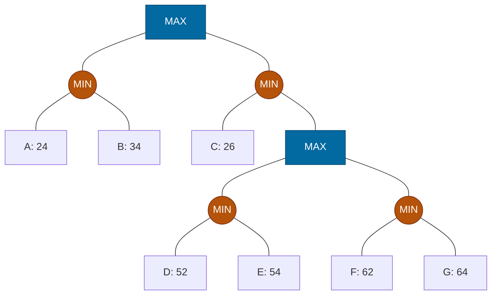

## The Question

A game tree with evaluation values at the horizon nodes A–G. Squares = MAX to move, circles = MIN to move. Tie-breaker: deepest node first, then leftmost.

*Rectangles = MAX to move, circles = MIN to move.*

| # | Question | Official answer |
|---|----------|-----------------|
| 3.1 | Which of the following is a strategy for MAX? (A: C,D,E · B: A,C · C: A,B · D: A,D,F) | **A and C** |
| 3.2 | Horizon nodes in MAX's best strategy | `C,F,G` |
| 3.3 | Horizon nodes pruned by Alpha-Beta | `F,G` |
| 3.4 | Horizon nodes SOLVED by SSS* | `A,C,D,E` |

## The Topic in 60 Seconds

**Minimax backup:** MAX nodes take the max of their children, MIN nodes take the min. Leaves already hold their evals.

**Strategy for MAX** = a complete plan: at **every MAX node pick exactly one child**; the set must not split across two children of any MAX node. MIN's replies stay inside the set — every leaf the opponent can force lands in it.

**Best strategy** = the valid strategy whose *worst* leaf is best:
$$\text{value(strategy)} = \min(\text{evals of its leaves}), \qquad \text{best strategy maximizes this}$$
Its guarantee equals the **minimax value of the root**.

**Alpha-Beta** prunes with a window $(\alpha, \beta)$: cut the remaining children the moment $\alpha \ge \beta$ (β-cutoff at a MAX node, α-cutoff at a MIN node).

**SSS\*** solves leaves by *proving* values top-down; leaves it never needs to touch are never solved.

> Deep-dive: [Minimax](/concepts/week-07-game-search/01-minimax), [Game Strategies](/concepts/week-07-game-search/03-game-strategies), [Alpha-Beta Pruning](/concepts/week-07-game-search/02-alpha-beta-pruning), [SSS*](/concepts/week-03-heuristic-search/03-sss-star).

## Step 0 — Back up the tree

Work bottom-up:

- $N_1 = \min(A, B) = \min(24, 34) = 24$
- $P_1 = \min(52, 54) = 52$, $\quad P_2 = \min(62, 64) = 62$
- $M = \max(P_1, P_2) = 62$
- $N_2 = \min(C, M) = \min(26, 62) = 26$
- $\text{Root} = \max(N_1, N_2) = \max(24, 26) = \mathbf{26}$ (via $N_2$, then $C$)

## 3.1 — Valid strategies → **A (C,D,E) and C (A,B)**

Apply the split test — *leaves under any MAX node must come from a single child of it*:

| Option | Check | Verdict |
|--------|-------|---------|
| **A: C,D,E** | Root: C via N₂, D,E via N₂ ✓ (all one child). M: D,E via P₁ only ✓ | **Valid** |
| B: A,C | Root: A via N₁ but C via N₂ — **split!** | Invalid |
| **C: A,B** | Root: both via N₁ ✓. N₁ is MIN — both its leaves included ✓ | **Valid** |
| D: A,D,F | Root: A via N₁, D,F via N₂ — **split!** | Invalid |

<Callout type="tip" title="Reading a strategy set">
A legal set = *one committed choice per MAX node*, with MIN's alternatives kept whole. `A,B` = "MAX goes left at the root" (MIN may pick A or B). `C,D,E` = "MAX goes right at the root, and if MIN hands over M, MAX commits to P₁" (C, or the pair D/E).
</Callout>

## 3.2 — Best strategy → `C,F,G`

The root value 26 is achieved through $N_2$:

- Root (MAX) commits to $N_2$.
- $N_2$ (MIN) keeps **all** its children: C and the M subtree.
- M (MAX) commits to $P_2$ (62 beats 52).
- $P_2$ (MIN) keeps **all**: F and G.

Horizon set: **C, F, G** — guarantee $\min(26, 62, 64) = 26$ = the minimax value ✓.

## 3.3 — Alpha-Beta prunes → `F,G`

Left-to-right, depth-first. Root MAX starts with $\alpha = -\infty$.

| Node | Window | Result |
|------|--------|--------|
| $N_1$ (MIN) | $(-\infty, +\infty)$ | A: 24 → $\beta_{N_1}=24$; B: 34 no change. Returns **24** |
| Root | $\alpha = 24$ | — |
| $N_2$ (MIN) | $(24, +\infty)$ | C: 26 → $\beta_{N_2}=26$; continue (24 < 26) |
| $M$ (MAX) | $(24, 26)$ | $P_1$ (MIN): D=52, E=54 → **52**; $\alpha_M = \max(24, 52) = 52 \ge \beta_M = 26$ → **β-cutoff!** |
| $P_2$ | pruned | **F, G never inspected** ✓ |

$M$ already has 52, which its MIN parent $N_2$ will never take (26 is smaller) — so $P_2$'s whole subtree is irrelevant. **Pruned: F, G.**

Step through the full α-β trace — the window $(\alpha, \beta)$ is written at every node, exactly as you'd annotate the exam paper:

<StepGraph
  height={430}
  nodeWidth={100}
  nodeHeight={50}
  nodeFontSize={12}
  legend={[
    { color: "#0369a1", label: "MAX (square)" },
    { color: "#b45309", label: "MIN (circle)" },
    { color: "#b45309", label: "inspected leaf" },
    { color: "#4b5563", label: "pruned" },
    { color: "#16a34a", label: "value flows to root" },
  ]}
  steps={[
    {
      label: "1 · descend to N1",
      note: "Root MAX: α = −∞, β = +∞.\nDescend left into N1 (MIN), window inherited.",
      elements: [
        { data: { id: "R", label: "MAX", type: "max" }, position: { x: 400, y: 20 } },
        { data: { id: "N1", label: "MIN", type: "current" }, position: { x: 150, y: 120 } },
        { data: { id: "N2", label: "MIN", type: "min" }, position: { x: 650, y: 120 } },
        { data: { id: "A", label: "A: 24" }, position: { x: 40, y: 230 } },
        { data: { id: "B", label: "B: 34" }, position: { x: 170, y: 230 } },
        { data: { id: "C", label: "C: 26" }, position: { x: 520, y: 230 } },
        { data: { id: "M", label: "MAX", type: "max" }, position: { x: 780, y: 230 } },
        { data: { id: "P1", label: "MIN", type: "min" }, position: { x: 680, y: 330 } },
        { data: { id: "P2", label: "MIN", type: "min" }, position: { x: 900, y: 330 } },
        { data: { id: "D", label: "D: 52" }, position: { x: 600, y: 430 } },
        { data: { id: "E", label: "E: 54" }, position: { x: 740, y: 430 } },
        { data: { id: "F", label: "F: 62" }, position: { x: 850, y: 430 } },
        { data: { id: "G", label: "G: 64" }, position: { x: 970, y: 430 } },
        { data: { id: "e1", source: "R", target: "N1" } },
        { data: { id: "e2", source: "R", target: "N2" } },
        { data: { id: "e3", source: "N1", target: "A" } },
        { data: { id: "e4", source: "N1", target: "B" } },
        { data: { id: "e5", source: "N2", target: "C" } },
        { data: { id: "e6", source: "N2", target: "M" } },
        { data: { id: "e7", source: "M", target: "P1" } },
        { data: { id: "e8", source: "M", target: "P2" } },
        { data: { id: "e9", source: "P1", target: "D" } },
        { data: { id: "e10", source: "P1", target: "E" } },
        { data: { id: "e11", source: "P2", target: "F" } },
        { data: { id: "e12", source: "P2", target: "G" } },
      ],
    },
    {
      label: "2 · N1: A=24",
      note: "N1 (MIN): first child A = 24 → β(N1) = 24.\nα(−∞) < 24 → keep going.",
      elements: [
        { data: { id: "R", label: "MAX", type: "max" }, position: { x: 400, y: 20 } },
        { data: { id: "N1", label: "MIN β=24", type: "current" }, position: { x: 150, y: 120 } },
        { data: { id: "N2", label: "MIN", type: "min" }, position: { x: 650, y: 120 } },
        { data: { id: "A", label: "A: 24", type: "path" }, position: { x: 40, y: 230 } },
        { data: { id: "B", label: "B: 34" }, position: { x: 170, y: 230 } },
        { data: { id: "C", label: "C: 26" }, position: { x: 520, y: 230 } },
        { data: { id: "M", label: "MAX", type: "max" }, position: { x: 780, y: 230 } },
        { data: { id: "P1", label: "MIN", type: "min" }, position: { x: 680, y: 330 } },
        { data: { id: "P2", label: "MIN", type: "min" }, position: { x: 900, y: 330 } },
        { data: { id: "D", label: "D: 52" }, position: { x: 600, y: 430 } },
        { data: { id: "E", label: "E: 54" }, position: { x: 740, y: 430 } },
        { data: { id: "F", label: "F: 62" }, position: { x: 850, y: 430 } },
        { data: { id: "G", label: "G: 64" }, position: { x: 970, y: 430 } },
        { data: { id: "e1", source: "R", target: "N1" } },
        { data: { id: "e2", source: "R", target: "N2" } },
        { data: { id: "e3", source: "N1", target: "A" } },
        { data: { id: "e4", source: "N1", target: "B" } },
        { data: { id: "e5", source: "N2", target: "C" } },
        { data: { id: "e6", source: "N2", target: "M" } },
        { data: { id: "e7", source: "M", target: "P1" } },
        { data: { id: "e8", source: "M", target: "P2" } },
        { data: { id: "e9", source: "P1", target: "D" } },
        { data: { id: "e10", source: "P1", target: "E" } },
        { data: { id: "e11", source: "P2", target: "F" } },
        { data: { id: "e12", source: "P2", target: "G" } },
      ],
    },
    {
      label: "3 · N1 returns 24",
      note: "B = 34 → no change (min stays 24).\nN1 = 24. Root: α = max(−∞, 24) = 24.",
      elements: [
        { data: { id: "R", label: "MAX α=24", type: "current" }, position: { x: 400, y: 20 } },
        { data: { id: "N1", label: "MIN =24", type: "path" }, position: { x: 150, y: 120 } },
        { data: { id: "N2", label: "MIN", type: "min" }, position: { x: 650, y: 120 } },
        { data: { id: "A", label: "A: 24", type: "path" }, position: { x: 40, y: 230 } },
        { data: { id: "B", label: "B: 34", type: "explored" }, position: { x: 170, y: 230 } },
        { data: { id: "C", label: "C: 26" }, position: { x: 520, y: 230 } },
        { data: { id: "M", label: "MAX", type: "max" }, position: { x: 780, y: 230 } },
        { data: { id: "P1", label: "MIN", type: "min" }, position: { x: 680, y: 330 } },
        { data: { id: "P2", label: "MIN", type: "min" }, position: { x: 900, y: 330 } },
        { data: { id: "D", label: "D: 52" }, position: { x: 600, y: 430 } },
        { data: { id: "E", label: "E: 54" }, position: { x: 740, y: 430 } },
        { data: { id: "F", label: "F: 62" }, position: { x: 850, y: 430 } },
        { data: { id: "G", label: "G: 64" }, position: { x: 970, y: 430 } },
        { data: { id: "e1", source: "R", target: "N1" } },
        { data: { id: "e2", source: "R", target: "N2" } },
        { data: { id: "e3", source: "N1", target: "A" } },
        { data: { id: "e4", source: "N1", target: "B" } },
        { data: { id: "e5", source: "N2", target: "C" } },
        { data: { id: "e6", source: "N2", target: "M" } },
        { data: { id: "e7", source: "M", target: "P1" } },
        { data: { id: "e8", source: "M", target: "P2" } },
        { data: { id: "e9", source: "P1", target: "D" } },
        { data: { id: "e10", source: "P1", target: "E" } },
        { data: { id: "e11", source: "P2", target: "F" } },
        { data: { id: "e12", source: "P2", target: "G" } },
      ],
    },
    {
      label: "4 · N2: C=26",
      note: "N2 (MIN) window (24, +∞): C = 26 → β(N2) = 26.\n24 < 26 → descend into M with window (24, 26).",
      elements: [
        { data: { id: "R", label: "MAX α=24", type: "max" }, position: { x: 400, y: 20 } },
        { data: { id: "N1", label: "MIN =24", type: "path" }, position: { x: 150, y: 120 } },
        { data: { id: "N2", label: "MIN β=26", type: "current" }, position: { x: 650, y: 120 } },
        { data: { id: "A", label: "A: 24", type: "path" }, position: { x: 40, y: 230 } },
        { data: { id: "B", label: "B: 34", type: "explored" }, position: { x: 170, y: 230 } },
        { data: { id: "C", label: "C: 26", type: "path" }, position: { x: 520, y: 230 } },
        { data: { id: "M", label: "MAX", type: "max" }, position: { x: 780, y: 230 } },
        { data: { id: "P1", label: "MIN", type: "min" }, position: { x: 680, y: 330 } },
        { data: { id: "P2", label: "MIN", type: "min" }, position: { x: 900, y: 330 } },
        { data: { id: "D", label: "D: 52" }, position: { x: 600, y: 430 } },
        { data: { id: "E", label: "E: 54" }, position: { x: 740, y: 430 } },
        { data: { id: "F", label: "F: 62" }, position: { x: 850, y: 430 } },
        { data: { id: "G", label: "G: 64" }, position: { x: 970, y: 430 } },
        { data: { id: "e1", source: "R", target: "N1" } },
        { data: { id: "e2", source: "R", target: "N2" } },
        { data: { id: "e3", source: "N1", target: "A" } },
        { data: { id: "e4", source: "N1", target: "B" } },
        { data: { id: "e5", source: "N2", target: "C" } },
        { data: { id: "e6", source: "N2", target: "M" } },
        { data: { id: "e7", source: "M", target: "P1" } },
        { data: { id: "e8", source: "M", target: "P2" } },
        { data: { id: "e9", source: "P1", target: "D" } },
        { data: { id: "e10", source: "P1", target: "E" } },
        { data: { id: "e11", source: "P2", target: "F" } },
        { data: { id: "e12", source: "P2", target: "G" } },
      ],
    },
    {
      label: "5 · M: P1 → D=52",
      note: "M (MAX) window (24, 26).\nP1 (MIN): D = 52 → provisional P1 = 52.",
      elements: [
        { data: { id: "R", label: "MAX α=24", type: "max" }, position: { x: 400, y: 20 } },
        { data: { id: "N1", label: "MIN =24", type: "path" }, position: { x: 150, y: 120 } },
        { data: { id: "N2", label: "MIN β=26", type: "min" }, position: { x: 650, y: 120 } },
        { data: { id: "A", label: "A: 24", type: "path" }, position: { x: 40, y: 230 } },
        { data: { id: "B", label: "B: 34", type: "explored" }, position: { x: 170, y: 230 } },
        { data: { id: "C", label: "C: 26", type: "path" }, position: { x: 520, y: 230 } },
        { data: { id: "M", label: "MAX 24,26", type: "current" }, position: { x: 780, y: 230 } },
        { data: { id: "P1", label: "MIN 52", type: "current" }, position: { x: 680, y: 330 } },
        { data: { id: "P2", label: "MIN", type: "min" }, position: { x: 900, y: 330 } },
        { data: { id: "D", label: "D: 52", type: "path" }, position: { x: 600, y: 430 } },
        { data: { id: "E", label: "E: 54" }, position: { x: 740, y: 430 } },
        { data: { id: "F", label: "F: 62" }, position: { x: 850, y: 430 } },
        { data: { id: "G", label: "G: 64" }, position: { x: 970, y: 430 } },
        { data: { id: "e1", source: "R", target: "N1" } },
        { data: { id: "e2", source: "R", target: "N2" } },
        { data: { id: "e3", source: "N1", target: "A" } },
        { data: { id: "e4", source: "N1", target: "B" } },
        { data: { id: "e5", source: "N2", target: "C" } },
        { data: { id: "e6", source: "N2", target: "M" } },
        { data: { id: "e7", source: "M", target: "P1" } },
        { data: { id: "e8", source: "M", target: "P2" } },
        { data: { id: "e9", source: "P1", target: "D" } },
        { data: { id: "e10", source: "P1", target: "E" } },
        { data: { id: "e11", source: "P2", target: "F" } },
        { data: { id: "e12", source: "P2", target: "G" } },
      ],
    },
    {
      label: "6 · β-cutoff at M!",
      note: "E = 54 → P1 = 52.\nM: α = max(24, 52) = 52 ≥ β = 26 → β-CUTOFF.\nP2 (F, G) pruned — N2 would never take 52 over 26.",
      elements: [
        { data: { id: "R", label: "MAX α=24", type: "max" }, position: { x: 400, y: 20 } },
        { data: { id: "N1", label: "MIN =24", type: "path" }, position: { x: 150, y: 120 } },
        { data: { id: "N2", label: "MIN β=26", type: "current" }, position: { x: 650, y: 120 } },
        { data: { id: "A", label: "A: 24", type: "path" }, position: { x: 40, y: 230 } },
        { data: { id: "B", label: "B: 34", type: "explored" }, position: { x: 170, y: 230 } },
        { data: { id: "C", label: "C: 26", type: "path" }, position: { x: 520, y: 230 } },
        { data: { id: "M", label: "MAX ≥52 ✂", type: "current" }, position: { x: 780, y: 230 } },
        { data: { id: "P1", label: "MIN =52", type: "path" }, position: { x: 680, y: 330 } },
        { data: { id: "P2", label: "MIN ✂", type: "explored" }, position: { x: 900, y: 330 } },
        { data: { id: "D", label: "D: 52", type: "path" }, position: { x: 600, y: 430 } },
        { data: { id: "E", label: "E: 54", type: "explored" }, position: { x: 740, y: 430 } },
        { data: { id: "F", label: "F: 62 ✂", type: "explored" }, position: { x: 850, y: 430 } },
        { data: { id: "G", label: "G: 64 ✂", type: "explored" }, position: { x: 970, y: 430 } },
        { data: { id: "e1", source: "R", target: "N1" } },
        { data: { id: "e2", source: "R", target: "N2" } },
        { data: { id: "e3", source: "N1", target: "A" } },
        { data: { id: "e4", source: "N1", target: "B" } },
        { data: { id: "e5", source: "N2", target: "C" } },
        { data: { id: "e6", source: "N2", target: "M" } },
        { data: { id: "e7", source: "M", target: "P1" } },
        { data: { id: "e8", source: "M", target: "P2" } },
        { data: { id: "e9", source: "P1", target: "D" } },
        { data: { id: "e10", source: "P1", target: "E" } },
        { data: { id: "e11", source: "P2", target: "F" } },
        { data: { id: "e12", source: "P2", target: "G" } },
      ],
    },
    {
      label: "7 · Root = 26",
      note: "N2 = min(26, ≥26) = 26.\nRoot = max(24, 26) = 26 via N2.\nInspected: A, B, C, D, E. Pruned: F, G.",
      elements: [
        { data: { id: "R", label: "MAX =26 ✓", type: "path" }, position: { x: 400, y: 20 } },
        { data: { id: "N1", label: "MIN =24", type: "path" }, position: { x: 150, y: 120 } },
        { data: { id: "N2", label: "MIN =26", type: "path" }, position: { x: 650, y: 120 } },
        { data: { id: "A", label: "A: 24", type: "path" }, position: { x: 40, y: 230 } },
        { data: { id: "B", label: "B: 34", type: "explored" }, position: { x: 170, y: 230 } },
        { data: { id: "C", label: "C: 26", type: "path" }, position: { x: 520, y: 230 } },
        { data: { id: "M", label: "MAX", type: "max" }, position: { x: 780, y: 230 } },
        { data: { id: "P1", label: "MIN =52", type: "explored" }, position: { x: 680, y: 330 } },
        { data: { id: "P2", label: "MIN ✂", type: "explored" }, position: { x: 900, y: 330 } },
        { data: { id: "D", label: "D: 52", type: "explored" }, position: { x: 600, y: 430 } },
        { data: { id: "E", label: "E: 54", type: "explored" }, position: { x: 740, y: 430 } },
        { data: { id: "F", label: "F: 62 ✂", type: "explored" }, position: { x: 850, y: 430 } },
        { data: { id: "G", label: "G: 64 ✂", type: "explored" }, position: { x: 970, y: 430 } },
        { data: { id: "e1", source: "R", target: "N1" } },
        { data: { id: "e2", source: "R", target: "N2", type: "path" } },
        { data: { id: "e3", source: "N1", target: "A" } },
        { data: { id: "e4", source: "N1", target: "B" } },
        { data: { id: "e5", source: "N2", target: "C" } },
        { data: { id: "e6", source: "N2", target: "M" } },
        { data: { id: "e7", source: "M", target: "P1" } },
        { data: { id: "e8", source: "M", target: "P2" } },
        { data: { id: "e9", source: "P1", target: "D" } },
        { data: { id: "e10", source: "P1", target: "E" } },
        { data: { id: "e11", source: "P2", target: "F" } },
        { data: { id: "e12", source: "P2", target: "G" } },
      ],
    },
  ]}
/>

## 3.4 — SSS* solves → `A,C,D,E`

SSS* processes the *most promising* line first, proving values:

1. **A solved** with 24 → $N_1$ can do no worse than… wait, MIN wants *low*: B (34) is LIVE with bound 24 but 34 > 24 can't improve → **B discarded**.
2. $N_1$ **solved at 24**. Root's other child $N_2$ (bound ∞) is now the only hope for MAX.
3. **C solved** with 26 → $N_2 \le 26$. M is LIVE with bound 26 (MAX needs to *prove* ≥ 26).
4. $P_1$'s leaves: **D solved** (52 ≥ 26, proves its point), **E solved** (54, same).
5. $P_1 = 52 \ge 26$ ⟹ $M \ge 26$ **proven** — $P_2$ (F, G) is never expanded.

Solved horizon nodes: **A, C, D, E** ✓ — B was discarded, F and G were never needed.

SSS* processes the *most promising* line first, proving values top-down. Step through it:

<StepGraph
  height={430}
  nodeWidth={100}
  nodeHeight={50}
  nodeFontSize={12}
  legend={[
    { color: "#0369a1", label: "MAX (square)" },
    { color: "#b45309", label: "MIN (circle)" },
    { color: "#16a34a", label: "SOLVED" },
    { color: "#4b5563", label: "discarded / never expanded" },
  ]}
  steps={[
    {
      label: "1 · solve A=24",
      note: "Merit order → leftmost line first.\nA SOLVED with 24 → N1 ≤ 24.",
      elements: [
        { data: { id: "R", label: "MAX", type: "max" }, position: { x: 400, y: 20 } },
        { data: { id: "N1", label: "MIN ≤24", type: "current" }, position: { x: 150, y: 120 } },
        { data: { id: "N2", label: "MIN", type: "min" }, position: { x: 650, y: 120 } },
        { data: { id: "A", label: "A: 24 ✓", type: "path" }, position: { x: 40, y: 230 } },
        { data: { id: "B", label: "B: 34", type: "frontier" }, position: { x: 170, y: 230 } },
        { data: { id: "C", label: "C: 26", type: "frontier" }, position: { x: 520, y: 230 } },
        { data: { id: "M", label: "MAX", type: "max" }, position: { x: 780, y: 230 } },
        { data: { id: "P1", label: "MIN", type: "min" }, position: { x: 680, y: 330 } },
        { data: { id: "P2", label: "MIN", type: "min" }, position: { x: 900, y: 330 } },
        { data: { id: "D", label: "D: 52" }, position: { x: 600, y: 430 } },
        { data: { id: "E", label: "E: 54" }, position: { x: 740, y: 430 } },
        { data: { id: "F", label: "F: 62" }, position: { x: 850, y: 430 } },
        { data: { id: "G", label: "G: 64" }, position: { x: 970, y: 430 } },
        { data: { id: "e1", source: "R", target: "N1" } },
        { data: { id: "e2", source: "R", target: "N2" } },
        { data: { id: "e3", source: "N1", target: "A" } },
        { data: { id: "e4", source: "N1", target: "B" } },
        { data: { id: "e5", source: "N2", target: "C" } },
        { data: { id: "e6", source: "N2", target: "M" } },
        { data: { id: "e7", source: "M", target: "P1" } },
        { data: { id: "e8", source: "M", target: "P2" } },
        { data: { id: "e9", source: "P1", target: "D" } },
        { data: { id: "e10", source: "P1", target: "E" } },
        { data: { id: "e11", source: "P2", target: "F" } },
        { data: { id: "e12", source: "P2", target: "G" } },
      ],
    },
    {
      label: "2 · B discarded",
      note: "B live with bound 24: eval 34 > 24 → can never improve N1 → DISCARDED.\nN1 SOLVED = 24.",
      elements: [
        { data: { id: "R", label: "MAX", type: "max" }, position: { x: 400, y: 20 } },
        { data: { id: "N1", label: "MIN =24 ✓", type: "path" }, position: { x: 150, y: 120 } },
        { data: { id: "N2", label: "MIN", type: "current" }, position: { x: 650, y: 120 } },
        { data: { id: "A", label: "A: 24 ✓", type: "path" }, position: { x: 40, y: 230 } },
        { data: { id: "B", label: "B: 34 ✗", type: "explored" }, position: { x: 170, y: 230 } },
        { data: { id: "C", label: "C: 26", type: "frontier" }, position: { x: 520, y: 230 } },
        { data: { id: "M", label: "MAX", type: "max" }, position: { x: 780, y: 230 } },
        { data: { id: "P1", label: "MIN", type: "min" }, position: { x: 680, y: 330 } },
        { data: { id: "P2", label: "MIN", type: "min" }, position: { x: 900, y: 330 } },
        { data: { id: "D", label: "D: 52" }, position: { x: 600, y: 430 } },
        { data: { id: "E", label: "E: 54" }, position: { x: 740, y: 430 } },
        { data: { id: "F", label: "F: 62" }, position: { x: 850, y: 430 } },
        { data: { id: "G", label: "G: 64" }, position: { x: 970, y: 430 } },
        { data: { id: "e1", source: "R", target: "N1" } },
        { data: { id: "e2", source: "R", target: "N2" } },
        { data: { id: "e3", source: "N1", target: "A" } },
        { data: { id: "e4", source: "N1", target: "B" } },
        { data: { id: "e5", source: "N2", target: "C" } },
        { data: { id: "e6", source: "N2", target: "M" } },
        { data: { id: "e7", source: "M", target: "P1" } },
        { data: { id: "e8", source: "M", target: "P2" } },
        { data: { id: "e9", source: "P1", target: "D" } },
        { data: { id: "e10", source: "P1", target: "E" } },
        { data: { id: "e11", source: "P2", target: "F" } },
        { data: { id: "e12", source: "P2", target: "G" } },
      ],
    },
    {
      label: "3 · solve C=26",
      note: "Next line: N2 (bound ∞).\nC SOLVED with 26 → N2 ≤ 26. M live with bound 26 (MAX must prove ≥ 26).",
      elements: [
        { data: { id: "R", label: "MAX", type: "max" }, position: { x: 400, y: 20 } },
        { data: { id: "N1", label: "MIN =24 ✓", type: "path" }, position: { x: 150, y: 120 } },
        { data: { id: "N2", label: "MIN ≤26", type: "current" }, position: { x: 650, y: 120 } },
        { data: { id: "A", label: "A: 24 ✓", type: "path" }, position: { x: 40, y: 230 } },
        { data: { id: "B", label: "B: 34 ✗", type: "explored" }, position: { x: 170, y: 230 } },
        { data: { id: "C", label: "C: 26 ✓", type: "path" }, position: { x: 520, y: 230 } },
        { data: { id: "M", label: "MAX ?26", type: "frontier" }, position: { x: 780, y: 230 } },
        { data: { id: "P1", label: "MIN", type: "min" }, position: { x: 680, y: 330 } },
        { data: { id: "P2", label: "MIN", type: "min" }, position: { x: 900, y: 330 } },
        { data: { id: "D", label: "D: 52" }, position: { x: 600, y: 430 } },
        { data: { id: "E", label: "E: 54" }, position: { x: 740, y: 430 } },
        { data: { id: "F", label: "F: 62" }, position: { x: 850, y: 430 } },
        { data: { id: "G", label: "G: 64" }, position: { x: 970, y: 430 } },
        { data: { id: "e1", source: "R", target: "N1" } },
        { data: { id: "e2", source: "R", target: "N2" } },
        { data: { id: "e3", source: "N1", target: "A" } },
        { data: { id: "e4", source: "N1", target: "B" } },
        { data: { id: "e5", source: "N2", target: "C" } },
        { data: { id: "e6", source: "N2", target: "M" } },
        { data: { id: "e7", source: "M", target: "P1" } },
        { data: { id: "e8", source: "M", target: "P2" } },
        { data: { id: "e9", source: "P1", target: "D" } },
        { data: { id: "e10", source: "P1", target: "E" } },
        { data: { id: "e11", source: "P2", target: "F" } },
        { data: { id: "e12", source: "P2", target: "G" } },
      ],
    },
    {
      label: "4 · solve D, E",
      note: "P1's leaves: D = 52 ≥ 26 ✓ SOLVED, E = 54 ✓ SOLVED.\nP1 = min(52,54) = 52 ≥ 26.",
      elements: [
        { data: { id: "R", label: "MAX", type: "max" }, position: { x: 400, y: 20 } },
        { data: { id: "N1", label: "MIN =24 ✓", type: "path" }, position: { x: 150, y: 120 } },
        { data: { id: "N2", label: "MIN ≤26", type: "current" }, position: { x: 650, y: 120 } },
        { data: { id: "A", label: "A: 24 ✓", type: "path" }, position: { x: 40, y: 230 } },
        { data: { id: "B", label: "B: 34 ✗", type: "explored" }, position: { x: 170, y: 230 } },
        { data: { id: "C", label: "C: 26 ✓", type: "path" }, position: { x: 520, y: 230 } },
        { data: { id: "M", label: "MAX ?26", type: "frontier" }, position: { x: 780, y: 230 } },
        { data: { id: "P1", label: "MIN =52 ✓", type: "path" }, position: { x: 680, y: 330 } },
        { data: { id: "P2", label: "MIN", type: "frontier" }, position: { x: 900, y: 330 } },
        { data: { id: "D", label: "D: 52 ✓", type: "path" }, position: { x: 600, y: 430 } },
        { data: { id: "E", label: "E: 54 ✓", type: "path" }, position: { x: 740, y: 430 } },
        { data: { id: "F", label: "F: 62", type: "frontier" }, position: { x: 850, y: 430 } },
        { data: { id: "G", label: "G: 64", type: "frontier" }, position: { x: 970, y: 430 } },
        { data: { id: "e1", source: "R", target: "N1" } },
        { data: { id: "e2", source: "R", target: "N2" } },
        { data: { id: "e3", source: "N1", target: "A" } },
        { data: { id: "e4", source: "N1", target: "B" } },
        { data: { id: "e5", source: "N2", target: "C" } },
        { data: { id: "e6", source: "N2", target: "M" } },
        { data: { id: "e7", source: "M", target: "P1" } },
        { data: { id: "e8", source: "M", target: "P2" } },
        { data: { id: "e9", source: "P1", target: "D" } },
        { data: { id: "e10", source: "P1", target: "E" } },
        { data: { id: "e11", source: "P2", target: "F" } },
        { data: { id: "e12", source: "P2", target: "G" } },
      ],
    },
    {
      label: "5 · M proven, P2 untouched",
      note: "P1 = 52 ≥ bound 26 → M proven ≥ 26 WITHOUT expanding P2.\nF, G never leave the queue.",
      elements: [
        { data: { id: "R", label: "MAX", type: "max" }, position: { x: 400, y: 20 } },
        { data: { id: "N1", label: "MIN =24 ✓", type: "path" }, position: { x: 150, y: 120 } },
        { data: { id: "N2", label: "MIN =26 ✓", type: "path" }, position: { x: 650, y: 120 } },
        { data: { id: "A", label: "A: 24 ✓", type: "path" }, position: { x: 40, y: 230 } },
        { data: { id: "B", label: "B: 34 ✗", type: "explored" }, position: { x: 170, y: 230 } },
        { data: { id: "C", label: "C: 26 ✓", type: "path" }, position: { x: 520, y: 230 } },
        { data: { id: "M", label: "MAX ≥26 ✓", type: "path" }, position: { x: 780, y: 230 } },
        { data: { id: "P1", label: "MIN =52 ✓", type: "path" }, position: { x: 680, y: 330 } },
        { data: { id: "P2", label: "MIN —", type: "explored" }, position: { x: 900, y: 330 } },
        { data: { id: "D", label: "D: 52 ✓", type: "path" }, position: { x: 600, y: 430 } },
        { data: { id: "E", label: "E: 54 ✓", type: "path" }, position: { x: 740, y: 430 } },
        { data: { id: "F", label: "F: 62 —", type: "explored" }, position: { x: 850, y: 430 } },
        { data: { id: "G", label: "G: 64 —", type: "explored" }, position: { x: 970, y: 430 } },
        { data: { id: "e1", source: "R", target: "N1" } },
        { data: { id: "e2", source: "R", target: "N2", type: "path" } },
        { data: { id: "e3", source: "N1", target: "A" } },
        { data: { id: "e4", source: "N1", target: "B" } },
        { data: { id: "e5", source: "N2", target: "C" } },
        { data: { id: "e6", source: "N2", target: "M", type: "path" } },
        { data: { id: "e7", source: "M", target: "P1", type: "path" } },
        { data: { id: "e8", source: "M", target: "P2" } },
        { data: { id: "e9", source: "P1", target: "D" } },
        { data: { id: "e10", source: "P1", target: "E" } },
        { data: { id: "e11", source: "P2", target: "F" } },
        { data: { id: "e12", source: "P2", target: "G" } },
      ],
    },
    {
      label: "6 · Root = 26",
      note: "N2 = min(26, ≥26) = 26. Root = max(24, 26) = 26.\nSOLVED: A, C, D, E. Discarded: B. Never expanded: F, G.",
      elements: [
        { data: { id: "R", label: "MAX =26 ✓", type: "path" }, position: { x: 400, y: 20 } },
        { data: { id: "N1", label: "MIN =24 ✓", type: "path" }, position: { x: 150, y: 120 } },
        { data: { id: "N2", label: "MIN =26 ✓", type: "path" }, position: { x: 650, y: 120 } },
        { data: { id: "A", label: "A: 24 ✓", type: "path" }, position: { x: 40, y: 230 } },
        { data: { id: "B", label: "B: 34 ✗", type: "explored" }, position: { x: 170, y: 230 } },
        { data: { id: "C", label: "C: 26 ✓", type: "path" }, position: { x: 520, y: 230 } },
        { data: { id: "M", label: "MAX ≥26 ✓", type: "path" }, position: { x: 780, y: 230 } },
        { data: { id: "P1", label: "MIN =52 ✓", type: "path" }, position: { x: 680, y: 330 } },
        { data: { id: "P2", label: "MIN —", type: "explored" }, position: { x: 900, y: 330 } },
        { data: { id: "D", label: "D: 52 ✓", type: "path" }, position: { x: 600, y: 430 } },
        { data: { id: "E", label: "E: 54 ✓", type: "path" }, position: { x: 740, y: 430 } },
        { data: { id: "F", label: "F: 62 —", type: "explored" }, position: { x: 850, y: 430 } },
        { data: { id: "G", label: "G: 64 —", type: "explored" }, position: { x: 970, y: 430 } },
        { data: { id: "e1", source: "R", target: "N1" } },
        { data: { id: "e2", source: "R", target: "N2", type: "path" } },
        { data: { id: "e3", source: "N1", target: "A" } },
        { data: { id: "e4", source: "N1", target: "B" } },
        { data: { id: "e5", source: "N2", target: "C" } },
        { data: { id: "e6", source: "N2", target: "M", type: "path" } },
        { data: { id: "e7", source: "M", target: "P1", type: "path" } },
        { data: { id: "e8", source: "M", target: "P2" } },
        { data: { id: "e9", source: "P1", target: "D" } },
        { data: { id: "e10", source: "P1", target: "E" } },
        { data: { id: "e11", source: "P2", target: "F" } },
        { data: { id: "e12", source: "P2", target: "G" } },
      ],
    },
  ]}
/>

## Tricks & Tips for This Question Family

<Accordion title="Speed routines">
1. **Back up the whole tree first** — every subquestion (best strategy, pruning, SSS*) reads off the backed-up values.
2. **Strategy check in one line:** for each MAX node, do all set-leaves descend from *one* child? If yes for every MAX node → valid.
3. **Best strategy = walk down the value:** at MAX take the max child, at MIN keep *all* children, at MAX again take the max… collect leaves. Its minimum should equal the root value — instant self-check.
4. **Alpha-Beta:** write the window $(\alpha, \beta)$ at the top of every node as you enter it. Cutoff the instant $\alpha \ge \beta$. Equal values count.
5. **SSS\* vs Alpha-Beta:** SSS* may *discard* a leaf (B) that Alpha-Beta *inspected* — different questions, different sets. Solved = proven relevant; discarded = couldn't improve; pruned = never visited.
</Accordion>

**Answers:** 3.1 **A, C** · 3.2 `C,F,G` · 3.3 `F,G` · 3.4 `A,C,D,E`
