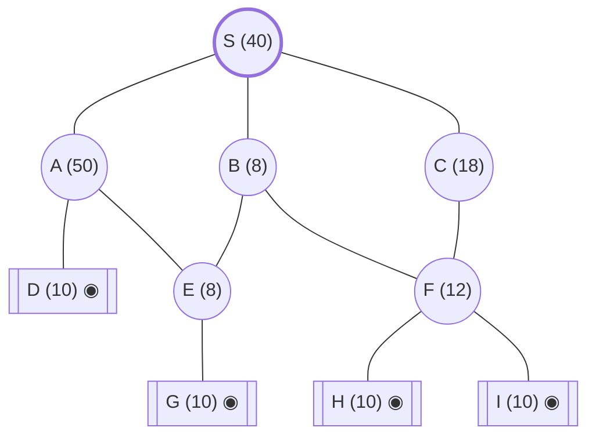

## The Question

An AND–OR graph: problem S decomposed into subproblems. Numbers = heuristic cost estimates; **double circles are primitive** (actual costs, born SOLVED, never expanded). Every edge costs **2**. Tie-breakers: node labels; for AND nodes expand the **highest-cost unsolved branch** first.

The **AND arcs** (from the figure): at **S**, the pair (S→B, S→C) is joined by an arc — S is solved by *B and C together*, **or** by A alone. At **A**: (A→D, A→E) AND. At **F**: (F→H, F→I) AND. B is an OR node over E and F; C has the single child F; E has the single child G.

| # | Question | Official answer |
|---|----------|-----------------|
| 4.1 | First three nodes expanded (incl. S) | `S,C,F` (also accepted: `C,F,B`) |
| 4.2 | Value of S after the 1st, 2nd, 3rd expansions | `30,26,38` (also accepted: `26,38,40`) |
| 4.3 | Final value of S | `44` |

## The Topic in 60 Seconds

AO* alternates two phases:

1. **Expand:** walk down from the root along **marked arcs only** (the currently-believed-best decomposition) to an unexpanded (live) node; expand it.
2. **Revise:** for every node whose children changed (deepest first), recompute each option —
   - OR option: child cost + edge cost (take the best one)
   - AND option: $\sum(\text{child costs}) + \sum(\text{edge costs})$ (all needed)
   mark the cheapest, and **propagate** the new cost up to the root.

Primitive nodes enter the graph already SOLVED; a node becomes SOLVED when all children of its marked option are SOLVED.

> Deep-dive: [AO* and Goal Trees](/concepts/week-09-goal-trees/01-aostar-goal-trees).

## The Trace — five expansions to a solved root

Initial costs: S=40, A=50, B=8, C=18, E=8, F=12; D=G=H(I)=10 primitive.

**Expansion 1 — S.** Options:
- `AND(B, C)`: $(8+2) + (18+2) = 30$
- `OR(A)`: $50 + 2 = 52$

Mark `AND(B, C)` → **S = 30** ✓ (value after 1st expansion).

**Expansion 2 — C** (marked path hits B and C; tie-breaker 2: C is the costlier branch, 18 > 8).
C's only option: $F + 2 = 12 + 2 = 14$ → **C = 14**. Propagate:
$$S = (8+2) + (14+2) = \mathbf{26} ✓$$

**Expansion 3 — F** (marked path: B(8), F(14→ via C); F costlier than B).
F's `AND(H, I)`: $(10+2)+(10+2) = 24$, both primitive → **F = 24, SOLVED**. Propagate:
- $C = 24 + 2 = 26$, SOLVED (its only child F is solved)
- $S = (8+2) + (26+2) = \mathbf{38}$ ✓

**Expansion 4 — B** (only unsolved node left on the marked path). B is OR:
- via E: $8 + 2 = 10$ ← cheaper
- via F: $24 + 2 = 26$

Mark E → **B = 10**. Propagate: $S = (10+2) + (26+2) = 40$.

**Expansion 5 — E** (marked path S→B→E). E's child: $G + 2 = 12$, G primitive → **E = 12, SOLVED**. Propagate:
- $B = \min(12+2,\ 24+2) = 14$ via E → B SOLVED
- $S = (14+2) + (26+2) = \mathbf{44}$ — and since B, C are solved, **S is SOLVED**. Stop.

**Final value of S = 44** ✓. Solution subtree: S → B→E→G and C→F→H,I.

<Callout type="important" title="The cost went 30 → 26 → 38 → 40 → 44 — up, down, then up. Why?">
The heuristic here is a mix: expanding C and F *raised* estimates (children cost more than the parent's optimistic guess), while B's cheap E branch *lowered* S. AO* simply keeps revising until the root is solved — monotonic increase is *not* guaranteed unless every $h$ underestimates.
</Callout>

Interactive AO* trace — watch the marked arcs (green) and S's value evolve, with the scrap-paper working under each step:

<StepGraph
  height={440}
  nodeWidth={110}
  nodeHeight={52}
  nodeFontSize={12}
  legend={[
    { color: "#b45309", label: "expanding now" },
    { color: "#0369a1", label: "live on marked path" },
    { color: "#52525b", label: "primitive (born SOLVED)" },
    { color: "#16a34a", label: "marked / solved" },
  ]}
  steps={[
    {
      label: "0 · setup",
      note: "h: S=40, A=50, B=8, C=18, E=8, F=12. D, G, H, I primitive (10, actual).\nEdge cost = 2 everywhere.\nS options: AND(B,C) = (8+2)+(18+2) = 30  |  OR(A) = 50+2 = 52\n→ mark AND(B,C).  S = 30",
      elements: [
        { data: { id: "S", label: "S 40", type: "frontier" }, position: { x: 420, y: 30 } },
        { data: { id: "A", label: "A 50", type: "frontier" }, position: { x: 130, y: 150 } },
        { data: { id: "B", label: "B 8", type: "frontier" }, position: { x: 420, y: 150 } },
        { data: { id: "C", label: "C 18", type: "frontier" }, position: { x: 700, y: 150 } },
        { data: { id: "D", label: "D 10", type: "primitive" }, position: { x: 40, y: 280 } },
        { data: { id: "E", label: "E 8", type: "frontier" }, position: { x: 300, y: 280 } },
        { data: { id: "F", label: "F 12", type: "frontier" }, position: { x: 700, y: 280 } },
        { data: { id: "G", label: "G 10", type: "primitive" }, position: { x: 300, y: 400 } },
        { data: { id: "H", label: "H 10", type: "primitive" }, position: { x: 600, y: 400 } },
        { data: { id: "I", label: "I 10", type: "primitive" }, position: { x: 800, y: 400 } },
        { data: { id: "e1", source: "S", target: "A", label: "OR" } },
        { data: { id: "e2", source: "S", target: "B", label: "AND", type: "path" } },
        { data: { id: "e3", source: "S", target: "C", label: "AND", type: "path" } },
        { data: { id: "e4", source: "A", target: "D" } },
        { data: { id: "e5", source: "A", target: "E" } },
        { data: { id: "e6", source: "B", target: "E" } },
        { data: { id: "e7", source: "B", target: "F" } },
        { data: { id: "e8", source: "C", target: "F" } },
        { data: { id: "e9", source: "E", target: "G" } },
        { data: { id: "e10", source: "F", target: "H" } },
        { data: { id: "e11", source: "F", target: "I" } },
      ],
    },
    {
      label: "1 · expand S → 30",
      note: "Marked path from S: B and C (AND pair).\nTie-breaker 2: expand the costlier branch first → C (18 > 8).",
      elements: [
        { data: { id: "S", label: "S =30", type: "explored" }, position: { x: 420, y: 30 } },
        { data: { id: "A", label: "A 50", type: "explored" }, position: { x: 130, y: 150 } },
        { data: { id: "B", label: "B 8", type: "frontier" }, position: { x: 420, y: 150 } },
        { data: { id: "C", label: "C 18", type: "current" }, position: { x: 700, y: 150 } },
        { data: { id: "D", label: "D 10", type: "primitive" }, position: { x: 40, y: 280 } },
        { data: { id: "E", label: "E 8", type: "frontier" }, position: { x: 300, y: 280 } },
        { data: { id: "F", label: "F 12", type: "frontier" }, position: { x: 700, y: 280 } },
        { data: { id: "G", label: "G 10", type: "primitive" }, position: { x: 300, y: 400 } },
        { data: { id: "H", label: "H 10", type: "primitive" }, position: { x: 600, y: 400 } },
        { data: { id: "I", label: "I 10", type: "primitive" }, position: { x: 800, y: 400 } },
        { data: { id: "e1", source: "S", target: "A" } },
        { data: { id: "e2", source: "S", target: "B", label: "AND", type: "path" } },
        { data: { id: "e3", source: "S", target: "C", label: "AND", type: "path" } },
        { data: { id: "e4", source: "A", target: "D" } },
        { data: { id: "e5", source: "A", target: "E" } },
        { data: { id: "e6", source: "B", target: "E" } },
        { data: { id: "e7", source: "B", target: "F" } },
        { data: { id: "e8", source: "C", target: "F" } },
        { data: { id: "e9", source: "E", target: "G" } },
        { data: { id: "e10", source: "F", target: "H" } },
        { data: { id: "e11", source: "F", target: "I" } },
      ],
    },
    {
      label: "2 · expand C → 26",
      note: "C: only child F → C = 12 + 2 = 14.\nPropagate: S = (B+2) + (C+2) = (8+2) + (14+2) = 26.",
      elements: [
        { data: { id: "S", label: "S =26", type: "explored" }, position: { x: 420, y: 30 } },
        { data: { id: "A", label: "A 50", type: "explored" }, position: { x: 130, y: 150 } },
        { data: { id: "B", label: "B 8", type: "frontier" }, position: { x: 420, y: 150 } },
        { data: { id: "C", label: "C =14", type: "explored" }, position: { x: 700, y: 150 } },
        { data: { id: "D", label: "D 10", type: "primitive" }, position: { x: 40, y: 280 } },
        { data: { id: "E", label: "E 8", type: "frontier" }, position: { x: 300, y: 280 } },
        { data: { id: "F", label: "F 12", type: "frontier" }, position: { x: 700, y: 280 } },
        { data: { id: "G", label: "G 10", type: "primitive" }, position: { x: 300, y: 400 } },
        { data: { id: "H", label: "H 10", type: "primitive" }, position: { x: 600, y: 400 } },
        { data: { id: "I", label: "I 10", type: "primitive" }, position: { x: 800, y: 400 } },
        { data: { id: "e1", source: "S", target: "A" } },
        { data: { id: "e2", source: "S", target: "B", label: "AND", type: "path" } },
        { data: { id: "e3", source: "S", target: "C", label: "AND", type: "path" } },
        { data: { id: "e4", source: "A", target: "D" } },
        { data: { id: "e5", source: "A", target: "E" } },
        { data: { id: "e6", source: "B", target: "E" } },
        { data: { id: "e7", source: "B", target: "F" } },
        { data: { id: "e8", source: "C", target: "F", type: "path" } },
        { data: { id: "e9", source: "E", target: "G" } },
        { data: { id: "e10", source: "F", target: "H" } },
        { data: { id: "e11", source: "F", target: "I" } },
      ],
    },
    {
      label: "3 · expand F → 38",
      note: "Marked path: B(8) and F(12) → F costlier, expand F.\nF: AND(H,I) = (10+2)+(10+2) = 24, both primitive → F = 24 SOLVED.\nPropagate: C = 24+2 = 26 SOLVED.\nS = (8+2) + (26+2) = 38.",
      elements: [
        { data: { id: "S", label: "S =38", type: "explored" }, position: { x: 420, y: 30 } },
        { data: { id: "A", label: "A 50", type: "explored" }, position: { x: 130, y: 150 } },
        { data: { id: "B", label: "B 8", type: "frontier" }, position: { x: 420, y: 150 } },
        { data: { id: "C", label: "C =26 ✓", type: "path" }, position: { x: 700, y: 150 } },
        { data: { id: "D", label: "D 10", type: "primitive" }, position: { x: 40, y: 280 } },
        { data: { id: "E", label: "E 8", type: "frontier" }, position: { x: 300, y: 280 } },
        { data: { id: "F", label: "F =24 ✓", type: "current" }, position: { x: 700, y: 280 } },
        { data: { id: "G", label: "G 10", type: "primitive" }, position: { x: 300, y: 400 } },
        { data: { id: "H", label: "H 10", type: "primitive" }, position: { x: 600, y: 400 } },
        { data: { id: "I", label: "I 10", type: "primitive" }, position: { x: 800, y: 400 } },
        { data: { id: "e1", source: "S", target: "A" } },
        { data: { id: "e2", source: "S", target: "B", label: "AND", type: "path" } },
        { data: { id: "e3", source: "S", target: "C", label: "AND", type: "path" } },
        { data: { id: "e4", source: "A", target: "D" } },
        { data: { id: "e5", source: "A", target: "E" } },
        { data: { id: "e6", source: "B", target: "E" } },
        { data: { id: "e7", source: "B", target: "F" } },
        { data: { id: "e8", source: "C", target: "F", type: "path" } },
        { data: { id: "e9", source: "E", target: "G" } },
        { data: { id: "e10", source: "F", target: "H", type: "path" } },
        { data: { id: "e11", source: "F", target: "I", type: "path" } },
      ],
    },
    {
      label: "4 · expand B → 40",
      note: "Only B unsolved on the marked path. B is OR:\nvia E: 8+2 = 10  |  via F: 24+2 = 26 → mark E, B = 10.\nPropagate: S = (10+2) + (26+2) = 40.",
      elements: [
        { data: { id: "S", label: "S =40", type: "explored" }, position: { x: 420, y: 30 } },
        { data: { id: "A", label: "A 50", type: "explored" }, position: { x: 130, y: 150 } },
        { data: { id: "B", label: "B =10", type: "current" }, position: { x: 420, y: 150 } },
        { data: { id: "C", label: "C =26 ✓", type: "path" }, position: { x: 700, y: 150 } },
        { data: { id: "D", label: "D 10", type: "primitive" }, position: { x: 40, y: 280 } },
        { data: { id: "E", label: "E 8", type: "frontier" }, position: { x: 300, y: 280 } },
        { data: { id: "F", label: "F =24 ✓", type: "path" }, position: { x: 700, y: 280 } },
        { data: { id: "G", label: "G 10", type: "primitive" }, position: { x: 300, y: 400 } },
        { data: { id: "H", label: "H 10", type: "primitive" }, position: { x: 600, y: 400 } },
        { data: { id: "I", label: "I 10", type: "primitive" }, position: { x: 800, y: 400 } },
        { data: { id: "e1", source: "S", target: "A" } },
        { data: { id: "e2", source: "S", target: "B", label: "AND", type: "path" } },
        { data: { id: "e3", source: "S", target: "C", label: "AND", type: "path" } },
        { data: { id: "e4", source: "A", target: "D" } },
        { data: { id: "e5", source: "A", target: "E" } },
        { data: { id: "e6", source: "B", target: "E", type: "path" } },
        { data: { id: "e7", source: "B", target: "F" } },
        { data: { id: "e8", source: "C", target: "F", type: "path" } },
        { data: { id: "e9", source: "E", target: "G" } },
        { data: { id: "e10", source: "F", target: "H", type: "path" } },
        { data: { id: "e11", source: "F", target: "I", type: "path" } },
      ],
    },
    {
      label: "5 · expand E → 44 ✓",
      note: "Marked path: S→B→E. E: G+2 = 12, G primitive → E = 12 SOLVED.\nPropagate: B = min(12+2, 24+2) = 14 SOLVED.\nS = (14+2) + (26+2) = 44 → S SOLVED. STOP.",
      elements: [
        { data: { id: "S", label: "S =44 ✓", type: "path" }, position: { x: 420, y: 30 } },
        { data: { id: "A", label: "A 50", type: "explored" }, position: { x: 130, y: 150 } },
        { data: { id: "B", label: "B =14 ✓", type: "path" }, position: { x: 420, y: 150 } },
        { data: { id: "C", label: "C =26 ✓", type: "path" }, position: { x: 700, y: 150 } },
        { data: { id: "D", label: "D 10", type: "primitive" }, position: { x: 40, y: 280 } },
        { data: { id: "E", label: "E =12 ✓", type: "path" }, position: { x: 300, y: 280 } },
        { data: { id: "F", label: "F =24 ✓", type: "path" }, position: { x: 700, y: 280 } },
        { data: { id: "G", label: "G 10", type: "primitive" }, position: { x: 300, y: 400 } },
        { data: { id: "H", label: "H 10", type: "primitive" }, position: { x: 600, y: 400 } },
        { data: { id: "I", label: "I 10", type: "primitive" }, position: { x: 800, y: 400 } },
        { data: { id: "e1", source: "S", target: "A" } },
        { data: { id: "e2", source: "S", target: "B", label: "AND", type: "path" } },
        { data: { id: "e3", source: "S", target: "C", label: "AND", type: "path" } },
        { data: { id: "e4", source: "A", target: "D" } },
        { data: { id: "e5", source: "A", target: "E" } },
        { data: { id: "e6", source: "B", target: "E", type: "path" } },
        { data: { id: "e7", source: "B", target: "F" } },
        { data: { id: "e8", source: "C", target: "F", type: "path" } },
        { data: { id: "e9", source: "E", target: "G", type: "path" } },
        { data: { id: "e10", source: "F", target: "H", type: "path" } },
        { data: { id: "e11", source: "F", target: "I", type: "path" } },
      ],
    },
    {
      label: "Final · cost 44",
      note: "Solution subtree: S needs B AND C (AND arc).\nB → E → primitive G. C → F → AND(H, I).\nFinal value of S = 44.",
      elements: [
        { data: { id: "S", label: "S 44", type: "path" }, position: { x: 420, y: 30 } },
        { data: { id: "A", label: "A 50", type: "explored" }, position: { x: 130, y: 150 } },
        { data: { id: "B", label: "B 14", type: "path" }, position: { x: 420, y: 150 } },
        { data: { id: "C", label: "C 26", type: "path" }, position: { x: 700, y: 150 } },
        { data: { id: "D", label: "D 10", type: "primitive" }, position: { x: 40, y: 280 } },
        { data: { id: "E", label: "E 12", type: "path" }, position: { x: 300, y: 280 } },
        { data: { id: "F", label: "F 24", type: "path" }, position: { x: 700, y: 280 } },
        { data: { id: "G", label: "G 10", type: "primitive" }, position: { x: 300, y: 400 } },
        { data: { id: "H", label: "H 10", type: "primitive" }, position: { x: 600, y: 400 } },
        { data: { id: "I", label: "I 10", type: "primitive" }, position: { x: 800, y: 400 } },
        { data: { id: "e1", source: "S", target: "A" } },
        { data: { id: "e2", source: "S", target: "B", label: "AND", type: "path" } },
        { data: { id: "e3", source: "S", target: "C", label: "AND", type: "path" } },
        { data: { id: "e4", source: "A", target: "D" } },
        { data: { id: "e5", source: "A", target: "E" } },
        { data: { id: "e6", source: "B", target: "E", type: "path" } },
        { data: { id: "e7", source: "B", target: "F" } },
        { data: { id: "e8", source: "C", target: "F", type: "path" } },
        { data: { id: "e9", source: "E", target: "G", type: "path" } },
        { data: { id: "e10", source: "F", target: "H", type: "path" } },
        { data: { id: "e11", source: "F", target: "I", type: "path" } },
      ],
    },
  ]}
/>

## Answers, decoded

- **4.1** — expansions in order: **S, C, F** (the accepted `C,F,B` variant counts S's own expansion as step 0 and lists the next three: C, F, B).
- **4.2** — S after each: **30, 26, 38** (the accepted `26,38,40` variant reports after C, F, B instead).
- **4.3** — final: **44**.

## Tricks & Tips for This Question Family

<Accordion title="How to blast through AO* traces">
1. **Draw the AND arcs first.** Misreading which pairs are AND-conjuncts is the #1 error. The arc joins two *edges* at a parent.
2. **Expand only along marked arcs** from the root — never a globally-cheapest live node. A low-h node on an unmarked branch never gets expanded.
3. **AND cost = sum of (child + edge) for every conjunct.** OR cost = best single (child + edge).
4. **Tie-breaker 2 is a gift:** in an AND pair, expand the *higher-cost* branch first — that's C before B here, and it's what makes the trace deterministic.
5. **Propagate to the root after every expansion** and write S's value down as you go — 4.2 is literally collecting the numbers you already computed.
6. **Solved ≠ expanded:** primitive nodes are born solved; a parent with a fully-solved marked option becomes solved automatically (C at expansion 3).
</Accordion>

**Answers:** 4.1 `S,C,F` · 4.2 `30,26,38` · 4.3 `44`
