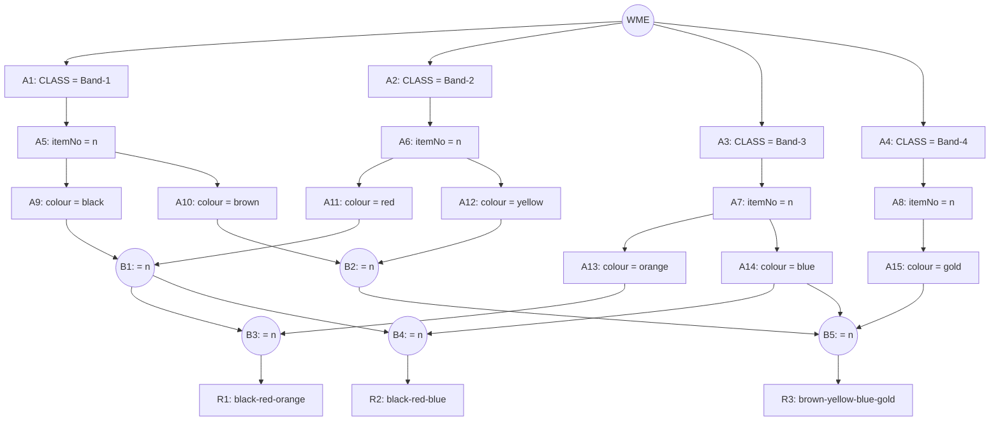

## The Question

A Rete net for classifying **resistors** from their colour bands (Band-1 … Band-4). Working memory (timestamp order):

```text
201. (Band-1 ^itemNo 2B ^colour brown)
202. (Band-2 ^itemNo 2B ^colour yellow)
203. (Band-1 ^itemNo 3C ^colour black)
204. (Band-2 ^itemNo 3C ^colour yellow)
205. (Band-3 ^itemNo 3C ^colour orange)
206. (Band-3 ^itemNo 2B ^colour blue)
207. (Band-4 ^itemNo 2B ^colour gold)
208. (Band-3 ^itemNo 1A ^colour blue)
209. (Band-2 ^itemNo 1A ^colour red)
210. (Band-1 ^itemNo 1A ^colour black)
```

| # | Question | Official answer |
|---|----------|-----------------|
| 5.1 | Which rule-data tuples are in the conflict set? (A: R1,203,205,209 · B: R2,208,209,210 · C: R3,201,204,208,207 · D: R3,201,202,206,207) | **B and D** |
| 5.2 | Specificity — which tuple fires? | **D** |
| 5.3 | Recency — which tuple fires? | **B** |

## The Topic in 60 Seconds

- **Alpha nodes** filter *single* WMEs (CLASS, then attribute tests). Every WME lives in exactly one alpha leaf.
- **Beta nodes** join two streams on a shared variable (`= <n>` joins on the same `^itemNo`).
- **Conflict set** = all fully matched (rule, data…) tuples. A **conflict resolution strategy** picks one:
  - **Specificity:** the tuple whose rule has the **most conditions** (most WMEs) wins.
  - **Recency:** the tuple containing the **newest (highest-timestamp) WME** wins.

> Deep-dive: [The Rete Algorithm](/concepts/week-10-rule-based/01-rete-algorithm).

## The Rete Net (from the figure)



So the rules are: **R1** = Band-1 black + Band-2 red + Band-3 orange (same itemNo) · **R2** = black + red + blue · **R3** = brown + yellow + blue + gold.

## Step 1 — Locate every WME

| WME | Facts | Alpha node |
|-----|-------|------------|
| 201 | Band-1, 2B, brown | **A10** |
| 202 | Band-2, 2B, yellow | **A12** |
| 203 | Band-1, 3C, black | **A9** |
| 204 | Band-2, 3C, yellow | **A12** |
| 205 | Band-3, 3C, orange | **A13** |
| 206 | Band-3, 2B, blue | **A14** |
| 207 | Band-4, 2B, gold | **A15** |
| 208 | Band-3, 1A, blue | **A14** |
| 209 | Band-2, 1A, red | **A11** |
| 210 | Band-1, 1A, black | **A9** |

## Step 2 — Fire the beta joins (match itemNo)

- **B1** (black ⋈ red): blacks `203: 3C`, `210: 1A` × reds `209: 1A` → only **(210, 209)** on 1A.
- **B2** (brown ⋈ yellow): browns `201: 2B` × yellows `202: 2B`, `204: 3C` → only **(201, 202)** on 2B.
- **B3** (B1 ⋈ orange): (210,209) is 1A; oranges `205: 3C` → **no match** → R1 empty.
- **B4** (B1 ⋈ blue): (210,209) is 1A; blues `206: 2B`, `208: 1A` → match **208** → **R2: (208, 209, 210)** ✓
- **B5** (B2 ⋈ blue ⋈ gold): (201,202) is 2B; blues `206: 2B` ✓; golds `207: 2B` ✓ → **R3: (201, 202, 206, 207)** ✓

**Conflict set** = (R2, 208, 209, 210) and (R3, 201, 202, 206, 207).

Check the options: A has itemNos 3C, 3C, 1A — no join ✗. C mixes 2B, 3C, 1A, 2B ✗. **B and D correct** ✓.

## 5.2 — Specificity → **D**

Count conditions (= WMEs in the tuple): R2's tuple has **3**, R3's tuple has **4**. More conditions = more specific → **R3, 201, 202, 206, 207 fires** → option **D**.

## 5.3 — Recency → **B**

Newest WME in each tuple: R2's = **210**; R3's = **207**. Higher timestamp wins → **R2, 208, 209, 210 fires** → option **B**.

## Tricks & Tips for This Question Family

<Accordion title="The 4-step recipe (works for every Rete question)">
1. **Table the WMEs → alpha nodes** first (30 seconds, kills half the options).
2. **Join bottom-up:** compute each beta's pairs on the shared attribute. A pair survives only if the itemNo (or join variable) is *identical*.
3. **Conflict set = leaves of the beta net that produced a full tuple.** Options mixing mismatched timestamps die instantly.
4. **Specificity = count WMEs; Recency = max timestamp.** If tied, papers fall back to rule label order (R1 before R2…).
</Accordion>

<Accordion title="Common pitfalls">
- **Don't match on colours alone** — the beta join is on `itemNo`. (203, 209) share "black+red" but 3C ≠ 1A.
- **Recency uses the newest WME *inside* the tuple**, not the newest rule or the largest tuple.
- **Specificity counts conditions of the rule instance**, i.e. WMEs bound in the tuple — R3's four bands beat R2's three.
</Accordion>

**Answers:** 5.1 **B, D** · 5.2 **D** · 5.3 **B**
