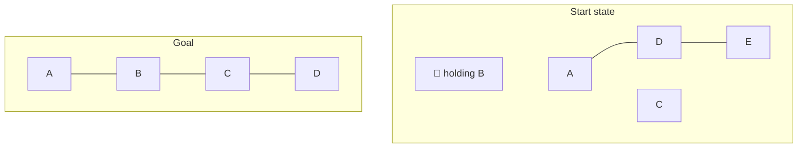
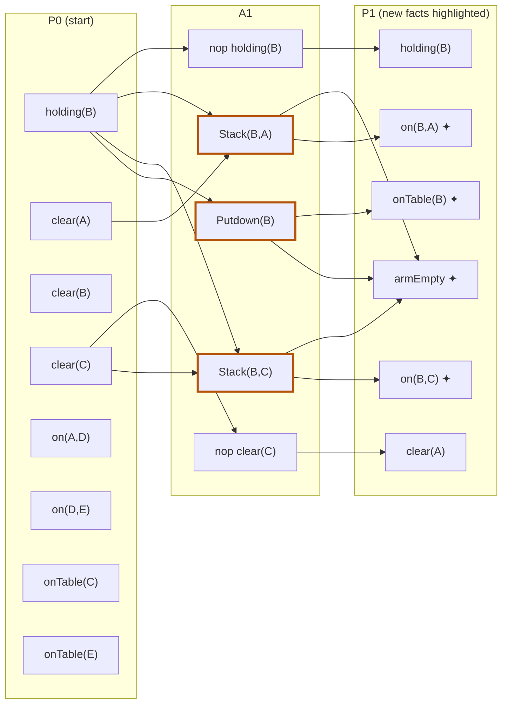

## The Question

Standard one-armed Blocks World (operators Pickup, Putdown, Unstack, Stack as usual).

**Start state:** $\{$ holding(B), on(A,D), on(D,E), onTable(C), onTable(E), clear(A), clear(B), clear(C) $\}$

**Goal:** $\{$ on(A,B), on(B,C), on(C,D) $\}$ — a single tower A/B/C/D.

| # | Question | Official answer |
|---|----------|-----------------|
| 6.1 | Applicable actions in the start state (A: Putdown(B) · B: Stack(B,C) · C: Stack(C,D) · D: Stack(B,A) · E: Stack(A,B)) | **A, B, D** |
| 6.2 | Relevant actions in the goal state | **B, C, E** |
| 6.3 | Mutex action pairs in layer 1 (A: Stack(B,C),Putdown(B) · B: Stack(B,A),Putdown(B) · C: Stack(B,C),Stack(B,A) · D: Pickup(C),Putdown(B) · E: Unstack(A,D),Putdown(B)) | **A, B, C** |
| 6.4 | Mutex propositions in layer 1 (A: clear(A),holding(B) · B: onTable(A),on(B,C) · C: onTable(B),on(B,C) · D: on(B,C),on(B,A)) | **C, D** |

## The Topic in 60 Seconds

- **Applicable** (forward view): every precondition is true in the **current state** — "can I do it *now*?"
- **Relevant** (backward view): the action's **add list contains a goal predicate** — "does it *build* the goal?"
- **Planning graph:** $P_0$ = start state → $A_1$ = actions whose preconditions all hold in $P_0$ (plus no-ops) → $P_1$ = all their effects.
- **Action mutex** (ANY of): inconsistent effects (one adds $p$, other deletes $p$) · interference (one deletes a precondition of the other) · competing needs (preconditions mutually mutex).
- **Proposition mutex** (ALL of): **every** pair of producers is mutex.

> Deep-dive: [Blocks World & STRIPS](/concepts/week-08-planning/01-blocks-world-strips), [GraphPlan Mutexes](/concepts/week-09-goal-trees/02-graphplan-mutexes).

## 6.1 — Applicable actions → **A, B, D**

Test each option's preconditions against the start state:

| Action | Preconditions | In state? | Applicable? |
|--------|---------------|-----------|-------------|
| Putdown(B) | holding(B) | holding(B) ✓ | **Yes** |
| Stack(B,C) | holding(B), clear(C) | both ✓ | **Yes** |
| Stack(C,D) | holding(C), clear(D) | holding(C) ✗ | No |
| Stack(B,A) | holding(B), clear(A) | both ✓ | **Yes** |
| Stack(A,B) | holding(A), clear(B) | holding(A) ✗ | No |

The arm holds B, so only actions that *use* holding(B) (or need nothing from the arm) can fire.

## 6.2 — Relevant actions → **B, C, E**

Which actions **add** a goal predicate?

| Action | Adds | Goal predicate? | Relevant? |
|--------|------|-----------------|-----------|
| Putdown(B) | armEmpty, onTable(B) | none | No |
| Stack(B,C) | armEmpty, **on(B,C)** | ✓ | **Yes** |
| Stack(C,D) | armEmpty, **on(C,D)** | ✓ | **Yes** |
| Stack(B,A) | armEmpty, on(B,A) | none | No |
| Stack(A,B) | armEmpty, **on(A,B)** | ✓ | **Yes** |

Exactly the three Stack actions that build the tower: **B, C, E**.

<Callout type="tip" title="Applicable vs relevant — the one-line contrast">
Applicable = *forward* from the start (preconditions hold). Relevant = *backward* from the goal (adds hit the goal). An action can be one, both, or neither — Stack(B,C) here is both; Unstack(A,D) is neither.
</Callout>

## 6.3 — Mutex action pairs in layer 1 → **A, B, C**

$A_1$ = actions applicable in $P_0$ = **Putdown(B), Stack(B,C), Stack(B,A)** (+ no-ops). Pickup(C) and Unstack(A,D) need armEmpty, which is *not* in the state — they aren't in $A_1$ at all, killing options D and E.

Now test the three real pairs:

| Pair | Reason | Mutex? |
|------|--------|--------|
| Stack(B,C) ⊕ Putdown(B) | Stack(B,C) **deletes holding(B)** — a precondition of Putdown(B) → interference | **Yes** |
| Stack(B,A) ⊕ Putdown(B) | same interference on holding(B) | **Yes** |
| Stack(B,C) ⊕ Stack(B,A) | each deletes the other's precondition holding(B) → interference (their effects clash too: on(B,C) vs on(B,A)) | **Yes** |

All three pairs mutex → **A, B, C** ✓.

## 6.4 — Mutex propositions in layer 1 → **C, D**

$P_1$ = start facts (via no-ops) ∪ effects of $A_1$: adds armEmpty, onTable(B), on(B,C), on(B,A).

Proposition mutex = **all producers mutually mutex**:

| Pair | Producers | Verdict |
|------|-----------|---------|
| clear(A), holding(B) | nop(clear(A)) vs nop(holding(B)) — both from $P_0$, non-mutex | Not mutex |
| onTable(A), on(B,C) | onTable(A) has **no producer** in $A_1$ — pair doesn't exist in $P_1$ | Not mutex |
| onTable(B), on(B,C) | only Putdown(B) vs only Stack(B,C) — and that pair **is** mutex (6.3) | **Mutex** ✓ |
| on(B,C), on(B,A) | only Stack(B,C) vs only Stack(B,A) — mutex (6.3) | **Mutex** ✓ |

→ **C, D** ✓.

## The Planning Graph, Layer 1

*All three real actions of A₁ interfere on holding(B) — hence action pairs (A,B,C) and, by the all-producers rule, proposition pairs (C,D).*

## Tricks & Tips for This Question Family

<Accordion title="One minute per subquestion">
1. **Applicable:** check preconditions only. The arm's status (`holding(X)` vs `armEmpty`) instantly eliminates half the options.
2. **Relevant:** intersect each action's **add list** with the goal set. Nothing else matters.
3. **Layer-1 actions = applicable actions.** Options naming non-applicable actions are auto-wrong.
4. **Action mutex:** look for a *shared deleted fact* — in Blocks World the arm invariants (holding/ArmEmpty) are almost always the culprit.
5. **Proposition mutex:** list the producers of each proposition. One non-mutex producer pair (usually two no-ops of co-existing start facts) breaks the mutex.
</Accordion>

**Answers:** 6.1 **A, B, D** · 6.2 **B, C, E** · 6.3 **A, B, C** · 6.4 **C, D**
