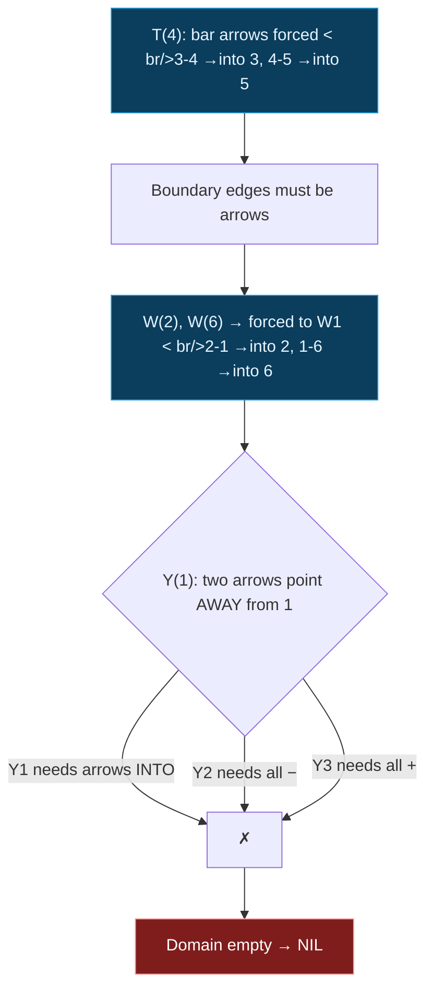

## The Question

The paper's junction dictionary (each junction type with its legal labelings; in-plane rotations are valid too):

| Type | Legal labelings (edges in order) |
|------|----------------------------------|
| **L** (2 edges) | L1: →,→ (both arrows *into* the corner) · L2: →,− · L3: −,→ · L4: ←,← (both arrows *away*) · L5: →,+ · L6: +,→ |
| **W** (3 edges, fan) | W1: →,+,→ (arrows *into* on both diagonals, + on stem) · W2: −,+,− · W3: +,−,+ |
| **Y** (3 edges, 120° apart) | Y1: →,→,− (arrows into on two edges, − on third) · Y2: −,−,− · Y3: +,+,+ |
| **T** (occlusion) | T1: bar arrows out, stem arrow *into* the T · T2: bar arrows out, stem arrow *away* · T3: bar arrows out, stem + · T4: bar arrows out, stem − |

(`+` convex, `−` concave, arrows = occluding edges.)

**The drawing to label** — junctions 1–6, with two edges running off the page at 2 and 6:

```text
        3 ------------ 4 ------------- 5
        |              |               |
        |              |               |
        |      1 (junction below 4)    |
      2 ················1·············· 6
   ~~↖ /                  \ ↗~~
(dangling)                  (dangling)
```

Edges: 3–4, 4–5 (top bar) · 3–2, 5–6 (verticals) · 2–1, 1–6 (diagonals) · 1–4 (vertical) · plus **dangling edges** leaving the page at 2 (up-left) and 6 (up-right).

Enter the junction labels for 1, 2, 3, 4 — or NIL.

**Official answer: `NIL`** — the drawing has no consistent labeling.

## The Topic in 60 Seconds

Waltz labeling = constraint satisfaction over edges: each junction must realize **one** of its legal dictionary patterns, and an edge shared by two junctions must carry the **same label (and arrow direction)** at both ends. If any junction runs out of legal patterns, the whole drawing is **inconsistent → NIL**.

> Deep-dive: [Waltz Line Labeling](/concepts/week-11-constraint-satisfaction/02-waltz-line-labeling), [Arc Consistency](/concepts/week-11-constraint-satisfaction/03-csp-relations-arc-consistency).

## Step 1 — Classify every junction

Count edges and angles:

| Junction | Edges | Shape | Type |
|----------|-------|-------|------|
| 3 | 4 (right), 2 (down) | corner | **L** |
| 4 | 3 (left), 5 (right), 1 (down) | two collinear + stem | **T** |
| 5 | 4 (left), 6 (down) | corner | **L** |
| 1 | 4 (up), 2 (down-left), 6 (down-right) | three edges ≈120° apart | **Y** |
| 2 | 3 (up), 1 (up-right), dangling (up-left) | 3-edge fan | **W** |
| 6 | 5 (up), 1 (up-left), dangling (up-right) | 3-edge fan | **W** |

## Step 2 — The T-junction speaks first (it's the most constrained)

In every T pattern, the **bar arrows point away from the T**. So:

- Edge **3–4**: arrow pointing **into junction 3**
- Edge **4–5**: arrow pointing **into junction 5**
- Stem **1–4**: still free — arrow into 4 (T1), arrow away (T2), + (T3), or − (T4).

## Step 3 — Boundary edges must be occluding arrows

An edge that runs **off the page** cannot be `+` or `−`: those join two *visible faces* and must terminate at junctions on both ends. A dangling edge is an **occluding (arrow) edge** — the object continues behind whatever the drawing cuts off.

Now look at the W dictionary for junction 2's dangling edge:

- W2 and W3 put **− / +** on the diagonals — impossible for a boundary edge.
- Only **W1** puts an arrow on a diagonal, pointing **into** the junction.

Same at junction 6. So both W junctions are forced to **W1**:

- At 2: dangling edge = arrow into 2 ⟹ **edge 2–1 = arrow into 2**, stem edge 2–3 = **+**
- At 6: dangling edge = arrow into 6 ⟹ **edge 1–6 = arrow into 6**, stem edge 5–6 = **+**

## Step 4 — Check the L junctions (they survive)

- Junction 3 (L): edge 3–4 arrives as an arrow *into 3*; edge 2–3 is `+` → pattern **L5** (arrow-in + +) ✓ legal.
- Junction 5 (L): edge 4–5 arrives as an arrow *into 5*; edge 5–6 is `+` → **L5/L6** ✓ legal.

## Step 5 — Junction 1 kills everything → **NIL**

Junction 1 is a **Y**. Its legal patterns are only:

- **Y1**: arrows pointing **into** 1 on two edges, − on the third
- **Y2**: all three edges `−`
- **Y3**: all three edges `+`

But from Step 3:

- Edge **2–1** carries its arrowhead at the *2-end* — from junction 1 it is an arrow pointing **away**
- Edge **1–6** carries its arrowhead at the *6-end* — again pointing **away** from 1

No Y pattern allows arrows pointing *away* on two edges (Y1 wants them pointing in; Y2/Y3 want − / +). **Junction 1 has no legal labeling — the domain empties — the drawing is inconsistent.**

$$\boxed{\text{Answer: NIL}}$$

Step through the propagation — watch each junction's domain shrink until junction 1 starves:

<StepGraph
  height={480}
  nodeWidth={110}
  nodeHeight={56}
  nodeFontSize={12}
  legend={[
    { color: "#4b5563", label: "unassigned" },
    { color: "#b45309", label: "forcing now" },
    { color: "#16a34a", label: "labeled consistently" },
    { color: "#7f1d1d", label: "domain emptied" },
    { color: "#0b5c2e", label: "boundary (dangling) edge" },
  ]}
  steps={[
    {
      label: "1 · classify",
      note: "Junctions: 3 = L · 4 = T · 5 = L · 2 = W · 1 = Y · 6 = W.\nDangling edges leave the page at 2 and 6.",
      elements: [
        { data: { id: "n3", label: "3 : L ?", type: "unassigned" }, position: { x: 100, y: 60 } },
        { data: { id: "n4", label: "4 : T ?", type: "unassigned" }, position: { x: 360, y: 60 } },
        { data: { id: "n5", label: "5 : L ?", type: "unassigned" }, position: { x: 620, y: 60 } },
        { data: { id: "n2", label: "2 : W ?", type: "unassigned" }, position: { x: 100, y: 240 } },
        { data: { id: "n1", label: "1 : Y ?", type: "unassigned" }, position: { x: 360, y: 240 } },
        { data: { id: "n6", label: "6 : W ?", type: "unassigned" }, position: { x: 620, y: 240 } },
        { data: { id: "b2", label: "off-page", type: "terminal" }, position: { x: 230, y: 400 } },
        { data: { id: "b6", label: "off-page", type: "terminal" }, position: { x: 500, y: 400 } },
        { data: { id: "e34", source: "n3", target: "n4" } },
        { data: { id: "e45", source: "n4", target: "n5" } },
        { data: { id: "e32", source: "n3", target: "n2" } },
        { data: { id: "e56", source: "n5", target: "n6" } },
        { data: { id: "e21", source: "n2", target: "n1" } },
        { data: { id: "e16", source: "n1", target: "n6" } },
        { data: { id: "e14", source: "n1", target: "n4" } },
        { data: { id: "eb2", source: "n2", target: "b2", type: "border" } },
        { data: { id: "eb6", source: "n6", target: "b6", type: "border" } },
      ],
    },
    {
      label: "2 · T-bars forced",
      note: "Every T pattern points its bar arrows AWAY from the T:\n3-4 arrowhead lands at 3 · 4-5 arrowhead lands at 5.\nStem 1-4 still free (T1-T4).",
      elements: [
        { data: { id: "n3", label: "3 : L ?", type: "unassigned" }, position: { x: 100, y: 60 } },
        { data: { id: "n4", label: "4 : T", type: "current" }, position: { x: 360, y: 60 } },
        { data: { id: "n5", label: "5 : L ?", type: "unassigned" }, position: { x: 620, y: 60 } },
        { data: { id: "n2", label: "2 : W ?", type: "unassigned" }, position: { x: 100, y: 240 } },
        { data: { id: "n1", label: "1 : Y ?", type: "unassigned" }, position: { x: 360, y: 240 } },
        { data: { id: "n6", label: "6 : W ?", type: "unassigned" }, position: { x: 620, y: 240 } },
        { data: { id: "b2", label: "off-page", type: "terminal" }, position: { x: 230, y: 400 } },
        { data: { id: "b6", label: "off-page", type: "terminal" }, position: { x: 500, y: 400 } },
        { data: { id: "e34", source: "n3", target: "n4", label: "arr -> 3", type: "active" } },
        { data: { id: "e45", source: "n4", target: "n5", label: "arr -> 5", type: "active" } },
        { data: { id: "e32", source: "n3", target: "n2" } },
        { data: { id: "e56", source: "n5", target: "n6" } },
        { data: { id: "e21", source: "n2", target: "n1" } },
        { data: { id: "e16", source: "n1", target: "n6" } },
        { data: { id: "e14", source: "n1", target: "n4" } },
        { data: { id: "eb2", source: "n2", target: "b2", type: "border" } },
        { data: { id: "eb6", source: "n6", target: "b6", type: "border" } },
      ],
    },
    {
      label: "3 · W1 forced at 2, 6",
      note: "Dangling edges must be arrows (a +/- needs faces on both ends).\nThe only W pattern with an arrow on a diagonal is W1 — arrows INTO the W.\nSo: 2-1 arrow into 2 · 1-6 arrow into 6 · stems 2-3 and 5-6 take +.",
      elements: [
        { data: { id: "n3", label: "3 : L ?", type: "unassigned" }, position: { x: 100, y: 60 } },
        { data: { id: "n4", label: "4 : T", type: "explored" }, position: { x: 360, y: 60 } },
        { data: { id: "n5", label: "5 : L ?", type: "unassigned" }, position: { x: 620, y: 60 } },
        { data: { id: "n2", label: "2 : W1 ✓", type: "path" }, position: { x: 100, y: 240 } },
        { data: { id: "n1", label: "1 : Y ?", type: "unassigned" }, position: { x: 360, y: 240 } },
        { data: { id: "n6", label: "6 : W1 ✓", type: "path" }, position: { x: 620, y: 240 } },
        { data: { id: "b2", label: "arrow", type: "terminal" }, position: { x: 230, y: 400 } },
        { data: { id: "b6", label: "arrow", type: "terminal" }, position: { x: 500, y: 400 } },
        { data: { id: "e34", source: "n3", target: "n4", label: "arr -> 3", type: "active" } },
        { data: { id: "e45", source: "n4", target: "n5", label: "arr -> 5", type: "active" } },
        { data: { id: "e32", source: "n3", target: "n2", label: "+", type: "convex" } },
        { data: { id: "e56", source: "n5", target: "n6", label: "+", type: "convex" } },
        { data: { id: "e21", source: "n2", target: "n1", label: "arr -> 2", type: "active" } },
        { data: { id: "e16", source: "n1", target: "n6", label: "arr -> 6", type: "active" } },
        { data: { id: "e14", source: "n1", target: "n4" } },
        { data: { id: "eb2", source: "n2", target: "b2", label: "arr -> 2", type: "border" } },
        { data: { id: "eb6", source: "n6", target: "b6", label: "arr -> 6", type: "border" } },
      ],
    },
    {
      label: "4 · L's survive",
      note: "Junction 3: edge 3-4 arrives as arrow INTO 3, edge 2-3 is '+' → L5 (arrow-in + convex) legal.\nJunction 5: same shape → L5/L6 legal.\nOnly junction 1 left…",
      elements: [
        { data: { id: "n3", label: "3 : L5 ✓", type: "path" }, position: { x: 100, y: 60 } },
        { data: { id: "n4", label: "4 : T", type: "explored" }, position: { x: 360, y: 60 } },
        { data: { id: "n5", label: "5 : L5 ✓", type: "path" }, position: { x: 620, y: 60 } },
        { data: { id: "n2", label: "2 : W1 ✓", type: "path" }, position: { x: 100, y: 240 } },
        { data: { id: "n1", label: "1 : Y ?", type: "current" }, position: { x: 360, y: 240 } },
        { data: { id: "n6", label: "6 : W1 ✓", type: "path" }, position: { x: 620, y: 240 } },
        { data: { id: "b2", label: "arrow", type: "terminal" }, position: { x: 230, y: 400 } },
        { data: { id: "b6", label: "arrow", type: "terminal" }, position: { x: 500, y: 400 } },
        { data: { id: "e34", source: "n3", target: "n4", label: "arr -> 3", type: "active" } },
        { data: { id: "e45", source: "n4", target: "n5", label: "arr -> 5", type: "active" } },
        { data: { id: "e32", source: "n3", target: "n2", label: "+", type: "convex" } },
        { data: { id: "e56", source: "n5", target: "n6", label: "+", type: "convex" } },
        { data: { id: "e21", source: "n2", target: "n1", label: "arr -> 2", type: "active" } },
        { data: { id: "e16", source: "n1", target: "n6", label: "arr -> 6", type: "active" } },
        { data: { id: "e14", source: "n1", target: "n4" } },
        { data: { id: "eb2", source: "n2", target: "b2", label: "arr -> 2", type: "border" } },
        { data: { id: "eb6", source: "n6", target: "b6", label: "arr -> 6", type: "border" } },
      ],
    },
    {
      label: "5 · Y dies → NIL",
      note: "At junction 1: edge 2-1 has its arrowhead AT 2 (points away from 1);\nedge 1-6 points away too. Stem 1-4 is free but that is not enough:\nY1 needs two arrows IN · Y2 needs all minus · Y3 needs all plus.\nNo pattern survives → domain empty → NIL.",
      elements: [
        { data: { id: "n3", label: "3 : L5 ✓", type: "path" }, position: { x: 100, y: 60 } },
        { data: { id: "n4", label: "4 : T", type: "explored" }, position: { x: 360, y: 60 } },
        { data: { id: "n5", label: "5 : L5 ✓", type: "path" }, position: { x: 620, y: 60 } },
        { data: { id: "n2", label: "2 : W1 ✓", type: "path" }, position: { x: 100, y: 240 } },
        { data: { id: "n1", label: "1 : Y ✗", type: "pruned" }, position: { x: 360, y: 240 } },
        { data: { id: "n6", label: "6 : W1 ✓", type: "path" }, position: { x: 620, y: 240 } },
        { data: { id: "b2", label: "arrow", type: "terminal" }, position: { x: 230, y: 400 } },
        { data: { id: "b6", label: "arrow", type: "terminal" }, position: { x: 500, y: 400 } },
        { data: { id: "e34", source: "n3", target: "n4", label: "arr -> 3", type: "active" } },
        { data: { id: "e45", source: "n4", target: "n5", label: "arr -> 5", type: "active" } },
        { data: { id: "e32", source: "n3", target: "n2", label: "+", type: "convex" } },
        { data: { id: "e56", source: "n5", target: "n6", label: "+", type: "convex" } },
        { data: { id: "e21", source: "n2", target: "n1", label: "arr -> 2", type: "pruned" } },
        { data: { id: "e16", source: "n1", target: "n6", label: "arr -> 6", type: "pruned" } },
        { data: { id: "e14", source: "n1", target: "n4" } },
        { data: { id: "eb2", source: "n2", target: "b2", label: "arr -> 2", type: "border" } },
        { data: { id: "eb6", source: "n6", target: "b6", label: "arr -> 6", type: "border" } },
      ],
    },
  ]}
/>



## Tricks & Tips for This Question Family

<Accordion title="The 4-step Waltz exam method">
1. **Classify junctions first** (2 edges = L; 3 edges with a 180° pair = T; 3-edge fan = W; 3 edges ≈120° = Y).
2. **Start at the T-junction** — its bar arrows are always forced outward; that pins labels on two edges immediately.
3. **Boundary/dangling edges are arrows** — and in W junctions that forces W1, which points the arrows *into* the W. This is the step most students miss.
4. **Propagate and eliminate.** Each shared edge must agree at both ends; the moment a junction's domain empties → answer NIL. Don't enumerate all labelings — kill branches as early as possible.
</Accordion>

<Accordion title="Common pitfalls">
- **Forgetting rotations:** the dictionary patterns hold at *any* in-plane rotation — match shapes, not absolute directions.
- **Treating dangling edges as free:** they are arrows, and that constraint is exactly what makes this drawing NIL.
- **Labeling edges differently at each end:** an arrow's head is at one specific junction; the other junction sees it pointing away.
</Accordion>

**Answer:** 7.1 `NIL`
