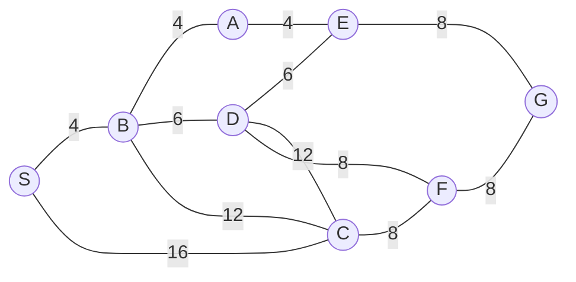

## The Question

A 1×1-tile grid map. Start **S**, goal **G**. MoveGen returns neighbours alphabetically. Heuristic = **Manhattan Distance**. Tie-breaker: node labels.

| # | Question | Official answer |
|---|----------|-----------------|
| 1.1 | Path found by Best First Search | `S,C,F,G` |
| 1.2 | Path found by A* | `S,B,A,E,G` |
| 1.3 | Path found by Branch-and-Bound (acyclic) | `S,B,A,E,G` |
| 1.4 | Which algorithm finds the **shortest** path? | **C** — both A* and BnB |
| 1.5 | Admissibility of the heuristic | **A** — admissible |

## The Topic in 60 Seconds

All three keep a list of partial paths and repeatedly pick one to expand — they differ only in the **sorting key**:

| Algorithm | Picks smallest | Blind to |
|-----------|---------------|----------|
| Best First | $h(n)$ (guess to goal) | cost paid so far |
| A* | $f(n) = g(n) + h(n)$ | nothing |
| Branch-and-Bound | $g(n)$ (exact cost paid) | the heuristic |

> Deep-dive: [A* Search](/concepts/week-03-heuristic-search/01-a-star-search), [Best First Search](/concepts/week-03-heuristic-search/09-best-first-search), [Branch and Bound](/concepts/week-03-heuristic-search/05-branch-and-bound).

## Step 0 — Heuristic table (Manhattan distance to G, read off the grid)

| Node | $h(n)$ | Node | $h(n)$ |
|------|--------|------|--------|
| S | 8 | D | 6 |
| A | 9 | E | 7 |
| B | 8 | F | 4 |
| C | 5 | G | 0 |

## 1.1 — Best First Search → `S,C,F,G`

| Step | OPEN (node : $h$) | Pick | Add |
|------|-------------------|------|-----|
| 1 | S : 8 | **S** | B : 8, C : 5 |
| 2 | C : 5, B : 8 | **C** | F : 4 |
| 3 | F : 4, B : 8 | **F** | G : 0 |
| 4 | G : 0, B : 8 | **G** — goal! | — |

Path: **S → C → F → G**. Greedy on $h$ alone — cost $16+8+8 = 32$ (far from optimal, but that's not BFS's job).

## 1.2 — A* → `S,B,A,E,G`

| Step | OPEN (node : $g$, $h$, $f$) | Pick | Updates |
|------|------------------------------|------|---------|
| 1 | S : 0, 8, **8** | **S** | B : 4, 8, **12** · C : 16, 5, **21** |
| 2 | B : **12**, C : 21 | **B** | A : 8, 9, **17** · D : 10, 6, **16** · C via B: 16, 5, 21 (no gain) |
| 3 | D : **16**, A : 17, C : 21 | **D** | E : 16, 7, **23** · F : 18, 4, 22 · C via D: 28 (keep 21) |
| 4 | A : **17**, C : 21, E : 23, F : 22 | **A** | E via A: 12, 7, **19** (improves 23!) |
| 5 | E : **19**, C : 21, F : 22 | **E** | G : 20, 0, **20** |
| 6 | G : **20**, C : 21, F : 22 | **G** — goal! | — |

Path: **S → B → A → E → G**, cost $4+4+4+8 = 20$.

## 1.3 — Branch-and-Bound → `S,B,A,E,G`

| Pop | OPEN (path : $g$) after extending |
|-----|-----------------------------------|
| S : 0 | SB : 4 · SC : 16 |
| SB : 4 | SBA : $4+4$ = **8** · SBD : $4+6$ = **10** · SBC : $4+12$ = **16** |
| SBA : 8 | SBAE : $8+4$ = **12** |
| SBD : 10 | SBDA : $10+4$ = **14** · SBDE : $10+6$ = **16** · SBDF : $10+8$ = **18** · SBDC : $10+12$ = **22** |
| SBAE : 12 | SBAED : $12+6$ = **18** · SBAEG : $12+8$ = **20** ← goal queued |
| SBDA : 14 | SBDAE : $14+4$ = **18** |
| SBC : 16 (tie with SC — labels) | SBCF : 24 · SBCD : 28 |
| SC : 16 | SCF : 24 · SCB : 28 · SCD : 28 |
| SBDE : 16 | SBDEA : 20 · SBDEG : 24 |
| SBAED, SBDAE, SBDF : 18 | SBAEDC : 30 · SBAEDF : 26 · SBDAEG : 26 · SBDFG : 26 · SBDFC : 26 |
| SBAEG : **20** — cheapest at the 20-tie (S-A before S-B), a complete tour | everything left ≥ 20 → **optimal, stop** |

Path: **S → B → A → E → G**, cost 20.

Interactive A* trace — watch $f = g + h$ steer the search around to the cheap northern route:

<StepGraph
  height={400}
  nodeWidth={110}
  nodeHeight={54}
  nodeFontSize={13}
  legend={[
    { color: "#b45309", label: "expanding" },
    { color: "#0369a1", label: "in OPEN (f = g+h)" },
    { color: "#4b5563", label: "expanded" },
    { color: "#16a34a", label: "returned path" },
  ]}
  steps={[
    {
      label: "Init",
      note: "OPEN = { S(g=0, h=8, f=8) }",
      elements: [
        { data: { id: "S", label: "S f=8", type: "frontier" }, position: { x: 40, y: 200 } },
        { data: { id: "A", label: "A", type: "explored" }, position: { x: 260, y: 40 } },
        { data: { id: "B", label: "B", type: "explored" }, position: { x: 150, y: 120 } },
        { data: { id: "C", label: "C", type: "explored" }, position: { x: 300, y: 330 } },
        { data: { id: "D", label: "D", type: "explored" }, position: { x: 380, y: 140 } },
        { data: { id: "E", label: "E", type: "explored" }, position: { x: 480, y: 40 } },
        { data: { id: "F", label: "F", type: "explored" }, position: { x: 560, y: 350 } },
        { data: { id: "G", label: "G", type: "explored" }, position: { x: 760, y: 160 } },
        { data: { id: "e1", source: "S", target: "B", label: "4" } },
        { data: { id: "e2", source: "S", target: "C", label: "16" } },
        { data: { id: "e3", source: "B", target: "A", label: "4" } },
        { data: { id: "e4", source: "B", target: "D", label: "6" } },
        { data: { id: "e5", source: "B", target: "C", label: "12" } },
        { data: { id: "e6", source: "A", target: "E", label: "4" } },
        { data: { id: "e7", source: "D", target: "E", label: "6" } },
        { data: { id: "e8", source: "D", target: "C", label: "12" } },
        { data: { id: "e9", source: "D", target: "F", label: "8" } },
        { data: { id: "e10", source: "E", target: "G", label: "8" } },
        { data: { id: "e11", source: "C", target: "F", label: "8" } },
        { data: { id: "e12", source: "F", target: "G", label: "8" } },
      ],
    },
    {
      label: "Expand S",
      note: "Pick S (f=8).\nB: g=4, h=8 → f=12\nC: g=16, h=5 → f=21\nOPEN = { B(12), C(21) }",
      elements: [
        { data: { id: "S", label: "S", type: "explored" }, position: { x: 40, y: 200 } },
        { data: { id: "A", label: "A", type: "explored" }, position: { x: 260, y: 40 } },
        { data: { id: "B", label: "B f=12", type: "frontier" }, position: { x: 150, y: 120 } },
        { data: { id: "C", label: "C f=21", type: "frontier" }, position: { x: 300, y: 330 } },
        { data: { id: "D", label: "D", type: "explored" }, position: { x: 380, y: 140 } },
        { data: { id: "E", label: "E", type: "explored" }, position: { x: 480, y: 40 } },
        { data: { id: "F", label: "F", type: "explored" }, position: { x: 560, y: 350 } },
        { data: { id: "G", label: "G", type: "explored" }, position: { x: 760, y: 160 } },
        { data: { id: "e1", source: "S", target: "B", label: "4" } },
        { data: { id: "e2", source: "S", target: "C", label: "16" } },
        { data: { id: "e3", source: "B", target: "A", label: "4" } },
        { data: { id: "e4", source: "B", target: "D", label: "6" } },
        { data: { id: "e5", source: "B", target: "C", label: "12" } },
        { data: { id: "e6", source: "A", target: "E", label: "4" } },
        { data: { id: "e7", source: "D", target: "E", label: "6" } },
        { data: { id: "e8", source: "D", target: "C", label: "12" } },
        { data: { id: "e9", source: "D", target: "F", label: "8" } },
        { data: { id: "e10", source: "E", target: "G", label: "8" } },
        { data: { id: "e11", source: "C", target: "F", label: "8" } },
        { data: { id: "e12", source: "F", target: "G", label: "8" } },
      ],
    },
    {
      label: "Expand B",
      note: "Pick B (f=12).\nA: g=8, h=9 → f=17\nD: g=10, h=6 → f=16\nC via B: g=16 → f=21 (tie, keep)\nOPEN = { D(16), A(17), C(21) }",
      elements: [
        { data: { id: "S", label: "S", type: "explored" }, position: { x: 40, y: 200 } },
        { data: { id: "A", label: "A f=17", type: "frontier" }, position: { x: 260, y: 40 } },
        { data: { id: "B", label: "B", type: "current" }, position: { x: 150, y: 120 } },
        { data: { id: "C", label: "C f=21", type: "frontier" }, position: { x: 300, y: 330 } },
        { data: { id: "D", label: "D f=16", type: "frontier" }, position: { x: 380, y: 140 } },
        { data: { id: "E", label: "E", type: "explored" }, position: { x: 480, y: 40 } },
        { data: { id: "F", label: "F", type: "explored" }, position: { x: 560, y: 350 } },
        { data: { id: "G", label: "G", type: "explored" }, position: { x: 760, y: 160 } },
        { data: { id: "e1", source: "S", target: "B", label: "4" } },
        { data: { id: "e2", source: "S", target: "C", label: "16" } },
        { data: { id: "e3", source: "B", target: "A", label: "4" } },
        { data: { id: "e4", source: "B", target: "D", label: "6" } },
        { data: { id: "e5", source: "B", target: "C", label: "12" } },
        { data: { id: "e6", source: "A", target: "E", label: "4" } },
        { data: { id: "e7", source: "D", target: "E", label: "6" } },
        { data: { id: "e8", source: "D", target: "C", label: "12" } },
        { data: { id: "e9", source: "D", target: "F", label: "8" } },
        { data: { id: "e10", source: "E", target: "G", label: "8" } },
        { data: { id: "e11", source: "C", target: "F", label: "8" } },
        { data: { id: "e12", source: "F", target: "G", label: "8" } },
      ],
    },
    {
      label: "Expand D",
      note: "Pick D (f=16).\nE: g=16, h=7 → f=23\nF: g=18, h=4 → f=22\nC via D: g=28 → worse\nOPEN = { A(17), C(21), F(22), E(23) }",
      elements: [
        { data: { id: "S", label: "S", type: "explored" }, position: { x: 40, y: 200 } },
        { data: { id: "A", label: "A f=17", type: "frontier" }, position: { x: 260, y: 40 } },
        { data: { id: "B", label: "B", type: "explored" }, position: { x: 150, y: 120 } },
        { data: { id: "C", label: "C f=21", type: "frontier" }, position: { x: 300, y: 330 } },
        { data: { id: "D", label: "D", type: "current" }, position: { x: 380, y: 140 } },
        { data: { id: "E", label: "E f=23", type: "frontier" }, position: { x: 480, y: 40 } },
        { data: { id: "F", label: "F f=22", type: "frontier" }, position: { x: 560, y: 350 } },
        { data: { id: "G", label: "G", type: "explored" }, position: { x: 760, y: 160 } },
        { data: { id: "e1", source: "S", target: "B", label: "4" } },
        { data: { id: "e2", source: "S", target: "C", label: "16" } },
        { data: { id: "e3", source: "B", target: "A", label: "4" } },
        { data: { id: "e4", source: "B", target: "D", label: "6" } },
        { data: { id: "e5", source: "B", target: "C", label: "12" } },
        { data: { id: "e6", source: "A", target: "E", label: "4" } },
        { data: { id: "e7", source: "D", target: "E", label: "6" } },
        { data: { id: "e8", source: "D", target: "C", label: "12" } },
        { data: { id: "e9", source: "D", target: "F", label: "8" } },
        { data: { id: "e10", source: "E", target: "G", label: "8" } },
        { data: { id: "e11", source: "C", target: "F", label: "8" } },
        { data: { id: "e12", source: "F", target: "G", label: "8" } },
      ],
    },
    {
      label: "Expand A",
      note: "Pick A (f=17).\nE via A: g=12, h=7 → f=19 < 23 → UPDATE E!\nOPEN = { E(19), C(21), F(22) }",
      elements: [
        { data: { id: "S", label: "S", type: "explored" }, position: { x: 40, y: 200 } },
        { data: { id: "A", label: "A", type: "current" }, position: { x: 260, y: 40 } },
        { data: { id: "B", label: "B", type: "explored" }, position: { x: 150, y: 120 } },
        { data: { id: "C", label: "C f=21", type: "frontier" }, position: { x: 300, y: 330 } },
        { data: { id: "D", label: "D", type: "explored" }, position: { x: 380, y: 140 } },
        { data: { id: "E", label: "E f=19", type: "frontier" }, position: { x: 480, y: 40 } },
        { data: { id: "F", label: "F f=22", type: "frontier" }, position: { x: 560, y: 350 } },
        { data: { id: "G", label: "G", type: "explored" }, position: { x: 760, y: 160 } },
        { data: { id: "e1", source: "S", target: "B", label: "4" } },
        { data: { id: "e2", source: "S", target: "C", label: "16" } },
        { data: { id: "e3", source: "B", target: "A", label: "4" } },
        { data: { id: "e4", source: "B", target: "D", label: "6" } },
        { data: { id: "e5", source: "B", target: "C", label: "12" } },
        { data: { id: "e6", source: "A", target: "E", label: "4" } },
        { data: { id: "e7", source: "D", target: "E", label: "6" } },
        { data: { id: "e8", source: "D", target: "C", label: "12" } },
        { data: { id: "e9", source: "D", target: "F", label: "8" } },
        { data: { id: "e10", source: "E", target: "G", label: "8" } },
        { data: { id: "e11", source: "C", target: "F", label: "8" } },
        { data: { id: "e12", source: "F", target: "G", label: "8" } },
      ],
    },
    {
      label: "Expand E",
      note: "Pick E (f=19).\nG: g=20, h=0 → f=20\nOPEN = { G(20), C(21), F(22) }",
      elements: [
        { data: { id: "S", label: "S", type: "explored" }, position: { x: 40, y: 200 } },
        { data: { id: "A", label: "A", type: "explored" }, position: { x: 260, y: 40 } },
        { data: { id: "B", label: "B", type: "explored" }, position: { x: 150, y: 120 } },
        { data: { id: "C", label: "C f=21", type: "frontier" }, position: { x: 300, y: 330 } },
        { data: { id: "D", label: "D", type: "explored" }, position: { x: 380, y: 140 } },
        { data: { id: "E", label: "E", type: "current" }, position: { x: 480, y: 40 } },
        { data: { id: "F", label: "F f=22", type: "frontier" }, position: { x: 560, y: 350 } },
        { data: { id: "G", label: "G f=20", type: "frontier" }, position: { x: 760, y: 160 } },
        { data: { id: "e1", source: "S", target: "B", label: "4" } },
        { data: { id: "e2", source: "S", target: "C", label: "16" } },
        { data: { id: "e3", source: "B", target: "A", label: "4" } },
        { data: { id: "e4", source: "B", target: "D", label: "6" } },
        { data: { id: "e5", source: "B", target: "C", label: "12" } },
        { data: { id: "e6", source: "A", target: "E", label: "4" } },
        { data: { id: "e7", source: "D", target: "E", label: "6" } },
        { data: { id: "e8", source: "D", target: "C", label: "12" } },
        { data: { id: "e9", source: "D", target: "F", label: "8" } },
        { data: { id: "e10", source: "E", target: "G", label: "8" } },
        { data: { id: "e11", source: "C", target: "F", label: "8" } },
        { data: { id: "e12", source: "F", target: "G", label: "8" } },
      ],
    },
    {
      label: "Goal: S,B,A,E,G",
      note: "Pick G (f=20) → GOAL.\nPath: S,B,A,E,G   cost = 4+4+4+8 = 20\nBnB finds the same path (see 1.3) — h is admissible (1.5).",
      elements: [
        { data: { id: "S", label: "S", type: "path" }, position: { x: 40, y: 200 } },
        { data: { id: "A", label: "A", type: "path" }, position: { x: 260, y: 40 } },
        { data: { id: "B", label: "B", type: "path" }, position: { x: 150, y: 120 } },
        { data: { id: "C", label: "C", type: "explored" }, position: { x: 300, y: 330 } },
        { data: { id: "D", label: "D", type: "explored" }, position: { x: 380, y: 140 } },
        { data: { id: "E", label: "E", type: "path" }, position: { x: 480, y: 40 } },
        { data: { id: "F", label: "F", type: "explored" }, position: { x: 560, y: 350 } },
        { data: { id: "G", label: "G ✓", type: "goal" }, position: { x: 760, y: 160 } },
        { data: { id: "e1", source: "S", target: "B", label: "4", type: "path" } },
        { data: { id: "e2", source: "S", target: "C", label: "16" } },
        { data: { id: "e3", source: "B", target: "A", label: "4", type: "path" } },
        { data: { id: "e4", source: "B", target: "D", label: "6" } },
        { data: { id: "e5", source: "B", target: "C", label: "12" } },
        { data: { id: "e6", source: "A", target: "E", label: "4", type: "path" } },
        { data: { id: "e7", source: "D", target: "E", label: "6" } },
        { data: { id: "e8", source: "D", target: "C", label: "12" } },
        { data: { id: "e9", source: "D", target: "F", label: "8" } },
        { data: { id: "e10", source: "E", target: "G", label: "8", type: "path" } },
        { data: { id: "e11", source: "C", target: "F", label: "8" } },
        { data: { id: "e12", source: "F", target: "G", label: "8" } },
      ],
    },
  ]}
/>

## 1.4 — Shortest path → **C (both A\* and BnB)**

Enumerate the plausible routes: S-B-A-E-G = **20** · S-B-D-E-G = 24 · S-B-D-F-G = 26 · S-C-F-G = 32. Both A* and BnB returned 20 → option **C**.

## 1.5 — Admissibility → **A (admissible)**

Check $h(n) \le h^*(n)$ everywhere:

| Node | $h$ | $h^*$ (true best to G) | OK? |
|------|-----|------------------------|-----|
| S | 8 | 20 | ✓ |
| B | 8 | 16 (B-A-E-G) | ✓ |
| A | 9 | 12 (A-E-G) | ✓ |
| D | 6 | 14 (D-E-G) | ✓ |
| E | 7 | 8 | ✓ |
| C | 5 | 16 (C-F-G) | ✓ |
| F | 4 | 8 | ✓ |

No overestimate anywhere → **admissible** → option **A**. (That's exactly why A* succeeded in 1.4.)

## Tricks & Tips

<Accordion title="Exam shortcuts">
1. **h-table first, always** — every subquestion reads from it.
2. **BFS = sort by h.** Stop when G has the smallest h in OPEN.
3. **A\* = sort by g+h; always test updates** — step 4 here (E improved 23 → 19) is where marks are lost.
4. **BnB = sort by g, write full paths.** The goal path pops itself to the front when it's truly cheapest.
5. **1.4/1.5 always agree:** if A* and BnB return the same path, h is admissible; if they differ, hunt for an overestimated h.
</Accordion>

**Answers:** 1.1 `S,C,F,G` · 1.2 `S,B,A,E,G` · 1.3 `S,B,A,E,G` · 1.4 **C** · 1.5 **A**
