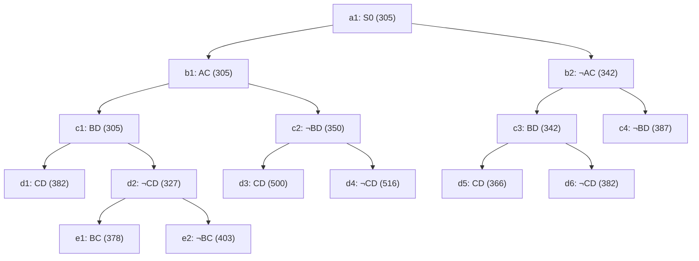

## The Question

The TSP BnB snapshot when the optimal tour is discovered. `XY` = include edge, `¬XY` = exclude. Numbers = lower bounds. Reference numbers break ties.

| # | Question | Official answer |
|---|----------|-----------------|
| 2.1 | 2nd–5th nodes refined | `b1,c1,d2,b2` |
| 2.2 | Node of the optimal tour | `d5` |
| 2.3 | Cost of the optimal tour | `366` |
| 2.4 | Number of cities | `5` |
| 2.5 | Optimal tour from A | `A,B,D,C,E` (also `A,E,C,D,B`) |

## The Topic in 60 Seconds

- A node = a set of tours sharing its include/exclude decisions; its number = a **lower bound** for that set.
- **Refine** = pop the cheapest open node, insert its two children. Bounds rise monotonically toward leaves.
- **Childless nodes** in the snapshot are finished branches — tours.
- Stop when a **tour** is popped and no open node is cheaper.

> Deep-dive: [Reading BnB Trees](/concepts/week-05-optimal-tsp/01-bnb-tree-reading), [Branch and Bound](/concepts/week-03-heuristic-search/05-branch-and-bound).

## 2.1 — Refine order → `b1,c1,d2,b2`

| Pop | Queue (min first) | Action |
|-----|-------------------|--------|
| 1 | a1 : 305 | refine → b1(305), b2(342) |
| 2 | b1 : 305, b2 : 342 | refine **b1** → c1(305), c2(350) |
| 3 | c1 : 305, b2 : 342, c2 : 350 | refine **c1** → d1(382), **d2(327)** |
| 4 | d2 : 327, b2 : 342, c2 : 350, d1 : 382 | refine **d2** → e1(378), e2(403) |
| 5 | b2 : 342, c2 : 350, e1 : 378, d1 : 382, e2 : 403 | refine **b2** → c3(342), c4(387) |

2nd–5th refined: **b1, c1, d2, b2** ✓

## 2.2 & 2.3 — Optimal tour → `d5`, cost `366`

Continue the queue: after b2 the OPEN set is c3 : 342, c2 : 350, e1 : 378, d1 : 382, c4 : 387, e2 : 403. Pop c3(342) → d5(366), d6(382). Pop c2(350) → d3(500), d4(516). Now the minimum is **d5 : 366 — a leaf (tour)**, and every open node ≥ 378. **d5 is the optimal tour, cost 366** ✓

## 2.4 — Number of cities → `5`

Reconstruct the tour d5 forces. Path root→d5: **¬AC, BD, CD** (exclude A–C; include B–D, C–D).

- Degrees: B–1, C–1, D–2 (full), A–0, E–0.
- D is done. A needs 2 edges from AB and AE (AC excluded) — so AB and AE. E then takes the remaining slot: E–C.
- Forced tour: **A–B–D–C–E–A** → 5 distinct cities ✓ (a 4-city attempt strands C once CD and AC are gone).

## 2.5 — Tour from A → `A,B,D,C,E`

The forced cycle above, rotated to start at A: **A, B, D, C, E** (reverse rotation A,E,C,D,B also accepted).

Interactive tree — amber = refined (in pop order), green = the winning leaf:

Interactive queue simulation — gray = already refined, blue = waiting in OPEN, green = the winning tour:

<PaperTrace
  height={440}
  nodeWidth={110}
  nodeHeight={56}
  nodeFontSize={12}
  legend={[
    { color: "#b45309", label: "popping now" },
    { color: "#0369a1", label: "waiting in OPEN" },
    { color: "#4b5563", label: "already refined" },
    { color: "#15803d", label: "optimal tour node" },
  ]}
  nodes={[
    { id: "a1", label: "a1: S0 305", x: 400, y: 20, kind: "unassigned" },
    { id: "b1", label: "b1: AC 305", x: 200, y: 110, kind: "unassigned" },
    { id: "b2", label: "b2: ¬AC 342", x: 640, y: 110, kind: "unassigned" },
    { id: "c1", label: "c1: BD 305", x: 60, y: 200, kind: "unassigned" },
    { id: "c2", label: "c2: ¬BD 350", x: 320, y: 200, kind: "unassigned" },
    { id: "c3", label: "c3: BD 342", x: 560, y: 200, kind: "unassigned" },
    { id: "c4", label: "c4: ¬BD 387", x: 760, y: 200, kind: "unassigned" },
    { id: "d1", label: "d1: CD 382", x: 10, y: 290, kind: "unassigned" },
    { id: "d2", label: "d2: ¬CD 327", x: 130, y: 290, kind: "unassigned" },
    { id: "d3", label: "d3: CD 500", x: 270, y: 290, kind: "unassigned" },
    { id: "d4", label: "d4: ¬CD 516", x: 390, y: 290, kind: "unassigned" },
    { id: "d5", label: "d5: CD 366", x: 510, y: 290, kind: "unassigned" },
    { id: "d6", label: "d6: ¬CD 382", x: 640, y: 290, kind: "unassigned" },
    { id: "e1", label: "e1: BC 378", x: 80, y: 380, kind: "unassigned" },
    { id: "e2", label: "e2: ¬BC 403", x: 200, y: 380, kind: "unassigned" },
  ]}
  edges={[
    { id: "x1", from: "a1", to: "b1" },
    { id: "x2", from: "a1", to: "b2" },
    { id: "x3", from: "b1", to: "c1" },
    { id: "x4", from: "b1", to: "c2" },
    { id: "x5", from: "b2", to: "c3" },
    { id: "x6", from: "b2", to: "c4" },
    { id: "x7", from: "c1", to: "d1" },
    { id: "x8", from: "c1", to: "d2" },
    { id: "x9", from: "c2", to: "d3" },
    { id: "x10", from: "c2", to: "d4" },
    { id: "x11", from: "c3", to: "d5" },
    { id: "x12", from: "c3", to: "d6" },
    { id: "x13", from: "d2", to: "e1" },
    { id: "x14", from: "d2", to: "e2" },
  ]}
  steps={[
    {
      label: "1 · pop a1 (305)",
      note: "Refine a1 → insert children.\nOPEN = { b1(305), b2(342) }",
      nodes: { a1: "current", b1: "frontier", b2: "frontier" },
      edges: { x1: "active", x2: "active" },
    },
    {
      label: "2 · pop b1 (305)",
      note: "Refine b1.\nOPEN = { c1(305), b2(342), c2(350) }",
      nodes: { a1: "explored", b1: "current", b2: "frontier", c1: "frontier", c2: "frontier" },
      edges: { x3: "active", x4: "active" },
    },
    {
      label: "3 · pop c1 (305)",
      note: "Refine c1 (BD in).\nOPEN = { d2(327), b2(342), c2(350), d1(382) }",
      nodes: { a1: "explored", b1: "explored", c1: "current", b2: "frontier", c2: "frontier", d1: "frontier", d2: "frontier" },
      edges: { x7: "active", x8: "active" },
    },
    {
      label: "4 · pop d2 (327)",
      note: "Refine d2 (~CD).\nOPEN = { b2(342), c2(350), e1(378), d1(382), e2(403) }",
      nodes: { a1: "explored", b1: "explored", c1: "explored", d2: "current", b2: "frontier", c2: "frontier", d1: "frontier", e1: "frontier", e2: "frontier" },
      edges: { x13: "active", x14: "active" },
    },
    {
      label: "5 · pop b2 (342)",
      note: "Refine b2 (~AC).\nOPEN = { c3(342), c2(350), e1(378), d1(382), c4(387), e2(403) }",
      nodes: { a1: "explored", b1: "explored", c1: "explored", d2: "explored", b2: "current", c2: "frontier", c3: "frontier", c4: "frontier", d1: "frontier", e1: "frontier", e2: "frontier" },
      edges: { x5: "active", x6: "active" },
    },
    {
      label: "6 · pop c3 (342)",
      note: "Refine c3 (BD).\nOPEN = { c2(350), d5(366), e1(378), d1(382), d6(382), c4(387), e2(403) }",
      nodes: { a1: "explored", b1: "explored", c1: "explored", d2: "explored", b2: "explored", c3: "current", c2: "frontier", c4: "frontier", d1: "frontier", d5: "frontier", d6: "frontier", e1: "frontier", e2: "frontier" },
      edges: { x11: "active", x12: "active" },
    },
    {
      label: "7 · pop c2 (350)",
      note: "Refine c2 (~BD) → d3(500), d4(516).\nOPEN = { d5(366), e1(378), d1(382), d6(382), c4(387), e2(403), … }",
      nodes: { a1: "explored", b1: "explored", b2: "explored", c1: "explored", c3: "explored", c2: "current", c4: "frontier", d1: "frontier", d3: "frontier", d4: "frontier", d5: "frontier", d6: "frontier", e1: "frontier", e2: "frontier" },
      edges: { x9: "active", x10: "active" },
    },
    {
      label: "8 · pop d5 (366) = TOUR",
      note: "d5 is childless → a complete tour, and cheaper than every open bound\n(next best is e1 at 378) → OPTIMAL.\nDecisions on root→d5: ¬AC, BD, CD → forced tour A–B–D–C–E–A.",
      nodes: { a1: "explored", b1: "explored", b2: "explored", c1: "explored", c2: "explored", c3: "explored", d5: "path", c4: "frontier", d1: "frontier", d3: "frontier", d4: "frontier", d6: "frontier", e1: "frontier", e2: "frontier" },
      edges: { x2: "path", x5: "path", x11: "path" },
    },
  ]}
/>

The last step also traces the winning decisions **¬AC · BD · CD**: D is full (BD + CD); A cannot use AC, so A takes AB and AE; C then closes the cycle via C–E. Forced tour: **A–B–D–C–E–A**, 5 cities, cost **366**.

## Tricks & Tips

<Accordion title="Fast method">
1. Queue table with (cost, ref#) — pop cheapest, refine if it has children in the snapshot.
2. The optimal tour = cheapest **childless** node popped while all open bounds are ≥ it.
3. Cities: complete the degrees from the winner's include/exclude chain; the forced detour reveals hidden cities (E here).
4. Both rotations of the cycle are usually accepted — write the one starting at the requested city.
</Accordion>

**Answers:** 2.1 `b1,c1,d2,b2` · 2.2 `d5` · 2.3 `366` · 2.4 `5` · 2.5 `A,B,D,C,E`
