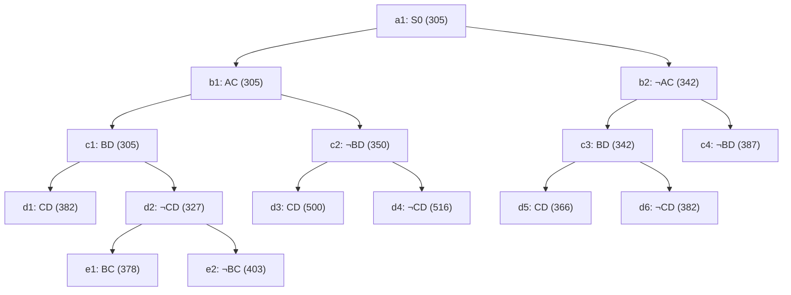

## The Question

The TSP BnB snapshot when the optimal tour is discovered. `XY` = include edge, `¬XY` = exclude. Numbers = lower bounds. Reference numbers break ties.

| # | Question | Official answer |
|---|----------|-----------------|
| 2.1 | 2nd–5th nodes refined | `b1,c1,d2,b2` |
| 2.2 | Node of the optimal tour | `d5` |
| 2.3 | Cost of the optimal tour | `366` |
| 2.4 | Number of cities | `5` |
| 2.5 | Optimal tour from A | `A,B,D,C,E` (also `A,E,C,D,B`) |

## The Topic in 60 Seconds

- A node = a set of tours sharing its include/exclude decisions; its number = a **lower bound** for that set.
- **Refine** = pop the cheapest open node, insert its two children. Bounds rise monotonically toward leaves.
- **Childless nodes** in the snapshot are finished branches — tours.
- Stop when a **tour** is popped and no open node is cheaper.

> Deep-dive: [Reading BnB Trees](/concepts/week-05-optimal-tsp/01-bnb-tree-reading), [Branch and Bound](/concepts/week-03-heuristic-search/05-branch-and-bound).

## 2.1 — Refine order → `b1,c1,d2,b2`

| Pop | Queue (min first) | Action |
|-----|-------------------|--------|
| 1 | a1 : 305 | refine → b1(305), b2(342) |
| 2 | b1 : 305, b2 : 342 | refine **b1** → c1(305), c2(350) |
| 3 | c1 : 305, b2 : 342, c2 : 350 | refine **c1** → d1(382), **d2(327)** |
| 4 | d2 : 327, b2 : 342, c2 : 350, d1 : 382 | refine **d2** → e1(378), e2(403) |
| 5 | b2 : 342, c2 : 350, e1 : 378, d1 : 382, e2 : 403 | refine **b2** → c3(342), c4(387) |

2nd–5th refined: **b1, c1, d2, b2** ✓

## 2.2 & 2.3 — Optimal tour → `d5`, cost `366`

Continue the queue: after b2 the OPEN set is c3 : 342, c2 : 350, e1 : 378, d1 : 382, c4 : 387, e2 : 403. Pop c3(342) → d5(366), d6(382). Pop c2(350) → d3(500), d4(516). Now the minimum is **d5 : 366 — a leaf (tour)**, and every open node ≥ 378. **d5 is the optimal tour, cost 366** ✓

## 2.4 — Number of cities → `5`

Reconstruct the tour d5 forces. Path root→d5: **¬AC, BD, CD** (exclude A–C; include B–D, C–D).

- Degrees: B–1, C–1, D–2 (full), A–0, E–0.
- D is done. A needs 2 edges from AB and AE (AC excluded) — so AB and AE. E then takes the remaining slot: E–C.
- Forced tour: **A–B–D–C–E–A** → 5 distinct cities ✓ (a 4-city attempt strands C once CD and AC are gone).

## 2.5 — Tour from A → `A,B,D,C,E`

The forced cycle above, rotated to start at A: **A, B, D, C, E** (reverse rotation A,E,C,D,B also accepted).

Interactive tree — amber = refined (in pop order), green = the winning leaf:

<Graph
  height={440}
  nodeWidth={110}
  nodeHeight={56}
  nodeFontSize={12}
  layout={{ name: "preset" }}
  elements={[
    { data: { id: "a1", label: "a1: S0 305", type: "current" }, position: { x: 400, y: 20 } },
    { data: { id: "b1", label: "b1: AC 305", type: "current" }, position: { x: 200, y: 110 } },
    { data: { id: "b2", label: "b2: ¬AC 342", type: "current" }, position: { x: 640, y: 110 } },
    { data: { id: "c1", label: "c1: BD 305", type: "current" }, position: { x: 60, y: 200 } },
    { data: { id: "c2", label: "c2: ¬BD 350", type: "explored" }, position: { x: 320, y: 200 } },
    { data: { id: "c3", label: "c3: BD 342", type: "explored" }, position: { x: 560, y: 200 } },
    { data: { id: "c4", label: "c4: ¬BD 387" }, position: { x: 760, y: 200 } },
    { data: { id: "d1", label: "d1: CD 382" }, position: { x: 10, y: 290 } },
    { data: { id: "d2", label: "d2: ¬CD 327", type: "current" }, position: { x: 130, y: 290 } },
    { data: { id: "d3", label: "d3: CD 500" }, position: { x: 270, y: 290 } },
    { data: { id: "d4", label: "d4: ¬CD 516" }, position: { x: 390, y: 290 } },
    { data: { id: "d5", label: "d5: CD 366 ✓", type: "path" }, position: { x: 510, y: 290 } },
    { data: { id: "d6", label: "d6: ¬CD 382" }, position: { x: 640, y: 290 } },
    { data: { id: "e1", label: "e1: BC 378" }, position: { x: 80, y: 380 } },
    { data: { id: "e2", label: "e2: ¬BC 403" }, position: { x: 200, y: 380 } },
    { data: { id: "x1", source: "a1", target: "b1" } },
    { data: { id: "x2", source: "a1", target: "b2" } },
    { data: { id: "x3", source: "b1", target: "c1" } },
    { data: { id: "x4", source: "b1", target: "c2" } },
    { data: { id: "x5", source: "b2", target: "c3" } },
    { data: { id: "x6", source: "b2", target: "c4" } },
    { data: { id: "x7", source: "c1", target: "d1" } },
    { data: { id: "x8", source: "c1", target: "d2" } },
    { data: { id: "x9", source: "c2", target: "d3" } },
    { data: { id: "x10", source: "c2", target: "d4" } },
    { data: { id: "x11", source: "c3", target: "d5" } },
    { data: { id: "x12", source: "c3", target: "d6" } },
    { data: { id: "x13", source: "d2", target: "e1" } },
    { data: { id: "x14", source: "d2", target: "e2" } },
  ]}
/>

*Amber = refined in order b1 → c1 → d2 → b2 (pop 2–5). Green = d5, the 366 tour.*

## Tricks & Tips

<Accordion title="Fast method">
1. Queue table with (cost, ref#) — pop cheapest, refine if it has children in the snapshot.
2. The optimal tour = cheapest **childless** node popped while all open bounds are ≥ it.
3. Cities: complete the degrees from the winner's include/exclude chain; the forced detour reveals hidden cities (E here).
4. Both rotations of the cycle are usually accepted — write the one starting at the requested city.
</Accordion>

**Answers:** 2.1 `b1,c1,d2,b2` · 2.2 `d5` · 2.3 `366` · 2.4 `5` · 2.5 `A,B,D,C,E`
