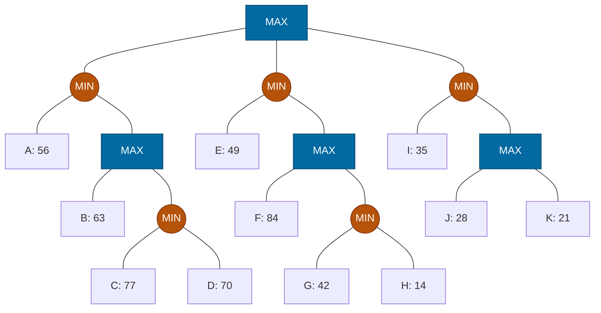

## The Question

Squares = MAX, circles = MIN. Leaves A–K. Tie-breaker: deepest, then leftmost.

| # | Question | Official answer |
|---|----------|-----------------|
| 3.1 | Valid strategies for MAX (A: I,K · B: E,F,G · C: E,F · D: I,J,K) | **A and C** |
| 3.2 | Leaves in MAX's best strategy | `A,C,D` |
| 3.3 | Leaves inspected by Alpha-Beta | `A,B,E,I` |
| 3.4 | Leaves SOLVED by SSS* | `A,B,E,I` |

## The Topic in 60 Seconds

- **Backups:** MAX takes max, MIN takes min.
- **Strategy for MAX:** at every MAX node the set-leaves must descend from **one single child**; MIN's alternatives all stay in the set.
- **Best strategy** = valid set maximizing $\min(\text{leaf evals})$; its guarantee equals the root's minimax value.
- **Alpha-Beta:** prune the moment $\alpha \ge \beta$ (β-cutoff at MAX, α-cutoff at MIN).
- **SSS\*:** proves values line-by-line; unneeded leaves are never expanded.

> Deep-dive: [Minimax](/concepts/week-07-game-search/01-minimax), [Game Strategies](/concepts/week-07-game-search/03-game-strategies), [Alpha-Beta Pruning](/concepts/week-07-game-search/02-alpha-beta-pruning), [SSS*](/concepts/week-03-heuristic-search/03-sss-star).

## Step 0 — Back up the tree

- $Y_1 = \min(77, 70) = 70$; $\quad Y_2 = \min(42, 14) = 14$
- $X_1 = \max(56, 70) = 70$; $\quad X_2 = \max(84, 14) = 84$; $\quad X_3 = \max(28, 21) = 28$
- $M_1 = \min(56, 70) = 56$; $\quad M_2 = \min(49, 84) = 49$; $\quad M_3 = \min(35, 28) = 28$
- $\text{Root} = \max(56, 49, 28) = \mathbf{56}$ via $M_1$

## 3.1 — Valid strategies → **A (I,K) and C (E,F)**

| Option | Split test at MAX nodes | Verdict |
|--------|-------------------------|---------|
| **A: I,K** | Root: all via $M_3$ ✓. $X_3$: K via one child ✓. $M_3$ keeps I and the $X_3$ branch ✓ | **Valid** |
| B: E,F,G | $X_2$ has F (direct) and G (via $Y_2$) — **split!** | Invalid |
| **C: E,F** | Root: via $M_2$ ✓. $X_2$ → F only ✓ | **Valid** |
| D: I,J,K | $X_3$ has both J and K as children — **split!** | Invalid |

## 3.2 — Best strategy → `A,C,D`

Root commits to $M_1$ (56). $M_1$ (MIN) keeps **all**: A and the $X_1$ subtree. $X_1$ (MAX) picks $Y_1$ (70 beats 63). $Y_1$ (MIN) keeps C and D.

Horizon set: **A, C, D** — guarantee $\min(56, 77, 70) = 56$ = game value ✓

## 3.3 — Alpha-Beta inspects → `A,B,E,I`

| Node | Window | Happening |
|------|--------|-----------|
| $M_1$ (MIN) | $(-\infty, +\infty)$ | A = 56 → $\beta = 56$ |
| $X_1$ (MAX) | $(-\infty, 56)$ | B = 63 ≥ 56 → **β-cutoff** — $Y_1$ (C, D) pruned! |
| Root | $\alpha = 56$ | |
| $M_2$ (MIN) | $(56, +\infty)$ | E = 49 ≤ 56 → **α-cutoff** — $X_2$ (F, G, H) pruned |
| $M_3$ (MIN) | $(56, +\infty)$ | I = 35 ≤ 56 → **α-cutoff** — $X_3$ (J, K) pruned |

Inspected: **A, B, E, I** ✓ (only 4 of 11 leaves!). Pruned: C, D, F, G, H, J, K.

## 3.4 — SSS* solves → `A,B,E,I`

1. **A solved** (56) → $M_1 \le 56$.
2. $X_1$ live with bound 56 → solve **B** (63 ≥ 56 ✓) → $X_1$ proven ≥ 56 → **$Y_1$ (C, D) never expanded**.
3. $M_1$ solved = 56. $M_2$: solve **E** (49 < 56) → $M_2 = 49$. $M_3$: solve **I** (35) → $M_3 = 35$.
4. Root = 56.

Solved leaves: **A, B, E, I** ✓ — identical to α-β's inspected set here.

Interactive α-β trace (the cutoffs are the whole story):

<StepGraph
  height={430}
  nodeWidth={96}
  nodeHeight={48}
  nodeFontSize={11}
  legend={[
    { color: "#0369a1", label: "MAX (square)" },
    { color: "#b45309", label: "MIN (circle)" },
    { color: "#16a34a", label: "inspected / value path" },
    { color: "#4b5563", label: "pruned" },
  ]}
  steps={[
    {
      label: "1 · M1: A=56",
      note: "Root MAX (−∞,+∞) → M1 (MIN).\nA = 56 → β(M1) = 56.",
      elements: [
        { data: { id: "R", label: "MAX", type: "max" }, position: { x: 430, y: 20 } },
        { data: { id: "M1", label: "MIN β=56", type: "current" }, position: { x: 150, y: 110 } },
        { data: { id: "M2", label: "MIN", type: "min" }, position: { x: 430, y: 110 } },
        { data: { id: "M3", label: "MIN", type: "min" }, position: { x: 710, y: 110 } },
        { data: { id: "A", label: "A: 56", type: "path" }, position: { x: 50, y: 210 } },
        { data: { id: "X1", label: "MAX", type: "max" }, position: { x: 210, y: 210 } },
        { data: { id: "E", label: "E: 49" }, position: { x: 340, y: 210 } },
        { data: { id: "X2", label: "MAX", type: "max" }, position: { x: 490, y: 210 } },
        { data: { id: "I", label: "I: 35" }, position: { x: 640, y: 210 } },
        { data: { id: "X3", label: "MAX", type: "max" }, position: { x: 780, y: 210 } },
        { data: { id: "B", label: "B: 63", type: "frontier" }, position: { x: 140, y: 300 } },
        { data: { id: "Y1", label: "MIN", type: "min" }, position: { x: 270, y: 300 } },
        { data: { id: "F", label: "F: 84", type: "frontier" }, position: { x: 430, y: 300 } },
        { data: { id: "Y2", label: "MIN", type: "min" }, position: { x: 550, y: 300 } },
        { data: { id: "J", label: "J: 28", type: "frontier" }, position: { x: 720, y: 300 } },
        { data: { id: "K", label: "K: 21", type: "frontier" }, position: { x: 840, y: 300 } },
        { data: { id: "C", label: "C: 77", type: "frontier" }, position: { x: 200, y: 390 } },
        { data: { id: "D", label: "D: 70", type: "frontier" }, position: { x: 330, y: 390 } },
        { data: { id: "G", label: "G: 42", type: "frontier" }, position: { x: 490, y: 390 } },
        { data: { id: "H", label: "H: 14", type: "frontier" }, position: { x: 610, y: 390 } },
        { data: { id: "e1", source: "R", target: "M1" } },
        { data: { id: "e2", source: "R", target: "M2" } },
        { data: { id: "e3", source: "R", target: "M3" } },
        { data: { id: "e4", source: "M1", target: "A" } },
        { data: { id: "e5", source: "M1", target: "X1" } },
        { data: { id: "e6", source: "X1", target: "B" } },
        { data: { id: "e7", source: "X1", target: "Y1" } },
        { data: { id: "e8", source: "Y1", target: "C" } },
        { data: { id: "e9", source: "Y1", target: "D" } },
        { data: { id: "e10", source: "M2", target: "E" } },
        { data: { id: "e11", source: "M2", target: "X2" } },
        { data: { id: "e12", source: "X2", target: "F" } },
        { data: { id: "e13", source: "X2", target: "Y2" } },
        { data: { id: "e14", source: "Y2", target: "G" } },
        { data: { id: "e15", source: "Y2", target: "H" } },
        { data: { id: "e16", source: "M3", target: "I" } },
        { data: { id: "e17", source: "M3", target: "X3" } },
        { data: { id: "e18", source: "X3", target: "J" } },
        { data: { id: "e19", source: "X3", target: "K" } },
      ],
    },
    {
      label: "2 · X1: B=63 ✂",
      note: "X1 (MAX) window (−∞, 56): B = 63 ≥ 56 → β-CUTOFF.\nY1 (C, D) pruned. M1 = min(56, 63) = 56. Root: α = 56.",
      elements: [
        { data: { id: "R", label: "MAX α=56", type: "current" }, position: { x: 430, y: 20 } },
        { data: { id: "M1", label: "MIN =56", type: "path" }, position: { x: 150, y: 110 } },
        { data: { id: "M2", label: "MIN", type: "min" }, position: { x: 430, y: 110 } },
        { data: { id: "M3", label: "MIN", type: "min" }, position: { x: 710, y: 110 } },
        { data: { id: "A", label: "A: 56", type: "path" }, position: { x: 50, y: 210 } },
        { data: { id: "X1", label: "MAX ✂", type: "current" }, position: { x: 210, y: 210 } },
        { data: { id: "E", label: "E: 49" }, position: { x: 340, y: 210 } },
        { data: { id: "X2", label: "MAX", type: "max" }, position: { x: 490, y: 210 } },
        { data: { id: "I", label: "I: 35" }, position: { x: 640, y: 210 } },
        { data: { id: "X3", label: "MAX", type: "max" }, position: { x: 780, y: 210 } },
        { data: { id: "B", label: "B: 63", type: "path" }, position: { x: 140, y: 300 } },
        { data: { id: "Y1", label: "MIN ✂", type: "explored" }, position: { x: 270, y: 300 } },
        { data: { id: "F", label: "F: 84", type: "frontier" }, position: { x: 430, y: 300 } },
        { data: { id: "Y2", label: "MIN", type: "min" }, position: { x: 550, y: 300 } },
        { data: { id: "J", label: "J: 28", type: "frontier" }, position: { x: 720, y: 300 } },
        { data: { id: "K", label: "K: 21", type: "frontier" }, position: { x: 840, y: 300 } },
        { data: { id: "C", label: "C: 77 ✂", type: "explored" }, position: { x: 200, y: 390 } },
        { data: { id: "D", label: "D: 70 ✂", type: "explored" }, position: { x: 330, y: 390 } },
        { data: { id: "G", label: "G: 42", type: "frontier" }, position: { x: 490, y: 390 } },
        { data: { id: "H", label: "H: 14", type: "frontier" }, position: { x: 610, y: 390 } },
        { data: { id: "e1", source: "R", target: "M1" } },
        { data: { id: "e2", source: "R", target: "M2" } },
        { data: { id: "e3", source: "R", target: "M3" } },
        { data: { id: "e4", source: "M1", target: "A" } },
        { data: { id: "e5", source: "M1", target: "X1" } },
        { data: { id: "e6", source: "X1", target: "B" } },
        { data: { id: "e7", source: "X1", target: "Y1" } },
        { data: { id: "e8", source: "Y1", target: "C" } },
        { data: { id: "e9", source: "Y1", target: "D" } },
        { data: { id: "e10", source: "M2", target: "E" } },
        { data: { id: "e11", source: "M2", target: "X2" } },
        { data: { id: "e12", source: "X2", target: "F" } },
        { data: { id: "e13", source: "X2", target: "Y2" } },
        { data: { id: "e14", source: "Y2", target: "G" } },
        { data: { id: "e15", source: "Y2", target: "H" } },
        { data: { id: "e16", source: "M3", target: "I" } },
        { data: { id: "e17", source: "M3", target: "X3" } },
        { data: { id: "e18", source: "X3", target: "J" } },
        { data: { id: "e19", source: "X3", target: "K" } },
      ],
    },
    {
      label: "3 · M2: E=49 ✂",
      note: "M2 (MIN) window (56, +∞): E = 49 ≤ 56 → α-CUTOFF.\nX2 (F, G, H) pruned. M2 = 49.",
      elements: [
        { data: { id: "R", label: "MAX α=56", type: "max" }, position: { x: 430, y: 20 } },
        { data: { id: "M1", label: "MIN =56", type: "path" }, position: { x: 150, y: 110 } },
        { data: { id: "M2", label: "MIN ✂ =49", type: "current" }, position: { x: 430, y: 110 } },
        { data: { id: "M3", label: "MIN", type: "min" }, position: { x: 710, y: 110 } },
        { data: { id: "A", label: "A: 56", type: "path" }, position: { x: 50, y: 210 } },
        { data: { id: "X1", label: "MAX", type: "max" }, position: { x: 210, y: 210 } },
        { data: { id: "E", label: "E: 49", type: "path" }, position: { x: 340, y: 210 } },
        { data: { id: "X2", label: "MAX ✂", type: "explored" }, position: { x: 490, y: 210 } },
        { data: { id: "I", label: "I: 35" }, position: { x: 640, y: 210 } },
        { data: { id: "X3", label: "MAX", type: "max" }, position: { x: 780, y: 210 } },
        { data: { id: "B", label: "B: 63", type: "explored" }, position: { x: 140, y: 300 } },
        { data: { id: "Y1", label: "MIN ✂", type: "explored" }, position: { x: 270, y: 300 } },
        { data: { id: "F", label: "F: 84 ✂", type: "explored" }, position: { x: 430, y: 300 } },
        { data: { id: "Y2", label: "MIN ✂", type: "explored" }, position: { x: 550, y: 300 } },
        { data: { id: "J", label: "J: 28", type: "frontier" }, position: { x: 720, y: 300 } },
        { data: { id: "K", label: "K: 21", type: "frontier" }, position: { x: 840, y: 300 } },
        { data: { id: "C", label: "C: 77 ✂", type: "explored" }, position: { x: 200, y: 390 } },
        { data: { id: "D", label: "D: 70 ✂", type: "explored" }, position: { x: 330, y: 390 } },
        { data: { id: "G", label: "G: 42 ✂", type: "explored" }, position: { x: 490, y: 390 } },
        { data: { id: "H", label: "H: 14 ✂", type: "explored" }, position: { x: 610, y: 390 } },
        { data: { id: "e1", source: "R", target: "M1" } },
        { data: { id: "e2", source: "R", target: "M2" } },
        { data: { id: "e3", source: "R", target: "M3" } },
        { data: { id: "e4", source: "M1", target: "A" } },
        { data: { id: "e5", source: "M1", target: "X1" } },
        { data: { id: "e6", source: "X1", target: "B" } },
        { data: { id: "e7", source: "X1", target: "Y1" } },
        { data: { id: "e8", source: "Y1", target: "C" } },
        { data: { id: "e9", source: "Y1", target: "D" } },
        { data: { id: "e10", source: "M2", target: "E" } },
        { data: { id: "e11", source: "M2", target: "X2" } },
        { data: { id: "e12", source: "X2", target: "F" } },
        { data: { id: "e13", source: "X2", target: "Y2" } },
        { data: { id: "e14", source: "Y2", target: "G" } },
        { data: { id: "e15", source: "Y2", target: "H" } },
        { data: { id: "e16", source: "M3", target: "I" } },
        { data: { id: "e17", source: "M3", target: "X3" } },
        { data: { id: "e18", source: "X3", target: "J" } },
        { data: { id: "e19", source: "X3", target: "K" } },
      ],
    },
    {
      label: "4 · M3: I=35 ✂ · Root=56",
      note: "M3 (MIN) window (56, +∞): I = 35 ≤ 56 → α-CUTOFF. X3 (J, K) pruned.\nRoot = max(56, 49, 35) = 56 via M1.\nInspected: A, B, E, I. Pruned: C, D, F, G, H, J, K.",
      elements: [
        { data: { id: "R", label: "MAX =56 ✓", type: "path" }, position: { x: 430, y: 20 } },
        { data: { id: "M1", label: "MIN =56", type: "path" }, position: { x: 150, y: 110 } },
        { data: { id: "M2", label: "MIN =49", type: "path" }, position: { x: 430, y: 110 } },
        { data: { id: "M3", label: "MIN ✂ =35", type: "current" }, position: { x: 710, y: 110 } },
        { data: { id: "A", label: "A: 56", type: "path" }, position: { x: 50, y: 210 } },
        { data: { id: "X1", label: "MAX", type: "max" }, position: { x: 210, y: 210 } },
        { data: { id: "E", label: "E: 49", type: "path" }, position: { x: 340, y: 210 } },
        { data: { id: "X2", label: "MAX ✂", type: "explored" }, position: { x: 490, y: 210 } },
        { data: { id: "I", label: "I: 35", type: "path" }, position: { x: 640, y: 210 } },
        { data: { id: "X3", label: "MAX ✂", type: "explored" }, position: { x: 780, y: 210 } },
        { data: { id: "B", label: "B: 63", type: "path" }, position: { x: 140, y: 300 } },
        { data: { id: "Y1", label: "MIN ✂", type: "explored" }, position: { x: 270, y: 300 } },
        { data: { id: "F", label: "F: 84 ✂", type: "explored" }, position: { x: 430, y: 300 } },
        { data: { id: "Y2", label: "MIN ✂", type: "explored" }, position: { x: 550, y: 300 } },
        { data: { id: "J", label: "J: 28 ✂", type: "explored" }, position: { x: 720, y: 300 } },
        { data: { id: "K", label: "K: 21 ✂", type: "explored" }, position: { x: 840, y: 300 } },
        { data: { id: "C", label: "C: 77 ✂", type: "explored" }, position: { x: 200, y: 390 } },
        { data: { id: "D", label: "D: 70 ✂", type: "explored" }, position: { x: 330, y: 390 } },
        { data: { id: "G", label: "G: 42 ✂", type: "explored" }, position: { x: 490, y: 390 } },
        { data: { id: "H", label: "H: 14 ✂", type: "explored" }, position: { x: 610, y: 390 } },
        { data: { id: "e1", source: "R", target: "M1", type: "path" } },
        { data: { id: "e2", source: "R", target: "M2" } },
        { data: { id: "e3", source: "R", target: "M3" } },
        { data: { id: "e4", source: "M1", target: "A", type: "path" } },
        { data: { id: "e5", source: "M1", target: "X1" } },
        { data: { id: "e6", source: "X1", target: "B" } },
        { data: { id: "e7", source: "X1", target: "Y1" } },
        { data: { id: "e8", source: "Y1", target: "C" } },
        { data: { id: "e9", source: "Y1", target: "D" } },
        { data: { id: "e10", source: "M2", target: "E" } },
        { data: { id: "e11", source: "M2", target: "X2" } },
        { data: { id: "e12", source: "X2", target: "F" } },
        { data: { id: "e13", source: "X2", target: "Y2" } },
        { data: { id: "e14", source: "Y2", target: "G" } },
        { data: { id: "e15", source: "Y2", target: "H" } },
        { data: { id: "e16", source: "M3", target: "I" } },
        { data: { id: "e17", source: "M3", target: "X3" } },
        { data: { id: "e18", source: "X3", target: "J" } },
        { data: { id: "e19", source: "X3", target: "K" } },
      ],
    },
  ]}
/>

<Callout type="tip" title="Why SSS* matches α-β here">
SSS* proves A (56) → M1 ≤ 56; then B (63 ≥ 56) proves X1 without touching Y1 — the same cutoff α-β found. Then E and I solve M2, M3 cheaply. Solved = A, B, E, I — identical to the inspected set.
</Callout>

## Tricks & Tips

<Accordion title="Speed routines">
1. **Back up everything first** — Y, X, M levels, then root.
2. **Strategy validity = no split at any MAX node** (leaves not descending from a MAX node don't count against it).
3. **Best strategy:** walk the value down (MAX picks max child, MIN keeps all), collect leaves, verify min = root value.
4. **α-β on MIN-heavy trees:** a low first leaf at a MIN node kills its whole right siblings (α-cutoff); a high first leaf at a MAX node inside a MIN parent kills its own children (β-cutoff).
5. **SSS\* here = solve first leaf, prove the sibling subtree with the bound, move on.**
</Accordion>

**Answers:** 3.1 **A, C** · 3.2 `A,C,D` · 3.3 `A,B,E,I` · 3.4 `A,B,E,I`
