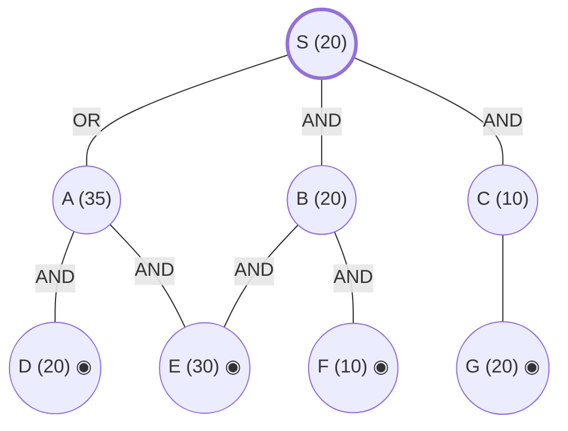

## The Question

AND–OR decomposition of S. Double circles = primitive (actual costs, born SOLVED). Every edge costs **2**. Tie-breakers: node labels; for AND nodes expand the **highest-cost unsolved branch** first.

AND arcs (from the figure): **S** = AND(B, C) *or* OR(A). **A** = AND(D, E). **B** = AND(E, F). C has the single child G. All of D, E, F, G are primitive.

| # | Question | Official answer |
|---|----------|-----------------|
| 4.1 | Nodes expanded (incl. S) | `S,B,A` |
| 4.2 | Value of S after each expansion | `34,37,56` |
| 4.3 | Final value of S | `56` |

## The Topic in 60 Seconds

AO* alternates **expand** (walk marked arcs from the root to a live node) and **revise** (recompute each option — OR: best child + edge; AND: sum of children + edges — mark the cheapest, propagate up). A node becomes SOLVED when its marked option's children are all solved. Unlike A*, the marked option can **switch** when refined costs overtake a rival branch.

> Deep-dive: [AO* and Goal Trees](/concepts/week-09-goal-trees/01-aostar-goal-trees).

## The Trace — three expansions

h: S=20, A=35, B=20, C=10; D=E=F=G=10/20/30/20 primitive.

**Expansion 1 — S.**
- AND(B, C): $(20+2) + (10+2) = 34$
- OR(A): $35 + 2 = 37$

Mark AND(B, C) → **S = 34** ✓

**Expansion 2 — B** (marked path: B(20), C(10); B is costlier → tie-breaker 2).
B: AND(E, F) $= (30+2) + (10+2) = 44$; E, F primitive → **B = 44, SOLVED**.
Propagate: AND(B, C) $= (44+2)+(10+2) = 58$ — now **worse than OR(A) = 37**! The marker **switches**:
$$S = \min(58,\ 37) = \mathbf{37} \checkmark \text{ (marked } \to A\text{)}$$

**Expansion 3 — A** (now on the marked path).
A: AND(D, E) $= (20+2)+(30+2) = 54$; D, E primitive → **A = 54, SOLVED**.
Propagate: $S = \min(58,\ 54+2) = \mathbf{56}$, and since A is solved → **S SOLVED = 56** ✓

**Final value of S = 56.** Solution subtree: S → A → D,E.

Interactive trace — watch the green marked arcs jump from the B,C branch to A:

<StepGraph
  height={420}
  nodeWidth={110}
  nodeHeight={52}
  nodeFontSize={12}
  legend={[
    { color: "#b45309", label: "expanding now" },
    { color: "#0369a1", label: "live on marked path" },
    { color: "#52525b", label: "primitive (born SOLVED)" },
    { color: "#16a34a", label: "marked arcs" },
  ]}
  steps={[
    {
      label: "0 · setup",
      note: "h: S=20, A=35, B=20, C=10; D=20, E=30, F=10, G=20 primitive.\nEdge = 2.\nS: AND(B,C) = (20+2)+(10+2) = 34 | OR(A) = 35+2 = 37\n→ mark AND(B,C). S = 34",
      elements: [
        { data: { id: "S", label: "S =34", type: "frontier" }, position: { x: 400, y: 30 } },
        { data: { id: "A", label: "A 35 (OR)", type: "frontier" }, position: { x: 120, y: 150 } },
        { data: { id: "B", label: "B 20", type: "frontier" }, position: { x: 400, y: 150 } },
        { data: { id: "C", label: "C 10", type: "frontier" }, position: { x: 680, y: 150 } },
        { data: { id: "D", label: "D 20", type: "primitive" }, position: { x: 40, y: 280 } },
        { data: { id: "E", label: "E 30", type: "primitive" }, position: { x: 260, y: 280 } },
        { data: { id: "F", label: "F 10", type: "primitive" }, position: { x: 540, y: 280 } },
        { data: { id: "G", label: "G 20", type: "primitive" }, position: { x: 760, y: 280 } },
        { data: { id: "e1", source: "S", target: "A", label: "OR" } },
        { data: { id: "e2", source: "S", target: "B", label: "AND", type: "path" } },
        { data: { id: "e3", source: "S", target: "C", label: "AND", type: "path" } },
        { data: { id: "e4", source: "A", target: "D" } },
        { data: { id: "e5", source: "A", target: "E" } },
        { data: { id: "e6", source: "B", target: "E" } },
        { data: { id: "e7", source: "B", target: "F" } },
        { data: { id: "e8", source: "C", target: "G" } },
      ],
    },
    {
      label: "1 · expand S → 34",
      note: "Marked path: B and C (AND). Tie-breaker 2: expand costlier branch → B (20 > 10).",
      elements: [
        { data: { id: "S", label: "S =34", type: "explored" }, position: { x: 400, y: 30 } },
        { data: { id: "A", label: "A 35 (OR)", type: "explored" }, position: { x: 120, y: 150 } },
        { data: { id: "B", label: "B 20", type: "current" }, position: { x: 400, y: 150 } },
        { data: { id: "C", label: "C 10", type: "frontier" }, position: { x: 680, y: 150 } },
        { data: { id: "D", label: "D 20", type: "primitive" }, position: { x: 40, y: 280 } },
        { data: { id: "E", label: "E 30", type: "primitive" }, position: { x: 260, y: 280 } },
        { data: { id: "F", label: "F 10", type: "primitive" }, position: { x: 540, y: 280 } },
        { data: { id: "G", label: "G 20", type: "primitive" }, position: { x: 760, y: 280 } },
        { data: { id: "e1", source: "S", target: "A", label: "OR" } },
        { data: { id: "e2", source: "S", target: "B", label: "AND", type: "path" } },
        { data: { id: "e3", source: "S", target: "C", label: "AND", type: "path" } },
        { data: { id: "e4", source: "A", target: "D" } },
        { data: { id: "e5", source: "A", target: "E" } },
        { data: { id: "e6", source: "B", target: "E" } },
        { data: { id: "e7", source: "B", target: "F" } },
        { data: { id: "e8", source: "C", target: "G" } },
      ],
    },
    {
      label: "2 · expand B → 37 (marker flips!)",
      note: "B: AND(E,F) = (30+2)+(10+2) = 44, both primitive → B = 44 SOLVED.\nAND(B,C) = (44+2)+(10+2) = 58 > OR(A) = 37 → MARKER SWITCHES to A.\nS = 37",
      elements: [
        { data: { id: "S", label: "S =37", type: "current" }, position: { x: 400, y: 30 } },
        { data: { id: "A", label: "A 35 ←marked", type: "frontier" }, position: { x: 120, y: 150 } },
        { data: { id: "B", label: "B =44 ✓", type: "path" }, position: { x: 400, y: 150 } },
        { data: { id: "C", label: "C 10", type: "explored" }, position: { x: 680, y: 150 } },
        { data: { id: "D", label: "D 20", type: "primitive" }, position: { x: 40, y: 280 } },
        { data: { id: "E", label: "E 30", type: "primitive" }, position: { x: 260, y: 280 } },
        { data: { id: "F", label: "F 10", type: "primitive" }, position: { x: 540, y: 280 } },
        { data: { id: "G", label: "G 20", type: "primitive" }, position: { x: 760, y: 280 } },
        { data: { id: "e1", source: "S", target: "A", label: "OR", type: "path" } },
        { data: { id: "e2", source: "S", target: "B", label: "AND" } },
        { data: { id: "e3", source: "S", target: "C", label: "AND" } },
        { data: { id: "e4", source: "A", target: "D" } },
        { data: { id: "e5", source: "A", target: "E" } },
        { data: { id: "e6", source: "B", target: "E", type: "path" } },
        { data: { id: "e7", source: "B", target: "F", type: "path" } },
        { data: { id: "e8", source: "C", target: "G" } },
      ],
    },
    {
      label: "3 · expand A → 56 ✓ SOLVED",
      note: "A: AND(D,E) = (20+2)+(30+2) = 54, both primitive → A = 54 SOLVED.\nS = min(58, 54+2) = 56, A solved → S SOLVED. Final = 56.",
      elements: [
        { data: { id: "S", label: "S =56 ✓", type: "path" }, position: { x: 400, y: 30 } },
        { data: { id: "A", label: "A =54 ✓", type: "path" }, position: { x: 120, y: 150 } },
        { data: { id: "B", label: "B =44", type: "explored" }, position: { x: 400, y: 150 } },
        { data: { id: "C", label: "C 10", type: "explored" }, position: { x: 680, y: 150 } },
        { data: { id: "D", label: "D 20", type: "primitive" }, position: { x: 40, y: 280 } },
        { data: { id: "E", label: "E 30", type: "primitive" }, position: { x: 260, y: 280 } },
        { data: { id: "F", label: "F 10", type: "primitive" }, position: { x: 540, y: 280 } },
        { data: { id: "G", label: "G 20", type: "primitive" }, position: { x: 760, y: 280 } },
        { data: { id: "e1", source: "S", target: "A", label: "OR", type: "path" } },
        { data: { id: "e2", source: "S", target: "B", label: "AND" } },
        { data: { id: "e3", source: "S", target: "C", label: "AND" } },
        { data: { id: "e4", source: "A", target: "D", type: "path" } },
        { data: { id: "e5", source: "A", target: "E", type: "path" } },
        { data: { id: "e6", source: "B", target: "E" } },
        { data: { id: "e7", source: "B", target: "F" } },
        { data: { id: "e8", source: "C", target: "G" } },
      ],
    },
  ]}
/>

<Callout type="important" title="The marker switch is the exam trap">
After expansion 2, the once-cheap AND(B,C) branch (34) ballooned to 58 — because B's *real* cost (44) is more than double its guess (20). AO* didn't expand C next; it abandoned the branch entirely and switched to A. If you blindly expand along the original marked path, you get 4.2 wrong.
</Callout>

## Answers, decoded

- **4.1** — expansions: **S, B, A** (C never expanded — its branch was abandoned).
- **4.2** — S after each: **34, 37, 56**.
- **4.3** — final: **56** via the solution subtree S → A → D,E.

## Tricks & Tips

<Accordion title="Fast method">
1. **Read the AND arcs off the figure first** — S's arc spans (B, C), not (A, B).
2. **Compute ALL of S's options at step 1** (34 vs 37) and keep the loser visible — you'll need it the moment the winner degrades.
3. **Primitive children make a node instantly SOLVED** with cost = sum(child + edge).
4. **After every expansion, re-min ALL options at every revised ancestor** — the marker can switch upward.
5. Tie-breaker 2 (costlier AND-branch first) is what forces B before C.
</Accordion>

**Answers:** 4.1 `S,B,A` · 4.2 `34,37,56` · 4.3 `56`
