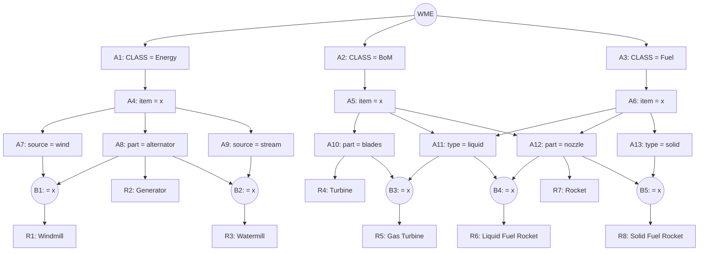

## The Question

A Rete net classifying machines (Windmill, Generator, Watermill, Turbine, Gas Turbine, Liquid Fuel Rocket, Rocket, Solid Fuel Rocket). Working memory:

```text
101. (Fuel  ^item N59 ^type solid)
102. (Fuel  ^item N26 ^type liquid)
103. (Fuel  ^item N37)
104. (BoM   ^item N48 ^part alternator)
105. (Energy ^item N48 ^source wind)
106. (BoM   ^item N37 ^part alternator)
107. (BoM   ^item N15 ^part CD-nozzle)
```

| # | Question | Official answer |
|---|----------|-----------------|
| 5.1 | Tuples in the conflict set (A: (LFR,102,107) · B: (SFR,107,101) · C: (Windmill,105,104) · D: (Generator,104) · E: (Generator,106) · F: (Rocket,107)) | **C, D, E, F** |
| 5.2 | Specificity fires | **C** |
| 5.3 | Recency fires | **F** |

## The Topic in 60 Seconds

- **Alpha nodes** filter single WMEs; **beta nodes** join two streams on a shared variable (`= <x>` joins on `^item`).
- **Conflict set** = all fully matched (rule, data…) tuples.
- **Specificity** = rule with the **most conditions** (most WMEs) fires.
- **Recency** = tuple containing the **newest (highest-timestamp) WME** fires.

> Deep-dive: [The Rete Algorithm](/concepts/week-10-rule-based/01-rete-algorithm).

## The Rete Net (from the figure)



## Step 1 — Locate every WME

| WME | Facts | Alpha node |
|-----|-------|------------|
| 101 | Fuel, N59, solid | **A13** |
| 102 | Fuel, N26, liquid | **A11** |
| 103 | Fuel, N37 (no type) | **A6** (fails A11/A13) |
| 104 | BoM, N48, alternator | **A8** |
| 105 | Energy, N48, wind | **A7** |
| 106 | BoM, N37, alternator | **A8** |
| 107 | BoM, N15, CD-nozzle | **A12** |

## Step 2 — Fire the joins (on `^item`)

- **R1 Windmill** (B1 = wind ⋈ alternator): wind `105: N48` × alternators `104: N48`, `106: N37` → **(R1, 105, 104)** ✓ on N48
- **R2 Generator** (A8 alone): 104, 106 → **(R2, 104)** ✓, **(R2, 106)** ✓
- **R3 Watermill** (stream ⋈ alternator): no stream WMEs → empty
- **R4 Turbine** (blades): none → empty
- **R5 Gas Turbine** (blades ⋈ liquid): blades empty → empty
- **R6 Liquid Fuel Rocket** (liquid ⋈ nozzle): 102 (N26) vs 107 (N15) → no match → empty
- **R7 Rocket** (A12 alone): 107 → **(R7, 107)** ✓
- **R8 Solid Fuel Rocket** (nozzle ⋈ solid): 101 (N59) vs 107 (N15) → no match → empty

**Conflict set** = (R1, 105, 104), (R2, 104), (R2, 106), (R7, 107) → options **C, D, E, F** ✓

## 5.2 — Specificity → **C**

Count WMEs per tuple: R1's has **2**; each R2 tuple has **1**; R7's has **1**. Most specific = **(R1, 105, 104)** → option **C**.

## 5.3 — Recency → **F**

Newest WME in each tuple: R1 → max(105,104) = 105; R2 → 106; R7 → **107**. Highest wins → **(R7, 107)** → option **F**.

<Callout type="tip" title="Notice the flip">
Specificity picks the two-WME Windmill tuple; recency picks the one-WME Rocket tuple (timestamp 107 is the newest fact). The strategies disagree whenever a recent fact feeds a *general* rule — exactly what this question tests.
</Callout>

## Tricks & Tips

<Accordion title="4-step recipe">
1. WME → alpha table (30 seconds; kills mismatched options like (R6,102,107): N26 ≠ N15).
2. Join each beta on the shared variable; a pair survives only if the item ids are *identical*.
3. Conflict set = every full tuple at the beta-net leaves (including single-alpha rules like R2/R7!).
4. Specificity = most WMEs; Recency = max timestamp; ties → rule label order.
</Accordion>

**Answers:** 5.1 **C, D, E, F** · 5.2 **C** · 5.3 **F**
