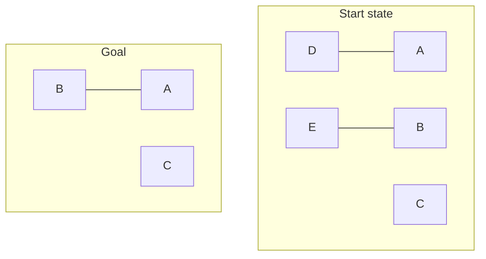
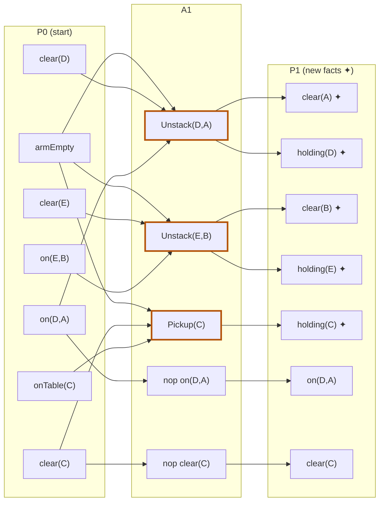

## The Question

Standard one-armed Blocks World operators (Pickup / Putdown / Unstack / Stack).

**Start state:** $\{$ onTable(A), onTable(B), onTable(C), clear(D), clear(E), clear(C), on(D,A), on(E,B), armEmpty $\}$

**Goal:** $\{$ on(B,C), on(A,B) $\}$ — tower B/A on C.

| # | Question | Official answer |
|---|----------|-----------------|
| 6.1 | Applicable in start state (A: Putdown(D) · B: Unstack(D,A) · C: Unstack(E,B) · D: Pickup(C) · E: Pickup(A) · F: Stack(A,B) · G: Stack(B,C)) | **B, C, D** |
| 6.2 | Relevant in goal state | **F, G** |
| 6.3 | Mutex action pairs in layer 1 (A: Unstack(D,A),Pickup(C) · B: Unstack(D,A),Unstack(E,B) · C: Pickup(C),Stack(A,B) · D: Pickup(C),Stack(B,C)) | **A, B** |
| 6.4 | Mutex propositions in layer 1 (A: clear(A),holding(E) · B: clear(A),clear(B) · C: clear(C),on(D,A) · D: clear(C),holding(E)) | **A, B** |

## The Topic in 60 Seconds

- **Applicable** = preconditions ⊆ current state ("can I do it *now*?").
- **Relevant** = add list ∩ goal ≠ ∅ ("does it *build* the goal?").
- $A_1$ = actions applicable in $P_0$ (+ no-ops). **Action mutex** (ANY of): inconsistent effects · interference (deletes other's precondition) · competing needs. **Proposition mutex** (ALL of): every producer pair mutex.

> Deep-dive: [Blocks World & STRIPS](/concepts/week-08-planning/01-blocks-world-strips), [GraphPlan Mutexes](/concepts/week-09-goal-trees/02-graphplan-mutexes).

## 6.1 — Applicable actions → **B, C, D**

armEmpty ✓ in the start state, so pickups and unstacks are live:

| Action | Preconditions | Verdict |
|--------|---------------|---------|
| Putdown(D) | holding(D) | ✗ not holding |
| **Unstack(D,A)** | armEmpty, clear(D), on(D,A) | **✓ all hold** |
| **Unstack(E,B)** | armEmpty, clear(E), on(E,B) | **✓ all hold** |
| **Pickup(C)** | armEmpty, clear(C), onTable(C) | **✓ all hold** |
| Pickup(A) | clear(A), onTable(A) | clear(A) ✗ (D sits on A) |
| Stack(A,B) / Stack(B,C) | holding(·) | ✗ arm is empty |

## 6.2 — Relevant actions → **F, G**

Goal predicates: on(B,C), on(A,B). Which actions **add** them?

- Stack(B,C) adds on(B,C) ✓ · Stack(A,B) adds on(A,B) ✓
- Everything else adds holding/armEmpty/clear/onTable — none in the goal.

→ **F, G**.

## 6.3 — Mutex action pairs in layer 1 → **A, B**

$A_1$ = Unstack(D,A), Unstack(E,B), Pickup(C) (+ no-ops). Stack(A,B)/Stack(B,C) (options C, D) aren't applicable → not in $A_1$ → auto-wrong.

| Pair | Reason | Mutex? |
|------|--------|--------|
| Unstack(D,A) ⊕ Pickup(C) | both **delete armEmpty** — each deletes the other's precondition → interference | **Yes** |
| Unstack(D,A) ⊕ Unstack(E,B) | same — both need and delete armEmpty | **Yes** |

## 6.4 — Mutex propositions in layer 1 → **A, B**

$P_1$ = start facts (nops) ∪ adds of $A_1$: clear(A), clear(B), holding(D), holding(E), holding(C).

| Pair | Producers | Verdict |
|------|-----------|---------|
| clear(A), holding(E) | clear(A): *only* Unstack(D,A) (not a start fact — D sits on A!). holding(E): only Unstack(E,B). Producers mutex (6.3) | **Mutex** ✓ |
| clear(A), clear(B) | clear(B): only Unstack(E,B). Same mutex producer pair | **Mutex** ✓ |
| clear(C), on(D,A) | clear(C): nop (start fact!) — nop ⊕ Unstack(D,A) non-mutex | Not mutex |
| clear(C), holding(E) | nop(clear(C)) vs Unstack(E,B) — non-mutex | Not mutex |

<Callout type="tip" title="The one fact that decides 6.4">
clear(A) and clear(B) are *not* in the start state — each has exactly **one** producer, and those two producers are mutex. That's why A and B are mutex while anything involving a start fact's no-op escapes.
</Callout>

## The Planning Graph, Layer 1

## Tricks & Tips

<Accordion title="One minute per subquestion">
1. **Applicable:** check preconditions; the arm's state (armEmpty vs holding) halves the list instantly.
2. **Relevant:** intersect add-lists with the goal set — nothing else matters.
3. **Layer-1 mutex:** options naming non-applicable actions are free eliminations.
4. **Proposition mutex:** ask "is this fact in the start state?" — a start fact's no-op producer breaks the all-producers test; a fact with a *single* mutex producer is locked.
</Accordion>

**Answers:** 6.1 **B, C, D** · 6.2 **F, G** · 6.3 **A, B** · 6.4 **A, B**
