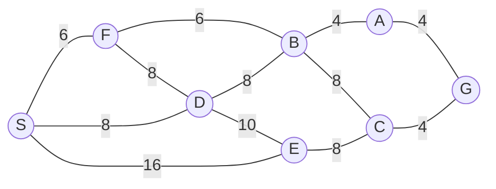

## The Question

1×1-tile grid. Start **S**, goal **G**. MoveGen alphabetical. Heuristic = Manhattan Distance. Tie-breaker: node labels.

| # | Question | Official answer |
|---|----------|-----------------|
| 1.1 | Best First Search path | `S,E,C,G` |
| 1.2 | A* path | `S,F,B,A,G` |
| 1.3 | Branch-and-Bound path | `S,F,B,A,G` |
| 1.4 | Who finds the shortest path? | **C** — both |
| 1.5 | Admissibility | **A** — admissible |

## The Topic in 60 Seconds

| Algorithm | Sorts OPEN by | Ignores |
|-----------|---------------|---------|
| Best First | $h(n)$ | $g(n)$ |
| A* | $f(n) = g(n) + h(n)$ | nothing |
| Branch-and-Bound | $g(n)$ | $h(n)$ |

> Deep-dive: [A* Search](/concepts/week-03-heuristic-search/01-a-star-search), [Best First Search](/concepts/week-03-heuristic-search/09-best-first-search), [Branch and Bound](/concepts/week-03-heuristic-search/05-branch-and-bound).

## Step 0 — Heuristic table (Manhattan to G)

| Node | $h$ | Node | $h$ |
|------|-----|------|-----|
| S | 8 | B | 6 |
| F | 9 | A | 4 |
| D | 7 | E | 4 |
| C | 2 | G | 0 |

## 1.1 — Best First Search → `S,E,C,G`

| Step | OPEN (node : $h$) | Pick | Add |
|------|-------------------|------|-----|
| 1 | S : 8 | **S** | D : 7, F : 9, E : 4 |
| 2 | E : 4, D : 7, F : 9 | **E** | C : 2 |
| 3 | C : 2, D : 7, F : 9 | **C** | G : 0 |
| 4 | G : 0, … | **G** — goal! | — |

Path: **S → E → C → G**, cost $16+8+4 = 28$.

## 1.2 — A* → `S,F,B,A,G`

| Step | OPEN (node : $f$) | Pick | Updates |
|------|-------------------|------|---------|
| 1 | S : 0+8 = **8** | **S** | F : 6+9 = **15** · D : 8+7 = **15** · E : 16+4 = **20** |
| 2 | F : **15**, D : 15, E : 20 | **F** (tie F before D) | B : 12+6 = **18** · D via F: 14+7 = 21 (keep 15) |
| 3 | D : **15**, B : 18, E : 20 | **D** | B via D: 16+6 = 22 (keep 18) · E via D: 18+4 = 22 (keep 20) |
| 4 | B : **18**, E : 20 | **B** | A : 16+4 = **20** · C : 20+2 = 22 |
| 5 | A : **20**, E : 20, C : 22 | **A** (tie A before E) | G : 20+0 = **20** |
| 6 | E : **20**, G : 20, C : 22 | **E** (tie E before G) | C via E: 26 (keep) |
| 7 | G : **20**, C : 22 | **G** — goal! | — |

Path: **S → F → B → A → G**, cost $6+6+4+4 = 20$. (The step-6 tie E vs G is why this trace is worth practising — labels keep E first, but G pops next anyway.)

## 1.3 — Branch-and-Bound → `S,F,B,A,G`

| Pop | OPEN (path : $g$) after extending |
|-----|-----------------------------------|
| S : 0 | SF : $0+6$ = **6** · SD : $0+8$ = **8** · SE : $0+16$ = **16** |
| SF : 6 | SFB : $6+6$ = **12** · **SFD : $6+8$ = 14** |
| SD : 8 | SDF : $8+8$ = **16** · SDB : $8+8$ = **16** · SDE : $8+10$ = **18** |
| SFB : 12 | SFBA : $12+4$ = **16** · SFBC : $12+8$ = **20** · SFBD : $12+8$ = **20** |
| SFD : 14 | SFDB : $14+8$ = **22** · SFDE : $14+10$ = **24** |
| SDB : 16 (first of the 16-tie — labels) | SDBA : $16+4$ = **20** · SDBF : $16+6$ = **22** · SDBC : $16+8$ = **24** |
| SDF : 16 | SDFB : $16+6$ = **22** |
| SE : 16 | SEC : $16+8$ = **24** · SED : $16+10$ = **26** |
| SFBA : 16 | SFBAG : $16+4$ = **20** ← goal queued |
| SDE : 18 | SDEC : $18+8$ = **28** |
| SDBA : 20 (tie at 20: S-D before S-F) | SDBAG : $20+4$ = **24** |
| SFBAG : **20** — next at the tie, a complete tour | everything left ≥ 20 → **optimal** |

Path: **S → F → B → A → G**, cost 20 ✓

## 1.4 — Shortest path → **C (both)**

Routes: S-F-B-A-G = **20** · S-D-B-A-G = 24 · S-F-D-B-A-G = $6+8+8+4+4$ = 30 · S-E-C-G = 28. Both algorithms returned 20 → **C**.

## 1.5 — Admissibility → **A**

$h(A) = 4 = h^*(A)$ (exact), $h(C) = 2 \le 4$, $h(B) = 6 \le 8$, $h(F) = 9 \le 14$, $h(D) = 7 \le 16$, $h(E) = 4 \le 12$, $h(S) = 8 \le 20$ — no overestimate anywhere → **admissible** ✓ (and that's why A* hit the optimum).

## Interactive A* trace

<StepGraph
  height={400}
  nodeWidth={110}
  nodeHeight={54}
  nodeFontSize={13}
  legend={[
    { color: "#b45309", label: "expanding" },
    { color: "#0369a1", label: "in OPEN (f = g+h)" },
    { color: "#4b5563", label: "expanded" },
    { color: "#16a34a", label: "returned path" },
  ]}
  steps={[
    {
      label: "Init",
      note: "OPEN = { S(0+8=8) }",
      elements: [
        { data: { id: "S", label: "S f=8", type: "frontier" }, position: { x: 40, y: 200 } },
        { data: { id: "F", label: "F", type: "explored" }, position: { x: 220, y: 40 } },
        { data: { id: "D", label: "D", type: "explored" }, position: { x: 220, y: 180 } },
        { data: { id: "E", label: "E", type: "explored" }, position: { x: 220, y: 340 } },
        { data: { id: "B", label: "B", type: "explored" }, position: { x: 420, y: 100 } },
        { data: { id: "C", label: "C", type: "explored" }, position: { x: 420, y: 340 } },
        { data: { id: "A", label: "A", type: "explored" }, position: { x: 620, y: 100 } },
        { data: { id: "G", label: "G", type: "explored" }, position: { x: 620, y: 340 } },
        { data: { id: "e1", source: "S", target: "F", label: "6" } },
        { data: { id: "e2", source: "S", target: "D", label: "8" } },
        { data: { id: "e3", source: "S", target: "E", label: "16" } },
        { data: { id: "e4", source: "F", target: "B", label: "6" } },
        { data: { id: "e5", source: "F", target: "D", label: "8" } },
        { data: { id: "e6", source: "D", target: "B", label: "8" } },
        { data: { id: "e7", source: "D", target: "E", label: "10" } },
        { data: { id: "e8", source: "B", target: "A", label: "4" } },
        { data: { id: "e9", source: "B", target: "C", label: "8" } },
        { data: { id: "e10", source: "E", target: "C", label: "8" } },
        { data: { id: "e11", source: "A", target: "G", label: "4" } },
        { data: { id: "e12", source: "C", target: "G", label: "4" } },
      ],
    },
    {
      label: "Expand S",
      note: "F: g=6, h=9 → f=15\nD: g=8, h=7 → f=15\nE: g=16, h=4 → f=20\nOPEN = { F(15), D(15), E(20) }",
      elements: [
        { data: { id: "S", label: "S", type: "explored" }, position: { x: 40, y: 200 } },
        { data: { id: "F", label: "F f=15", type: "frontier" }, position: { x: 220, y: 40 } },
        { data: { id: "D", label: "D f=15", type: "frontier" }, position: { x: 220, y: 180 } },
        { data: { id: "E", label: "E f=20", type: "frontier" }, position: { x: 220, y: 340 } },
        { data: { id: "B", label: "B", type: "explored" }, position: { x: 420, y: 100 } },
        { data: { id: "C", label: "C", type: "explored" }, position: { x: 420, y: 340 } },
        { data: { id: "A", label: "A", type: "explored" }, position: { x: 620, y: 100 } },
        { data: { id: "G", label: "G", type: "explored" }, position: { x: 620, y: 340 } },
        { data: { id: "e1", source: "S", target: "F", label: "6" } },
        { data: { id: "e2", source: "S", target: "D", label: "8" } },
        { data: { id: "e3", source: "S", target: "E", label: "16" } },
        { data: { id: "e4", source: "F", target: "B", label: "6" } },
        { data: { id: "e5", source: "F", target: "D", label: "8" } },
        { data: { id: "e6", source: "D", target: "B", label: "8" } },
        { data: { id: "e7", source: "D", target: "E", label: "10" } },
        { data: { id: "e8", source: "B", target: "A", label: "4" } },
        { data: { id: "e9", source: "B", target: "C", label: "8" } },
        { data: { id: "e10", source: "E", target: "C", label: "8" } },
        { data: { id: "e11", source: "A", target: "G", label: "4" } },
        { data: { id: "e12", source: "C", target: "G", label: "4" } },
      ],
    },
    {
      label: "Expand F",
      note: "Pick F (tie 15, F < D).\nB: g=12, h=6 → f=18\nD via F: g=14 → f=21 (keep 15)\nOPEN = { D(15), B(18), E(20) }",
      elements: [
        { data: { id: "S", label: "S", type: "explored" }, position: { x: 40, y: 200 } },
        { data: { id: "F", label: "F", type: "current" }, position: { x: 220, y: 40 } },
        { data: { id: "D", label: "D f=15", type: "frontier" }, position: { x: 220, y: 180 } },
        { data: { id: "E", label: "E f=20", type: "frontier" }, position: { x: 220, y: 340 } },
        { data: { id: "B", label: "B f=18", type: "frontier" }, position: { x: 420, y: 100 } },
        { data: { id: "C", label: "C", type: "explored" }, position: { x: 420, y: 340 } },
        { data: { id: "A", label: "A", type: "explored" }, position: { x: 620, y: 100 } },
        { data: { id: "G", label: "G", type: "explored" }, position: { x: 620, y: 340 } },
        { data: { id: "e1", source: "S", target: "F", label: "6" } },
        { data: { id: "e2", source: "S", target: "D", label: "8" } },
        { data: { id: "e3", source: "S", target: "E", label: "16" } },
        { data: { id: "e4", source: "F", target: "B", label: "6" } },
        { data: { id: "e5", source: "F", target: "D", label: "8" } },
        { data: { id: "e6", source: "D", target: "B", label: "8" } },
        { data: { id: "e7", source: "D", target: "E", label: "10" } },
        { data: { id: "e8", source: "B", target: "A", label: "4" } },
        { data: { id: "e9", source: "B", target: "C", label: "8" } },
        { data: { id: "e10", source: "E", target: "C", label: "8" } },
        { data: { id: "e11", source: "A", target: "G", label: "4" } },
        { data: { id: "e12", source: "C", target: "G", label: "4" } },
      ],
    },
    {
      label: "Expand D",
      note: "Pick D (f=15).\nB via D: g=16 → f=22 (keep 18)\nE via D: g=18 → f=22 (keep 20)\nOPEN = { B(18), E(20) }",
      elements: [
        { data: { id: "S", label: "S", type: "explored" }, position: { x: 40, y: 200 } },
        { data: { id: "F", label: "F", type: "explored" }, position: { x: 220, y: 40 } },
        { data: { id: "D", label: "D", type: "current" }, position: { x: 220, y: 180 } },
        { data: { id: "E", label: "E f=20", type: "frontier" }, position: { x: 220, y: 340 } },
        { data: { id: "B", label: "B f=18", type: "frontier" }, position: { x: 420, y: 100 } },
        { data: { id: "C", label: "C", type: "explored" }, position: { x: 420, y: 340 } },
        { data: { id: "A", label: "A", type: "explored" }, position: { x: 620, y: 100 } },
        { data: { id: "G", label: "G", type: "explored" }, position: { x: 620, y: 340 } },
        { data: { id: "e1", source: "S", target: "F", label: "6" } },
        { data: { id: "e2", source: "S", target: "D", label: "8" } },
        { data: { id: "e3", source: "S", target: "E", label: "16" } },
        { data: { id: "e4", source: "F", target: "B", label: "6" } },
        { data: { id: "e5", source: "F", target: "D", label: "8" } },
        { data: { id: "e6", source: "D", target: "B", label: "8" } },
        { data: { id: "e7", source: "D", target: "E", label: "10" } },
        { data: { id: "e8", source: "B", target: "A", label: "4" } },
        { data: { id: "e9", source: "B", target: "C", label: "8" } },
        { data: { id: "e10", source: "E", target: "C", label: "8" } },
        { data: { id: "e11", source: "A", target: "G", label: "4" } },
        { data: { id: "e12", source: "C", target: "G", label: "4" } },
      ],
    },
    {
      label: "Expand B",
      note: "Pick B (f=18).\nA: g=16, h=4 → f=20\nC: g=20, h=2 → f=22\nOPEN = { A(20), E(20), C(22) }",
      elements: [
        { data: { id: "S", label: "S", type: "explored" }, position: { x: 40, y: 200 } },
        { data: { id: "F", label: "F", type: "explored" }, position: { x: 220, y: 40 } },
        { data: { id: "D", label: "D", type: "explored" }, position: { x: 220, y: 180 } },
        { data: { id: "E", label: "E f=20", type: "frontier" }, position: { x: 220, y: 340 } },
        { data: { id: "B", label: "B", type: "current" }, position: { x: 420, y: 100 } },
        { data: { id: "C", label: "C f=22", type: "frontier" }, position: { x: 420, y: 340 } },
        { data: { id: "A", label: "A f=20", type: "frontier" }, position: { x: 620, y: 100 } },
        { data: { id: "G", label: "G", type: "explored" }, position: { x: 620, y: 340 } },
        { data: { id: "e1", source: "S", target: "F", label: "6" } },
        { data: { id: "e2", source: "S", target: "D", label: "8" } },
        { data: { id: "e3", source: "S", target: "E", label: "16" } },
        { data: { id: "e4", source: "F", target: "B", label: "6" } },
        { data: { id: "e5", source: "F", target: "D", label: "8" } },
        { data: { id: "e6", source: "D", target: "B", label: "8" } },
        { data: { id: "e7", source: "D", target: "E", label: "10" } },
        { data: { id: "e8", source: "B", target: "A", label: "4" } },
        { data: { id: "e9", source: "B", target: "C", label: "8" } },
        { data: { id: "e10", source: "E", target: "C", label: "8" } },
        { data: { id: "e11", source: "A", target: "G", label: "4" } },
        { data: { id: "e12", source: "C", target: "G", label: "4" } },
      ],
    },
    {
      label: "Expand A, then E",
      note: "Pick A (tie 20, A < E): G = 20+0 = 20.\nPick E (tie 20, E < G): C via E = 26 (keep).\nOPEN = { G(20), C(22) }",
      elements: [
        { data: { id: "S", label: "S", type: "explored" }, position: { x: 40, y: 200 } },
        { data: { id: "F", label: "F", type: "explored" }, position: { x: 220, y: 40 } },
        { data: { id: "D", label: "D", type: "explored" }, position: { x: 220, y: 180 } },
        { data: { id: "E", label: "E", type: "current" }, position: { x: 220, y: 340 } },
        { data: { id: "B", label: "B", type: "explored" }, position: { x: 420, y: 100 } },
        { data: { id: "C", label: "C f=22", type: "frontier" }, position: { x: 420, y: 340 } },
        { data: { id: "A", label: "A", type: "explored" }, position: { x: 620, y: 100 } },
        { data: { id: "G", label: "G f=20", type: "frontier" }, position: { x: 620, y: 340 } },
        { data: { id: "e1", source: "S", target: "F", label: "6" } },
        { data: { id: "e2", source: "S", target: "D", label: "8" } },
        { data: { id: "e3", source: "S", target: "E", label: "16" } },
        { data: { id: "e4", source: "F", target: "B", label: "6" } },
        { data: { id: "e5", source: "F", target: "D", label: "8" } },
        { data: { id: "e6", source: "D", target: "B", label: "8" } },
        { data: { id: "e7", source: "D", target: "E", label: "10" } },
        { data: { id: "e8", source: "B", target: "A", label: "4" } },
        { data: { id: "e9", source: "B", target: "C", label: "8" } },
        { data: { id: "e10", source: "E", target: "C", label: "8" } },
        { data: { id: "e11", source: "A", target: "G", label: "4" } },
        { data: { id: "e12", source: "C", target: "G", label: "4" } },
      ],
    },
    {
      label: "Goal: S,F,B,A,G",
      note: "Pick G (f=20) → GOAL.\nPath: S,F,B,A,G   cost = 6+6+4+4 = 20 ✓ shortest (BnB agrees).",
      elements: [
        { data: { id: "S", label: "S", type: "path" }, position: { x: 40, y: 200 } },
        { data: { id: "F", label: "F", type: "path" }, position: { x: 220, y: 40 } },
        { data: { id: "D", label: "D", type: "explored" }, position: { x: 220, y: 180 } },
        { data: { id: "E", label: "E", type: "explored" }, position: { x: 220, y: 340 } },
        { data: { id: "B", label: "B", type: "path" }, position: { x: 420, y: 100 } },
        { data: { id: "C", label: "C", type: "explored" }, position: { x: 420, y: 340 } },
        { data: { id: "A", label: "A", type: "path" }, position: { x: 620, y: 100 } },
        { data: { id: "G", label: "G ✓", type: "goal" }, position: { x: 620, y: 340 } },
        { data: { id: "e1", source: "S", target: "F", label: "6", type: "path" } },
        { data: { id: "e2", source: "S", target: "D", label: "8" } },
        { data: { id: "e3", source: "S", target: "E", label: "16" } },
        { data: { id: "e4", source: "F", target: "B", label: "6", type: "path" } },
        { data: { id: "e5", source: "F", target: "D", label: "8" } },
        { data: { id: "e6", source: "D", target: "B", label: "8" } },
        { data: { id: "e7", source: "D", target: "E", label: "10" } },
        { data: { id: "e8", source: "B", target: "A", label: "4", type: "path" } },
        { data: { id: "e9", source: "B", target: "C", label: "8" } },
        { data: { id: "e10", source: "E", target: "C", label: "8" } },
        { data: { id: "e11", source: "A", target: "G", label: "4", type: "path" } },
        { data: { id: "e12", source: "C", target: "G", label: "4" } },
      ],
    },
  ]}
/>

## Tricks & Tips

<Accordion title="Exam shortcuts">
1. h-table first; BFS = sort by h; A* = sort by g+h with update checks; BnB = sort by g on full paths.
2. **Ties everywhere here** — the label rule (alphabetical) decides: F before D, A before E, E before G. Write the tie explicitly in the exam.
3. 1.4/1.5 agree: both algorithms optimal ⇒ h admissible.
</Accordion>

**Answers:** 1.1 `S,E,C,G` · 1.2 `S,F,B,A,G` · 1.3 `S,F,B,A,G` · 1.4 **C** · 1.5 **A**
