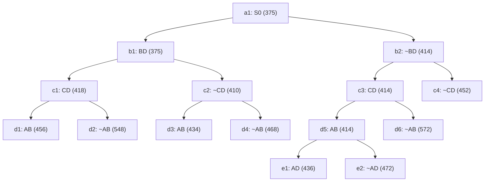

## The Question

TSP BnB snapshot at the moment the optimal tour is discovered. `XY` = include, `~XY` = exclude; numbers = lower bounds; reference numbers break ties.

| # | Question | Official answer |
|---|----------|-----------------|
| 2.1 | 2nd–5th nodes refined | `b1,c2,b2,c3` |
| 2.2 | Optimal tour node | `d3` |
| 2.3 | Optimal cost | `434` |
| 2.4 | Number of cities | `5` |
| 2.5 | Tour from A | `A,B,D,E,C` |

## The Topic in 60 Seconds

Refine = pop the cheapest open node, insert its two children. Childless snapshot nodes are tours. Stop when a tour pops with no cheaper open node.

> Deep-dive: [Reading BnB Trees](/concepts/week-05-optimal-tsp/01-bnb-tree-reading), [Branch and Bound](/concepts/week-03-heuristic-search/05-branch-and-bound).

## 2.1 — Refine order → `b1,c2,b2,c3`

| Pop | Queue (min first) | Action |
|-----|-------------------|--------|
| 1 | a1 : 375 | refine → b1(375), b2(414) |
| 2 | b1 : 375, b2 : 414 | refine **b1** → c1(418), c2(410) |
| 3 | c2 : 410, b2 : 414, c1 : 418 | refine **c2** → d3(434), d4(468) |
| 4 | b2 : 414, c1 : 418, d3 : 434, d4 : 468 | refine **b2** → c3(414), c4(452) |
| 5 | c3 : 414, c1 : 418, d3 : 434, c4 : 452, d4 : 468 | refine **c3** → d5(414), d6(572) |

## 2.2 & 2.3 — Optimal tour → `d3`, `434`

Queue continues: pop d5(414) → e1(436), e2(472); pop c1(418) → d1(456), d2(548). Now **d3 : 434** is the minimum and a **leaf** — a tour. Everything else ≥ 436 → **d3 = optimal, 434** ✓

## 2.4 — Cities → `5`

Path root→d3: **BD in, ~CD, AB in**. Degrees: A–1, B–2 (full), C–0, D–1. D can't use CD → D–E. C needs two: C–A and C–E. Forced tour: **A–B–D–E–C–A** → 5 cities ✓

## 2.5 — Tour from A → `A,B,D,E,C`

The forced cycle above ✓ (reverse A,C,E,D,B equivalent).

Interactive queue simulation — gray = already refined, blue = waiting in OPEN, green = the winning tour:

<PaperTrace
  height={440}
  nodeWidth={110}
  nodeHeight={56}
  nodeFontSize={12}
  legend={[
    { color: "#b45309", label: "popping now" },
    { color: "#0369a1", label: "waiting in OPEN" },
    { color: "#4b5563", label: "already refined" },
    { color: "#15803d", label: "optimal tour node" },
  ]}
  nodes={[
    { id: "a1", label: "a1: S0 375", x: 400, y: 20, kind: "unassigned" },
    { id: "b1", label: "b1: BD 375", x: 200, y: 110, kind: "unassigned" },
    { id: "b2", label: "b2: ~BD 414", x: 640, y: 110, kind: "unassigned" },
    { id: "c1", label: "c1: CD 418", x: 60, y: 200, kind: "unassigned" },
    { id: "c2", label: "c2: ~CD 410", x: 320, y: 200, kind: "unassigned" },
    { id: "c3", label: "c3: CD 414", x: 560, y: 200, kind: "unassigned" },
    { id: "c4", label: "c4: ~CD 452", x: 760, y: 200, kind: "unassigned" },
    { id: "d1", label: "d1: AB 456", x: 10, y: 290, kind: "unassigned" },
    { id: "d2", label: "d2: ~AB 548", x: 130, y: 290, kind: "unassigned" },
    { id: "d3", label: "d3: AB 434", x: 270, y: 290, kind: "unassigned" },
    { id: "d4", label: "d4: ~AB 468", x: 390, y: 290, kind: "unassigned" },
    { id: "d5", label: "d5: AB 414", x: 510, y: 290, kind: "unassigned" },
    { id: "d6", label: "d6: ~AB 572", x: 640, y: 290, kind: "unassigned" },
    { id: "e1", label: "e1: AD 436", x: 450, y: 380, kind: "unassigned" },
    { id: "e2", label: "e2: ~AD 472", x: 570, y: 380, kind: "unassigned" },
  ]}
  edges={[
    { id: "x1", from: "a1", to: "b1" },
    { id: "x2", from: "a1", to: "b2" },
    { id: "x3", from: "b1", to: "c1" },
    { id: "x4", from: "b1", to: "c2" },
    { id: "x5", from: "b2", to: "c3" },
    { id: "x6", from: "b2", to: "c4" },
    { id: "x7", from: "c1", to: "d1" },
    { id: "x8", from: "c1", to: "d2" },
    { id: "x9", from: "c2", to: "d3" },
    { id: "x10", from: "c2", to: "d4" },
    { id: "x11", from: "c3", to: "d5" },
    { id: "x12", from: "c3", to: "d6" },
    { id: "x13", from: "d5", to: "e1" },
    { id: "x14", from: "d5", to: "e2" },
  ]}
  steps={[
    {
      label: "1 · pop a1 (375)",
      note: "Refine a1 → insert children.\nOPEN = { b1(375), b2(414) }",
      nodes: { a1: "current", b1: "frontier", b2: "frontier" },
      edges: { x1: "active", x2: "active" },
    },
    {
      label: "2 · pop b1 (375)",
      note: "Refine b1.\nOPEN = { c2(410), b2(414), c1(418) }",
      nodes: { a1: "explored", b1: "current", b2: "frontier", c1: "frontier", c2: "frontier" },
      edges: { x3: "active", x4: "active" },
    },
    {
      label: "3 · pop c2 (410)",
      note: "Refine c2 (~CD).\nOPEN = { b2(414), c1(418), d3(434), d4(468) }",
      nodes: { a1: "explored", b1: "explored", b2: "frontier", c1: "frontier", c2: "current", d3: "frontier", d4: "frontier" },
      edges: { x9: "active", x10: "active" },
    },
    {
      label: "4 · pop b2 (414)",
      note: "Refine b2 (~BD).\nOPEN = { c3(414), c1(418), d3(434), c4(452), d4(468) }",
      nodes: { a1: "explored", b1: "explored", c2: "explored", b2: "current", c1: "frontier", c3: "frontier", c4: "frontier", d3: "frontier", d4: "frontier" },
      edges: { x5: "active", x6: "active" },
    },
    {
      label: "5 · pop c3 (414)",
      note: "Refine c3 (BD).\nOPEN = { d5(414), c1(418), d3(434), c4(452), d4(468), d6(572) }",
      nodes: { a1: "explored", b1: "explored", b2: "explored", c2: "explored", c3: "current", c1: "frontier", c4: "frontier", d3: "frontier", d4: "frontier", d5: "frontier", d6: "frontier" },
      edges: { x11: "active", x12: "active" },
    },
    {
      label: "6 · pop d5 (414)",
      note: "Refine d5 (AB) → e1(436), e2(472).\nOPEN = { c1(418), d3(434), e1(436), c4(452), d4(468), e2(472), d6(572) }",
      nodes: { a1: "explored", b1: "explored", b2: "explored", c2: "explored", c3: "explored", d5: "current", c1: "frontier", c4: "frontier", d3: "frontier", d4: "frontier", d6: "frontier", e1: "frontier", e2: "frontier" },
      edges: { x13: "active", x14: "active" },
    },
    {
      label: "7 · pop c1 (418)",
      note: "Refine c1 (CD) → d1(456), d2(548).\nOPEN = { d3(434), e1(436), c4(452), d1(456), d4(468), … }",
      nodes: { a1: "explored", b1: "explored", b2: "explored", c2: "explored", c3: "explored", d5: "explored", c1: "current", c4: "frontier", d1: "frontier", d2: "frontier", d3: "frontier", d4: "frontier", d6: "frontier", e1: "frontier", e2: "frontier" },
      edges: { x7: "active", x8: "active" },
    },
    {
      label: "8 · pop d3 (434) = TOUR",
      note: "d3 is childless → a complete tour, and the cheapest thing in OPEN\n(everything left ≥ 436 > 434) → OPTIMAL.\nDecisions on root→d3: BD in, ~CD, AB in → forced tour A–B–D–E–C–A.",
      nodes: { a1: "explored", b1: "explored", b2: "explored", c1: "explored", c2: "explored", c3: "explored", d5: "explored", d3: "path", c4: "frontier", d1: "frontier", d2: "frontier", d4: "frontier", d6: "frontier", e1: "frontier", e2: "frontier" },
      edges: { x1: "path", x4: "path", x9: "path" },
    },
  ]}
/>

The last step also traces the winning decisions **BD in · ~CD · AB in**: B is full (AB + BD), so D's second edge cannot be CD — it must be D–E; C then closes the cycle via C–A and C–E. Forced tour: **A–B–D–E–C–A**, 5 cities, cost **434**.

## Tricks & Tips

<Accordion title="Fast method">
1. Sorted queue with (cost, ref#); refine only nodes that have children in the snapshot.
2. Optimal = cheapest leaf popped while all open bounds ≥ it.
3. Cities: complete degrees from the winner's decisions — the excluded edge (CD) forces the detour through E.
</Accordion>

**Answers:** 2.1 `b1,c2,b2,c3` · 2.2 `d3` · 2.3 `434` · 2.4 `5` · 2.5 `A,B,D,E,C`
