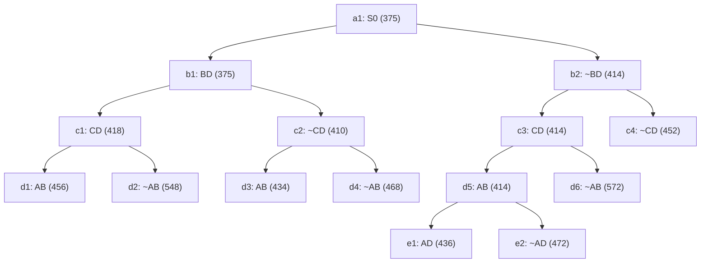

## The Question

TSP BnB snapshot at the moment the optimal tour is discovered. `XY` = include, `~XY` = exclude; numbers = lower bounds; reference numbers break ties.

| # | Question | Official answer |
|---|----------|-----------------|
| 2.1 | 2nd–5th nodes refined | `b1,c2,b2,c3` |
| 2.2 | Optimal tour node | `d3` |
| 2.3 | Optimal cost | `434` |
| 2.4 | Number of cities | `5` |
| 2.5 | Tour from A | `A,B,D,E,C` |

## The Topic in 60 Seconds

Refine = pop the cheapest open node, insert its two children. Childless snapshot nodes are tours. Stop when a tour pops with no cheaper open node.

> Deep-dive: [Reading BnB Trees](/concepts/week-05-optimal-tsp/01-bnb-tree-reading), [Branch and Bound](/concepts/week-03-heuristic-search/05-branch-and-bound).

## 2.1 — Refine order → `b1,c2,b2,c3`

| Pop | Queue (min first) | Action |
|-----|-------------------|--------|
| 1 | a1 : 375 | refine → b1(375), b2(414) |
| 2 | b1 : 375, b2 : 414 | refine **b1** → c1(418), c2(410) |
| 3 | c2 : 410, b2 : 414, c1 : 418 | refine **c2** → d3(434), d4(468) |
| 4 | b2 : 414, c1 : 418, d3 : 434, d4 : 468 | refine **b2** → c3(414), c4(452) |
| 5 | c3 : 414, c1 : 418, d3 : 434, c4 : 452, d4 : 468 | refine **c3** → d5(414), d6(572) |

## 2.2 & 2.3 — Optimal tour → `d3`, `434`

Queue continues: pop d5(414) → e1(436), e2(472); pop c1(418) → d1(456), d2(548). Now **d3 : 434** is the minimum and a **leaf** — a tour. Everything else ≥ 436 → **d3 = optimal, 434** ✓

## 2.4 — Cities → `5`

Path root→d3: **BD in, ~CD, AB in**. Degrees: A–1, B–2 (full), C–0, D–1. D can't use CD → D–E. C needs two: C–A and C–E. Forced tour: **A–B–D–E–C–A** → 5 cities ✓

## 2.5 — Tour from A → `A,B,D,E,C`

The forced cycle above ✓ (reverse A,C,E,D,B equivalent).

<Graph
  height={440}
  nodeWidth={110}
  nodeHeight={56}
  nodeFontSize={12}
  layout={{ name: "preset" }}
  elements={[
    { data: { id: "a1", label: "a1: S0 375", type: "current" }, position: { x: 400, y: 20 } },
    { data: { id: "b1", label: "b1: BD 375", type: "current" }, position: { x: 200, y: 110 } },
    { data: { id: "b2", label: "b2: ~BD 414", type: "current" }, position: { x: 640, y: 110 } },
    { data: { id: "c1", label: "c1: CD 418", type: "explored" }, position: { x: 60, y: 200 } },
    { data: { id: "c2", label: "c2: ~CD 410", type: "current" }, position: { x: 320, y: 200 } },
    { data: { id: "c3", label: "c3: CD 414", type: "current" }, position: { x: 560, y: 200 } },
    { data: { id: "c4", label: "c4: ~CD 452" }, position: { x: 760, y: 200 } },
    { data: { id: "d1", label: "d1: AB 456" }, position: { x: 10, y: 290 } },
    { data: { id: "d2", label: "d2: ~AB 548" }, position: { x: 130, y: 290 } },
    { data: { id: "d3", label: "d3: AB 434 ✓", type: "path" }, position: { x: 270, y: 290 } },
    { data: { id: "d4", label: "d4: ~AB 468" }, position: { x: 390, y: 290 } },
    { data: { id: "d5", label: "d5: AB 414", type: "explored" }, position: { x: 510, y: 290 } },
    { data: { id: "d6", label: "d6: ~AB 572" }, position: { x: 640, y: 290 } },
    { data: { id: "e1", label: "e1: AD 436" }, position: { x: 450, y: 380 } },
    { data: { id: "e2", label: "e2: ~AD 472" }, position: { x: 570, y: 380 } },
    { data: { id: "x1", source: "a1", target: "b1" } },
    { data: { id: "x2", source: "a1", target: "b2" } },
    { data: { id: "x3", source: "b1", target: "c1" } },
    { data: { id: "x4", source: "b1", target: "c2" } },
    { data: { id: "x5", source: "b2", target: "c3" } },
    { data: { id: "x6", source: "b2", target: "c4" } },
    { data: { id: "x7", source: "c1", target: "d1" } },
    { data: { id: "x8", source: "c1", target: "d2" } },
    { data: { id: "x9", source: "c2", target: "d3" } },
    { data: { id: "x10", source: "c2", target: "d4" } },
    { data: { id: "x11", source: "c3", target: "d5" } },
    { data: { id: "x12", source: "c3", target: "d6" } },
    { data: { id: "x13", source: "d5", target: "e1" } },
    { data: { id: "x14", source: "d5", target: "e2" } },
  ]}
/>

*Amber = refined in order b1 → c2 → b2 → c3. Green = d3, the 434 tour.*

## Tricks & Tips

<Accordion title="Fast method">
1. Sorted queue with (cost, ref#); refine only nodes that have children in the snapshot.
2. Optimal = cheapest leaf popped while all open bounds ≥ it.
3. Cities: complete degrees from the winner's decisions — the excluded edge (CD) forces the detour through E.
</Accordion>

**Answers:** 2.1 `b1,c2,b2,c3` · 2.2 `d3` · 2.3 `434` · 2.4 `5` · 2.5 `A,B,D,E,C`
